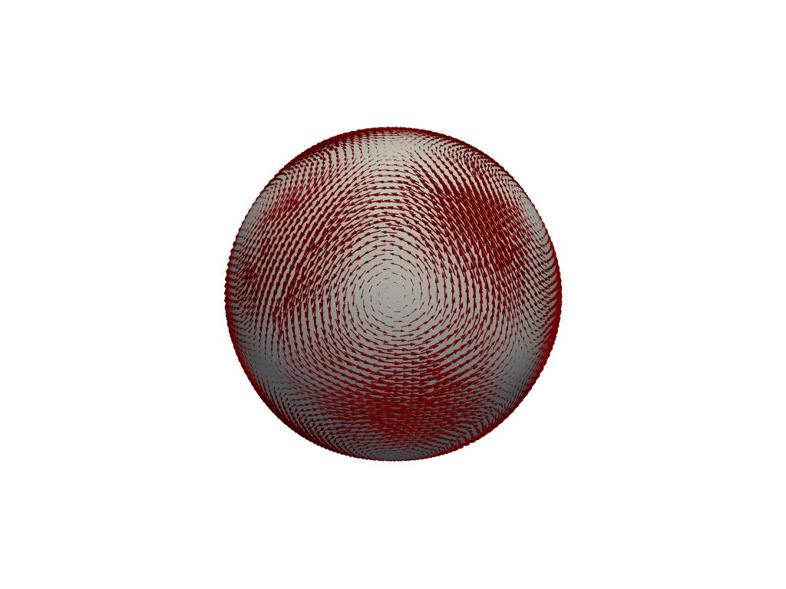
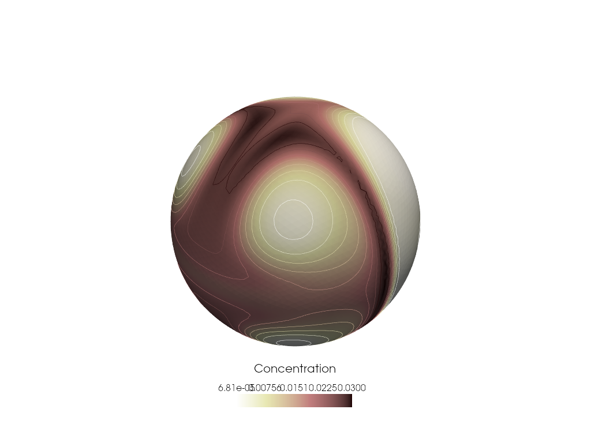

<div class="nb-header"><a href="https://colab.research.google.com/github/smec-ethz/tatva-docs/blob/main/notebooks/examples/advection_diffusion_surface.ipynb" target="_blank"></a><a href="/assets/notebooks/examples/advection_diffusion_surface.ipynb" download="advection_diffusion_surface.ipynb" class="nb-download-btn"><svg class="nb-download-icon" viewBox="0 0 24 24" xmlns="http://www.w3.org/2000/svg"><path d="M12 16l-6-6 1.41-1.41L11 13.17V4h2v9.17l3.59-3.58L18 11l-6 6z"/><path d="M5 18h14v2H5z"/></svg> Download</a></div>

# Advection-Diffusion on Sphere

In this notebook, we will solve the surface advection-diffusion equation using the finite element method (FEM) implemented in `tatva`. We will focus on  2D spherical surface embedded in 3D space.


The strong form of the surface advection-diffusion equation is given by:

$$ 
\frac{\partial c}{\partial t} + \nabla_s \cdot (\boldsymbol{u} c) - D \Delta_s c = f \quad \text{on } \Gamma 
$$

where $c$ is the concentration of the substance on the surface $\Gamma$, $\boldsymbol{u}$ is the velocity field tangential to the surface, $D$ is the diffusion coefficient. In this equation, $\Delta_s$ is the Laplace-Beltrami operator on the surface, and $f$ is a source term. Also, $\nabla_S$ denotes the surface gradient which is given by projecting the standard gradient onto the tangent plane of the surface.

$$
\nabla_S = \mathbf{J}(\mathbf{J}^T\mathbf{J})^{-1} \nabla_\xi 
$$

where $\mathbf{J}$ is the Jacobian of the mapping from the reference element to the surface element. Expanding the advection term using the product rule, we have:

$$
\nabla_s \cdot (\mathbf{u} c) = \boldsymbol{u} \cdot \nabla_s c + c \nabla_s \cdot \mathbf{u} 
$$

We assume that the velocity field $\boldsymbol{u}$ is divergence-free on the surface, i.e., $\nabla_s \cdot \boldsymbol{u} = 0$. This simplifies the advection term to:

$$
\nabla_s \cdot (\boldsymbol{u} c) = \boldsymbol{u} \cdot \nabla_s c 
$$

To derive the weak form, we multiply the equation by a test function $v$ and integrate over the surface $\Gamma$. Using integration by parts for the diffusion term, we obtain the weak form:

$$ 
\mathcal{W}(c, v) =\underbrace{\int_{\Gamma} \frac{\partial c}{\partial t} v ~ d\Gamma}_{\text{Inertia}} - \underbrace{\int_{\Gamma} c  \boldsymbol{u} \cdot \nabla_s v ~ d\Gamma}_{\text{Advection (Conservative)}} + \underbrace{\int_{\Gamma} D \nabla_s c \cdot \nabla_s v ~ d\Gamma}_{\text{Diffusion}} - \underbrace{\int_{\Gamma} f v ~ d\Gamma}_{\text{Source}} 
$$


??? example "Colab Setup (Install Dependencies)"
    ```python
    
    # Only run this if we are in Google Colab
    if 'google.colab' in str(get_ipython()):
        print("Installing dependencies using uv...")
        # Install uv if not available
        !pip install -q uv
        # Install system dependencies
        !apt-get install -qq gmsh
        # Use uv to install Python dependencies
        !uv pip install --system matplotlib meshio
        !uv pip install --system pyvista
        !uv pip install --system "git+https://github.com/smec-ethz/tatva-docs.git"
      
        import pyvista as pv
    
        pv.global_theme.jupyter_backend = 'static'
        pv.global_theme.notebook = True
        pv.start_xvfb()
        
        print("Installation complete!")
    else:
        import pyvista as pv
        pv.global_theme.jupyter_backend = 'client'
    ```


```python
import jax

jax.config.update("jax_enable_x64", True)  

from functools import partial

import equinox as eqx
import jax.numpy as jnp
import numpy as np
from jax import Array
from jax_autovmap import autovmap
from tatva import Mesh, Operator, element
```

We start with creating the mesh for the spherical surface of radius 1.0 using `gmsh`.


??? example "View mesh generation functions"
    ```python
    
    def create_sphere_mesh(r=1.0, lc=0.5):
        import gmsh
        gmsh.initialize()
        gmsh.model.add("Sphere")
        gmsh.model.occ.addSphere(0, 0, 0, r)
        gmsh.model.occ.synchronize()
        gmsh.option.setNumber("Mesh.MeshSizeMax", lc)
        gmsh.model.mesh.generate(2) # Surface mesh only
        
        _, coords, _ = gmsh.model.mesh.getNodes()
        nodes = jnp.array(coords.reshape(-1, 3))
        
        _, _, node_indices = gmsh.model.mesh.getElements(2)
        elements = jnp.array(node_indices[0].reshape(-1, 3) - 1)
        
        gmsh.finalize()
        return Mesh(coords=nodes, elements=elements)
    ```


```python

mesh = create_sphere_mesh(r=radius, lc=0.05)
n_dofs = mesh.coords.shape[0]
```

??? info "Output"
    In order to the surface PDE, we  define a triangular element (topology in 2D) embedded in 3D space. We then define the surface gradient operator using the Jacobian of the mapping from the reference element to the surface element. Finally, we assemble the mass and stiffness matrices using the surface gradient operator.


```python
def safe_sqrt(x):
    return jnp.where(x < 0, 0.0, jnp.sqrt(x))


class Tri3Manifold(element.Tri3):
    """A 3-node linear triangular element on a 2D manifold embedded in 3D space."""

    def get_jacobian(self, xi: Array, nodal_coords: Array) -> tuple[Array, Array]:
        dNdr = self.shape_function_derivative(xi)
        J = dNdr @ nodal_coords  # shape (2, 2) or (2, 3)
        G = J @ J.T  # shape (2, 2)
        detJ = safe_sqrt(jnp.linalg.det(G))
        return J, detJ

    def gradient(self, xi: Array, nodal_values: Array, nodal_coords: Array) -> Array:
        dNdr = self.shape_function_derivative(xi)  # shape (2, 3)
        J, _ = self.get_jacobian(xi, nodal_coords)  # shape (2, 3)

        G_inv = jnp.linalg.inv(J @ J.T)  # shape (2, 2)
        J_plus = J.T @ G_inv  # shape (3, 2)

        dudxi = dNdr @ nodal_values  # shape (2, n_values)
        return J_plus @ dudxi  # shape (3, n_values)
```

We can now use the custom-defined element `Tri3Manifold` and define an `Operator`.


```python
tri3 = Tri3Manifold()
op = Operator(mesh, tri3)
```

To check if the  implementation is correct, we compute the total surface area by integrating the constant function 1 over the surface. The total area should match the known analytical value for the given surface.


```python
print(f"Calculated surface area {op.integrate(1.0)}")  # Warm-up
print(f"Actual surface area {4 * jnp.pi * radius ** 2}")
```

We also check if the normals are computed correctly by plotting them on the surface mesh.


```python
@autovmap(J=2)
def get_normals(J: Array) -> Array:
    """ Computes the normal vector to the surface given the Jacobian J. """
    n = jnp.cross(J[0, :], J[1, :])
    n = n / jnp.linalg.norm(n)
    return n

J, _ = op.map(tri3.get_jacobian)(mesh.coords)
normals = get_normals(J)

```

## Simulating the Advection-Diffusion equation

Now, we can start with defining the problem parameters and initial conditions. We will discretize the time domain and use the implicit Euler method for time integration.


```python
from typing import NamedTuple


class TransportPhysics(NamedTuple):
    epsilon: float = 0.05  # Diffusivity
    dt: float = 0.01

transport_params = TransportPhysics()

@autovmap(coords=1)
def get_shear_velocity(coords):
    x, y, z = coords
    omega = 10.0 * jnp.sin(3.0 * jnp.pi * z) 
    
    u = jnp.array([-y * omega, x * omega, 0.0])
    return u


@autovmap(coords=1)
def get_deformational_velocity(coords):
    """
    Computes a divergence-free deformational flow.
    Stream function psi = x * y * z
    u = curl(psi * x_vec) = grad(psi) x x_vec
    """
    x, y, z = coords
    magnitude = 20.0 # Adjust speed
    
    u_x = x * (z**2 - y**2)
    u_y = y * (x**2 - z**2)
    u_z = z * (y**2 - x**2)
    
    return magnitude * jnp.array([u_x, u_y, u_z])

nodal_velocity = get_deformational_velocity(mesh.coords)

# Precompute velocity at quadrature points
u_quad = op.eval(nodal_velocity)
```


??? example "Visualize the velocity field on the surface"
    ```python
    
    faces = np.column_stack([
        np.full(len(mesh.elements), 3, dtype=np.int64), 
        mesh.elements.astype(np.int64)
    ]).flatten()
    
    
    surf = pv.PolyData(np.array(mesh.coords), faces)
    surf.point_data["v"] = nodal_velocity
    surf.set_active_vectors("v")
    
    pl = pv.Plotter()
    pl.add_mesh(surf, color="lightgray")
    pl.add_arrows(mesh.coords, nodal_velocity, mag=0.015, color="darkred")
    pl.view_isometric()
    ```



Now we define functions to compute the total virtual work and total kinetic energy.


```python
@autovmap(c=0, grad_c=1, v=0, grad_v=1, u_quad=1, epsilon=0)
def compute_advection_diffusion_density(c, grad_c, v, grad_v, u_quad, epsilon):
    """
    Computes the virtual work density for Advection-Diffusion.
    
    Args:
        c, v: Scalar values of trial and test functions
        grad_c, grad_v: Surface gradients
        u_quad: Velocity vector at quad point
        epsilon: Diffusivity
    """
    term_diffusion = epsilon * jnp.vdot(grad_c, grad_v)
    
    advection_flux = jnp.vdot(u_quad, grad_c)
    term_advection = advection_flux * v
    
    return term_diffusion + term_advection

@jax.jit
def total_virtual_work(c_flat : Array, v_flat: Array) -> Array:
    """
    Computes the spatial part of the weak form: Integral(Advection + Diffusion)
    Args:
        c_flat: Flattened nodal values of trial function
        v_flat: Flattened nodal values of test function
    """
    
    c_quad = op.eval(c_flat)
    v_quad = op.eval(v_flat)
    
    grad_c = op.grad(c_flat)
    grad_v = op.grad(v_flat)

    # compute density    
    density = compute_advection_diffusion_density(
        c_quad, grad_c, 
        v_quad, grad_v, 
        u_quad, 
        transport_params.epsilon
    )
    
    # integrate over the surface
    return op.integrate(density)


@autovmap(c=0, v=0)
def compute_kinetic_energy_density(c: Array, v: Array) -> Array:
    """ Computes the kinetic energy density: 0.5 * c * v 
    Args:
        c, v: Scalar values of trial and test functions
    """

    return jnp.dot(c, v)

@jax.jit
def total_kinetic_energy(c_flat: Array, v_flat: Array) -> Array:
    """
    Computes the total kinetic energy: Integral(0.5 * c * v)
    Args:
        c_flat: Flattened nodal values of trial function
        v_flat: Flattened nodal values of test function
    """
    c_quad = op.eval(c_flat)
    v_quad = op.eval(v_flat)

    kinetic_energy_density = compute_kinetic_energy_density(c_quad, v_quad)
    kinetic_energy = op.integrate(kinetic_energy_density)
    return kinetic_energy

```

We use `jax.jacrev` to compute the derivative of the virtual work with respect to the trial function, which gives us the internal force vector. Similarly, we compute the kinetic vector by differentiating the inertia term with respect to the trial function and dividing by the time step.


```python
compute_internal_force = jax.jacrev(total_virtual_work, argnums=1)
compute_kinetic_force = jax.jacrev(total_kinetic_energy, argnums=1)


@jax.jit
def _compute_residual(c_new, c_old, dt, v_trial):
    """
    Computes the global residual vector for the time step.
    Res = M*(c_new - c_old)/dt + SpatialForce(c_new)
    Target: Res = 0
    """
    
    force_spatial = compute_internal_force(c_new, v_trial)
    
    force_mass = compute_kinetic_force(c_new - c_old, v_trial) / dt
    
    return force_mass + force_spatial

compute_residual = jax.jit(partial(_compute_residual, v_trial=jnp.zeros(n_dofs)))

@jax.jit
def compute_tangent(x, c_new, c_old, dt):
    """
    Computes J(c_new) * v using Forward Mode AD (jvp).
    This is the Linear Operator 'A' for the linear solver.
    """
    
    _, jvp_val = jax.jvp(
        lambda c: compute_residual(c, c_old, dt), 
        (c_new,), 
        (x,)
    )
    return jvp_val
```


??? example "BiCGSTAB Linear Solver Implementation"
    ```python
    
    @eqx.filter_jit
    def bicgstab(A, b, atol=1e-8, max_iter=100):
        x = jnp.zeros_like(b)
        r = b - A(x)
        r_hat = r  
        rho = 1.0
        alpha = 1.0
        omega = 1.0
        v = jnp.zeros_like(b)
        p = jnp.zeros_like(b)
        
        initial_state = (x, r, r_hat, rho, alpha, omega, v, p, 0)
    
        def cond_fun(state):
            x, r, r_hat, rho, alpha, omega, v, p, iiter = state
            # Terminate if residual is small enough or max iterations reached
            res_norm = jnp.linalg.norm(r)
            return jnp.logical_and(res_norm > atol, iiter < max_iter)
    
        def body_fun(state):
            x, r, r_hat, rho_prev, alpha, omega, v, p, iiter = state
            
            rho = jnp.vdot(r_hat, r)
            beta = (rho / rho_prev) * (alpha / omega)
            p = r + beta * (p - omega * v)
            
            v = A(p)
            alpha = rho / jnp.vdot(r_hat, v)
            s = r - alpha * v
            
            # Check norm of s for early exit if needed, 
            # but for while_loop simplicity we proceed to t
            t = A(s)
            omega = jnp.vdot(t, s) / jnp.vdot(t, t)
            
            x = x + alpha * p + omega * s
            r = s - omega * t
            
            return (x, r, r_hat, rho, alpha, omega, v, p, iiter + 1)
    
        final_state = jax.lax.while_loop(cond_fun, body_fun, initial_state)
        x_final, iiter_final = final_state[0], final_state[-1]
        
        return x_final, iiter_final
    
    ```

Initially, we set the concentration field to be a Gaussian distribution centered at a specific point on the surface. We also define a tangential velocity field that will advect the concentration over time. Finally, we run the time-stepping loop to solve the advection-diffusion equation on the surface. We visualize the concentration field at each time step to observe how it evolves over time.


```python
# Initial Condition: Gaussian Blob
def get_gaussian_initial_condition(mesh_coords, pole=jnp.array([0., 0., 1.]), sigma=0.2):
    dists_sq = jnp.sum((mesh_coords - pole)**2, axis=1)
    
    # Gaussian distribution
    u_0 = jnp.exp(-dists_sq / (2 * sigma**2))
    return u_0

def compute_total_concentration(c_flat):
    c_quad = op.eval(c_flat)
    return op.integrate(c_quad)
```


```python

c_history = [c_curr]
total_conc_per_time = [compute_total_concentration(c_curr)]

n_steps_transport = 100
dt_transport = 0.05

for step in range(n_steps_transport):
    
    rhs = -compute_residual(c_curr, c_curr, dt_transport)
    
    A = eqx.Partial(compute_tangent, c_new=c_curr, c_old=c_curr, dt=dt_transport)
    
    delta_c, info = bicgstab(A, rhs, atol=1e-6, max_iter=100)
    
    c_curr = c_curr + delta_c
    c_history.append(c_curr)
    
    total_conc = compute_total_concentration(c_curr)
    total_conc_per_time.append(total_conc)
    
    if step % 10 == 0:
        print(f"Step {step}: Max c = {jnp.max(c_curr):.4f}")
```


```python

```

## Visualization


??? example "Visualize concentration on the surface at a specific time step"
    ```python
    
    sargs = dict(
        title=r"Concentration" + "\n",
        height=0.08,       # Reduces the length (25% of window height)
        width=0.2,        # Adjusts thickness
        vertical=False,     # Orientation
        position_x=0.4,   # Distance from left edge (5%)
        position_y=0.08,   # Distance from bottom edge (5%)
        title_font_size=20,
        label_font_size=16,
        color="black",      # Useful for white/transparent backgrounds
        font_family="arial",
    )
    surf = pv.PolyData(np.array(mesh.coords), faces)
    surf.point_data["c"] = c_history[10].flatten()
    surf.point_data["v"] = nodal_velocity
    surf.set_active_scalars("c")
    
    contours = surf.contour(isosurfaces=10)
    
    pl = pv.Plotter()
    pl.add_mesh(surf, scalars="c", cmap="pink_r", scalar_bar_args=sargs)
    pl.add_mesh(contours, cmap="pink_r", line_width=0.5, show_scalar_bar=False)
    pl.show()
    ```



