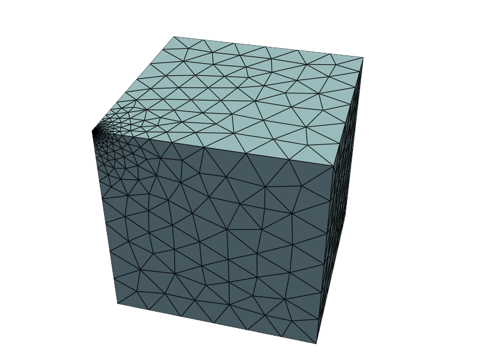
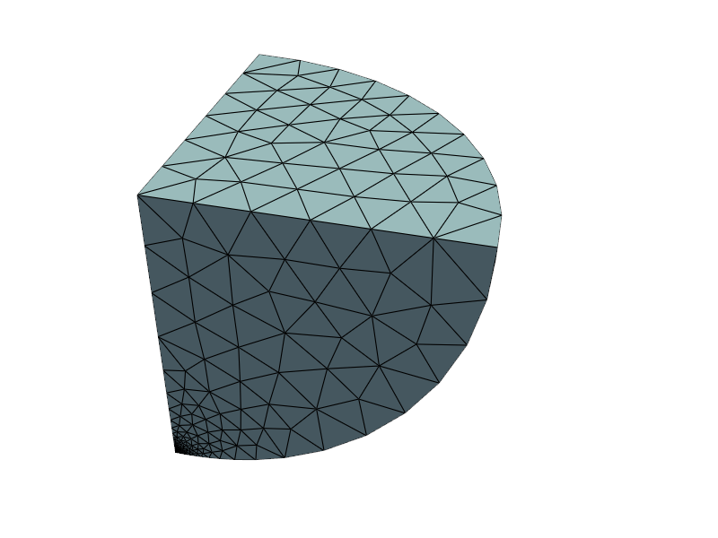
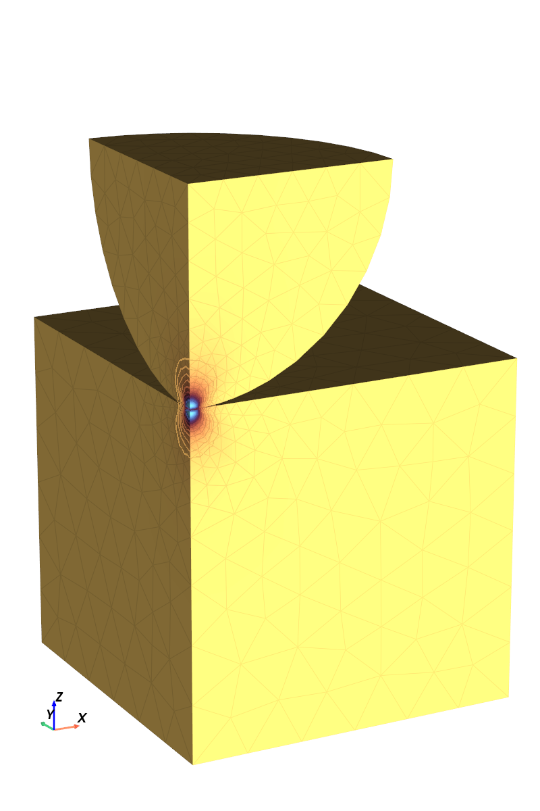
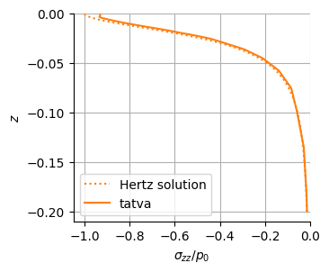
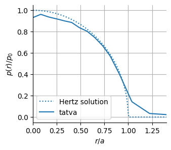

<div class="nb-header"><a href="https://colab.research.google.com/github/smec-ethz/tatva-docs/blob/main/notebooks/examples/contact_3d.ipynb" target="_blank"></a><a href="/assets/notebooks/examples/contact_3d.ipynb" download="contact_3d.ipynb" class="nb-download-btn"><svg class="nb-download-icon" viewBox="0 0 24 24" xmlns="http://www.w3.org/2000/svg"><path d="M12 16l-6-6 1.41-1.41L11 13.17V4h2v9.17l3.59-3.58L18 11l-6 6z"/><path d="M5 18h14v2H5z"/></svg> Download</a></div>

# Contact mechanics using Penalty Approach

In this notebook, we model the circular punch of a sphere on a deformable plane.

We impose the contact constraint via a penalty approach by extending the total energy functional with a contact contribution $\Psi_c$, defined by the penalty density

$$
\psi_c =\frac{1}{2} \kappa~ g(\boldsymbol{u}_1, \boldsymbol{u}_2)^2~,
$$

where $g$ represents the normal gap function and $\kappa$ denotes the penalty parameter. The resulting total energy functional reads

\begin{equation}
\Psi(\boldsymbol{u}_1, \boldsymbol{u}_2) = \int_{\Omega_{\mathrm{sphere}}}\psi_\varepsilon(\boldsymbol{u}_1)~\mathrm{d\Omega} + \int_{\Omega_{\mathrm{cube}}}\psi_\varepsilon(\boldsymbol{u}_2)~\mathrm{d\Omega} +\int_{\mathrm{S}_c}\psi_c(\boldsymbol{u}_1, \boldsymbol{u}_2) ~\mathrm{dS} ~ .
\end{equation}


??? example "Colab Setup (Install Dependencies)"
    ```python
    
    # Only run this if we are in Google Colab
    if "google.colab" in str(get_ipython()):
        print("Installing dependencies from pyproject.toml...")
        # This installs the repo itself (and its dependencies)
        !apt-get install gmsh 
        !apt-get install -qq xvfb libgl1-mesa-glx
        !pip install pyvista -qq
        !pip install -q "git+https://github.com/smec-ethz/tatva-docs.git"    
    
        import pyvista as pv
    
        pv.global_theme.jupyter_backend = "static"
        pv.global_theme.notebook = True
        pv.start_xvfb()
    
        print("Installation complete!")
    ```


```python
import gmsh
import jax
import jax.numpy as jnp
import pyvista as pv
from jax import Array
from jax_autovmap import autovmap
from tatva import Mesh, Operator

jax.config.update("jax_enable_x64", True)
pv.global_theme.jupyter_backend = "static"
```

## Meshing

We generate two separate meshes with `gmsh`; one for the cube, another one for the sphere.


??? example "Code for generating the mesh"
    ```python
    
    import math
    import os
    
    import gmsh
    import numpy as np
    
    
    def extract_mesh() -> tuple[Mesh, dict[str, np.ndarray]]:
        node_tags, coords, _ = gmsh.model.mesh.getNodes()
        nodes_arr = np.array(coords).reshape(-1, 3)
    
        # Gmsh tags are 1-based and potentially non-contiguous.
        # We map them to 0-based indices for JAX.
        tag_map = {tag: i for i, tag in enumerate(node_tags)}
    
        # 5. Extract Tetrahedral Elements
        # Element Type 4 is 4-node Tetrahedron
        # getElementsByType returns: (element_tags, node_tags)
        try:
            _, elem_node_tags = gmsh.model.mesh.getElementsByType(4)
            elem_node_tags = np.array(elem_node_tags).reshape(-1, 4)
        except ValueError:
            gmsh.finalize()
            raise
    
        # Remap tags to 0-based indices
        # Vectorized map using a lookup array if tags are contiguous,
        # but loop is safer for general Gmsh output.
        elements_array = np.array(
            [[tag_map[tag] for tag in elem] for elem in elem_node_tags]
        )
    
        # --- physical surfaces: collect 2D triangle faces (Tri3 = type 2) per physical group ---
        # Returns: dict[name:str] -> np.ndarray[int] of shape (ntri, 3) with 0-based node indices
        physical_surfaces: dict[str, np.ndarray] = {}
    
        for dim, pg_tag in gmsh.model.getPhysicalGroups(dim=2):
            name = gmsh.model.getPhysicalName(dim, pg_tag)
    
            # Entities (surface tags) that belong to this physical group
            entities = gmsh.model.getEntitiesForPhysicalGroup(dim, pg_tag)
    
            tris = []
            for ent in entities:
                # Get all mesh elements on this surface entity
                types, _, node_tags_by_type = gmsh.model.mesh.getElements(dim, ent)
    
                for etype, ntags in zip(types, node_tags_by_type):
                    if etype != 2:  # Tri3 only
                        continue
                    tri_nodes = np.array(ntags, dtype=np.int64).reshape(-1, 3)
                    tris.append(tri_nodes)
    
            if not tris:
                physical_surfaces[name] = np.zeros((0, 3), dtype=np.int32)
                continue
    
            tri_nodes = np.vstack(tris)
            tri_nodes_0 = np.array(
                [[tag_map[t] for t in tri] for tri in tri_nodes], dtype=np.int32
            )
            physical_surfaces[name] = tri_nodes_0
    
        return Mesh(
            coords=np.array(nodes_arr),
            elements=np.array(elements_array),
        ), physical_surfaces
    
    
    def get_mesh_cube(
        h_min: float, h_max: float, h_corner: float
    ) -> tuple[Mesh, dict[str, np.ndarray]]:
        ox, oy, oz = (0.0, 0.0, 0.0)
        lx, ly, lz = (1.0, 1.0, -1.0)
    
        gmsh.initialize()
        gmsh.model.add("cube")
    
        gmsh.option.setNumber("General.Terminal", 1)
        gmsh.option.setNumber("Mesh.MshFileVersion", 4.1)
        gmsh.option.setNumber("Mesh.ElementOrder", 1)
        gmsh.option.setNumber("Mesh.Algorithm3D", 4)
        gmsh.option.setNumber("Mesh.CharacteristicLengthMin", min(h_min, h_corner))
        gmsh.option.setNumber("Mesh.CharacteristicLengthMax", h_max)
    
        # ---- 1) points (we keep the tags we care about) ----
        p000 = gmsh.model.occ.addPoint(ox, oy, oz)  # corner of interest for refinement
        p100 = gmsh.model.occ.addPoint(ox + lx, oy, oz)
        p110 = gmsh.model.occ.addPoint(ox + lx, oy + ly, oz)
        p010 = gmsh.model.occ.addPoint(ox, oy + ly, oz)
    
        # ---- 2) curves + base surface (z = oz) ----
        l01 = gmsh.model.occ.addLine(p000, p100)
        l12 = gmsh.model.occ.addLine(p100, p110)
        l23 = gmsh.model.occ.addLine(p110, p010)
        l30 = gmsh.model.occ.addLine(p010, p000)
    
        cloop = gmsh.model.occ.addCurveLoop([l01, l12, l23, l30])
        s_base = gmsh.model.occ.addPlaneSurface([cloop])
    
        # ---- 3) volume via extrusion; capture returned entity tags (no searching) ----
        # extrude returns a list of (dim, tag). For a surface extrusion, you get:
        #   - one top surface (dim=2),
        #   - one volume (dim=3),
        #   - lateral surfaces (dim=2) ...
        out = gmsh.model.occ.extrude([(2, s_base)], 0.0, 0.0, lz)
    
        vol_tag = next(tag for (dim, tag) in out if dim == 3)
    
        gmsh.model.occ.synchronize()
    
        # ---- refinement field around p000 (no point lookup loop) ----
        dist = gmsh.model.mesh.field.add("Distance")
        gmsh.model.mesh.field.setNumbers(dist, "PointsList", [p000])
    
        thr = gmsh.model.mesh.field.add("Threshold")
        gmsh.model.mesh.field.setNumber(thr, "IField", dist)
        gmsh.model.mesh.field.setNumber(thr, "LcMin", h_corner)
        gmsh.model.mesh.field.setNumber(thr, "LcMax", h_max)
        gmsh.model.mesh.field.setNumber(thr, "DistMin", h_corner * 10)
        gmsh.model.mesh.field.setNumber(thr, "DistMax", 0.5)
        gmsh.model.mesh.field.setAsBackgroundMesh(thr)
    
        # ---- physical groups (using known tags) ----
        vol_pg = gmsh.model.addPhysicalGroup(3, [vol_tag], tag=1)
        gmsh.model.setPhysicalName(3, vol_pg, "cube_volume")
    
        top_pg = gmsh.model.addPhysicalGroup(2, [s_base], tag=2)
        gmsh.model.setPhysicalName(2, top_pg, "cube_top")
    
        gmsh.model.mesh.generate(3)
    
        mesh = extract_mesh()
        gmsh.finalize()
        return mesh
    
    
    def mesh_bottom_eighth_sphere(
        radius: float, h_min: float, h_max: float, h_corner: float
    ) -> tuple[Mesh, dict[str, np.ndarray]]:
        r_ref = 0.6 * radius
    
        gmsh.initialize()
        gmsh.model.add("bottom_eighth_sphere")
    
        gmsh.option.setNumber("General.Terminal", 1)
        gmsh.option.setNumber("Mesh.MshFileVersion", 4.1)
        gmsh.option.setNumber("Mesh.ElementOrder", 1)
        gmsh.option.setNumber("Mesh.Algorithm3D", 4)
        gmsh.option.setNumber("Mesh.CharacteristicLengthMin", min(h_min, h_corner))
        gmsh.option.setNumber("Mesh.CharacteristicLengthMax", h_max)
    
        sphere_tag = gmsh.model.occ.addSphere(0.0, 0.0, radius, radius)
        box_tag = gmsh.model.occ.addBox(0.0, 0.0, 0.0, radius, radius, radius)
    
        out = gmsh.model.occ.intersect(
            [(3, sphere_tag)], [(3, box_tag)], removeObject=True, removeTool=True
        )
        gmsh.model.occ.synchronize()
    
        vol_tag = out[0][0][1]
    
        # ---- refinement field at corner (0,0,0) ----
        # use Distance field with an explicit point; no need to find an existing CAD vertex
        p_corner = gmsh.model.occ.addPoint(0.0, 0.0, 0.0)
        gmsh.model.occ.synchronize()
    
        dist = gmsh.model.mesh.field.add("Distance")
        gmsh.model.mesh.field.setNumbers(dist, "PointsList", [p_corner])
    
        thr = gmsh.model.mesh.field.add("Threshold")
        gmsh.model.mesh.field.setNumber(thr, "IField", dist)
        gmsh.model.mesh.field.setNumber(thr, "LcMin", h_corner)
        gmsh.model.mesh.field.setNumber(thr, "LcMax", h_max)
        gmsh.model.mesh.field.setNumber(thr, "DistMin", h_corner * 10)
        gmsh.model.mesh.field.setNumber(thr, "DistMax", r_ref)
        gmsh.model.mesh.field.setAsBackgroundMesh(thr)
    
        # --- identify spherical boundary surface by OCC type ---
        boundary = gmsh.model.getBoundary([(3, vol_tag)], oriented=False)
    
        tol = 1e-6  # << much looser than 1e-10
    
        boundary = gmsh.model.getBoundary([(3, vol_tag)], oriented=False)
    
        sphere_candidates = []
        for dim, tag in boundary:
            if dim != 2:
                continue
            xmin, ymin, zmin, xmax, ymax, zmax = gmsh.model.getBoundingBox(2, tag)
    
            is_x0 = abs(xmin - 0.0) < tol and abs(xmax - 0.0) < tol
            is_y0 = abs(ymin - 0.0) < tol and abs(ymax - 0.0) < tol
            is_zr = abs(zmin - radius) < tol and abs(zmax - radius) < tol
    
            if not (is_x0 or is_y0 or is_zr):
                sphere_candidates.append(tag)
    
        if len(sphere_candidates) != 1:
            raise RuntimeError(
                f"Expected 1 spherical face, got {len(sphere_candidates)}: {sphere_candidates}"
            )
    
        curved_surface = sphere_candidates[0]
    
        vol_pg = gmsh.model.addPhysicalGroup(3, [vol_tag], tag=1)
        gmsh.model.setPhysicalName(3, vol_pg, "sphere_bottom_eighth")
    
        surf_pg = gmsh.model.addPhysicalGroup(2, [curved_surface], tag=2)
        gmsh.model.setPhysicalName(2, surf_pg, "sphere_outer")
    
        gmsh.model.mesh.generate(3)
    
        mesh = extract_mesh()
        gmsh.finalize()
        return mesh
    ```


??? example "Code for visualizing the mesh with PyVista"
    ```python
    pv.set_jupyter_backend("client")
    
    
    def get_pyvista_grid(mesh, cell_type="quad"):
        if mesh.coords.shape[1] == 2:
            pv_points = np.hstack((mesh.coords, np.zeros(shape=(mesh.coords.shape[0], 1))))
        else:
            pv_points = np.array(mesh.coords)
    
        cell_type_dict = {
            "quad": 4,
            "triangle": 3,
            "tetra": 4,
            "hexahedron": 8,
        }
    
        pv_cells = np.hstack(
            (
                np.full(
                    fill_value=cell_type_dict[cell_type], shape=(mesh.elements.shape[0], 1)
                ),
                mesh.elements,
            )
        )
    
        pv_cell_type_dict = {
            "quad": pv.CellType.QUAD,
            "triangle": pv.CellType.TRIANGLE,
            "tetra": pv.CellType.TETRA,
            "hexahedron": pv.CellType.HEXAHEDRON,
        }
        cell_types = np.full(
            fill_value=pv_cell_type_dict[cell_type], shape=(mesh.elements.shape[0],)
        )
    
        grid = pv.UnstructuredGrid(pv_cells.flatten(), cell_types, pv_points)
    
        return grid
    ```


```python
h_min = 0.01
h_max = 0.3
h_corner = 0.002

mesh_cube, pg_cube = get_mesh_cube(h_min, h_max, h_corner)

```

??? info "Output"
    Info    : Meshing 1D...
        Info    : [  0%] Meshing curve 1 (Line)
        Info    : [ 10%] Meshing curve 2 (Line)
        Info    : [ 20%] Meshing curve 3 (Line)
        Info    : [ 30%] Meshing curve 4 (Line)
        Info    : [ 40%] Meshing curve 5 (Line)
        Info    : [ 50%] Meshing curve 6 (Line)
        Info    : [ 60%] Meshing curve 7 (Line)
        Info    : [ 60%] Meshing curve 8 (Line)
        Info    : [ 70%] Meshing curve 9 (Line)
        Info    : [ 80%] Meshing curve 10 (Line)
        Info    : [ 90%] Meshing curve 11 (Line)
        Info    : [100%] Meshing curve 12 (Line)
        Info    : Done meshing 1D (Wall 0.00662568s, CPU 0.00702s)
        Info    : Meshing 2D...
        Info    : [  0%] Meshing surface 1 (Plane, Frontal-Delaunay)
        Info    : [ 20%] Meshing surface 2 (Plane, Frontal-Delaunay)
        Info    : [ 40%] Meshing surface 3 (Plane, Frontal-Delaunay)
        Info    : [ 60%] Meshing surface 4 (Plane, Frontal-Delaunay)
        Info    : [ 70%] Meshing surface 5 (Plane, Frontal-Delaunay)
        Info    : [ 90%] Meshing surface 6 (Plane, Frontal-Delaunay)
        Info    : Done meshing 2D (Wall 0.0299664s, CPU 0.030777s)
        Info    : Meshing 3D...
        Info    : Meshing volume 1 (Frontal)
        Info    : Region 1 Face 2, 1 intersect
        Info    : Region 1 Face 3, 1 intersect
        Info    : Region 1 Face 4, 1 intersect
        Info    : Region 1 Face 5, 1 intersect
        Info    : Region 1 Face 1, 1 intersect
        Info    : Region 1 Face 6, 0 intersect
        Info    : CalcLocalH: 872 Points 0 Elements 1740 Surface Elements 
        Info    : Check subdomain 1 / 1 
        Info    : 1740 open elements 
        Info    : Meshing subdomain 1 of 1 
        Info    : 1740 open elements 
        Info    : Use internal rules 
        Info    : 1740 open elements 
        Info    : Delaunay meshing 
        Info    : number of points: 872 
        Info    : blockfill local h 
        Info    : number of points: 1540 
        Info    : Points: 1540 
        Info    : Elements: 8619 
        Info    : 0 open elements 
        Info    : Num open: 0 
        Info    : free: 0, fixed: 8619 
        Info    : SwapImprove  
        Info    : 0 swaps performed 
        Info    : 0 open elements 
        Info    : Num open: 0 
        Info    : free: 0, fixed: 8619 
        Info    : SwapImprove  
        Info    : 0 swaps performed 
        Info    : 0 degenerated elements removed 
        Info    : Remove intersecting 
        Info    : Remove outer 
        Info    : tables filled 
        Info    : outer removed 
        Info    : 1740 open elements 
        Info    : 1540 points, 6728 elements 
        Info    : 0 open elements 
        Info    : 0 open faces 
        Info    : start tetmeshing 
        Info    : Use internal rules 
        Info    : 0 open elements 
        Info    : Success ! 
        Info    : 1540 points, 6728 elements 
        Info    : Done meshing 3D (Wall 0.0881125s, CPU 0.08839s)
        Info    : Optimizing mesh...
        Info    : Optimizing volume 1
        Info    : Optimization starts (volume = 1) with worst = 0.025172 / average = 0.681818:
        Info    : 0.00 < quality < 0.10 :        21 elements
        Info    : 0.10 < quality < 0.20 :        56 elements
        Info    : 0.20 < quality < 0.30 :       173 elements
        Info    : 0.30 < quality < 0.40 :       284 elements
        Info    : 0.40 < quality < 0.50 :       301 elements
        Info    : 0.50 < quality < 0.60 :       575 elements
        Info    : 0.60 < quality < 0.70 :      1641 elements
        Info    : 0.70 < quality < 0.80 :      2139 elements
        Info    : 0.80 < quality < 0.90 :      1132 elements
        Info    : 0.90 < quality < 1.00 :       403 elements
        Info    : 191 edge swaps, 48 node relocations (volume = 1): worst = 0.233998 / average = 0.696372 (Wall 0.00368831s, CPU 0.003454s)
        Info    : 209 edge swaps, 56 node relocations (volume = 1): worst = 0.239252 / average = 0.696901 (Wall 0.00458502s, CPU 0.004442s)
        Info    : 210 edge swaps, 56 node relocations (volume = 1): worst = 0.239252 / average = 0.69702 (Wall 0.00514286s, CPU 0.004442s)
        Info    : No ill-shaped tets in the mesh :-)
        Info    : 0.00 < quality < 0.10 :         0 elements
        Info    : 0.10 < quality < 0.20 :         0 elements
        Info    : 0.20 < quality < 0.30 :        11 elements
        Info    : 0.30 < quality < 0.40 :       301 elements
        Info    : 0.40 < quality < 0.50 :       346 elements
        Info    : 0.50 < quality < 0.60 :       650 elements
        Info    : 0.60 < quality < 0.70 :      1593 elements
        Info    : 0.70 < quality < 0.80 :      2106 elements
        Info    : 0.80 < quality < 0.90 :      1160 elements
        Info    : 0.90 < quality < 1.00 :       420 elements
        Info    : Done optimizing mesh (Wall 0.00831119s, CPU 0.007544s)
        Info    : 1540 nodes 8469 elements


```python
pl = pv.Plotter(window_size=(800, 600))
pl.add_mesh(get_pyvista_grid(mesh_cube, cell_type="tetra"), show_edges=True)
pl.camera.azimuth = -120
_ = pl.show()
```


    

    


```python
radius = 0.6

mesh_sphere, pg_sphere = mesh_bottom_eighth_sphere(radius, h_min, h_max, h_corner)
grid_sphere = get_pyvista_grid(mesh_sphere, cell_type="tetra")

```

??? info "Output"
    Info    : Cannot bind existing OpenCASCADE volume 1 to second tag 2                                                                              
        Info    : Could not preserve tag of 3D object 2 (->1)
        Info    : Meshing 1D...
        Info    : [  0%] Meshing curve 1 (Circle)
        Info    : [ 20%] Meshing curve 2 (Circle)
        Info    : [ 50%] Meshing curve 4 (Circle)
        Info    : [ 60%] Meshing curve 5 (Line)
        Info    : [ 80%] Meshing curve 6 (Line)
        Info    : [ 90%] Meshing curve 7 (Line)
        Info    : Done meshing 1D (Wall 0.00492711s, CPU 0.004363s)
        Info    : Meshing 2D...
        Info    : [  0%] Meshing surface 1 (Sphere, Frontal-Delaunay)
        Info    : [ 30%] Meshing surface 2 (Plane, Frontal-Delaunay)
        Info    : [ 60%] Meshing surface 3 (Plane, Frontal-Delaunay)
        Info    : [ 80%] Meshing surface 4 (Plane, Frontal-Delaunay)
        Info    : Done meshing 2D (Wall 0.0239352s, CPU 0.024075s)
        Info    : Meshing 3D...
        Info    : Meshing volume 1 (Frontal)
        Info    : Region 1 Face 1, 1 intersect
        Info    : Region 1 Face 2, 1 intersect
        Info    : Region 1 Face 3, 0 intersect
        Info    : Region 1 Face 4, 0 intersect
        Info    : CalcLocalH: 770 Points 0 Elements 1536 Surface Elements 
        Info    : Check subdomain 1 / 1 
        Info    : 1536 open elements 
        Info    : Meshing subdomain 1 of 1 
        Info    : 1536 open elements 
        Info    : Use internal rules 
        Info    : 1536 open elements 
        Info    : Delaunay meshing 
        Info    : number of points: 770 
        Info    : blockfill local h 
        Info    : number of points: 1485 
        Info    : Points: 1485 
        Info    : Elements: 8398 
        Info    : 8 open elements 
        Info    : Num open: 8 
        Info    : free: 93, fixed: 8305 
        Info    : SwapImprove  
        Info    : 11 swaps performed 
        Info    : 0 open elements 
        Info    : Num open: 0 
        Info    : free: 0, fixed: 8395 
        Info    : SwapImprove  
        Info    : 0 swaps performed 
        Info    : 0 degenerated elements removed 
        Info    : Remove intersecting 
        Info    : Remove outer 
        Info    : tables filled 
        Info    : outer removed 
        Info    : 1536 open elements 
        Info    : 1485 points, 6768 elements 
        Info    : 0 open elements 
        Info    : 0 open faces 
        Info    : start tetmeshing 
        Info    : Use internal rules 
        Info    : 0 open elements 
        Info    : Success ! 
        Info    : 1485 points, 6768 elements 
        Info    : Done meshing 3D (Wall 0.0863274s, CPU 0.084559s)
        Info    : Optimizing mesh...
        Info    : Optimizing volume 1
        Info    : Optimization starts (volume = 0.112136) with worst = 0.0388189 / average = 0.670886:
        Info    : 0.00 < quality < 0.10 :         8 elements
        Info    : 0.10 < quality < 0.20 :        92 elements
        Info    : 0.20 < quality < 0.30 :       225 elements
        Info    : 0.30 < quality < 0.40 :       384 elements
        Info    : 0.40 < quality < 0.50 :       321 elements
        Info    : 0.50 < quality < 0.60 :       643 elements
        Info    : 0.60 < quality < 0.70 :      1447 elements
        Info    : 0.70 < quality < 0.80 :      2136 elements
        Info    : 0.80 < quality < 0.90 :      1166 elements
        Info    : 0.90 < quality < 1.00 :       346 elements
        Info    : 232 edge swaps, 76 node relocations (volume = 0.112136): worst = 0.129743 / average = 0.688803 (Wall 0.00520292s, CPU 0.004763s)
        Info    : 258 edge swaps, 91 node relocations (volume = 0.112136): worst = 0.233733 / average = 0.690749 (Wall 0.00665104s, CPU 0.006296s)
        Info    : 261 edge swaps, 95 node relocations (volume = 0.112136): worst = 0.233733 / average = 0.691017 (Wall 0.00753035s, CPU 0.007228s)
        Info    : No ill-shaped tets in the mesh :-)
        Info    : 0.00 < quality < 0.10 :         0 elements
        Info    : 0.10 < quality < 0.20 :         0 elements
        Info    : 0.20 < quality < 0.30 :        16 elements
        Info    : 0.30 < quality < 0.40 :       371 elements
        Info    : 0.40 < quality < 0.50 :       419 elements
        Info    : 0.50 < quality < 0.60 :       715 elements
        Info    : 0.60 < quality < 0.70 :      1422 elements
        Info    : 0.70 < quality < 0.80 :      2112 elements
        Info    : 0.80 < quality < 0.90 :      1163 elements
        Info    : 0.90 < quality < 1.00 :       382 elements
        Info    : Done optimizing mesh (Wall 0.0109751s, CPU 0.01085s)
        Info    : 1486 nodes 8248 elements
    
    
        Warning : Intersection - BOPAlgo_AlertUnableToOrientTheShape BOPAlgo_AlertUnableToOrientTheShape


```python
pl = pv.Plotter(window_size=(800, 600))
pl.add_mesh(grid_sphere, show_edges=True)
pl.camera.azimuth = -120
_ = pl.show()
```


    

    


## Problem setup

### System definition


Our problem includes two fields; $u_\text{cube}$ and $u_\text{sphere}$. 
To handle them, we use both [`Compound`](../api/tatva.compound.md#tatva.compound.Compound) and [`Lifter`](../api/tatva.lifter.md#tatva.lifter.Lifter) utilities.
We first declare the `Solution` as a subclass of `Compound`:


```python
from tatva.compound import Compound, field


class Solution(Compound):
    u_cube = field((mesh_cube.coords.shape[0], 3))
    u_sphere = field((mesh_sphere.coords.shape[0], 3))
```

Then we find boundary nodes to apply BCs. 
Exploiting the symmetry in the problem, we model only a quarter of the full geometric problem.
This means, we need to constrain these respective displacements.
Finally, we apply a top displacement `z_disp` on the top surface of the sphere octant.
We construct the `lifter` for our problem:


```python
from tatva.lifter import DirichletBC, Lifter

z_disp = -0.001

cube_sym_x = jnp.where(jnp.isclose(mesh_cube.coords[:, 0], 0.0))[0]
cube_sym_y = jnp.where(jnp.isclose(mesh_cube.coords[:, 1], 0.0))[0]
cube_bottom = jnp.where(jnp.isclose(mesh_cube.coords[:, 2], -1.0))[0]
sphere_sym_x = jnp.where(jnp.isclose(mesh_sphere.coords[:, 0], 0.0))[0]
sphere_sym_y = jnp.where(jnp.isclose(mesh_sphere.coords[:, 1], 0.0))[0]
sphere_top = jnp.where(
    jnp.isclose(mesh_sphere.coords[:, 2], mesh_sphere.coords[:, 2].max())
)[0]

lifter = Lifter(
    Solution.size,
    DirichletBC(Solution.u_cube[cube_sym_x, 0]),
    DirichletBC(Solution.u_cube[cube_sym_y, 1]),
    DirichletBC(Solution.u_cube[cube_bottom, 2]),
    DirichletBC(Solution.u_sphere[sphere_sym_x, 0]),
    DirichletBC(Solution.u_sphere[sphere_sym_y, 1]),
    DirichletBC(Solution.u_sphere[sphere_top, 2], z_disp),
)
```

Finally, we now define the two [`Operators`](../api/tatva.operator.md#tatva.operator.Operator) from the meshes and the element type. 
In this example, we use 4-node Tetrahedral elements [`Tetrahedron4`](../api/tatva.element.md#tatva.element.Tetrahedron4).


```python
from tatva.element import Tetrahedron4

el = Tetrahedron4()
op_cube = Operator(mesh_cube, el)
op_sphere = Operator(mesh_sphere, el)
```

### Contact energy definition

Contact potential energy contribution based on gap function between two deformable meshes.
The contact contribution to the total energy is evaluated using a **two-pass node-to-surface contact detection scheme**.
The total contact energy is defined as the arithmetic mean of the two surface contributions.
This symmetric formulation avoids master–slave bias and improves robustness, particularly for comparable mesh resolutions and material stiffnesses.

**First pass (sphere → cube):**

- Each surface node of the sphere is orthogonally projected onto the cube surface.
- The normal gap is evaluated at the projection point.
- The corresponding penalty density is integrated over the sphere surface.

**Second pass (cube → sphere):**

- Each surface node of the cube is orthogonally projected onto the sphere surface.
- The normal gap is computed analogously.
- The penalty contribution is integrated over the cube surface.

To integrate across the 3d manifold, we need to define a `Tri3Manifold` element type, and we define two surface operators:


```python
from tatva.element import Tri3


class Tri3Manifold(Tri3):
    """A 3-node linear triangular element on a 2D manifold embedded in 3D space."""

    def get_jacobian(self, xi: Array, nodal_coords: Array) -> tuple[Array, Array]:
        dNdr = self.shape_function_derivative(xi)
        J = dNdr @ nodal_coords  # shape (2, 2) or (2, 3)
        G = J @ J.T  # shape (2, 2)
        detJ = jnp.sqrt(jnp.linalg.det(G))
        return J, detJ

    def gradient(self, xi: Array, nodal_values: Array, nodal_coords: Array) -> Array:
        dNdr = self.shape_function_derivative(xi)  # shape (2, 3)
        J, _ = self.get_jacobian(xi, nodal_coords)  # shape (2, 3)

        G_inv = jnp.linalg.inv(J @ J.T)  # shape (2, 2)
        J_plus = J.T @ G_inv  # shape (3, 2)

        dudxi = dNdr @ nodal_values  # shape (2, n_values)
        return J_plus @ dudxi  # shape (3, n_values)


surf_op_cube = Operator(
    mesh_cube._replace(elements=pg_cube["cube_top"]), Tri3Manifold()
)

surf_op_sphere = Operator(
    mesh_sphere._replace(elements=pg_sphere["sphere_outer"]), Tri3Manifold()
)
```


??? example "Code for computing the gap function"
    ```python
    @autovmap(x=1, el_coords=2, reference_point=1)
    def _get_gap_and_inside_mask(
        x: Array, el_coords: Array, reference_point: Array, *, eps: float = 1e-12
    ) -> tuple[Array, Array]:
        x0, x1, x2 = el_coords
        e0 = x1 - x0
        e1 = x2 - x0
    
        n0 = jnp.cross(e0, e1)
        nn = jnp.vdot(n0, n0)
    
        def _degenerate():
            return jnp.array(False), jnp.array(0.0, dtype=x.dtype)
    
        def _regular():
            n = n0 / jnp.sqrt(nn)
            # orient normal (only affects gap sign)
            n = jnp.where(jnp.dot(n, x0 - reference_point) > 0.0, n, -n)
    
            gap = jnp.dot(x - x0, n)
            xproj = x - gap * n
    
            # inside test using edge half-spaces
            c0 = jnp.dot(jnp.cross(x1 - x0, xproj - x0), n)
            c1 = jnp.dot(jnp.cross(x2 - x1, xproj - x1), n)
            c2 = jnp.dot(jnp.cross(x0 - x2, xproj - x2), n)
    
            inside = (c0 >= -eps) & (c1 >= -eps) & (c2 >= -eps)
            return inside, gap
    
        return jax.lax.cond(nn < eps**2, _degenerate, _regular)
    
    
    def get_gap(x: Array, el_coords: Array, reference_point: Array) -> Array:
        mask, gap = _get_gap_and_inside_mask(x, el_coords, reference_point)
        return jnp.min(jnp.where(mask, gap, jnp.inf))
    ```


```python
@jax.jit
def contact_energy(x_cube: Array, x_sphere: Array, *, kappa: float = 1e4) -> Array:
    """Contact energy with cube as master surface.

    Args:
        x_cube: (n_cube_nodes, 3) array of cube node coordinates
        x_sphere: (n_sphere_nodes, 3) array of sphere node coordinates
        kappa: penalty stiffness parameter
    """
    # for each sphere surface quad point, compute gap to cube surface
    gap = jax.vmap(
        lambda x: get_gap(x, x_cube[pg_cube["cube_top"]], jnp.array([0.1, 0.1, -1.0])),
        in_axes=0,
    )(surf_op_sphere.eval(x_sphere))

    # for each cube surface quad point, compute gap to sphere surface
    gap_inv = jax.vmap(
        lambda x: get_gap(
            x,
            x_sphere[pg_sphere["sphere_outer"]],
            jnp.array([0.1, 0.1, radius + 0.1]),
        ),
        in_axes=0,
    )(surf_op_cube.eval(x_cube))

    # only negative gaps contribute to energy; add singleton dim for integration
    gap = jnp.minimum(gap, 0.0)[..., None]
    gap_inv = jnp.minimum(gap_inv, 0.0)[..., None]

    # return arithmetic mean of sphere and cube contributions to energy
    return 0.5 * (
        0.5 * kappa * surf_op_sphere.integrate(gap**2)
        + 0.5 * kappa * surf_op_cube.integrate(gap_inv**2)
    )
```

### Elastic energy definition

Here, we employ a linear elastic material model. We define the material point functions for strain and stress:


```python
@autovmap(grad_u=2)
def compute_strain(grad_u: Array) -> Array:
    return 0.5 * (grad_u + grad_u.T)


@autovmap(eps=2, mu=0, lmbda=0)
def compute_stress(eps: Array, mu: float, lmbda: float) -> Array:
    I = jnp.eye(3)
    return 2 * mu * eps + lmbda * jnp.trace(eps) * I


@autovmap(grad_u=2, mu=0, lmbda=0)
def strain_energy(grad_u: Array, mu: float, lmbda: float) -> Array:
    eps = compute_strain(grad_u)
    sigma = compute_stress(eps, mu, lmbda)
    return 0.5 * jnp.einsum("ij,ij->", sigma, eps)
```

Let's quickly add a material utility.


```python
from typing import NamedTuple


class Material(NamedTuple):
    """Material properties for the elasticity operator."""

    mu: float  # Diffusion coefficient
    lmbda: float  # Diffusion coefficient

    @classmethod
    def from_youngs_poisson(cls, E: float, nu: float) -> "Material":
        mu = E / (3 - 6 * nu)
        lmbda = E * nu / (1 - 2 * nu) / (1 + nu)
        return cls(mu=mu, lmbda=lmbda)


mat_cube = Material.from_youngs_poisson(1, 0.3)
mat_sphere = Material.from_youngs_poisson(1, 0.3)
```

Finally, we define the **total energy functional**:


```python
@jax.jit(static_argnames=("kappa",))
def total_energy_full(u_full: Array, kappa: float = 1e2) -> Array:
    (u1, u2) = Solution(u_full)
    e1 = strain_energy(op_cube.grad(u1), mat_cube.mu, mat_cube.lmbda)
    e2 = strain_energy(op_sphere.grad(u2), mat_sphere.mu, mat_sphere.lmbda)

    # extract surface displacements, compute position, and contact energy
    xcube_surf = mesh_cube.coords + u1  # current position of all cube nodes
    xsphere_surf = mesh_sphere.coords + u2  # current position of all sphere nodes
    e_contact = contact_energy(xcube_surf, xsphere_surf, kappa=kappa)

    return op_cube.integrate(e1) + op_sphere.integrate(e2) + e_contact


@jax.jit(static_argnames=("kappa",))
def total_energy(u_free: Array, kappa: float = 1e2) -> Array:
    """Compute the total energy of the system."""
    u_full = lifter.lift_from_zeros(u_free)
    return total_energy_full(u_full, kappa=kappa)


residual_fn = jax.jacrev(total_energy)
```

### Solve system


??? example "Newton-Krylov solver"
    ```python
    
    import time
    from functools import partial
    
    
    @partial(jax.jit, static_argnames=["gradient", "compute_tangent"])
    def newton_krylov_solver(
        u,
        gradient,
        compute_tangent,
    ):
        residual = gradient(u)
        norm_res = jnp.linalg.norm(residual)
    
        init_val = (u, 0, norm_res)
    
        def cond_fun(state):
            u, iiter, norm_res = state
            return jnp.logical_and(norm_res > 1e-8, iiter < 10)
    
        def body_fun(state):
            jax.debug.print(
                "Iteration {iter}, Residual norm: {res:.2e}", iter=state[1], res=state[2]
            )
            u, iiter, norm_res = state
            residual = gradient(u)
            A = jax.jit(compute_tangent(u))
    
            start_time = time.time()
            du, _ = jax.scipy.sparse.linalg.cg(A, -residual, maxiter=1000)
            end_time = time.time()
            jax.block_until_ready(du)
            jax.debug.print("  CG solve time: {time:.2f} s", time=end_time - start_time)
    
            u = u + du
    
            residual = gradient(u)
            norm_res = jnp.linalg.norm(residual)
            jax.debug.print("  Residual norm: {res:.2e}", res=norm_res)
    
            return (u, iiter + 1, norm_res)
    
        final_u, final_iiter, final_norm = jax.lax.while_loop(cond_fun, body_fun, init_val)
        jax.debug.print("  Residual: {res:.2e}", res=final_norm)
    
        return final_u, final_norm
    ```


```python

fn = partial(residual_fn, kappa=2e3)


def _jvp(loc: Array) -> Callable[[Array], Array]:
    def _jvp_fn(v: Array) -> Array:
        return jax.jvp(fn, (loc,), (v,))[1]

    return _jvp_fn


z0 = jnp.zeros(lifter.size_reduced).at[Solution.u_sphere[:, 2]].set(z_disp)
z_sol, norm_res = newton_krylov_solver(u=z0, gradient=fn, compute_tangent=_jvp)
```

??? info "Output"
    CG solve time: 0.03 s
        Iteration 0, Residual norm: 4.11e-03
          Residual norm: 1.54e-05
          CG solve time: 0.03 s
        Iteration 1, Residual norm: 1.54e-05
          Residual norm: 1.21e-05
          CG solve time: 0.03 s
        Iteration 2, Residual norm: 1.21e-05
          Residual norm: 4.33e-07
          CG solve time: 0.03 s
        Iteration 3, Residual norm: 4.33e-07
          Residual norm: 9.20e-08
          CG solve time: 0.03 s
        Iteration 4, Residual norm: 9.20e-08
          Residual norm: 5.61e-09
          Residual: 5.61e-09


```python
# Use Solution to unpack the full solution vector into displacements for cube and sphere
u1, u2 = Solution(lifter.lift_from_zeros(z_sol))
```

## Results


??? example "Function to visualize the results with PyVista"
    ```python
    def plot_contact_result(
        mesh_sphere,
        mesh_cube,
        u_sphere,
        u_cube,
        stress_sphere,
        stress_cube,
        *,
        factor: float = 1.0,
        cmap: str = "managua",
        clim=None,
        backend: str = "static",
    ):
        import numpy as np
        import pyvista as pv
    
        def von_mises_stress(stress):
            sxx = stress[..., 0, 0]
            syy = stress[..., 1, 1]
            szz = stress[..., 2, 2]
            sxy = stress[..., 0, 1]
            syz = stress[..., 1, 2]
            szx = stress[..., 2, 0]
            return np.sqrt(
                0.5
                * (
                    (sxx - syy) ** 2
                    + (syy - szz) ** 2
                    + (szz - sxx) ** 2
                    + 6 * (sxy**2 + syz**2 + szx**2)
                )
            )
    
        # --- build grids ---
        grid_s = get_pyvista_grid(mesh_sphere, cell_type="tetra")
        grid_s.point_data["u"] = np.asarray(u_sphere)
        grid_s.cell_data["sig_vm"] = von_mises_stress(np.asarray(stress_sphere))
        grid_s.cell_data["sig_zz"] = np.asarray(stress_sphere[..., 2, 2])
        grid_s.cell_data["sig_zx"] = np.asarray(stress_sphere[..., 2, 0])
        grid_s.warp_by_vector("u", factor=factor, inplace=True)
    
        grid_c = get_pyvista_grid(mesh_cube, cell_type="tetra")
        grid_c.point_data["u"] = np.asarray(u_cube)
        grid_c.cell_data["sig_vm"] = von_mises_stress(np.asarray(stress_cube))
        grid_c.cell_data["sig_zz"] = np.asarray(stress_cube[..., 2, 2])
        grid_c.cell_data["sig_zx"] = np.asarray(stress_cube[..., 2, 0])
        grid_c.warp_by_vector("u", factor=factor, inplace=True)
    
        pv.set_jupyter_backend(backend)
        pl = pv.Plotter(window_size=(800, 1200))
    
        for g in (grid_s, grid_c):
            g.translate((-0.2, 0, 0), inplace=True)
    
        # --- lighting ---
        pl.remove_all_lights()
        pl.add_light(
            pv.Light(position=(-1, -10.0, 2), focal_point=(0, 0, 0), intensity=0.4)
        )
        pl.add_light(
            pv.Light(position=(-8, -15.0, 3), focal_point=(0, 0, 0), intensity=1.0)
        )
    
        # --- sphere ---
        surf_s = grid_s.cell_data_to_point_data()
        pl.add_mesh(
            surf_s,
            scalars="sig_vm",
            show_edges=True,
            edge_opacity=0.1,
            cmap=cmap,
            clim=clim,
            opacity=1.0,
        )
        iso_s = surf_s.extract_surface(algorithm="dataset_surface").contour(
            isosurfaces=np.logspace(-3, 0, 20), scalars="sig_vm"
        )
        pl.add_mesh(iso_s, line_width=3, cmap=cmap, clim=clim, opacity=0.6)
    
        # --- cube ---
        surf_c = grid_c.cell_data_to_point_data()
        pl.add_mesh(
            surf_c,
            scalars="sig_vm",
            show_edges=True,
            edge_opacity=0.1,
            cmap=cmap,
            clim=clim,
            opacity=1.0,
        )
        iso_c = surf_c.extract_surface(algorithm="dataset_surface").contour(
            isosurfaces=np.logspace(-3, 0, 20), scalars="sig_vm"
        )
        pl.add_mesh(iso_c, line_width=3, cmap=cmap, clim=clim, opacity=0.6)
    
        pl.add_axes(interactive=False, line_width=3)
        pl.scalar_bar.SetVisibility(False)
    
        pl.view_isometric()
        pl.camera.azimuth -= 160
        pl.camera.elevation -= 20
        pl.camera.position = (
            pl.camera.position[0] - 1.4,
            pl.camera.position[1] - 2,
            pl.camera.position[2] + 1,
        )
        pl.camera.zoom(2)
    
        return pl.show()
    ```


```python
eps_box = compute_strain(op_cube.grad(u1))
stress_box = compute_stress(eps_box, mat_cube.mu, mat_cube.lmbda)
eps_sphere = compute_strain(op_sphere.grad(u2))
stress_sphere = compute_stress(eps_sphere, mat_sphere.mu, mat_sphere.lmbda)


plot_contact_result(mesh_sphere, mesh_cube, u2, u1, stress_sphere, stress_box)

```


    

    


??? example "Code for computing the analytical solution for Hertzian contact"
    ```python
    def force_analytical(E: float, R: float, d: float) -> float:
        """Analytical contact force for a sphere indenting a half-space.
    
        Args:
            E: Young's modulus of the half-space.
            R: Radius of the sphere.
            d: Indentation depth (positive).
        """
        return 4 / 3 * E * R**0.5 * d**1.5
    
    
    def get_a(R: float, d: float) -> float:
        """Hertzian contact radius from indentation depth."""
        return np.sqrt(R * d)
    
    
    def p_max(F, a):
        return 3 / 2 * F / np.pi / a**2
    
    
    def sig_z(z, a: float, p_max: float) -> float:
        return -p_max / (1 + (z / a) ** 2)
    
    
    def get_analytical_stress(F, R, d):
        E = 1.0
        nu = 0.3
        a = get_a(R, d)
        pmax = p_max(F, a)
        return lambda z: sig_z(z, a, pmax)
    ```


??? example "Create plot for $\sigma_{zz}$ along the centerline and compare to analytical solution"
    ```python
    import matplotlib.pyplot as plt
    from scipy.interpolate import NearestNDInterpolator, LinearNDInterpolator
    
    nodal_coords = mesh_cube.coords
    quad_coords = op_cube.eval(mesh_cube.coords).squeeze()
    
    grid = get_pyvista_grid(mesh_cube, cell_type="tetra")
    grid.cell_data["sig_zz"] = stress_box[..., 2, 2]
    nodal_sig = np.array(grid.cell_data_to_point_data().point_data["sig_zz"])
    interp = LinearNDInterpolator(nodal_coords, nodal_sig)
    
    # z-extent of the cube
    zmin = mesh_cube.coords[:, 2].min()
    zmax = mesh_cube.coords[:, 2].max()
    
    # Compute analytical solution for Hertzian contact
    z_disp_abs = abs(z_disp)
    radius = 0.6
    E_star = 1.0 / (1 - 0.3**2)
    F = force_analytical(E_star, radius, z_disp_abs)
    a = get_a(radius, z_disp_abs)
    
    fig = plt.figure(figsize=(3.4, 3.0))  # single-column width
    ax = fig.add_subplot(111)
    
    
    def plot_sig_zz(ax):
        zi = np.linspace(zmin + (zmax - zmin) * 0.8, zmax + z_disp_abs / 2, 200)
        p0 = p_max(F, a)
        ax.plot(
            get_analytical_stress(F, radius, z_disp_abs)(zi) / p0,
            zi,
            ":",
            label="Hertz solution",
            color="C1",
        )
        ax.plot(
            interp(np.c_[np.full_like(zi, 0.0), np.full_like(zi, 0.0), zi]) / p0,
            zi,
            "-",
            label="tatva",
            c="C1",
        )
    
        ax.set_xlabel(r"$\sigma_{zz} / p_0$")
        ax.set_ylabel(r"$z$")
        ax.grid()
        ax.set_xlim(right=0)
        ax.set_ylim(top=0)
        ax.legend()
        ax.spines["top"].set_visible(False)
        ax.spines["right"].set_visible(False)
    
    
    plot_sig_zz(ax)
    ```




??? example "Create plot for traction distribution $p(r)$ and compare to analytical solution"
    ```python
    fig = plt.figure(figsize=(3.4, 3.0))  # single-column width
    ax = fig.add_subplot(111)
    
    
    def plot_traction(ax):
        xi = np.linspace(0.0, 1.4 * a, 200)
        offset = 0.00
    
        p0 = 3 * F / 2 / np.pi / a**2
    
        def p_of_r(r: NDArray) -> NDArray:
            return np.where(r < a, p0 * np.sqrt(1 - (r / a) ** 2), 0)
    
        ax.plot(xi / a, p_of_r(xi) / p0, ":", label="Hertz solution", c="C0")
        ax.plot(
            xi / a,
            -interp(np.c_[np.full_like(xi, offset), xi, np.full_like(xi, 0)]) / p0,
            "-",
            label="tatva",
            c="C0",
        )
        ax.grid()
        ax.legend(loc="lower left")
        ax.set_xlim((0, 1.4))
        ax.set(xlabel=r"$r / a$", ylabel=r"$p(r) / p_0$")
        ax.spines["top"].set_visible(False)
        ax.spines["right"].set_visible(False)
    
    
    plot_traction(ax)
    ```

/tmp/ipykernel_122596/4210642787.py:13: RuntimeWarning: invalid value encountered in sqrt
      return np.where(r < a, p0 * np.sqrt(1 - (r / a) ** 2), 0)


    


