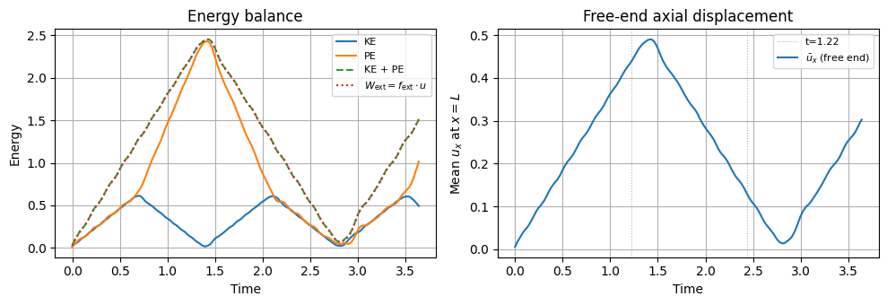
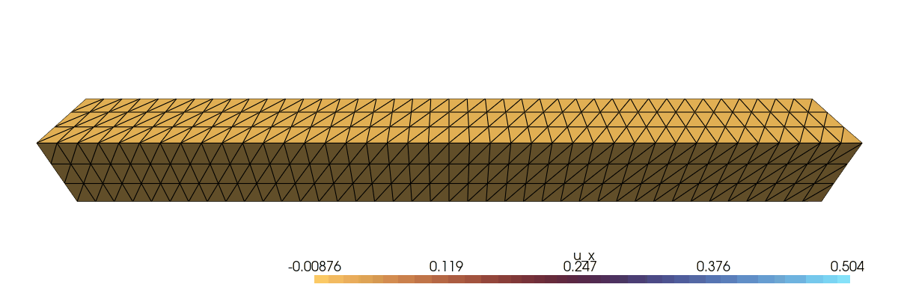

<div class="nb-header"><a href="https://colab.research.google.com/github/smec-ethz/tatva-docs/blob/main/notebooks/examples/elastodynamics_3d.ipynb" target="_blank"></a><a href="/assets/notebooks/examples/elastodynamics_3d.ipynb" download="elastodynamics_3d.ipynb" class="nb-download-btn"><svg class="nb-download-icon" viewBox="0 0 24 24" xmlns="http://www.w3.org/2000/svg"><path d="M12 16l-6-6 1.41-1.41L11 13.17V4h2v9.17l3.59-3.58L18 11l-6 6z"/><path d="M5 18h14v2H5z"/></svg> Download notebook</a></div>

# Elasto-dynamics in 3D: Explicit Central Difference Integration

<div class="nb-clear"></div>


Elastic wave propagation in a 3D bar under a step axial load. A compressive P-wave is launched from the free end (x = L), travels to the clamped end (x = 0), reflects, and returns.

The leap-frog (central difference) scheme reads:

$$u_{n+1} = u_n + \Delta t\, v_{n+1/2}$$

$$a_{n+1} = M^{-1}\bigl(f_\mathrm{ext} - f_\mathrm{int}(u_{n+1})\bigr)$$

$$v_{n+3/2} = v_{n+1/2} + \Delta t\, a_{n+1}$$

The scheme is conditionally stable for $\Delta t \leq h_\mathrm{min} / c_p$, where $c_p = \sqrt{(\lambda + 2\mu)/\rho}$ is the dilatational wave speed.
Because each step has fixed cost (no inner Newton iteration), the entire time loop is compiled with `jax.lax.scan`.


```python
import time
from typing import NamedTuple

import jax
import jax.numpy as jnp
import matplotlib.pyplot as plt
import numpy as np
import pyvista as pv
from jax_autovmap import autovmap

from tatva import Mesh, Operator, element

jax.config.update("jax_enable_x64", True)
jax.config.update("jax_platforms", "cpu")
```


??? example "Structured tetrahedral mesh for a rectangular bar"
    ```python
    
    
    def create_bar_mesh(
        lengths: tuple[float, float, float],
        nb_elems: tuple[int, int, int],
    ) -> Mesh:
        """Structured tet mesh for a bar along the x-axis.
    
        Bar occupies: x in [0, L], y in [-W/2, W/2], z in [-H/2, H/2].
        Each hexahedral cell is subdivided into 6 tetrahedra sharing the body
        diagonal, following the same pattern as the hyperelastic_3d example.
        """
        x_length, y_length, z_length = lengths
        nx, ny, nz = nb_elems
    
        x_rng = np.linspace(0.0, x_length, nx + 1)
        y_rng = np.linspace(-y_length / 2.0, y_length / 2.0, ny + 1)
        z_rng = np.linspace(-z_length / 2.0, z_length / 2.0, nz + 1)
    
        # Node global index: ix + iy*(nx+1) + iz*(nx+1)*(ny+1)
        Z, Y, X = np.meshgrid(z_rng, y_rng, x_rng, indexing="ij")
        nodes = np.stack([X, Y, Z], axis=-1).reshape(-1, 3)
    
        stride_x = 1
        stride_y = nx + 1
        stride_z = (nx + 1) * (ny + 1)
    
        k_idx, j_idx, i_idx = np.meshgrid(
            np.arange(nz), np.arange(ny), np.arange(nx), indexing="ij"
        )
        n0 = (i_idx * stride_x + j_idx * stride_y + k_idx * stride_z).ravel()
        n1 = n0 + stride_x
        n2 = n0 + stride_y
        n3 = n2 + stride_x
        n4 = n0 + stride_z
        n5 = n4 + stride_x
        n6 = n4 + stride_y
        n7 = n6 + stride_x
    
        tets = np.vstack(
            [
                np.stack([n0, n1, n3, n7], axis=1),
                np.stack([n0, n1, n7, n5], axis=1),
                np.stack([n0, n5, n7, n4], axis=1),
                np.stack([n0, n3, n2, n7], axis=1),
                np.stack([n0, n2, n6, n7], axis=1),
                np.stack([n0, n6, n4, n7], axis=1),
            ]
        )
        return Mesh(coords=jnp.array(nodes), elements=jnp.array(tets))
    ```

Now, we define material parameters and compute the wave-speeds for the considered material properties.


```python
class Material(NamedTuple):
    mu: float
    lmbda: float
    rho: float

    @classmethod
    def from_young_poisson(cls, E: float, nu: float, rho: float) -> "Material":
        mu = E / (2.0 * (1.0 + nu))
        lmbda = E * nu / ((1.0 + nu) * (1.0 - 2.0 * nu))
        return cls(mu=mu, lmbda=lmbda, rho=rho)


mat = Material.from_young_poisson(E=200.0, nu=0.3, rho=1.0)

# Theoretical wave speeds
c_p = float(jnp.sqrt((mat.lmbda + 2.0 * mat.mu) / mat.rho))  # P-wave (dilatational)
c_s = float(jnp.sqrt(mat.mu / mat.rho))  # S-wave (shear)
print(f"P-wave speed: {c_p:.3f}   S-wave speed: {c_s:.3f}")
```

    P-wave speed: 16.408   S-wave speed: 8.771


```python
L, W, H = 10.0, 1.0, 1.0
nx, ny, nz = 40, 3, 3

mesh = create_bar_mesh((L, W, H), (nx, ny, nz))
op = Operator(mesh, element.Tetrahedron4())

n_dofs_per_node = 3
n_nodes = mesh.coords.shape[0]
n_dofs = n_nodes * n_dofs_per_node
print(f"Nodes: {n_nodes}   DOFs: {n_dofs}   Elements: {mesh.elements.shape[0]}")
```

    Nodes: 656   DOFs: 1968   Elements: 2160


## Computing Lumped mass matrix

Lumped mass matrix assembled via AD of the integrated density field. `jacrev` of a scalar integral w.r.t. nodal density gives the row-sum nodal masses.


```python
mass_nodal = jax.jacrev(lambda rho_field: op.integrate(rho_field))(
    jnp.ones(n_nodes) * mat.rho
) 
M_flat = jnp.repeat(mass_nodal, n_dofs_per_node)  

print(
    f"Total mass: {float(jnp.sum(mass_nodal)):.4f}   Expected: {mat.rho * L * W * H:.4f}"
)
```

    Total mass: 10.0000   Expected: 10.0000


## Dirichlet BC 

We assume that the bar is clamped at the left face (x = 0). We apply uniform axial step traction at the right face (x = L), applied at t = 0.


```python
tol = 1e-10
fixed_nodes = jnp.where(jnp.isclose(mesh.coords[:, 0], 0.0, atol=tol))[0]
load_nodes = jnp.where(jnp.isclose(mesh.coords[:, 0], L, atol=tol))[0]

fixed_dofs = jnp.concatenate(
    [
        fixed_nodes * 3,
        fixed_nodes * 3 + 1,
        fixed_nodes * 3 + 2,
    ]
)

```

The resultant axial force is distributed uniformly over the face nodes. We chose the magnitude o that the peak strain (~$\sigma/E$) stays within the linear regime.


```python
total_force = 5.0
f_ext = jnp.zeros(n_dofs).at[load_nodes * 3].set(total_force / load_nodes.shape[0])
```

## CFL stability condition 

$$dt < h_\mathrm{min} / c_p$$

We compute $h_\mathrm{min}$ as the shortest edge length over all tetrahedra. And a safety factor of 0.5 to ensure stability.


```python
elem_coords = mesh.coords[mesh.elements]
edge_vecs = jnp.concatenate(
    [
        elem_coords[:, 1] - elem_coords[:, 0],
        elem_coords[:, 2] - elem_coords[:, 0],
        elem_coords[:, 3] - elem_coords[:, 0],
        elem_coords[:, 2] - elem_coords[:, 1],
        elem_coords[:, 3] - elem_coords[:, 1],
        elem_coords[:, 3] - elem_coords[:, 2],
    ],
    axis=0,
)  
h_min = float(jnp.min(jnp.linalg.norm(edge_vecs, axis=1)))

cfl_safety = 0.5
dt = cfl_safety * h_min / c_p
```

We simulate 3 full round trips of the P-wave (6 one-way traversals). To this end the total number of steps are calculated below based on the length of the bar and the $P-$wave speed.


```python
T_wave = L / c_p  # one-way travel time
n_steps = int(np.ceil(6.0 * T_wave / dt))
save_every = max(1, n_steps // 200)  # store ~200 frames
n_saves = n_steps // save_every

print(
    f"h_min: {h_min:.4f}   dt: {dt:.5f}   n_steps: {n_steps}   "
    f"n_saves: {n_saves}   T_wave: {T_wave:.3f}"
)
```

    h_min: 0.2500   dt: 0.00762   n_steps: 481   n_saves: 240   T_wave: 0.609


# Linear elastic strain energy and internal force 

Now we define the functions to compute the total strain energy of the bar and from it we compute the internal force vector using AD. The strain energy is given as 

$$ \Psi(\boldsymbol{u}) = \int \dfrac{1}{2}\sigma:\epsilon~\mathrm{d}\Omega $$

and the internal force vector is given as 

$$ \boldsymbol{f}_\mathrm{int} = \dfrac{\partial \Psi(\boldsymbol{{u}})}{\partial \boldsymbol{u}} $$


```python

@autovmap(grad_u=2, mu=0, lmbda=0)
def strain_energy_density(grad_u, mu, lmbda):
    eps = 0.5 * (grad_u + grad_u.T)
    return mu * jnp.einsum("ij,ij->", eps, eps) + 0.5 * lmbda * jnp.trace(eps) ** 2


def _strain_energy(u_flat: jnp.ndarray) -> jnp.ndarray:
    u = u_flat.reshape(-1, n_dofs_per_node)
    psi = strain_energy_density(op.grad(u), mat.mu, mat.lmbda)
    return op.integrate(psi)


# Standalone JIT-compiled versions for use outside of lax.scan
strain_energy_jit = jax.jit(_strain_energy)
internal_force_jit = jax.jit(jax.grad(_strain_energy))
```

## Leap-frog time stepping via `jax.lax.scan`

Using `lax.scan` (rather than a Python for loop) is the natural choice for explicit integrators: each step has identical, fixed cost, so the entire loop compiles to a single XLA program with no Python overhead per step.


```python
# State: (u_n, v_{n+1/2})

def _step(carry: tuple, _: None) -> tuple:
    u, v_half = carry
    # Update positions and enforce Dirichlet BCs
    u_new = (u + dt * v_half).at[fixed_dofs].set(0.0)
    # Compute acceleration: a = (f_ext - f_int) / M
    f_int = jax.grad(_strain_energy)(u_new)
    a = ((f_ext - f_int) / M_flat).at[fixed_dofs].set(0.0)
    # Update staggered velocities
    v_half_new = (v_half + dt * a).at[fixed_dofs].set(0.0)
    return (u_new, v_half_new), None


def _save_step(carry: tuple, _: None) -> tuple:
    """Advance save_every steps then collect observables."""
    (u, v_half), _ = jax.lax.scan(_step, carry, None, length=save_every)
    ke = 0.5 * jnp.sum(M_flat * v_half**2)
    pe = _strain_energy(u)
    # Mean axial displacement at the loaded (free) face
    tip_ux = jnp.mean(u.reshape(-1, n_dofs_per_node)[load_nodes, 0])
    return (u, v_half), (u, ke, pe, tip_ux)

```

Leap-frog initialization: $v_{1/2} = v_0 + (dt/2) * a_0$. At rest (u=0, v=0): $f_\mathrm{int}(u=0) = 0$, so $a_0 = f_\mathrm{ext} / M$


```python
u0 = jnp.zeros(n_dofs)
a0 = (f_ext / M_flat).at[fixed_dofs].set(0.0)
v_half_0 = (0.5 * dt * a0).at[fixed_dofs].set(0.0)
```


```python
t_start = time.time()

(u_final, _), (u_history, ke_history, pe_history, tip_history) = jax.lax.scan(
    _save_step, (u0, v_half_0), None, length=n_saves
)
jax.block_until_ready(u_history)

t_end = time.time()
print(f"Done in {t_end - t_start:.2f}s   u_history shape: {u_history.shape}")

# Move to host
u_history = np.array(u_history)  # (n_saves, n_dofs)
ke_history = np.array(ke_history)  # (n_saves,)
pe_history = np.array(pe_history)  # (n_saves,)
tip_history = np.array(tip_history)
times = np.arange(n_saves) * save_every * dt
```

    Compiling and running explicit dynamics simulation...
    Done in 0.84s   u_history shape: (240, 1968)


## Energy balance and tip displacement plots.

For a constant external force, energy conservation reads: $KE(t) + PE(t) = W_\mathrm{ext}(t)$  where $W_\mathrm{ext} = f_\mathrm{ext} \cdot u$. The leap-frog scheme preserves a modified energy, so the residual $KE + PE - W_\mathrm{ext}$  should remain close to zero throughout.


```python

f_ext_np = np.array(f_ext)
w_ext = np.einsum("j,ij->i", f_ext_np, u_history)  # (n_saves,)
te = ke_history + pe_history

fig, axes = plt.subplots(1, 2, figsize=(10, 3.5))

ax = axes[0]
ax.plot(times, ke_history, label="KE")
ax.plot(times, pe_history, label="PE")
ax.plot(times, te, label="KE + PE", ls="--")
ax.plot(times, w_ext, label=r"$W_\mathrm{ext} = f_\mathrm{ext} \cdot u$", ls=":")
ax.set(xlabel="Time", ylabel="Energy", title="Energy balance")
ax.legend(fontsize=8)
ax.grid(True)

ax = axes[1]
# Mark theoretical arrival times of the reflected P-wave at the free end
# (wave leaves x=L at t=0, hits x=0 at t=T_wave, returns at t=2*T_wave, …)
for k in range(2, 7, 2):
    t_arr = k * T_wave
    if t_arr < times[-1]:
        ax.axvline(
            t_arr,
            color="gray",
            ls=":",
            lw=0.8,
            alpha=0.6,
            label=f"t={t_arr:.2f}" if k == 2 else None,
        )
ax.plot(times, tip_history, label=r"$\bar{u}_x$ (free end)")
ax.set(
    xlabel="Time", ylabel=r"Mean $u_x$ at $x = L$", title="Free-end axial displacement"
)
ax.legend(fontsize=8)
ax.grid(True)

fig.tight_layout()
plt.show()
```


    

    


??? example "PyVista animation of the propagating P-wave front"
    ```python
    #
    # The bar is colored by axial displacement u_x: the wave front appears as a
    # moving boundary between the undisturbed (u_x ≈ 0) and displaced regions.
    
    pv.set_jupyter_backend("client")
    
    ux_all = u_history.reshape(n_saves, n_nodes, 3)[:, :, 0]  # (n_saves, n_nodes)
    clim = [float(ux_all.min()), float(ux_all.max())]
    if abs(clim[1] - clim[0]) < 1e-12:
        clim = [-1e-6, 1e-6]
    
    cells = np.hstack(
        [np.full((mesh.elements.shape[0], 1), 4), np.array(mesh.elements)]
    ).flatten()
    cell_types = np.full(mesh.elements.shape[0], pv.CellType.TETRA)
    grid = pv.UnstructuredGrid(cells, cell_types, np.array(mesh.coords, dtype=np.float64))
    
    plotter = pv.Plotter(off_screen=True)
    plotter.window_size = (1200, 400)
    plotter.open_gif("../figures/elastodynamics_3d.gif", fps=20)
    
    grid.point_data["ux"] = ux_all[0]
    plotter.add_mesh(
        grid,
        scalars="ux",
        cmap="managua",
        clim=clim,
        show_edges=True,
        scalar_bar_args={"title": "u_x", "vertical": False},
    )
    
    plotter.camera_position = [
        (L / 2, -5.0, 4.0),
        (L / 2, 0.0, 0.0),
        (0.0, 0.0, 1.0),
    ]
    plotter.zoom_camera(0.85)
    
    
    for i in range(n_saves):
        grid.points = np.array(
            mesh.coords + u_history[i].reshape(-1, n_dofs_per_node), dtype=np.float64
        )
        grid.point_data["ux"] = ux_all[i]
        plotter.write_frame()
    
    plotter.close()
    ```



