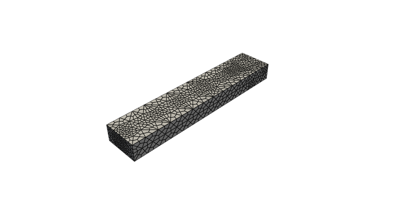
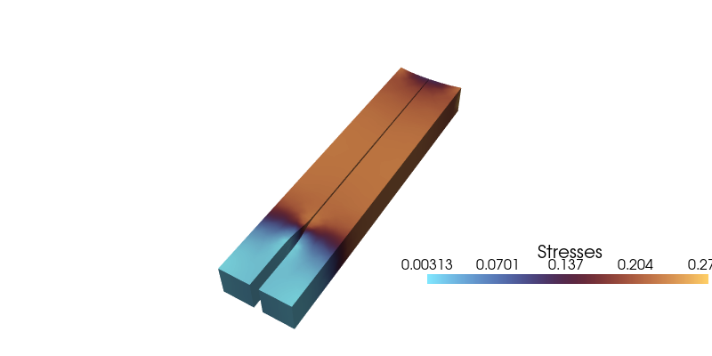
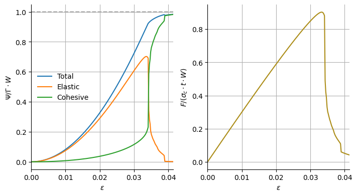

<div class="nb-header"><a href="https://colab.research.google.com/github/smec-ethz/tatva-docs/blob/main/notebooks/examples/fracture_quasistatic_3d.ipynb" target="_blank"></a><a href="/assets/notebooks/examples/fracture_quasistatic_3d.ipynb" download="fracture_quasistatic_3d.ipynb" class="nb-download-btn"><svg class="nb-download-icon" viewBox="0 0 24 24" xmlns="http://www.w3.org/2000/svg"><path d="M12 16l-6-6 1.41-1.41L11 13.17V4h2v9.17l3.59-3.58L18 11l-6 6z"/><path d="M5 18h14v2H5z"/></svg> Download notebook</a></div>

# Cohesive Fracture: Penalty Method

<div class="nb-clear"></div>


In this notebook, we simulate quasi-static crack propagation along an interface in a 3D plate using Cohesive law. This is an example of mixed-dimensional coupling where the energies are computed in domains which are dimensionally separate. In bulk which is a 3D domain and along the interface which a 2D domain.


??? example "Colab Setup (Install Dependencies)"
    ```python
    
    # Only run this if we are in Google Colab
    if 'google.colab' in str(get_ipython()):
        print("Installing dependencies using uv...")
        # Install uv if not available
        !pip install -q uv
        # Install system dependencies
        !apt-get install -qq gmsh
        # Use uv to install Python dependencies
        !uv pip install --system matplotlib meshio
        !uv pip install --system pyvista
        !uv pip install --system "git+https://github.com/smec-ethz/tatva-docs.git"
            
        import pyvista as pv
    
        pv.global_theme.jupyter_backend = 'static'
        pv.global_theme.notebook = True
        pv.start_xvfb()
        
        print("Installation complete!")
    else:
        import pyvista as pv
        pv.global_theme.jupyter_backend = 'client'
    ```


```python
import jax

jax.config.update("jax_enable_x64", True)  # use double-precision
jax.config.update("jax_persistent_cache_min_compile_time_secs", 0)

import os
from typing import NamedTuple

import equinox as eqx
import gmsh
import jax.numpy as jnp
import matplotlib.pyplot as plt
import meshio
import numpy as np
from jax import Array
from jax_autovmap import autovmap
from tatva import Mesh, Operator, element
```

The critical length for plain strain condition is given by:

$$L_\text{G} = 2\mu \Gamma/\pi(1-\nu)\sigma_{\infty}^2$$

where $\mu$ is the shear modulus, $\Gamma$ is the fracture energy, $\nu$ is the Poisson's ratio, and $\sigma_{\infty}$ is the stress at infinity. For plain strain condition, the effective Young's modulus is given by:

$$E_\text{eff} = \frac{E}{1-\nu^2}$$

where $E$ is the Young's modulus and $\nu$ is the Poisson's ratio. For a specimen stretched by a prestrain $\epsilon$, the applied stress at infinity is given by:

$$\sigma_{\infty} = \epsilon /E_\text{eff}$$

## Pre-crack plate under Mode I loading {#sec-plate-mode-I}

We generate a plate with a pre-crack of length $L_G$ and the cohesive interface lies at $x \geq L_G$ and $y=0$.


??? example "View mesh generation functions"
    ```python
    
    def generate_unstructured_hex_fracture_3d(
        length: float,
        height: float,
        thickness: float,
        crack_tip_x: float,
        mesh_size_tip: float,
        mesh_size_far: float,
        work_dir: str = "../meshes",
    ):
        """
        Generates a 3D fracture assembly with an Unstructured HEXAHEDRAL mesh.
    
        Args:
            length: Total length of the block (L)
            height: Total height of the block (h)
            thickness: Thickness of the block (t)
            crack_tip_x: X-coordinate of the crack tip (a)
            mesh_size_tip: Desired mesh size near the crack tip (refined)
            mesh_size_far: Desired mesh size far from the crack tip (coarser)
            work_dir: Directory to store temporary mesh files
        Returns:
            mesh: The full 3D mesh of the half-block (Mesh object)
            interface_mesh: The mesh representing the crack interface (Mesh object)
            top_interface_nodes: Node indices on the top face of the interface
            bottom_interface_nodes: Node indices on the bottom face of the interface
            active_quads_top: Quad element indices on the top face of the interface
            active_quads_bottom: Quad element indices on the bottom face of the interface
        """
        
        if not os.path.exists(work_dir):
            os.makedirs(work_dir)
        
        filename = os.path.join(work_dir, "temp_half_block_hex.msh")
        
        gmsh.initialize()
        gmsh.model.add("half_block_hex")
        
        h_half = height / 2.0
            
        # Points: Bottom Face (y=0)
        p1 = gmsh.model.geo.addPoint(0, 0, 0, mesh_size_far)
        p4 = gmsh.model.geo.addPoint(0, 0, thickness, mesh_size_far)
        # x=crack_tip (Refined)
        pt1 = gmsh.model.geo.addPoint(crack_tip_x, 0, 0, mesh_size_tip)
        pt2 = gmsh.model.geo.addPoint(crack_tip_x, 0, thickness, mesh_size_tip)
        # x=L
        p2 = gmsh.model.geo.addPoint(length, 0, 0, mesh_size_tip)
        p3 = gmsh.model.geo.addPoint(length, 0, thickness, mesh_size_tip)
    
        # Points: Top Face (y=h/2)
        p5 = gmsh.model.geo.addPoint(0, h_half, 0, mesh_size_far)
        p8 = gmsh.model.geo.addPoint(0, h_half, thickness, mesh_size_far)
        # x=crack_tip (Refined)
        pt3 = gmsh.model.geo.addPoint(crack_tip_x, h_half, 0, mesh_size_far)
        pt4 = gmsh.model.geo.addPoint(crack_tip_x, h_half, thickness, mesh_size_far)
        # x=L
        p6 = gmsh.model.geo.addPoint(length, h_half, 0, mesh_size_far)
        p7 = gmsh.model.geo.addPoint(length, h_half, thickness, mesh_size_far)
    
        # Lines: Bottom
        l1 = gmsh.model.geo.addLine(p1, pt1)
        l2 = gmsh.model.geo.addLine(pt1, p2)
        l_right_b = gmsh.model.geo.addLine(p2, p3)
        l3 = gmsh.model.geo.addLine(p3, pt2)
        l4 = gmsh.model.geo.addLine(pt2, p4)
        l_left_b = gmsh.model.geo.addLine(p4, p1)
        l_crack_b = gmsh.model.geo.addLine(pt1, pt2) # Crack front
    
        # Lines: Top
        l5 = gmsh.model.geo.addLine(p5, pt3)
        l6 = gmsh.model.geo.addLine(pt3, p6)
        l_right_t = gmsh.model.geo.addLine(p6, p7)
        l7 = gmsh.model.geo.addLine(p7, pt4)
        l8 = gmsh.model.geo.addLine(pt4, p8)
        l_left_t = gmsh.model.geo.addLine(p8, p5)
        l_crack_t = gmsh.model.geo.addLine(pt3, pt4)
    
        # Lines: Vertical
        v1 = gmsh.model.geo.addLine(p1, p5)
        v_tip1 = gmsh.model.geo.addLine(pt1, pt3)
        v2 = gmsh.model.geo.addLine(p2, p6)
        v3 = gmsh.model.geo.addLine(p3, p7)
        v_tip2 = gmsh.model.geo.addLine(pt2, pt4)
        v4 = gmsh.model.geo.addLine(p4, p8)
    
        # Surfaces (Pre/Post Crack Split)
        loop_if_1 = gmsh.model.geo.addCurveLoop([l1, l_crack_b, l4, l_left_b])
        s_if_1 = gmsh.model.geo.addPlaneSurface([loop_if_1])
        
        loop_if_2 = gmsh.model.geo.addCurveLoop([l2, l_right_b, l3, -l_crack_b])
        s_if_2 = gmsh.model.geo.addPlaneSurface([loop_if_2])
    
        loop_top_1 = gmsh.model.geo.addCurveLoop([l5, l_crack_t, l8, l_left_t])
        s_top_1 = gmsh.model.geo.addPlaneSurface([loop_top_1])
        
        loop_top_2 = gmsh.model.geo.addCurveLoop([l6, l_right_t, l7, -l_crack_t])
        s_top_2 = gmsh.model.geo.addPlaneSurface([loop_top_2])
    
        # Sides
        s_left = gmsh.model.geo.addPlaneSurface([gmsh.model.geo.addCurveLoop([l_left_b, v1, -l_left_t, -v4])])
        s_right = gmsh.model.geo.addPlaneSurface([gmsh.model.geo.addCurveLoop([l_right_b, v3, -l_right_t, -v2])])
        s_front_1 = gmsh.model.geo.addPlaneSurface([gmsh.model.geo.addCurveLoop([l1, v_tip1, -l5, -v1])])
        s_front_2 = gmsh.model.geo.addPlaneSurface([gmsh.model.geo.addCurveLoop([l2, v2, -l6, -v_tip1])])
        s_back_1 = gmsh.model.geo.addPlaneSurface([gmsh.model.geo.addCurveLoop([l4, v4, -l8, -v_tip2])])
        s_back_2 = gmsh.model.geo.addPlaneSurface([gmsh.model.geo.addCurveLoop([l3, v_tip2, -l7, -v3])])
        s_mid = gmsh.model.geo.addPlaneSurface([gmsh.model.geo.addCurveLoop([l_crack_b, v_tip2, -l_crack_t, -v_tip1])])
    
        # Volumes
        sl1 = gmsh.model.geo.addSurfaceLoop([s_if_1, s_top_1, s_left, s_front_1, s_back_1, s_mid])
        vol1 = gmsh.model.geo.addVolume([sl1])
        sl2 = gmsh.model.geo.addSurfaceLoop([s_if_2, s_top_2, s_right, s_front_2, s_back_2, s_mid])
        vol2 = gmsh.model.geo.addVolume([sl2])
    
        gmsh.model.geo.synchronize()
    
        gmsh.model.addPhysicalGroup(2, [s_if_1, s_if_2], 1, name="interface_surface")
        gmsh.model.addPhysicalGroup(3, [vol1, vol2], 2, name="top_domain")
        gmsh.option.setNumber("Mesh.SubdivisionAlgorithm", 2)
        
        gmsh.model.mesh.generate(3)
        gmsh.write(filename)
        gmsh.finalize()
    
        _m = meshio.read(filename)
        if os.path.exists(filename):
            os.remove(filename)
    
        points_top = _m.points # (N, 3)
        
        hex_top = _m.cells_dict["hexahedron"]
        
        interface_surf_idx = _m.cell_sets_dict["interface_surface"]["quad"]
        all_interface_quads_top = _m.cells_dict["quad"][interface_surf_idx]
    
        points_bottom = points_top.copy()
        points_bottom[:, 1] *= -1 # Flip Y
        points_bottom[:, 1] -= 1e-7
        
        N_half = len(points_top)
        
        hex_bottom = hex_top + N_half
        
        hex_bottom[:, [1, 3]] = hex_bottom[:, [3, 1]]
        hex_bottom[:, [5, 7]] = hex_bottom[:, [7, 5]]
    
        coords = np.vstack([points_top, points_bottom])
        elements = np.vstack([hex_top, hex_bottom])
    
        quad_coords = points_top[all_interface_quads_top]
        centroids_x = np.mean(quad_coords[:, :, 0], axis=1)
        
        active_mask = centroids_x >= (crack_tip_x - 1e-9)
        
        active_quads_top = all_interface_quads_top[active_mask]
        active_quads_bottom = active_quads_top + N_half
        
        unique_nodes_bot, inverse_indices = jnp.unique(active_quads_bottom, return_inverse=True)
        
        interface_coords = coords[unique_nodes_bot]
        interface_connectivity = inverse_indices.reshape(active_quads_bottom.shape)
        
        interface_mesh = Mesh(interface_coords, interface_connectivity)
    
        bottom_interface_nodes = unique_nodes_bot
        top_interface_nodes = bottom_interface_nodes - N_half
        mesh = Mesh(coords, elements)
    
        return mesh, interface_mesh, top_interface_nodes, bottom_interface_nodes, active_quads_top, active_quads_bottom
    ```

Now, we define the material parameters and geometic parameters.


```python
prestrain = 0.1
nu = 0.35

E = 106e3  # N/m^2
lmbda = nu * E / ((1 + nu) * (1 - 2 * nu))
mu = E / (2 * (1 + nu))

Gamma = 15  # J/m^2
sigma_c = 20e3  # N/m^2

print(f"mu: {mu} N/m^2")
print(f"lmbda: {lmbda} N/m^2")

sigma_inf = prestrain * E

L_G = 2 * mu * Gamma / (jnp.pi * (1 - nu) * sigma_inf**2)
print(f"L_G: {L_G} m")
```

    mu: 39259.259259259255 N/m^2
    lmbda: 91604.93827160491 N/m^2
    L_G: 0.0051332024864342955 m


```python
Lx = 10 * L_G
Ly = 2 * L_G
Lz = 1 * L_G

(
    mesh,
    interface_mesh,
    top_interface_nodes,
    bottom_interface_nodes,
    top_interface_elements,
    bottom_interface_elements,
) = generate_unstructured_hex_fracture_3d(
    length=Lx,
    height=Ly,
    thickness=Lz,
    crack_tip_x=crack_length,
    mesh_size_tip=2e-3,
    mesh_size_far=4e-3,
)


n_nodes = mesh.coords.shape[0]
n_dofs_per_node = 3
n_dofs = n_dofs_per_node * n_nodes
```

??? info "Output"
    Info    : Meshing 1D...
        Info    : [  0%] Meshing curve 1 (Line)
        Info    : [ 10%] Meshing curve 2 (Line)
        Info    : [ 20%] Meshing curve 3 (Line)
        Info    : [ 20%] Meshing curve 4 (Line)
        Info    : [ 30%] Meshing curve 5 (Line)
        Info    : [ 30%] Meshing curve 6 (Line)
        Info    : [ 40%] Meshing curve 7 (Line)
        Info    : [ 40%] Meshing curve 8 (Line)
        Info    : [ 50%] Meshing curve 9 (Line)
        Info    : [ 50%] Meshing curve 10 (Line)
        Info    : [ 60%] Meshing curve 11 (Line)
        Info    : [ 60%] Meshing curve 12 (Line)
        Info    : [ 70%] Meshing curve 13 (Line)
        Info    : [ 70%] Meshing curve 14 (Line)
        Info    : [ 80%] Meshing curve 15 (Line)
        Info    : [ 80%] Meshing curve 16 (Line)
        Info    : [ 90%] Meshing curve 17 (Line)
        Info    : [ 90%] Meshing curve 18 (Line)
        Info    : [100%] Meshing curve 19 (Line)
        Info    : [100%] Meshing curve 20 (Line)
        Info    : Done meshing 1D (Wall 0.00359308s, CPU 0.004157s)
        Info    : Meshing 2D...
        Info    : [  0%] Meshing surface 1 (Plane, Frontal-Delaunay)
        Info    : [ 10%] Meshing surface 2 (Plane, Frontal-Delaunay)
        Info    : [ 20%] Meshing surface 3 (Plane, Frontal-Delaunay)
        Info    : [ 30%] Meshing surface 4 (Plane, Frontal-Delaunay)
        Info    : [ 40%] Meshing surface 5 (Plane, Frontal-Delaunay)
        Info    : [ 50%] Meshing surface 6 (Plane, Frontal-Delaunay)
        Info    : [ 60%] Meshing surface 7 (Plane, Frontal-Delaunay)
        Info    : [ 70%] Meshing surface 8 (Plane, Frontal-Delaunay)
        Info    : [ 80%] Meshing surface 9 (Plane, Frontal-Delaunay)
        Info    : [ 90%] Meshing surface 10 (Plane, Frontal-Delaunay)
        Info    : [100%] Meshing surface 11 (Plane, Frontal-Delaunay)
        Info    : Done meshing 2D (Wall 0.00530414s, CPU 0.004784s)
        Info    : Meshing 3D...
        Info    : 3D Meshing 2 volumes with 1 connected component
        Info    : Tetrahedrizing 249 nodes...
        Info    : Done tetrahedrizing 257 nodes (Wall 0.00191356s, CPU 0.002098s)
        Info    : Reconstructing mesh...
        Info    :  - Creating surface mesh
        Info    :  - Identifying boundary edges
        Info    :  - Recovering boundary
        Info    : Done reconstructing mesh (Wall 0.00425647s, CPU 0.00351s)
        Info    : Found volume 1
        Info    : Found volume 2
        Info    : It. 0 - 0 nodes created - worst tet radius 1.19778 (nodes removed 0 0)
        Info    : 3D refinement terminated (255 nodes total):
        Info    :  - 0 Delaunay cavities modified for star shapeness
        Info    :  - 0 nodes could not be inserted
        Info    :  - 680 tetrahedra created in 0.000347617 sec. (1956175 tets/s)
        Info    : 0 node relocations
        Info    : Done meshing 3D (Wall 0.00848098s, CPU 0.007885s)
        Info    : Optimizing mesh...
        Info    : Optimizing volume 1
        Info    : Optimization starts (volume = 2.43466e-07) with worst = 0.0504542 / average = 0.777641:
        Info    : 0.00 < quality < 0.10 :         2 elements
        Info    : 0.10 < quality < 0.20 :         0 elements
        Info    : 0.20 < quality < 0.30 :         2 elements
        Info    : 0.30 < quality < 0.40 :         0 elements
        Info    : 0.40 < quality < 0.50 :         3 elements
        Info    : 0.50 < quality < 0.60 :         1 elements
        Info    : 0.60 < quality < 0.70 :        29 elements
        Info    : 0.70 < quality < 0.80 :        43 elements
        Info    : 0.80 < quality < 0.90 :        52 elements
        Info    : 0.90 < quality < 1.00 :        30 elements
        Info    : 4 edge swaps, 0 node relocations (volume = 2.43466e-07): worst = 0.479486 / average = 0.794093 (Wall 6.8234e-05s, CPU 9.5e-05s)
        Info    : No ill-shaped tets in the mesh :-)
        Info    : 0.00 < quality < 0.10 :         0 elements
        Info    : 0.10 < quality < 0.20 :         0 elements
        Info    : 0.20 < quality < 0.30 :         0 elements
        Info    : 0.30 < quality < 0.40 :         0 elements
        Info    : 0.40 < quality < 0.50 :         3 elements
        Info    : 0.50 < quality < 0.60 :         1 elements
        Info    : 0.60 < quality < 0.70 :        31 elements
        Info    : 0.70 < quality < 0.80 :        41 elements
        Info    : 0.80 < quality < 0.90 :        50 elements
        Info    : 0.90 < quality < 1.00 :        32 elements
        Info    : Optimizing volume 2
        Info    : Optimization starts (volume = 1.10912e-06) with worst = 0.0625991 / average = 0.673012:
        Info    : 0.00 < quality < 0.10 :        10 elements
        Info    : 0.10 < quality < 0.20 :         7 elements
        Info    : 0.20 < quality < 0.30 :        12 elements
        Info    : 0.30 < quality < 0.40 :        16 elements
        Info    : 0.40 < quality < 0.50 :        45 elements
        Info    : 0.50 < quality < 0.60 :        49 elements
        Info    : 0.60 < quality < 0.70 :       148 elements
        Info    : 0.70 < quality < 0.80 :        85 elements
        Info    : 0.80 < quality < 0.90 :        76 elements
        Info    : 0.90 < quality < 1.00 :        70 elements
        Info    : 27 edge swaps, 0 node relocations (volume = 1.10912e-06): worst = 0.309952 / average = 0.698742 (Wall 0.000326186s, CPU 0.000311s)
        Info    : No ill-shaped tets in the mesh :-)
        Info    : 0.00 < quality < 0.10 :         0 elements
        Info    : 0.10 < quality < 0.20 :         0 elements
        Info    : 0.20 < quality < 0.30 :         0 elements
        Info    : 0.30 < quality < 0.40 :        23 elements
        Info    : 0.40 < quality < 0.50 :        48 elements
        Info    : 0.50 < quality < 0.60 :        50 elements
        Info    : 0.60 < quality < 0.70 :       139 elements
        Info    : 0.70 < quality < 0.80 :        90 elements
        Info    : 0.80 < quality < 0.90 :        77 elements
        Info    : 0.90 < quality < 1.00 :        70 elements
        Info    : Done optimizing mesh (Wall 0.000840244s, CPU 0.000912s)
        Info    : Refining mesh...
        Info    : Meshing order 2 (curvilinear on)...
        Info    : [  0%] Meshing curve 1 order 2
        Info    : [ 10%] Meshing curve 2 order 2
        Info    : [ 10%] Meshing curve 3 order 2
        Info    : [ 10%] Meshing curve 4 order 2
        Info    : [ 20%] Meshing curve 5 order 2
        Info    : [ 20%] Meshing curve 6 order 2
        Info    : [ 20%] Meshing curve 7 order 2
        Info    : [ 30%] Meshing curve 8 order 2
        Info    : [ 30%] Meshing curve 9 order 2
        Info    : [ 30%] Meshing curve 10 order 2
        Info    : [ 40%] Meshing curve 11 order 2
        Info    : [ 40%] Meshing curve 12 order 2
        Info    : [ 40%] Meshing curve 13 order 2
        Info    : [ 40%] Meshing curve 14 order 2
        Info    : [ 50%] Meshing curve 15 order 2
        Info    : [ 50%] Meshing curve 16 order 2
        Info    : [ 50%] Meshing curve 17 order 2
        Info    : [ 60%] Meshing curve 18 order 2
        Info    : [ 60%] Meshing curve 19 order 2
        Info    : [ 60%] Meshing curve 20 order 2
        Info    : [ 70%] Meshing surface 1 order 2
        Info    : [ 70%] Meshing surface 2 order 2
        Info    : [ 70%] Meshing surface 3 order 2
        Info    : [ 70%] Meshing surface 4 order 2
        Info    : [ 80%] Meshing surface 5 order 2
        Info    : [ 80%] Meshing surface 6 order 2
        Info    : [ 80%] Meshing surface 7 order 2
        Info    : [ 90%] Meshing surface 8 order 2
        Info    : [ 90%] Meshing surface 9 order 2
        Info    : [ 90%] Meshing surface 10 order 2
        Info    : [100%] Meshing surface 11 order 2
        Info    : [100%] Meshing volume 1 order 2
        Info    : [100%] Meshing volume 2 order 2
        Info    : Surface mesh: worst distortion = 1 (0 elements in ]0, 0.2]); worst gamma = 0.702659
        Info    : Volume mesh: worst distortion = 1 (0 elements in ]0, 0.2])
        Info    : Done meshing order 2 (Wall 0.00286796s, CPU 0.0023s)
        Info    : Done refining mesh (Wall 0.00733381s, CPU 0.006798s)
        Info    : 3613 nodes 4347 elements
        Info    : Writing '../meshes/temp_half_block_hex.msh'...
        Info    : Done writing '../meshes/temp_half_block_hex.msh'


```python
grid = pv.UnstructuredGrid(
    np.hstack((np.full((mesh.elements.shape[0], 1), 8), mesh.elements)).flatten(),
    np.full(mesh.elements.shape[0], pv.CellType.HEXAHEDRON),
    np.array(mesh.coords)
)

grid_interface = pv.UnstructuredGrid(
    np.hstack((np.full((interface_mesh.elements.shape[0], 1), 4), interface_mesh.elements)).flatten(),
    np.full(interface_mesh.elements.shape[0], pv.CellType.QUAD),
    np.array(interface_mesh.coords)
)

pl = pv.Plotter(window_size=(800, 400))
pl.add_mesh(grid, show_edges=True, color="lightgray",  smooth_shading=False, opacity=1)
pl.add_mesh(grid_interface, show_edges=True, color="red",  smooth_shading=False)
pl.view_isometric()
pl.show()
```

[](../assets/plots/fracture_mesh_interactive.html){: target="_blank" }

*Click the image above to mesh in full screen.*

We can now create the mesh and `tatva.Operator` to integrate the energy. We define the Element 8-node `Hexahedron`. One can implement any new H$^1$ finite-element.


??? example "Define the 8-node hexahedral element"
    ```python
    
    class Hexahedron8(element.Element):
        """A 8-node linear hexahedral element."""
    
        a = 1 / jnp.sqrt(3)
    
        # 2x2x2 Gauss Quadrature Rule
        quad_points = jnp.array(
            [
                [-a, -a, -a],
                [a, -a, -a],
                [a, a, -a],
                [-a, a, -a],
                [-a, -a, a],
                [a, -a, a],
                [a, a, a],
                [-a, a, a],
            ]
        )
    
        # Weights are all 1.0 for this rule (since interval is [-1, 1])
        quad_weights = jnp.ones(8)
    
        def shape_function(self, xi: Array) -> Array:
            """Returns the shape functions evaluated at the local coordinates (xi, eta, zeta)."""
            xi, eta, zeta = xi
            return (1 / 8) * jnp.array(
                [
                    (1 - xi) * (1 - eta) * (1 - zeta),
                    (1 + xi) * (1 - eta) * (1 - zeta),
                    (1 + xi) * (1 + eta) * (1 - zeta),
                    (1 - xi) * (1 + eta) * (1 - zeta),
                    (1 - xi) * (1 - eta) * (1 + zeta),
                    (1 + xi) * (1 - eta) * (1 + zeta),
                    (1 + xi) * (1 + eta) * (1 + zeta),
                    (1 - xi) * (1 + eta) * (1 + zeta),
                ]
            )
    
        def shape_function_derivative(self, xi: Array) -> Array:
            """Returns the derivative of the shape functions."""
            # shape (3, 8) -> (dim, n_nodes)
            xi, eta, zeta = xi
            return (1 / 8) * jnp.array(
                [
                    [
                        -(1 - eta) * (1 - zeta),
                        (1 - eta) * (1 - zeta),
                        (1 + eta) * (1 - zeta),
                        -(1 + eta) * (1 - zeta),
                        -(1 - eta) * (1 + zeta),
                        (1 - eta) * (1 + zeta),
                        (1 + eta) * (1 + zeta),
                        -(1 + eta) * (1 + zeta),
                    ],
                    [
                        -(1 - xi) * (1 - zeta),
                        -(1 + xi) * (1 - zeta),
                        (1 + xi) * (1 - zeta),
                        (1 - xi) * (1 - zeta),
                        -(1 - xi) * (1 + zeta),
                        -(1 + xi) * (1 + zeta),
                        (1 + xi) * (1 + zeta),
                        (1 - xi) * (1 + zeta),
                    ],
                    [
                        -(1 - xi) * (1 - eta),
                        -(1 + xi) * (1 - eta),
                        -(1 + xi) * (1 + eta),
                        -(1 - xi) * (1 + eta),
                        (1 - xi) * (1 - eta),
                        (1 + xi) * (1 - eta),
                        (1 + xi) * (1 + eta),
                        (1 - xi) * (1 + eta),
                    ],
                ]
            )
    ```


```python
hex = Hexahedron8()
op = Operator(mesh, hex)
```

## Defining the total potential energy


### Defining elastic strain energy


We define a function to compute the linear elastic energy density based on the displacement gradients $\nabla u$.

$$
\Psi(x) =  \sigma(x) : \epsilon(x)
$$

where $\sigma$ is the stress tensor and $\epsilon$ is the strain tensor.

$$
\sigma = \lambda \text{tr}(\epsilon) I + 2\mu \epsilon
$$

and

$$
\epsilon = \frac{1}{2} (\nabla u + \nabla u^T)
$$

The elastic strain energy density is then given by:

$$
\Psi_{elastic}(u) = \int_{\Omega} \Psi(x) dV
$$


```python
@autovmap(grad_u=2)
def compute_strain(grad_u):
    return 0.5 * (grad_u + grad_u.T)


@autovmap(eps=2, mu=0, lmbda=0)
def compute_stress(eps, mu, lmbda):
    I = jnp.eye(3)
    return 2 * mu * eps + lmbda * jnp.trace(eps) * I


@autovmap(grad_u=2, mu=0, lmbda=0)
def strain_energy(grad_u, mu, lmbda):
    eps = compute_strain(grad_u)
    sigma = compute_stress(eps, mu, lmbda)
    return 0.5 * jnp.einsum("ij,ij->", sigma, eps)
    

@jax.jit
def total_strain_energy(u_flat):
    u = u_flat.reshape(-1, n_dofs_per_node)
    u_grad = op.grad(u)
    energy_density = strain_energy(u_grad, mu, lmbda)
    return op.integrate(energy_density)
```

### Defining total fracture energy


The total potential energy $\Psi$ is the sum of the elastic strain energy $\Psi_{elastic}$ and the cohesive energy $\Psi_{cohesive}$.

$$\Psi(u)=\Psi_{elastic}(u)+\Psi_{cohesive}(u)$$

The cohesive energy is defined as:

$$\Psi_{cohesive}(u)= \int_{\Gamma_\text{coh}} \psi(\delta(\boldsymbol{u})) dA$$

where

- $\Gamma_{coh}$ is the cohesive interface.
- $\boldsymbol{\delta}(\boldsymbol{u}) = \boldsymbol{u}^+ - \boldsymbol{u}^-$ is the displacement jump across the interface.
- $\phi(\boldsymbol{\delta})$ is the cohesive potential, which defines the energy-separation relationship.

### Defining the effective opening

Now, we proceed with defining the cohesive potential in terms of the jump displacement

$$
[\![ \boldsymbol{u} ]\!] = \boldsymbol{u}_1 - \boldsymbol{u}_2
$$

where $\boldsymbol{u}_1$ and $\boldsymbol{u}_2$ are the displacements of the nodes of the upper and lower interface respectively. The effective opening is then given as:

$$
\delta = \sqrt{[\![ u ]\!]_t^2 + [\![ u_ ]\!]_n^2}
$$

where $[\![ u ]\!]_t$ and $[\![ u ]\!]_n$ are the tangential and normal components of the jump displacement with respect to the fracture plane or the interface. Since the fracture plane or the interface is parallel to the $x$ axis and we assume that it remains so throughout the simulation, we can then write:

$$
[\![ u ]\!]_t = [\![ \boldsymbol{u} ]\!]\cdot{}\boldsymbol{e}_x
$$

and

$$
[\![ u ]\!]_n = [\![ \boldsymbol{u} ]\!]\cdot{}\boldsymbol{e}_y
$$

where $\boldsymbol{e}_x$ and $\boldsymbol{e}_y$ are the unit vectors in the $x$ and $y$ directions respectively.

### Defining the traction-separation law

For this example, we assume that the cohesive potential is given by the exponential cohesive potential.

$$
\phi = \Gamma \left(-\frac{\delta}{\delta_c} \exp\left(-\frac{\delta}{\delta_c}\right)\right)
$$

where $\Gamma$ is the fracture energy and $\delta_c$ is the critical opening. The critical opening for the exponential cohesive potential is given by:

$$
\delta_c = \frac{\Gamma \exp(-1)}{\sigma_c}
$$

It is the opening at which the cohesive traction is equal to the critical stress.


```python
penalty = 1e2
normal_vector = jnp.array([0.0, 1.0, 0.0])  # Y-direction
beta = 0.0  # No tangential contribution

@jax.jit
def safe_sqrt(x):
    return jnp.sqrt(jnp.where(x > 0.0, x, 0.0))


@autovmap(jump=1)
def compute_opening(jump: Array) -> float:
    """
    Compute the opening of the cohesive element.
    Args:
        jump: The jump in the displacement field.
    Returns:
        The opening of the cohesive element.
    """
    delta_n = jnp.dot(jump, normal_vector)
    delta_t_vec = jump - delta_n * normal_vector
    delta_t = safe_sqrt(jnp.dot(delta_t_vec, delta_t_vec))
    opening = safe_sqrt(delta_n ** 2 + beta * delta_t ** 2)
    return opening


def exponential_potential(delta, Gamma, delta_c):
    return Gamma * (1 - (1 + (delta / delta_c)) * (jnp.exp(-delta / delta_c)))


exponential_traction = jax.jacrev(exponential_potential)


@autovmap(jump=1, delta_max=0)
def exponential_cohesive_energy(
    jump: Array,
    delta_max: float,
    Gamma: float,
    sigma_c: float,
    penalty: float,
    delta_threshold: float = 1e-8,
) -> float:
    """
    Compute the cohesive energy for a given jump.
    Args:
        jump: The jump in the displacement field.
        Gamma: Fracture energy of the material.
        sigma_c: The critical strength of the material.
        penalty: The penalty parameter for penalizing the interpenetration.
        delta_threshold: The threshold for the delta parameter.
    Returns:
        The cohesive energy.
    """
    delta = compute_opening(jump)
    delta_c = (Gamma * jnp.exp(-1)) / sigma_c

    def true_fun(delta):
        def loading(delta):
            return exponential_potential(delta, Gamma, delta_c)

        def unloading(delta):
            psi_max = exponential_potential(delta_max, Gamma, delta_c)
            T_max = exponential_traction(delta_max, Gamma, delta_c)
            T_current = T_max * (delta) / delta_max
            psi_current = psi_max - 0.5 * (T_max + T_current) * (delta_max - delta)
            return psi_current

        return jax.lax.cond(delta > delta_max, loading, unloading, delta)

    def false_fun(delta):
        return 0.5 * penalty * delta**2

    return jax.lax.cond(delta > delta_threshold, true_fun, false_fun, delta)

```

To ease the integration along the cohesive interface, we will define a new mesh that contains the Quadrilateral elements from one of the two interfaces. Since the two interfaces are discretized using the same number of elements, and occupy the same spatial domain, we can use any one of the two to perform the integration.


??? example "Define the 4-node quadrilateral element on the interface"
    ```python
    
    class Quad4Manifold(element.Quad4):
        """A 4-node linear quadrilateral element on a 2D manifold embedded in 3D space."""
    
        def get_jacobian(self, xi: Array, nodal_coords: Array) -> tuple[Array, Array]:
            dNdr = self.shape_function_derivative(xi)
            J = dNdr @ nodal_coords  # shape (2, 2) or (2, 3)
            G = J @ J.T  # shape (2, 2)
            detJ = safe_sqrt(jnp.linalg.det(G))
            return J, detJ
    
        def gradient(self, xi: Array, nodal_values: Array, nodal_coords: Array) -> Array:
            dNdr = self.shape_function_derivative(xi)  # shape (2, 3)
            J, _ = self.get_jacobian(xi, nodal_coords)  # shape (2, 3)
    
            G_inv = jnp.linalg.inv(J @ J.T)  # shape (2, 2)
            J_plus = J.T @ G_inv  # shape (3, 2)
    
            dudxi = dNdr @ nodal_values  # shape (2, n_values)
            return J_plus @ dudxi  # shape (3, n_values)
    ```


```python
quad4 = Quad4Manifold()
interface_op = Operator(interface_mesh, quad4)
```

Now we can use the `interface_op` to compute the total cohesive energy along the interface.


```python
@jax.jit
def total_cohesive_energy(u_flat: Array, delta_max: Array) -> float:
    u = u_flat.reshape(-1, n_dofs_per_node)
    jump = u.at[top_interface_nodes, :].get() - u.at[bottom_interface_nodes, :].get()
    jump_quad = interface_op.eval(jump)
    cohesive_energy_density = exponential_cohesive_energy(
        jump_quad, delta_max, Gamma, sigma_c, penalty
    )
    return interface_op.integrate(cohesive_energy_density)
```


```python
@jax.jit
def total_energy(u_flat: Array, delta_max: Array) -> float:
    u = u_flat.reshape(-1, n_dofs_per_node)
    elastic_strain_energy = total_strain_energy(u)
    cohesive_energy = total_cohesive_energy(u, delta_max)
    return elastic_strain_energy + cohesive_energy
```

## Boundary and Loading condition

We now apply boundary and loading conditions


```python
z_max = jnp.max(mesh.coords[:, 2])
z_min = jnp.min(mesh.coords[:, 2])
y_max = jnp.max(mesh.coords[:, 1])
y_min = jnp.min(mesh.coords[:, 1])
x_min = jnp.min(mesh.coords[:, 0])
height = y_max - y_min


upper_nodes = jnp.where(jnp.isclose(mesh.coords[:, 1], y_max))[0]
lower_nodes = jnp.where(jnp.isclose(mesh.coords[:, 1], y_min))[0]
left_nodes = jnp.where(jnp.isclose(mesh.coords[:, 0], x_min))[0]
front_nodes = jnp.where(jnp.isclose(mesh.coords[:, 2], z_min))[0]
back_nodes = jnp.where(jnp.isclose(mesh.coords[:, 2], z_max))[0]

applied_disp = 2.25 * prestrain * height

fixed_dofs = jnp.concatenate(
    [
        n_dofs_per_node * upper_nodes,
        n_dofs_per_node * upper_nodes + 1,
        n_dofs_per_node * upper_nodes + 2,

        n_dofs_per_node * lower_nodes,
        n_dofs_per_node * lower_nodes + 1,
        n_dofs_per_node * lower_nodes + 2,

        n_dofs_per_node * left_nodes,
        n_dofs_per_node * front_nodes + 2,
        n_dofs_per_node * back_nodes + 2,
    ]
)


prescribed_values = jnp.zeros(n_dofs).at[n_dofs_per_node * upper_nodes].set(0.0)
prescribed_values = prescribed_values.at[n_dofs_per_node * upper_nodes + 1].set(applied_disp / 2.0)
prescribed_values = prescribed_values.at[n_dofs_per_node * upper_nodes + 2].set(0.0)
prescribed_values = prescribed_values.at[n_dofs_per_node * lower_nodes].set(0.0)
prescribed_values = prescribed_values.at[n_dofs_per_node * lower_nodes + 1].set(-applied_disp / 2.0)
prescribed_values = prescribed_values.at[n_dofs_per_node * lower_nodes + 2].set(0.0)
prescribed_values = prescribed_values.at[n_dofs_per_node * left_nodes].set(0.0)
prescribed_values = prescribed_values.at[n_dofs_per_node * front_nodes + 2].set(0.0)
prescribed_values = prescribed_values.at[n_dofs_per_node * back_nodes + 2].set(0.0)


free_dofs = jnp.setdiff1d(jnp.arange(n_dofs), fixed_dofs)
```

## Using Matrix-free solvers

In this example, we use matrix-free solver. To enforce boundary conditions, we use Projected Conjugate Gradient 


```python
# creating functions to compute the gradient and
gradient = jax.jacrev(total_energy)


# create a function to compute the JVP product
@eqx.filter_jit
def compute_tangent(du, u_prev, gradient):
    du_projected = du.at[fixed_dofs].set(0)
    tangent = jax.jvp(gradient, (u_prev,), (du_projected,))[1]
    tangent = tangent.at[fixed_dofs].set(0)
    return tangent
```


??? example "Define the Netwon-Krylov solvers (Newton and Conjugate Gradient)"
    ```python
    
    from functools import partial
    
    
    @eqx.filter_jit
    def conjugate_gradient(A, b, atol=1e-8, max_iter=100):
        iiter = 0
    
        def body_fun(state):
            b, p, r, rsold, x, iiter = state
            Ap = A(p)
            alpha = rsold / jnp.vdot(p, Ap)
            x = x + jnp.dot(alpha, p)
            r = r - jnp.dot(alpha, Ap)
            rsnew = jnp.vdot(r, r)
            p = r + (rsnew / rsold) * p
            rsold = rsnew
            iiter = iiter + 1
            return (b, p, r, rsold, x, iiter)
    
        def cond_fun(state):
            b, p, r, rsold, x, iiter = state
            return jnp.logical_and(jnp.sqrt(rsold) > atol, iiter < max_iter)
    
        x = jnp.full_like(b, fill_value=0.0)
        r = b - A(x)
        p = r
        rsold = jnp.vdot(r, p)
    
        b, p, r, rsold, x, iiter = jax.lax.while_loop(
            cond_fun, body_fun, (b, p, r, rsold, x, iiter)
        )
        return x, iiter
    
    
    
    @eqx.filter_jit
    def newton_krylov_solver(
        u_init,
        fext,
        gradient,
        compute_tangent,
        fixed_dofs,
    ):
        fint_init = gradient(u_init)
        res_init = (fext - fint_init).at[fixed_dofs].set(0)
        norm_res_init = jnp.linalg.norm(res_init)
        
        init_val = (u_init, 0, norm_res_init, fint_init)
        
        def cond_fun(state):
            u, iiter, norm_res, _ = state
            return (norm_res > 1e-8) & (iiter < 200)
    
        def body_fun(state):
            u, iiter, norm_res, fint = state
            
            residual = (fext - fint).at[fixed_dofs].set(0)        
            A = eqx.Partial(compute_tangent, u_prev=u, gradient=gradient)
            
            du, _ = conjugate_gradient(A=A, b=residual, atol=1e-8, max_iter=100)
    
            u_next = u + du
            
            fint_next = gradient(u_next)
            residual_next = (fext - fint_next).at[fixed_dofs].set(0)
            norm_res_next = jnp.linalg.norm(residual_next)
            
            return (u_next, iiter + 1, norm_res_next, fint_next)
    
        final_u, final_iiter, final_norm, _ = jax.lax.while_loop(cond_fun, body_fun, init_val)
        jax.debug.print("  Residual: {res:.2e}", res=final_norm)
        
        return final_u, final_norm
    ```

We define the initial conditions.


```python
u_prev = jnp.zeros(n_dofs)
fext = jnp.zeros(n_dofs)

jump = (
    u_prev.reshape(-1, n_dofs_per_node).at[top_interface_nodes, :].get()
    - u_prev.reshape(-1, n_dofs_per_node).at[bottom_interface_nodes, :].get()
)
jump_quad = interface_op.eval(jump)
delta_maxs_prev = compute_opening(jump_quad)
```

We divided the total loading into `300` steps. 


```python

force_on_top = []
displacement_on_top = []
u_per_step = []

energies = {}
energies["elastic"] = []
energies["cohesive"] = []

delta_maxs_per_step = []

force_on_top.append(0)
displacement_on_top.append(0)
u_per_step.append(u_prev.reshape(n_nodes, n_dofs_per_node))
energies["elastic"].append(
    total_strain_energy(u_prev.reshape(n_nodes, n_dofs_per_node))
)
energies["cohesive"].append(
    total_cohesive_energy(u_prev.reshape(n_nodes, n_dofs_per_node), delta_maxs_prev)
)

du_total = prescribed_values / n_steps  # displacement increment

error_per_step = []

for step in range(n_steps):
    print(f"Step {step + 1}/{n_steps}")
    if step < n_steps:
        u_prev = u_prev.at[fixed_dofs].add(du_total[fixed_dofs])

    gradient_partial = eqx.Partial(gradient, delta_max=delta_maxs_prev)

    u_new, rnorm = newton_krylov_solver(
        u_prev,
        fext,
        gradient_partial,
        compute_tangent,
        fixed_dofs,
    )

    u_prev = u_new

    force_on_top.append(jnp.sum(gradient(u_prev, delta_maxs_prev)[n_dofs_per_node * upper_nodes + 1]))
    displacement_on_top.append(jnp.mean(u_prev[n_dofs_per_node * upper_nodes + 1]))
    u_per_step.append(u_prev.reshape(n_nodes, n_dofs_per_node))
    energies["elastic"].append(
        total_strain_energy(u_prev.reshape(n_nodes, n_dofs_per_node))
    )
    energies["cohesive"].append(
        total_cohesive_energy(u_prev.reshape(n_nodes, n_dofs_per_node), delta_maxs_prev)
    )
    error_per_step.append(rnorm)

    jump = (
            u_per_step[step].at[top_interface_nodes, :].get()
            - u_per_step[step].at[bottom_interface_nodes, :].get()
    )
    jump_quad = interface_op.eval(jump).squeeze()
    openings = compute_opening(jump_quad)
    delta_maxs = jnp.maximum(delta_maxs_prev, openings)
    delta_maxs_per_step.append(delta_maxs)

u_solution = u_prev.reshape(n_nodes, n_dofs_per_node)
```

??? info "Output"
    Step 1/300
          Residual: 9.78e-09
        Step 2/300
          Residual: 9.59e-09
        Step 3/300
          Residual: 9.91e-09
        Step 4/300
          Residual: 9.74e-09
        Step 5/300
          Residual: 9.75e-09
        Step 6/300
          Residual: 9.91e-09
        Step 7/300
          Residual: 9.90e-09
        Step 8/300
          Residual: 9.91e-09
        Step 9/300
          Residual: 9.81e-09
        Step 10/300
          Residual: 9.56e-09
        Step 11/300
          Residual: 9.94e-09
        Step 12/300
          Residual: 9.29e-09
        Step 13/300
          Residual: 9.83e-09
        Step 14/300
          Residual: 9.66e-09
        Step 15/300
          Residual: 9.11e-09
        Step 16/300
          Residual: 9.65e-09
        Step 17/300
          Residual: 9.57e-09
        Step 18/300
          Residual: 9.71e-09
        Step 19/300
          Residual: 9.98e-09
        Step 20/300
          Residual: 9.70e-09
        Step 21/300
          Residual: 9.34e-09
        Step 22/300
          Residual: 9.60e-09
        Step 23/300
          Residual: 9.83e-09
        Step 24/300
          Residual: 9.82e-09
        Step 25/300
          Residual: 9.53e-09
        Step 26/300
          Residual: 9.92e-09
        Step 27/300
          Residual: 9.90e-09
        Step 28/300
          Residual: 9.95e-09
        Step 29/300
          Residual: 9.34e-09
        Step 30/300
          Residual: 9.46e-09
        Step 31/300
          Residual: 9.24e-09
        Step 32/300
          Residual: 9.67e-09
        Step 33/300
          Residual: 9.53e-09
        Step 34/300
          Residual: 9.81e-09
        Step 35/300
          Residual: 9.61e-09
        Step 36/300
          Residual: 9.48e-09
        Step 37/300
          Residual: 9.97e-09
        Step 38/300
          Residual: 9.09e-09
        Step 39/300
          Residual: 9.64e-09
        Step 40/300
          Residual: 9.93e-09
        Step 41/300
          Residual: 9.84e-09
        Step 42/300
          Residual: 9.81e-09
        Step 43/300
          Residual: 9.43e-09
        Step 44/300
          Residual: 9.78e-09
        Step 45/300
          Residual: 9.64e-09
        Step 46/300
          Residual: 9.82e-09
        Step 47/300
          Residual: 9.87e-09
        Step 48/300
          Residual: 9.77e-09
        Step 49/300
          Residual: 9.76e-09
        Step 50/300
          Residual: 9.72e-09
        Step 51/300
          Residual: 9.03e-09
        Step 52/300
          Residual: 9.70e-09
        Step 53/300
          Residual: 9.58e-09
        Step 54/300
          Residual: 9.44e-09
        Step 55/300
          Residual: 9.97e-09
        Step 56/300
          Residual: 9.84e-09
        Step 57/300
          Residual: 9.99e-09
        Step 58/300
          Residual: 9.74e-09
        Step 59/300
          Residual: 9.60e-09
        Step 60/300
          Residual: 9.77e-09
        Step 61/300
          Residual: 9.49e-09
        Step 62/300
          Residual: 9.81e-09
        Step 63/300
          Residual: 9.99e-09
        Step 64/300
          Residual: 9.35e-09
        Step 65/300
          Residual: 9.92e-09
        Step 66/300
          Residual: 9.97e-09
        Step 67/300
          Residual: 9.40e-09
        Step 68/300
          Residual: 9.61e-09
        Step 69/300
          Residual: 9.78e-09
        Step 70/300
          Residual: 9.64e-09
        Step 71/300
          Residual: 9.55e-09
        Step 72/300
          Residual: 9.92e-09
        Step 73/300
          Residual: 9.93e-09
        Step 74/300
          Residual: 9.90e-09
        Step 75/300
          Residual: 9.58e-09
        Step 76/300
          Residual: 9.97e-09
        Step 77/300
          Residual: 9.97e-09
        Step 78/300
          Residual: 9.83e-09
        Step 79/300
          Residual: 9.30e-09
        Step 80/300
          Residual: 9.97e-09
        Step 81/300
          Residual: 9.12e-09
        Step 82/300
          Residual: 9.76e-09
        Step 83/300
          Residual: 9.66e-09
        Step 84/300
          Residual: 9.86e-09
        Step 85/300
          Residual: 9.82e-09
        Step 86/300
          Residual: 9.81e-09
        Step 87/300
          Residual: 9.88e-09
        Step 88/300
          Residual: 9.37e-09
        Step 89/300
          Residual: 9.83e-09
        Step 90/300
          Residual: 9.86e-09
        Step 91/300
          Residual: 9.60e-09
        Step 92/300
          Residual: 9.80e-09
        Step 93/300
          Residual: 9.71e-09
        Step 94/300
          Residual: 9.93e-09
        Step 95/300
          Residual: 9.83e-09
        Step 96/300
          Residual: 9.87e-09
        Step 97/300
          Residual: 9.99e-09
        Step 98/300
          Residual: 9.61e-09
        Step 99/300
          Residual: 9.85e-09
        Step 100/300
          Residual: 9.65e-09
        Step 101/300
          Residual: 9.71e-09
        Step 102/300
          Residual: 9.75e-09
        Step 103/300
          Residual: 9.89e-09
        Step 104/300
          Residual: 9.63e-09
        Step 105/300
          Residual: 9.96e-09
        Step 106/300
          Residual: 9.97e-09
        Step 107/300
          Residual: 9.71e-09
        Step 108/300
          Residual: 9.83e-09
        Step 109/300
          Residual: 9.92e-09
        Step 110/300
          Residual: 9.27e-09
        Step 111/300
          Residual: 9.27e-09
        Step 112/300
          Residual: 9.13e-09
        Step 113/300
          Residual: 9.53e-09
        Step 114/300
          Residual: 9.78e-09
        Step 115/300
          Residual: 9.77e-09
        Step 116/300
          Residual: 9.67e-09
        Step 117/300
          Residual: 9.33e-09
        Step 118/300
          Residual: 9.61e-09
        Step 119/300
          Residual: 9.69e-09
        Step 120/300
          Residual: 9.35e-09
        Step 121/300
          Residual: 9.39e-09
        Step 122/300
          Residual: 9.30e-09
        Step 123/300
          Residual: 9.34e-09
        Step 124/300
          Residual: 9.21e-09
        Step 125/300
          Residual: 9.68e-09
        Step 126/300
          Residual: 9.69e-09
        Step 127/300
          Residual: 9.55e-09
        Step 128/300
          Residual: 9.60e-09
        Step 129/300
          Residual: 9.93e-09
        Step 130/300
          Residual: 9.42e-09
        Step 131/300
          Residual: 9.41e-09
        Step 132/300
          Residual: 9.79e-09
        Step 133/300
          Residual: 9.89e-09
        Step 134/300
          Residual: 9.95e-09
        Step 135/300
          Residual: 9.44e-09
        Step 136/300
          Residual: 9.66e-09
        Step 137/300
          Residual: 9.49e-09
        Step 138/300
          Residual: 9.83e-09
        Step 139/300
          Residual: 9.96e-09
        Step 140/300
          Residual: 9.49e-09
        Step 141/300
          Residual: 9.43e-09
        Step 142/300
          Residual: 9.94e-09
        Step 143/300
          Residual: 9.49e-09
        Step 144/300
          Residual: 9.86e-09
        Step 145/300
          Residual: 9.11e-09
        Step 146/300
          Residual: 9.81e-09
        Step 147/300
          Residual: 9.91e-09
        Step 148/300
          Residual: 9.87e-09
        Step 149/300
          Residual: 9.63e-09
        Step 150/300
          Residual: 9.98e-09
        Step 151/300
          Residual: 9.25e-09
        Step 152/300
          Residual: 9.93e-09
        Step 153/300
          Residual: 9.92e-09
        Step 154/300
          Residual: 9.58e-09
        Step 155/300
          Residual: 9.92e-09
        Step 156/300
          Residual: 9.97e-09
        Step 157/300
          Residual: 9.99e-09
        Step 158/300
          Residual: 9.24e-09
        Step 159/300
          Residual: 9.88e-09
        Step 160/300
          Residual: 9.14e-09
        Step 161/300
          Residual: 9.76e-09
        Step 162/300
          Residual: 9.90e-09
        Step 163/300
          Residual: 9.99e-09
        Step 164/300
          Residual: 9.72e-09
        Step 165/300
          Residual: 9.63e-09
        Step 166/300
          Residual: 9.90e-09
        Step 167/300
          Residual: 9.56e-09
        Step 168/300
          Residual: 1.00e-08
        Step 169/300
          Residual: 9.41e-09
        Step 170/300
          Residual: 8.96e-09
        Step 171/300
          Residual: 9.56e-09
        Step 172/300
          Residual: 9.13e-09
        Step 173/300
          Residual: 9.93e-09
        Step 174/300
          Residual: 9.13e-09
        Step 175/300
          Residual: 9.54e-09
        Step 176/300
          Residual: 9.11e-09
        Step 177/300
          Residual: 9.68e-09
        Step 178/300
          Residual: 8.50e-09
        Step 179/300
          Residual: 9.01e-09
        Step 180/300
          Residual: 9.96e-09
        Step 181/300
          Residual: 9.86e-09
        Step 182/300
          Residual: 9.98e-09
        Step 183/300
          Residual: 9.94e-09
        Step 184/300
          Residual: 9.72e-09
        Step 185/300
          Residual: 9.36e-09
        Step 186/300
          Residual: 9.96e-09
        Step 187/300
          Residual: 9.93e-09
        Step 188/300
          Residual: 9.59e-09
        Step 189/300
          Residual: 9.70e-09
        Step 190/300
          Residual: 9.69e-09
        Step 191/300
          Residual: 9.75e-09
        Step 192/300
          Residual: 9.03e-09
        Step 193/300
          Residual: 9.77e-09
        Step 194/300
          Residual: 9.83e-09
        Step 195/300
          Residual: 9.95e-09
        Step 196/300
          Residual: 9.74e-09
        Step 197/300
          Residual: 9.18e-09
        Step 198/300
          Residual: 9.31e-09
        Step 199/300
          Residual: 9.64e-09
        Step 200/300
          Residual: 9.54e-09
        Step 201/300
          Residual: 9.47e-09
        Step 202/300
          Residual: 9.50e-09
        Step 203/300
          Residual: 9.76e-09
        Step 204/300
          Residual: 9.87e-09
        Step 205/300
          Residual: 9.43e-09
        Step 206/300
          Residual: 9.36e-09
        Step 207/300
          Residual: 9.55e-09
        Step 208/300
          Residual: 9.97e-09
        Step 209/300
          Residual: 9.79e-09
        Step 210/300
          Residual: 9.21e-09
        Step 211/300
          Residual: 9.74e-09
        Step 212/300
          Residual: 9.65e-09
        Step 213/300
          Residual: 9.19e-09
        Step 214/300
          Residual: 9.85e-09
        Step 215/300
          Residual: 9.85e-09
        Step 216/300
          Residual: 9.95e-09
        Step 217/300
          Residual: 9.86e-09
        Step 218/300
          Residual: 9.82e-09
        Step 219/300
          Residual: 9.80e-09
        Step 220/300
          Residual: 9.73e-09
        Step 221/300
          Residual: 9.86e-09
        Step 222/300
          Residual: 9.53e-09
        Step 223/300
          Residual: 9.85e-09
        Step 224/300
          Residual: 9.64e-09
        Step 225/300
          Residual: 1.00e-08
        Step 226/300
          Residual: 9.91e-09
        Step 227/300
          Residual: 9.93e-09
        Step 228/300
          Residual: 9.90e-09
        Step 229/300
          Residual: 9.90e-09
        Step 230/300
          Residual: 9.76e-09
        Step 231/300
          Residual: 9.55e-09
        Step 232/300
          Residual: 9.41e-09
        Step 233/300
          Residual: 9.78e-09
        Step 234/300
          Residual: 9.64e-09
        Step 235/300
          Residual: 9.90e-09
        Step 236/300
          Residual: 9.86e-09
        Step 237/300
          Residual: 9.94e-09
        Step 238/300
          Residual: 9.93e-09
        Step 239/300
          Residual: 9.89e-09
        Step 240/300
          Residual: 9.96e-09
        Step 241/300
          Residual: 9.90e-09
        Step 242/300
          Residual: 9.84e-09
        Step 243/300
          Residual: 9.98e-09
        Step 244/300
          Residual: 9.87e-09
        Step 245/300
          Residual: 9.99e-09
        Step 246/300
          Residual: 9.53e-09
        Step 247/300
          Residual: 9.52e-09
        Step 248/300
          Residual: 9.84e-09
        Step 249/300
          Residual: 9.81e-09
        Step 250/300
          Residual: 9.37e-09
        Step 251/300
          Residual: 9.19e-09
        Step 252/300
          Residual: 9.15e-09
        Step 253/300
          Residual: 8.69e-09
        Step 254/300
          Residual: 8.68e-09
        Step 255/300
          Residual: 8.46e-09
        Step 256/300
          Residual: 9.97e-09
        Step 257/300
          Residual: 9.93e-09
        Step 258/300
          Residual: 9.93e-09
        Step 259/300
          Residual: 9.85e-09
        Step 260/300
          Residual: 9.59e-09
        Step 261/300
          Residual: 9.73e-09
        Step 262/300
          Residual: 9.70e-09
        Step 263/300
          Residual: 9.49e-09
        Step 264/300
          Residual: 9.96e-09
        Step 265/300
          Residual: 9.88e-09
        Step 266/300
          Residual: 9.91e-09
        Step 267/300
          Residual: 9.86e-09
        Step 268/300
          Residual: 9.28e-09
        Step 269/300
          Residual: 9.66e-09
        Step 270/300
          Residual: 9.92e-09
        Step 271/300
          Residual: 9.55e-09
        Step 272/300
          Residual: 9.66e-09
        Step 273/300
          Residual: 9.98e-09
        Step 274/300
          Residual: 9.76e-09
        Step 275/300
          Residual: 9.46e-09
        Step 276/300
          Residual: 9.41e-09
        Step 277/300
          Residual: 9.90e-09
        Step 278/300
          Residual: 9.59e-09
        Step 279/300
          Residual: 9.92e-09
        Step 280/300
          Residual: 9.40e-09
        Step 281/300
          Residual: 9.37e-09
        Step 282/300
          Residual: 9.02e-09
        Step 283/300
          Residual: 9.66e-09
        Step 284/300
          Residual: 9.66e-09
        Step 285/300
          Residual: 9.32e-09
        Step 286/300
          Residual: 9.81e-09
        Step 287/300
          Residual: 9.43e-09
        Step 288/300
          Residual: 9.12e-09
        Step 289/300
          Residual: 8.93e-09
        Step 290/300
          Residual: 1.00e-08
        Step 291/300
          Residual: 9.63e-09
        Step 292/300
          Residual: 9.24e-09
        Step 293/300
          Residual: 9.35e-09
        Step 294/300
          Residual: 9.46e-09
        Step 295/300
          Residual: 9.27e-09
        Step 296/300
          Residual: 9.79e-09
        Step 297/300
          Residual: 9.89e-09
        Step 298/300
          Residual: 9.87e-09
        Step 299/300
          Residual: 9.67e-09
        Step 300/300
          Residual: 9.73e-09


```python

```

## Visualization 

Now we use `pyvista` and `matplotlib` to visualize the results.


??? example "PyVista code for visualization of the results"
    ```python
    
    gradient_cohesive = jax.jacrev(total_cohesive_energy)
    
    cohesive_forces_per_step = []
    opening_per_step = []
    stresses_per_step = []
    disp_per_step = []
    
    for i in [100, 150, 160, 165, 170, 175, 180, 185, 190, 200]:
        cohesive_forces_per_step.append(
            gradient_cohesive(u_per_step[i].reshape(n_dofs), delta_maxs_per_step[i]).reshape(n_nodes, n_dofs_per_node)
        )
        jump = (
            u_per_step[i].at[top_interface_nodes, :].get()
            - u_per_step[i].at[bottom_interface_nodes, :].get()
        )
        jump_quad = interface_op.eval(jump).squeeze()
        openings = compute_opening(jump_quad)
        opening_per_step.append(openings)
    
        grad_u = op.grad(u_per_step[i]).squeeze()
        strains = compute_strain(grad_u)
        stresses = compute_stress(strains, mu, lmbda)
        stresses_per_step.append(stresses)
        disp_per_step.append(u_per_step[i])
    
    sargs = dict(
        title=r"Stresses",
        height=0.08,  # Reduces the length (25% of window height)
        width=0.4,  # Adjusts thickness
        vertical=False,  # Orientation
        position_x=0.6,  # Distance from left edge (5%)
        position_y=0.2,  # Distance from bottom edge (5%)
        title_font_size=20,
        label_font_size=16,
        color="black",  # Useful for white/transparent backgrounds
        font_family="arial",
    )
    
    
    step_number = 6
    
    
    grid = pv.UnstructuredGrid(
        np.hstack((np.full((mesh.elements.shape[0], 1), 8), mesh.elements)).flatten(),
        np.full(mesh.elements.shape[0], pv.CellType.HEXAHEDRON),
        np.array(mesh.coords),
    )
    
    grid.cell_data["stresses"] = (
        np.mean(np.array(stresses_per_step[step_number]), axis=1) / E
    )
    grid = grid.cell_data_to_point_data()
    
    grid_interface = pv.UnstructuredGrid(
        np.hstack(
            (np.full((interface_mesh.elements.shape[0], 1), 4), interface_mesh.elements)
        ).flatten(),
        np.full(interface_mesh.elements.shape[0], pv.CellType.QUAD),
        np.array(interface_mesh.coords),
    )
    
    grid_top_interface = pv.UnstructuredGrid(
        np.hstack(
            (np.full((interface_mesh.elements.shape[0], 1), 4), interface_mesh.elements)
        ).flatten(),
        np.full(interface_mesh.elements.shape[0], pv.CellType.QUAD),
        np.array(interface_mesh.coords),
    )
    
    pl = pv.Plotter(window_size=(800, 400))
    grid["u"] = np.array(disp_per_step[step_number].reshape(-1, n_dofs_per_node))
    grid_interface["u"] = np.array(
        disp_per_step[step_number][bottom_interface_nodes].reshape(-1, n_dofs_per_node)
    )
    grid_interface.cell_data["opening"] = np.array(opening_per_step[step_number])
    grid_interface.set_active_scalars("opening")
    
    grid_top_interface["u"] = np.array(
        disp_per_step[step_number][top_interface_nodes].reshape(-1, n_dofs_per_node)
    )
    grid_top_interface.cell_data["opening"] = np.array(opening_per_step[step_number])
    grid_top_interface.set_active_scalars("opening")
    
    
    warp_factor = 1.0
    warped = grid.warp_by_vector("u", factor=warp_factor)
    
    warped_interface = grid_interface.warp_by_vector("u", factor=warp_factor * 0.98)
    warped_interface_top = grid_top_interface.warp_by_vector("u", factor=warp_factor * 0.98)
    
    
    pl.add_mesh(
        warped_interface,
        show_edges=False,
        cmap="pink_r",
        scalars="opening",
        smooth_shading=False,
        show_scalar_bar=False,
    )
    pl.add_mesh(
        warped,
        show_edges=False,
        scalars="stresses",
        cmap="managua_r",
        line_width=0.1,
        scalar_bar_args=sargs,
        opacity=1.0,
    )
    pl.view_vector([-0.85, -0.5, 1.0])
    pl.show()
    ```

[](../assets/plots/cohesive_fracture_interactive.html){: target="_blank" }

*Click the image above to explore the 3D fracture in full screen.*


??? example "Plotting the force-displacement curve and energy evolution"
    ```python
    
    Gamma_W = Gamma * (Lx - crack_length) * Lz
    
    fig, axs = plt.subplots(
        1, 2, figsize=(7, 3.8), layout="constrained", gridspec_kw={"width_ratios": [1, 1]}
    )
    
    
    axs[0].plot(
        np.array(displacement_on_top) / height / 2,
        (np.array(energies["elastic"]) + np.array(energies["cohesive"])) / Gamma_W,
        markevery=5,
        label="Total",
    )
    axs[0].plot(
        np.array(displacement_on_top) / height / 2,
        np.array(energies["elastic"]) / Gamma_W,
        label="Elastic",
        markevery=5,
    )
    axs[0].plot(
        np.array(displacement_on_top) / height / 2,
        np.array(energies["cohesive"]) / Gamma_W,
        label="Cohesive",
        markevery=5,
    )
    
    axs[0].axhline(1, color="gray", zorder=-1, linestyle="--")
    axs[0].set_xlabel(r"$\varepsilon$")
    axs[0].set_ylabel(r"$\Psi/\Gamma\cdot{}W$")
    axs[0].grid(True)
    axs[0].set_xlim(0, np.array(displacement_on_top)[-80] / height / 2)
    axs[0].grid(True)
    axs[0].legend(frameon=False, numpoints=1, markerscale=1.25)
    axs[0].spines["top"].set_visible(False)
    axs[0].spines["right"].set_visible(False)
    
    axs[1].plot(
        np.array(displacement_on_top) / height / 2,
        np.array(force_on_top) / (sigma_c * Lz * (Lx - crack_length)),
        color="#AC8D18",
    )
    axs[1].set_xlabel(r"$\varepsilon$")
    axs[1].set_ylabel(r"$F/(\sigma_c \cdot t \cdot W)$")
    axs[1].grid(True)
    axs[1].set_xlim(0, np.array(displacement_on_top)[-80] / height / 2)
    axs[1].spines["top"].set_visible(False)
    axs[1].spines["right"].set_visible(False)
    
    plt.show()
    ```



