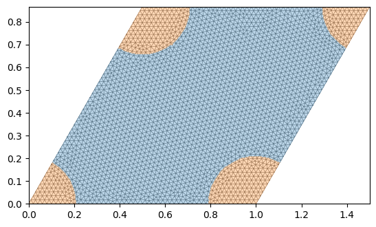
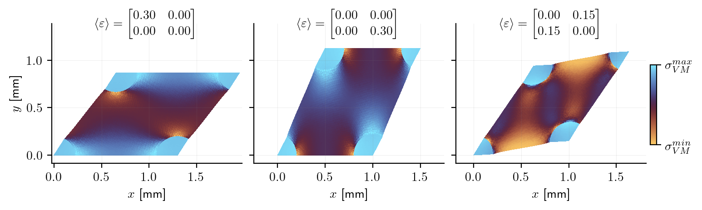

<div class="nb-header"><a href="https://colab.research.google.com/github/smec-ethz/tatva-docs/blob/main/notebooks/examples/homogenization_periodic.ipynb" target="_blank"></a><a href="/assets/notebooks/examples/homogenization_periodic.ipynb" download="homogenization_periodic.ipynb" class="nb-download-btn"><svg class="nb-download-icon" viewBox="0 0 24 24" xmlns="http://www.w3.org/2000/svg"><path d="M12 16l-6-6 1.41-1.41L11 13.17V4h2v9.17l3.59-3.58L18 11l-6 6z"/><path d="M5 18h14v2H5z"/></svg> Download</a></div>

??? example "Colab Setup (Install Dependencies)"
    ```python
    
    # Only run this if we are in Google Colab
    if "google.colab" in str(get_ipython()):
        print("Installing dependencies using uv...")
        # Install uv if not available
        !pip install -q uv
        # Install system dependencies
        !apt-get install -qq gmsh
        # Use uv to install Python dependencies
        !uv pip install --system matplotlib meshio
        !uv pip install --system "git+https://github.com/smec-ethz/tatva-docs.git"
        print("Installation complete!")
    ```

# Periodic Boundary Conditions

We compute the effective (homogenized) stiffness of a periodic composite by solving a **cell problem** on one representative unit cell $\mathcal{A}$.
The microscopic displacement is decomposed as

$$
\boldsymbol{u}(\boldsymbol{y}) = \boldsymbol{E}\,\boldsymbol{y} + \boldsymbol{v}(\boldsymbol{y}),
$$

where $\boldsymbol{E}$ is a prescribed macroscopic strain and $\boldsymbol{v}$ is a periodic fluctuation field.

We solve this example with two approaches:

- We show the use of **Lagrange multipliers** to enforce periodicity. We will solve the saddle-point problem using sparse differentiation and a direct sparse solver. 
- Alternatively, we enforce periodicity through a **MPC** and static condensation, and solve the problem using a matrix-free CG-solver.

We follow Jeremy Bleyer's example:
https://bleyerj.github.io/comet-fenicsx/tours/homogenization/periodic_elasticity/periodic_elasticity.html

$$
\begin{cases}
\nabla\!\cdot\boldsymbol{\sigma}=\boldsymbol{0} & \text{in } \mathcal{A},\\
\boldsymbol{\sigma}=\mathbb{C}(\boldsymbol{y}):\boldsymbol{\varepsilon} & \text{(heterogeneous material)},\\
\boldsymbol{\varepsilon}=\boldsymbol{E}+\nabla^s\boldsymbol{v} & \text{in } \mathcal{A},\\
\boldsymbol{v}\text{ is periodic},\\
\boldsymbol{T}=\boldsymbol{\sigma}\boldsymbol{n}\text{ is anti-periodic.}
\end{cases}
$$

Because the framework is fully differentiable, we can obtain $\mathbb{C}^{\text{hom}}$ directly by differentiating the map $\boldsymbol{E} \mapsto \langle\boldsymbol{\sigma}(\boldsymbol{E})\rangle$, rather than solving separate problems for multiple $\boldsymbol{E}$.


```python
import gmsh
import jax
import jax.numpy as jnp
import matplotlib.pyplot as plt
import numpy as np
from jax import Array

from tatva import Mesh, Operator, compound, element

jax.config.update("jax_enable_x64", True)
```

## Meshing

We build a periodic unit square with circular inclusions using `gmsh`.
Two physical regions are extracted:

- **Matrix** elements
- **Inclusions** elements

Boundary edges are also tagged (`left`, `right`, `top`, `bottom`) so we can later pair nodes and impose periodicity.


??? example "Code for mesh generation and extraction"
    ```python
    
    from itertools import chain
    from typing import TypedDict
    
    from numpy.typing import NDArray
    
    
    class PhysicalGroups(TypedDict):
        Matrix: Array
        Inclusions: Array
        bottom: Array
        right: Array
        top: Array
        left: Array
    
    
    def plot_mesh(mesh: Mesh, pg: PhysicalGroups, ax: plt.Axes | None = None) -> None:
        if ax is None:
            fig, ax = plt.subplots()
        ax.triplot(
            mesh.coords[:, 0], mesh.coords[:, 1], mesh.elements, color="gray", linewidth=0.5
        )
        # Plot physical groups with different colors
        ax.tricontourf(
            mesh.coords[:, 0],
            mesh.coords[:, 1],
            mesh.elements,
            jnp.zeros(mesh.coords.shape[0]).at[pg["Inclusions"]].set(1.0),
            levels=[-0.5, 0.5, 1.5],
            colors=["C0", "C1"],
            alpha=0.3,
        )  # ty: ignore
        ax.set_aspect("equal")
    
    
    def extract_physical_groups(tag_map: dict) -> PhysicalGroups:
        print("Extracting physical groups from Gmsh model...")
        physical_surfaces: dict[str, Array] = {}
    
        for dim, pg_tag in chain(
            gmsh.model.getPhysicalGroups(dim=1), gmsh.model.getPhysicalGroups(dim=2)
        ):
            name = gmsh.model.getPhysicalName(dim, pg_tag)
    
            # Entities (surface tags) that belong to this physical group
            entities = gmsh.model.getEntitiesForPhysicalGroup(dim, pg_tag)
    
            els = []
            for ent in entities:
                # Get all mesh elements on this surface entity
                types, _, node_tags_by_type = gmsh.model.mesh.getElements(dim, ent)
    
                for etype, ntags in zip(types, node_tags_by_type):
                    nodes = np.array(ntags, dtype=np.int64).reshape(-1, etype + 1)
                    els.append(nodes)
    
            if not els:
                physical_surfaces[name] = np.zeros((0, dim + 1), dtype=np.int32)
                continue
    
            group_els = np.vstack(els, dtype=np.int32)
            group_els = np.array(
                [[tag_map[t] for t in tri] for tri in group_els], dtype=np.int32
            )
            physical_surfaces[name] = group_els
    
        return physical_surfaces
    
    
    def extract_mesh_data() -> tuple[Array, Array, PhysicalGroups]:
        # Extract nodes and elements
        node_tags, node_coords, _ = gmsh.model.mesh.getNodes()
        tag_map = {tag: i for i, tag in enumerate(node_tags)}
        nodes = jnp.array(node_coords).reshape(-1, 3)[:, :2]
    
        elem_types, elem_tags, elem_node_tags = gmsh.model.mesh.getElements(2)
        elements = jnp.array(elem_node_tags[0]).reshape(-1, 3) - 1
    
        pg = extract_physical_groups(tag_map)
        return nodes, elements, pg
    
    
    def generate_mesh(
        Lx: float, Ly: float, c: float, R: float, h: float
    ) -> tuple[Mesh, PhysicalGroups, NDArray]:
        corners = np.array([[0.0, 0.0], [Lx, 0.0], [Lx + c, Ly], [c, Ly]])
        a1 = corners[1, :] - corners[0, :]  # first vector generating periodicity
        a2 = corners[3, :] - corners[0, :]  # second vector generating periodicity
    
        gdim = 2  # domain geometry dimension
        fdim = 1  # facets dimension
        gmsh.initialize()
    
        occ = gmsh.model.occ
        model_rank = 0
        points = [occ.add_point(*corner, 0) for corner in corners]
        lines = [occ.add_line(points[i], points[(i + 1) % 4]) for i in range(4)]
        loop = occ.add_curve_loop(lines)
        unit_cell = occ.add_plane_surface([loop])
        inclusions = [occ.add_disk(*corner, 0, R, R) for corner in corners]
        vol_dimTag = (gdim, unit_cell)
        out = occ.intersect(
            [vol_dimTag], [(gdim, incl) for incl in inclusions], removeObject=False
        )
        incl_dimTags = out[0]
        occ.synchronize()
        occ.cut([vol_dimTag], incl_dimTags, removeTool=False)
        occ.synchronize()
    
        # tag physical domains and facets
        gmsh.model.addPhysicalGroup(gdim, [vol_dimTag[1]], 1, name="Matrix")
        gmsh.model.addPhysicalGroup(
            gdim,
            [tag for _, tag in incl_dimTags],
            2,
            name="Inclusions",
        )
        gmsh.model.addPhysicalGroup(fdim, [7, 20, 10], 1, name="bottom")
        gmsh.model.addPhysicalGroup(fdim, [9, 19, 16], 2, name="right")
        gmsh.model.addPhysicalGroup(fdim, [15, 18, 12], 3, name="top")
        gmsh.model.addPhysicalGroup(fdim, [11, 17, 5], 4, name="left")
        gmsh.option.setNumber("Mesh.CharacteristicLengthMin", h)
        gmsh.option.setNumber("Mesh.CharacteristicLengthMax", h)
    
        gmsh.model.mesh.generate(gdim)
    
        nodes, elements, pg = extract_mesh_data()
        mesh = Mesh(coords=nodes, elements=elements)
        gmsh.finalize()
        return mesh, pg, corners
    ```


```python
Ly = np.sqrt(3) / 2.0 * Lx
c = 0.5 * Lx
R = 0.2 * Lx
h = 0.02 * Lx

mesh, pg, corners = generate_mesh(Lx, Ly, c, R, h)
```

??? info "Output"
    Info    : Meshing 1D...ence                                                                                                                      
        Info    : [  0%] Meshing curve 5 (Line)
        Info    : [ 10%] Meshing curve 6 (Ellipse)
        Info    : [ 20%] Meshing curve 7 (Line)
        Info    : [ 20%] Meshing curve 8 (Ellipse)
        Info    : [ 30%] Meshing curve 9 (Line)
        Info    : [ 40%] Meshing curve 10 (Line)
        Info    : [ 40%] Meshing curve 11 (Line)
        Info    : [ 50%] Meshing curve 12 (Line)
        Info    : [ 60%] Meshing curve 13 (Ellipse)
        Info    : [ 60%] Meshing curve 14 (Ellipse)
        Info    : [ 70%] Meshing curve 15 (Line)
        Info    : [ 70%] Meshing curve 16 (Line)
        Info    : [ 80%] Meshing curve 17 (Line)
        Info    : [ 90%] Meshing curve 18 (Line)
        Info    : [ 90%] Meshing curve 19 (Line)
        Info    : [100%] Meshing curve 20 (Line)
        Info    : Done meshing 1D (Wall 0.00144414s, CPU 0.001692s)
        Info    : Meshing 2D...
        Info    : [  0%] Meshing surface 1 (Plane, Frontal-Delaunay)
        Info    : [ 30%] Meshing surface 2 (Plane, Frontal-Delaunay)
        Info    : [ 50%] Meshing surface 3 (Plane, Frontal-Delaunay)
        Info    : [ 70%] Meshing surface 4 (Plane, Frontal-Delaunay)
        Info    : [ 90%] Meshing surface 5 (Plane, Frontal-Delaunay)
        Info    : Done meshing 2D (Wall 0.0726566s, CPU 0.073034s)
        Info    : 2679 nodes 5432 elements
        Extracting physical groups from Gmsh model...


```python
plot_mesh(mesh, pg)
```


    

    


## Problem setup

### Material

We define isotropic linear elasticity for each phase through Lame parameters $(\mu,\lambda)$.
The local constitutive law is

$$
\boldsymbol{\sigma} = 2\mu\,\boldsymbol{\varepsilon} + \lambda\,\mathrm{tr}(\boldsymbol{\varepsilon})\,\mathbf{I}.
$$

For a given macroscopic strain $\boldsymbol{E}=\hat{\boldsymbol{\varepsilon}}$, the cell energy density uses

$$
\boldsymbol{\varepsilon}(\boldsymbol{u}) = \nabla^s\boldsymbol{u} + \hat{\boldsymbol{\varepsilon}}.
$$

This lets us solve the microscopic fluctuation while embedding the imposed macro-strain.


```python
from typing import NamedTuple

from jax_autovmap import autovmap


class Material(NamedTuple):
    """Material properties for the elasticity operator."""

    mu: float  # Shear modulus
    lmbda: float  # Lamé parameter

    @classmethod
    def from_youngs_poisson_2d(
        cls, E: float, nu: float, plane_stress: bool = False
    ) -> "Material":
        mu = E / 2 / (1 + nu)
        if plane_stress:
            lmbda = 2 * nu * mu / (1 - nu)
        else:
            lmbda = E * nu / (1 - 2 * nu) / (1 + nu)
        return cls(mu=mu, lmbda=lmbda)


mat_matrix = Material.from_youngs_poisson_2d(50e3, 0.2)
mat_inclusion = Material.from_youngs_poisson_2d(210e3, 0.3)


@autovmap(grad_u=2)
def compute_strain(grad_u):
    return 0.5 * (grad_u + grad_u.T)


@autovmap(eps=2, mu=0, lmbda=0)
def compute_stress(eps, mu, lmbda):
    return 2 * mu * eps + lmbda * jnp.trace(eps) * jnp.eye(2)


@autovmap(grad_u=2, eps_hat=2, mu=0, lmbda=0)
def strain_energy(grad_u, eps_hat, mu, lmbda):
    """Includes macroscopic strain eps_hat."""
    eps = compute_strain(grad_u) + eps_hat
    sigma = compute_stress(eps, mu, lmbda)
    return 0.5 * jnp.einsum("ij,ij->", sigma, eps)
```

### Periodic mapping

Periodic kinematics require matching opposite boundary nodes:

- left $\leftrightarrow$ right
- bottom $\leftrightarrow$ top

The helper `edge_bijection` builds slave-to-master pairs by geometric matching.
Corner nodes are handled separately to avoid duplicate constraints.


```python
from numpy.typing import NDArray

ArrayLike = NDArray | Array

mesh_matrix = mesh._replace(elements=pg["Matrix"])
mesh_inclusion = mesh._replace(elements=pg["Inclusions"])
op_matrix = Operator(mesh_matrix, element.Tri3())
op_inclusion = Operator(mesh_inclusion, element.Tri3())
op = Operator(mesh, element.Tri3())


def edge_bijection(
    coords: ArrayLike,
    m_group: ArrayLike,
    s_group: ArrayLike,
    *,
    axis: int = 0,
    offset: float = 0.0,
) -> Array:
    """Find a bijection between master and slave edge nodes. Returns an array of sorted
    slave node indices such that s_nodes[i] -> m_nodes[i]
    """
    axis = axis ^ 1  # bitwise xor to get the other axis
    m_nodes = jnp.unique(m_group)
    s_nodes = jnp.unique(s_group)

    # exclude corners from the matching (min and max in axis direction)
    m_nodes = m_nodes[
        (coords[m_nodes, axis] != jnp.min(coords[m_nodes, axis]))
        & (coords[m_nodes, axis] != jnp.max(coords[m_nodes, axis]))
    ]
    s_nodes = s_nodes[
        (coords[s_nodes, axis] != jnp.min(coords[s_nodes, axis]))
        & (coords[s_nodes, axis] != jnp.max(coords[s_nodes, axis]))
    ]

    # for each m_node, find the closest s_node depending on the periodicity vector
    def find_closest_slave(m_node: ArrayLike, inv_axis: int) -> ArrayLike:
        diffs = coords[s_nodes, inv_axis] - (coords[m_node, inv_axis] + offset)
        return jnp.array([m_node, s_nodes[jnp.argmin(diffs**2)]])

    return jax.vmap(find_closest_slave, in_axes=(0, None))(m_nodes, axis)


corner_nodes = [
    jnp.argmin(jnp.linalg.norm(mesh.coords - corner, axis=1)) for corner in corners
]
corner_m = jnp.repeat(corner_nodes[0], 3)
corner_s = jnp.array(corner_nodes[1:])
left_right = edge_bijection(mesh.coords, pg["left"], pg["right"], axis=0)
bottom_top = edge_bijection(
    mesh.coords, pg["bottom"], pg["top"], axis=1, offset=Lx * 1 / 2
)
corner_map = jnp.vstack([corner_m, corner_s]).T
```

## PBCs with Lagrange Multipliers

We create a `Compound` subclass with two fields:
- $\mathbf{u}$: the periodic displacement fluctuation field `(n_nodes, 2)`
- $\lambda$: the lagrange multipliers `(n_slave_nodes, 2)`


```python
import jax.experimental.sparse as jsparse
import scipy.sparse as sp
from tatva.lifter import Fixed, Lifter


class SolutionLM(compound.Compound):
    u = compound.field(mesh.coords.shape)
    lm = compound.field(
        (left_right.shape[0] + bottom_top.shape[0] + corner_s.shape[0], 2)
    )
```


```python
def constraints_func(u_flat: Array) -> Array:
    """A function that returns the residual of the periodicity constraints, which should
    be zero at the solution. The Lagrange multipliers will enforce these constraints.
    """
    (u, _) = SolutionLM(u_flat)
    u_diff_left_right = u[left_right[:, 0]] - u[left_right[:, 1]]
    u_diff_bot_top = u[bottom_top[:, 0]] - u[bottom_top[:, 1]]
    u_diff_corners = u[corner_m] - u[corner_s]
    return jnp.concatenate(
        [
            u_diff_left_right.flatten(),
            u_diff_bot_top.flatten(),
            u_diff_corners.flatten(),
        ]
    )

```

### Sparsity and graph coloring


```python
from tatva.sparse import create_sparsity_pattern_KKT, reduce_sparsity_pattern

sparsity = create_sparsity_pattern_KKT(
    mesh,
    2,
    jax.jacfwd(constraints_func)(jnp.zeros(SolutionLM.size))[
        :, : -(SolutionLM.lm.shape[0] * 2)
    ],
)

```


```python
from tatva.sparse import ColoredMatrix

# we use a lifter to restrict rigid body modes
lifter = Lifter(
    SolutionLM.size,
    Fixed(SolutionLM.u[[corner_m[0]]]),
)

sparsity = reduce_sparsity_pattern(sparsity, lifter.free_dofs)
colored_matrix = ColoredMatrix.from_csr(sparsity)

```

### Energy functional and sparse Jacobian

The total cell energy is the sum of matrix and inclusion contributions:

$$
\Pi(\mathbf{u};\hat{\boldsymbol{\varepsilon}})=\int_{\mathcal{A}_m}\psi_m\,dA+\int_{\mathcal{A}_i}\psi_i\,dA.
$$

We minimize in reduced variables by composing with the lifter,
$\Pi_r(\mathbf{v}) = \Pi(\text{lift}(\mathbf{v}))$.

`jax.jacrev` gives the residual, and a colored sparse Jacobian is assembled for efficient linear solves.


```python
from tatva import sparse


def total_energy(u: Array, eps_hat: Array) -> Array:
    # compute energy contributions from matrix and inclusion domains
    e_inclusion = op_inclusion.integrate(
        strain_energy(
            op_inclusion.grad(u), eps_hat, mat_inclusion.mu, mat_inclusion.lmbda
        )
    )
    e_matrix = op_matrix.integrate(
        strain_energy(op_matrix.grad(u), eps_hat, mat_matrix.mu, mat_matrix.lmbda)
    )
    return e_inclusion + e_matrix


def lagrangian(u_flat: Array, eps_hat: Array) -> Array:
    (u, lm) = SolutionLM(u_flat)

    # add contribution from Lagrange multipliers enforcing periodicity constraints
    return total_energy(u, eps_hat) + jnp.dot(lm.flatten(), constraints_func(u_flat))


def lagrangian_free(u_free: Array, eps_hat: Array) -> Array:
    u_full = lifter.lift_from_zeros(u_free)
    return lagrangian(u_full, eps_hat)


residual = jax.jacrev(lagrangian_free)
jacobian = sparse.jacfwd(
    fn=residual,
    colored_matrix=colored_matrix,
    color_batch_size=10,
)
```

### Solve for unit strains

We solve three independent 2D strain load cases (Voigt basis):

- $\varepsilon_{xx}=1$
- $\varepsilon_{yy}=1$
- $\varepsilon_{xy}=1$ (implemented with symmetric $0.5$ off-diagonals)

For each case, we solve the linearized equilibrium for fluctuation DOFs, then reconstruct

$$
\boldsymbol{u}(\boldsymbol{y}) = \hat{\boldsymbol{\varepsilon}}\,\boldsymbol{y} + \tilde{\boldsymbol{u}}(\boldsymbol{y}).
$$


??? example "Newton-Krylov solver with sparse direct solver for the linearized system."
    ```python
    
    from functools import partial
    
    
    @partial(jax.jit, static_argnames=["gradient", "compute_tangent"])
    def newton_krylov_solver(
        u,
        gradient,
        compute_tangent,
    ):
        residual = gradient(u)
        norm_res = jnp.linalg.norm(residual)
    
        init_val = (u, 0, norm_res)
    
        def cond_fun(state):
            u, iiter, norm_res = state
            return jnp.logical_and(norm_res > 1e-8, iiter < 10)
    
        def body_fun(state):
            u, iiter, norm_res = state
            residual = gradient(u)
    
            A = jax.jit(partial(compute_tangent, u_prev=u))
    
            du, _ = jax.scipy.sparse.linalg.cg(A=A, b=-residual)
    
            u = u + du
    
            residual = gradient(u)
            norm_res = jnp.linalg.norm(residual)
    
            return (u, iiter + 1, norm_res)
    
        final_u, final_iiter, final_norm = jax.lax.while_loop(cond_fun, body_fun, init_val)
        jax.debug.print("  Residual: {res:.2e}", res=final_norm)
    
        return final_u, final_norm
    ```


```python
from dataclasses import dataclass


def sparse_solve(A: ColoredMatrix, b: Array) -> Array:
    return jsparse.linalg.spsolve(A.data, A.indices, A.indptr, b)


@dataclass
class Result:
    u: NDArray
    eps_hat: NDArray


v0 = jnp.zeros(lifter.size_reduced)

scale = 0.3
eps_hat_list = scale * jnp.array(
    [
        [[1.0, 0.0], [0.0, 0.0]],
        [[0.0, 0.0], [0.0, 1.0]],
        [[0.0, 0.5], [0.5, 0.0]],
    ]
)  # unit strain tensors

results = []

for eps_hat in eps_hat_list[:]:
    v = sparse_solve(jacobian(v0, eps_hat), -residual(v0, eps_hat))
    u0 = (eps_hat @ mesh.coords.T).T
    u = u0 + SolutionLM(lifter.lift_from_zeros(v)).u
    results.append(Result(u=u, eps_hat=eps_hat))
```

### Results


??? example "Functions for post-processing and visualization of results"
    ```python
    import numpy as np
    from matplotlib.cm import ScalarMappable
    from matplotlib.collections import LineCollection
    from matplotlib.colors import ListedColormap, Normalize
    from matplotlib.tri import Triangulation
    
    
    def cell_to_point_data(
        coords: np.ndarray,
        elements: np.ndarray,
        celldata: np.ndarray,
        *,
        method: str = "area",
        eps: float = 1e-30,
    ) -> np.ndarray:
        """Interpolate (average) per-cell data to nodes for a 2D triangular mesh.
    
        Args:
            coords: float
            elements: (node indices per triangle)
            celldata: (nels, ...) float  (e.g. stress components per element)
            method: "uniform" or "area"
                - "uniform": each incident element contributes equally
                - "area"   : each incident element weighted by triangle area
            eps: small number to avoid divide-by-zero
    
        Returns:
            pointdata: (nnodes, ...) float
        """
        coords = np.asarray(coords)
        elements = np.asarray(elements, dtype=np.int64)
        celldata = np.asarray(celldata)
    
        nnodes = coords.shape[0]
        nels = elements.shape[0]
    
        # Flatten celldata trailing dims -> (nels, ncomp)
        trailing_shape = celldata.shape[1:]
        cel_flat = celldata.reshape(nels, -1)
        ncomp = cel_flat.shape[1]
    
        # Optional weights per element
        if method == "uniform":
            w = np.ones(nels, dtype=cel_flat.dtype)
        elif method == "area":
            tri = coords[elements]  # (nels, 3, 2)
            a = tri[:, 1] - tri[:, 0]
            b = tri[:, 2] - tri[:, 0]
            # signed area*2 = cross(a,b) in 2D
            w = 0.5 * np.abs(a[:, 0] * b[:, 1] - a[:, 1] * b[:, 0])
            w = w.astype(cel_flat.dtype, copy=False)
        else:
            raise ValueError("method must be 'uniform' or 'area'")
    
        # Accumulate: for each element, add w*celldata to its 3 nodes
        point_sum = np.zeros((nnodes, ncomp), dtype=cel_flat.dtype)
        weight_sum = np.zeros(nnodes, dtype=cel_flat.dtype)
    
        contrib = cel_flat * w[:, None]  # (nels, ncomp)
        for j in range(3):
            idx = elements[:, j]
            np.add.at(point_sum, idx, contrib)
            np.add.at(weight_sum, idx, w)
    
        point_flat = point_sum / (weight_sum[:, None] + eps)
        return point_flat.reshape((nnodes,) + trailing_shape)
    
    
    def stress(u: Array) -> Array:
        """Computes the stress respecting the two separate materials."""
        grad_u = op.grad(u).squeeze()
        eps = compute_strain(grad_u)
        sig_1 = compute_stress(eps, mat_matrix.mu, mat_matrix.lmbda)
        sig_2 = compute_stress(eps, mat_inclusion.mu, mat_inclusion.lmbda)
        mask = jnp.isin(op.mesh.elements, mesh_inclusion.elements).all(axis=1)  # (nels,)
        sig = jnp.where(mask[:, None, None], sig_2, sig_1)
        return sig
    
    
    def von_mises_2d(sig: Array) -> Array:
        sxx = sig[..., 0, 0]
        syy = sig[..., 1, 1]
        sxy = sig[..., 0, 1]
        return jnp.sqrt(sxx**2 - sxx * syy + syy**2 + 3 * sxy**2)
    ```


??? example "Matplotlib settings for plotting"
    ```python
    plt.rcParams.update(
        {
            "text.usetex": True,
            "text.latex.preamble": r"\usepackage{amsmath}",
            "grid.color": "grey",
            "grid.linestyle": "solid",
            "grid.linewidth": 0.25,
            "grid.alpha": 0.2,
            "figure.dpi": 200,
        }
    )
    ```


```python
fig, axes = plt.subplots(1, 3, figsize=(7.1, 2.2), sharey=True, constrained_layout=True)

sig_vm_min = np.inf
sig_vm_max = -np.inf

for res in results:
    sig = stress(res.u)
    sig_vm = von_mises_2d(sig)
    sig_vm_min = min(sig_vm_min, jnp.min(sig_vm))
    sig_vm_max = max(sig_vm_max, jnp.max(sig_vm))

for i, (ax, res) in enumerate(zip(axes, results)):
    ax: plt.Axes
    x = mesh.coords + res.u
    tri = Triangulation(x[:, 0], x[:, 1], triangles=np.array(mesh.elements))
    sig = stress(res.u)
    sig_vm = von_mises_2d(sig)

    m = ax.tripcolor(tri, facecolors=sig_vm, cmap="managua", rasterized=True)
    ax.set_aspect("equal", adjustable="datalim")
    # keep axes size consistent
    ax.set_ylim(-0.1 * Ly, Ly * 1.6)
    ax.grid()
    ax.set_xlabel("$x$ [mm]")
    ax.spines["top"].set_visible(False)
    ax.spines["right"].set_visible(False)
    ax.annotate(
        r"$$\langle\varepsilon\rangle = \begin{bmatrix}"
        + f"{res.eps_hat[0, 0]:.2f} & {res.eps_hat[0, 1]:.2f} \\\\ "
        + f"{res.eps_hat[1, 0]:.2f} & {res.eps_hat[1, 1]:.2f} "
        + r"\end{bmatrix}$$",
        xy=(0.5, 0.89),
        ha="center",
        va="bottom",
        xycoords="axes fraction",
    )

axes[0].set(ylabel="$y$ [mm]")
cax = fig.add_axes((1.0, 0.3, 0.01, 0.4))
sm = ScalarMappable(Normalize(vmin=0, vmax=1), cmap="managua")
cb = fig.colorbar(sm, cax=cax, orientation="vertical", pad=0.1)
cb.set_ticks([0, 1])
cb.set_ticklabels((r"$\sigma_{{VM}}^{{min}}$", r"$\sigma_{{VM}}^{{max}}$"))

```


    

    


### Compute homogenized stiffness tensor

From each solved microfield, we compute element stresses and average them over the cell:

$$
\langle \boldsymbol{\sigma} \rangle = \frac{1}{|\mathcal{A}|}\int_{\mathcal{A}} \boldsymbol{\sigma}\,dA.
$$

The homogenized tangent in Voigt form is obtained by automatic differentiation of
$\langle\boldsymbol{\sigma}\rangle(\hat{\boldsymbol{\varepsilon}})$:

$$
\mathbf{C}^{\text{hom}} = \frac{\partial\langle\boldsymbol{\sigma}\rangle}{\partial\hat{\boldsymbol{\varepsilon}}}.
$$

!!! note

    Unfortunately, the sparse solver of `jax` is not differentiable yet. Therefore, we use a dense direct solver for this part of the example.


```python
jacobian_dense = jax.jacfwd(residual)


def func(eps_hat_voigt: Array) -> Array:
    """Returns the average stress for a given macroscopic strain eps_hat (in Voigt notation)."""
    eps_hat = jnp.array(
        [[eps_hat_voigt[0], eps_hat_voigt[2]], [eps_hat_voigt[2], eps_hat_voigt[1]]]
    )
    v = jnp.linalg.solve(jacobian_dense(v0, eps_hat), -residual(v0, eps_hat))
    u = (eps_hat @ mesh.coords.T).T + SolutionLM(lifter.lift_from_zeros(v)).u
    sig = stress(u)
    sig = jnp.mean(sig, axis=0)  # average stress
    return jnp.array([sig[0, 0], sig[1, 1], sig[0, 1]])


C_hom = jax.jacfwd(func)(jnp.ones(3))
```


```python
print("Homogenized stiffness tensor (Voigt notation):")
with np.printoptions(precision=2):
    print(C_hom)
```

    Homogenized stiffness tensor (Voigt notation):
    [[6.58e+04 1.75e+04 8.28e+01]
     [1.75e+04 6.57e+04 1.44e+02]
     [5.57e+01 8.66e+01 4.82e+04]]


## PBCs through condensation

We create a `Compound` subclass with one field:
- $\mathbf{u}$: the periodic displacement fluctuation field `(n_nodes, 2)`

[`Lifter`](../api/tatva.lifter.md#tatva.lifter.Lifter) enforces constraints in reduced coordinates.
We define:

- `PeriodicMap(slave, master)` for periodic DOF ties
- one `DirichletBC` at a corner to remove rigid-body translation

Then the solver unknown is only the **free DOF vector** $\mathbf{v}$, while `lifter.lift_from_zeros(v)` reconstructs the full constrained field.


```python
from tatva.lifter import Fixed, Lifter, Periodic
from tatva.sparse import create_sparsity_pattern_master_slave, reduce_sparsity_pattern


class Solution(compound.Compound):
    u = compound.field(mesh.coords.shape)


periodic_map = jnp.concatenate(
    [
        jnp.array([Solution.u[nodes, :] for nodes in left_right.T]).T,
        jnp.array([Solution.u[nodes, :] for nodes in bottom_top.T]).T,
        jnp.array([Solution.u[nodes, :] for nodes in corner_map.T]).T,
    ]
)

lifter = Lifter(
    Solution.size,
    Fixed(Solution.u[[corner_m[0]]]),
    Periodic(periodic_map[:, 1], periodic_map[:, 0]),
)

sparsity = create_sparsity_pattern_master_slave(
    mesh,
    2,
    jnp.arange(Solution.size)
    .at[Solution.u[[corner_m[0]]]]
    .set(-1)
    .at[periodic_map[:, 1]]
    .set(periodic_map[:, 0]),
)
```

### Energy functional

The total cell energy is the sum of matrix and inclusion contributions:

$$
\Pi(\mathbf{u};\hat{\boldsymbol{\varepsilon}})=\int_{\mathcal{A}_m}\psi_m\,dA+\int_{\mathcal{A}_i}\psi_i\,dA.
$$

We minimize in reduced variables by composing with the lifter,
$\Pi_r(\mathbf{v}) = \Pi(\text{lift}(\mathbf{v}))$.

`jax.jacrev` gives the residual, and `jax.jvp` defines the Jacobian-Vector-Product function.


```python
from typing import Callable

import scipy.sparse as sp

from tatva import sparse


def total_energy(u_flat: Array, eps_hat: Array) -> Array:
    (u,) = Solution(u_flat)
    # Inclusion gets Material 2, Matrix gets Material 1
    e_inclusion = op_inclusion.integrate(
        strain_energy(
            op_inclusion.grad(u), eps_hat, mat_inclusion.mu, mat_inclusion.lmbda
        )
    )
    e_matrix = op_matrix.integrate(
        strain_energy(op_matrix.grad(u), eps_hat, mat_matrix.mu, mat_matrix.lmbda)
    )
    return e_inclusion + e_matrix


def lagrangian(u_free: Array, eps_hat: Array) -> Array:
    u_full = lifter.lift_from_zeros(u_free)
    return total_energy(u_full, eps_hat)


residual = jax.jacrev(lagrangian)


def jvp(loc: Array, eps_hat: Array) -> Callable[[Array], Array]:
    def _jvp_fn(v: Array) -> Array:
        return jax.jvp(residual, (loc, eps_hat), (v, jnp.zeros_like(eps_hat)))[1]

    return _jvp_fn
```

### Solve for unit strains

We solve three independent 2D strain load cases (Voigt basis):

- $\varepsilon_{xx}=1$
- $\varepsilon_{yy}=1$
- $\varepsilon_{xy}=1$ (implemented with symmetric $0.5$ off-diagonals)

For each case, we solve the linearized equilibrium for fluctuation DOFs, then reconstruct

$$
\boldsymbol{u}(\boldsymbol{y}) = \hat{\boldsymbol{\varepsilon}}\,\boldsymbol{y} + \tilde{\boldsymbol{u}}(\boldsymbol{y}).
$$


```python
from dataclasses import dataclass

import jax.experimental.sparse as jsparse


@dataclass
class Result:
    u: NDArray
    eps_hat: NDArray


v0 = jnp.zeros(lifter.size_reduced)

scale = 0.3
eps_hat_list = scale * jnp.array(
    [
        [[1.0, 0.0], [0.0, 0.0]],
        [[0.0, 0.0], [0.0, 1.0]],
        [[0.0, 0.5], [0.5, 0.0]],
    ]
)  # unit strain tensors

results = []

for eps_hat in eps_hat_list:
    v = jax.scipy.sparse.linalg.cg(jvp(v0, eps_hat), -residual(v0, eps_hat))[0]
    u0 = (eps_hat @ mesh.coords.T).T
    u = u0 + Solution(lifter.lift_from_zeros(v)).u
    results.append(Result(u=u, eps_hat=eps_hat))
```

### Results


```python
fig, axes = plt.subplots(1, 3, figsize=(7.1, 2.2), sharey=True, constrained_layout=True)

sig_vm_min = np.inf
sig_vm_max = -np.inf

for res in results:
    sig = stress(res.u)
    sig_vm = von_mises_2d(sig)
    sig_vm_min = min(sig_vm_min, jnp.min(sig_vm))
    sig_vm_max = max(sig_vm_max, jnp.max(sig_vm))

for i, (ax, res) in enumerate(zip(axes, results)):
    ax: plt.Axes
    x = mesh.coords + res.u
    tri = Triangulation(x[:, 0], x[:, 1], triangles=np.array(mesh.elements))
    sig = stress(res.u)
    sig_vm = von_mises_2d(sig)

    m = ax.tripcolor(tri, facecolors=sig_vm, cmap="managua", rasterized=True)
    ax.set_aspect("equal", adjustable="datalim")
    # keep axes size consistent
    ax.set_ylim(-0.1 * Ly, Ly * 1.6)
    ax.grid()
    ax.set_xlabel("$x$ [mm]")
    ax.spines["top"].set_visible(False)
    ax.spines["right"].set_visible(False)
    ax.annotate(
        r"$$\langle\varepsilon\rangle = \begin{bmatrix}"
        + f"{res.eps_hat[0, 0]:.2f} & {res.eps_hat[0, 1]:.2f} \\\\ "
        + f"{res.eps_hat[1, 0]:.2f} & {res.eps_hat[1, 1]:.2f} "
        + r"\end{bmatrix}$$",
        xy=(0.5, 0.89),
        ha="center",
        va="bottom",
        xycoords="axes fraction",
    )

axes[0].set(ylabel="$y$ [mm]")
cax = fig.add_axes((1.0, 0.3, 0.01, 0.4))
sm = ScalarMappable(Normalize(vmin=0, vmax=1), cmap="managua")
cb = fig.colorbar(sm, cax=cax, orientation="vertical", pad=0.1)
cb.set_ticks([0, 1])
cb.set_ticklabels((r"$\sigma_{{VM}}^{{min}}$", r"$\sigma_{{VM}}^{{max}}$"))

```


    

    


### Compute homogenized stiffness tensor

From each solved microfield, we compute element stresses and average them over the cell:

$$
\langle \boldsymbol{\sigma} \rangle = \frac{1}{|\mathcal{A}|}\int_{\mathcal{A}} \boldsymbol{\sigma}\,dA.
$$

The homogenized tangent in Voigt form is obtained by automatic differentiation of
$\langle\boldsymbol{\sigma}\rangle(\hat{\boldsymbol{\varepsilon}})$:

$$
\mathbf{C}^{\text{hom}} = \frac{\partial\langle\boldsymbol{\sigma}\rangle}{\partial\hat{\boldsymbol{\varepsilon}}}.
$$


```python
def func(eps_hat_voigt: Array) -> Array:
    eps_hat = jnp.array(
        [[eps_hat_voigt[0], eps_hat_voigt[2]], [eps_hat_voigt[2], eps_hat_voigt[1]]]
    )
    v = jax.scipy.sparse.linalg.cg(jvp(v0, eps_hat), -residual(v0, eps_hat))[0]
    u = (eps_hat @ mesh.coords.T).T + Solution(lifter.lift_from_zeros(v)).u
    sig = stress(u)
    sig = jnp.mean(sig, axis=0)  # average stress
    return jnp.array([sig[0, 0], sig[1, 1], sig[0, 1]])


C_hom = jax.jacfwd(func)(jnp.ones(3))
```


```python
print("Homogenized stiffness tensor (Voigt notation):")
with np.printoptions(precision=2):
    print(C_hom)
```

    Homogenized stiffness tensor (Voigt notation):
    [[6.58e+04 1.75e+04 8.28e+01]
     [1.75e+04 6.57e+04 1.44e+02]
     [5.57e+01 8.66e+01 4.82e+04]]


```python

```
