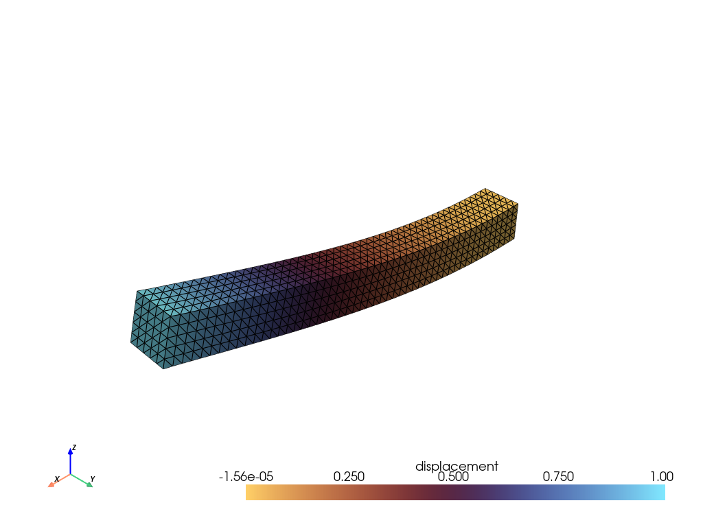

<div class="nb-header"><a href="https://colab.research.google.com/github/smec-ethz/tatva-docs/blob/main/notebooks/examples/hyperelastic_3d.ipynb" target="_blank"></a><a href="/assets/notebooks/examples/hyperelastic_3d.ipynb" download="hyperelastic_3d.ipynb" class="nb-download-btn"><svg class="nb-download-icon" viewBox="0 0 24 24" xmlns="http://www.w3.org/2000/svg"><path d="M12 16l-6-6 1.41-1.41L11 13.17V4h2v9.17l3.59-3.58L18 11l-6 6z"/><path d="M5 18h14v2H5z"/></svg> Download notebook</a></div>

# Neo-Hookean Material

<div class="nb-clear"></div>


!!! info

    This example uses `PETSc` to solver the nonlinear problem. Please ensure that `petsc4py` is installed to run this example. 

    


```python
import time
from typing import NamedTuple

import jax
import jax.numpy as jnp
import numpy as np
import pyvista as pv
from jax_autovmap import autovmap
from petsc4py import PETSc
from tatva import Mesh, Operator, element, sparse

jax.config.update("jax_enable_x64", True)
```


In this notebook, we solve a hyperelastic problem where the boundary conditions are enforced via condensation. The example consists of a 3D rectangular beam

The problem can be formulated as the minimization of the total potential energy subject to kinematic constraints,


\begin{gather}
    \Psi(\boldsymbol{u}) 
    = \int_{\Omega} \psi_\varepsilon\!\left(\boldsymbol{F}(\boldsymbol{u})\right)\,\mathrm{d}\Omega
    - \int_{\mathrm{S}_t} \boldsymbol{t} \cdot \boldsymbol{u}\,\mathrm{d}\Gamma ~, \\
    \boldsymbol{u}_x = \mathbf{0} \quad \text{on } \mathrm{S}_{D} ~,  \notag
\end{gather}

## Mesh generation

We will create a structured mesh of a rectangular box and then convert it into a tetrahedral mesh.


??? example "View mesh generation functions"
    ```python
    
    def create_rectangle_box_tetrahedron_mesh(
        lengths: tuple[float, float, float], nb_elems: tuple[int, int, int]
    ) -> Mesh:
        x_length, y_length, z_length = lengths
        nx, ny, nz = nb_elems
    
        x_rng = np.linspace(-x_length / 2, x_length / 2, nx + 1)
        y_rng = np.linspace(-y_length / 2, y_length / 2, ny + 1)
        z_rng = np.linspace(0, z_length, nz + 1)
    
        Z, Y, X = np.meshgrid(z_rng, y_rng, x_rng, indexing="ij")
        nodes = np.stack([X, Y, Z], axis=-1).reshape(-1, 3)
    
        stride_x = 1
        stride_y = nx + 1
        stride_z = (nx + 1) * (ny + 1)
    
        k_idx, j_idx, i_idx = np.meshgrid(
            np.arange(nz), np.arange(ny), np.arange(nx), indexing="ij"
        )
        n0 = (i_idx * stride_x + j_idx * stride_y + k_idx * stride_z).flatten()
    
        n1 = n0 + stride_x
        n2 = n0 + stride_y
        n3 = n2 + stride_x
        n4 = n0 + stride_z
        n5 = n4 + stride_x
        n6 = n4 + stride_y
        n7 = n6 + stride_x
    
        t1 = jnp.stack([n0, n1, n3, n7], axis=-1)
        t2 = jnp.stack([n0, n1, n7, n5], axis=-1)
        t3 = jnp.stack([n0, n5, n7, n4], axis=-1)
        t4 = jnp.stack([n0, n3, n2, n7], axis=-1)
        t5 = jnp.stack([n0, n2, n6, n7], axis=-1)
        t6 = jnp.stack([n0, n6, n4, n7], axis=-1)
    
        all_tets = jnp.stack([t1, t2, t3, t4, t5, t6], axis=1)
        elements = all_tets.reshape(-1, 4)
    
        return Mesh(coords=jnp.array(nodes), elements=jnp.array(elements))
    ```

## Material model
We will use a Neo-Hookean material model for our hyperelastic simulation. The strain energy density function for a Neo-Hookean material is given by:

$$\psi = \frac{\mu}{2} (I_1 - 3 - 2 \log J) + \frac{\lambda}{2} (\log J)^2$$

where $I_1$ is the first invariant of the right Cauchy-Green deformation tensor $C = F^T F$, $J$ is the determinant of the deformation gradient $F$, and $\mu$ and $\lambda$ are the Lamé parameters of the material.


```python
class Material(NamedTuple):
    mu: float
    lmbda: float


@autovmap(grad_u=2)
def compute_deformation_gradient(grad_u):
    I = jnp.eye(3)
    F = I + grad_u
    return F


@autovmap(grad_u=2, mu=0, lmbda=0)
def neo_hookean_density(grad_u, mu, lmbda):
    F = compute_deformation_gradient(grad_u)
    J = jnp.linalg.det(F)
    C = F.T @ F
    I1 = jnp.trace(C)
    return (mu / 2) * (I1 - 3 - 2 * jnp.log(J)) + (lmbda / 2) * (jnp.log(J)) ** 2
```

## Create mesh and operator
We consider a rectangular box of dimensions 10 x 1 x 1, discretized into a structured mesh with 50 elements along the length and 5 elements along the width and height. We then create an operator for the tetrahedral elements.


```python
L, W, H = 10.0, 1.0, 1.0
nx, ny, nz = 50, 5, 5
mesh = create_rectangle_box_tetrahedron_mesh((L, H, W), (nx, ny, nz))

tet_elem = element.Tetrahedron4()
op = Operator(mesh, tet_elem)
mat = Material(mu=500.0, lmbda=1000.0)

n_dofs_per_node = 3
n_nodes = mesh.coords.shape[0]
n_dofs = n_nodes * n_dofs_per_node
```

## Define boundary conditions
We will fix the bottom face (z=0) and apply a displacement load on the top face (z=L)


```python
x_min, x_max = jnp.min(mesh.coords[:, 0]), jnp.max(mesh.coords[:, 0])
fixed_nodes = jnp.where(jnp.isclose(mesh.coords[:, 0], x_min))[0]
load_nodes = jnp.where(jnp.isclose(mesh.coords[:, 0], x_max))[0]

fixed_dofs = jnp.concatenate(
    [fixed_nodes * 3, fixed_nodes * 3 + 1, fixed_nodes * 3 + 2]
)
load_dofs = load_nodes * 3 + 2  # Apply load in z-direction
prescribed_dofs = jnp.unique(jnp.concatenate([fixed_dofs, load_dofs]))
free_dofs = jnp.setdiff1d(jnp.arange(n_dofs), prescribed_dofs)

applied_u_load = 1.0
```

## Sparse Jacobian assembly using coloring
We will define the total energy of the system as a function of the free degrees of freedom. The residual will be the gradient of the total energy, and the Jacobian (stiffness matrix) will be the Hessian of the total energy.
We will use JAX's automatic differentiation to compute these quantities and use sparse coloring to efficiently compute the Hessian.


```python
@jax.jit
def total_energy(u_free):
    u_full = jnp.zeros(n_dofs).at[free_dofs].set(u_free)
    u_full = u_full.at[load_dofs].set(applied_u_load)
    u = u_full.reshape(-1, n_dofs_per_node)
    u_grad = op.grad(u)
    psi = neo_hookean_density(u_grad, mat.mu, mat.lmbda)
    return op.integrate(psi)


residual_fn = jax.jit(jax.grad(total_energy))

sparsity_pattern = sparse.create_sparsity_pattern(mesh, n_dofs_per_node=3)
reduced_sparsity = sparse.reduce_sparsity_pattern(sparsity_pattern, free_dofs)
colored_matrix = sparse.ColoredMatrix.from_csr(reduced_sparsity)

hessian_fn = sparse.jacfwd(
    fn=residual_fn, colored_matrix=colored_matrix, color_batch_size=int(colored_matrix.colors.max()) + 1
)
hessian_fn = jax.jit(hessian_fn)
```

## Solve the nonlinear system using PETSc SNES
We will use the PETSc SNES solver to solve the nonlinear system. We will define callback functions for computing the residual and Jacobian,
which will call our JAX functions to compute these quantities.


```python
def snes_jacobian(snes, x, J, P):
    u = jnp.array(x.array_r)

    K_sparse = hessian_fn(u)
    J.zeroEntries()
    J.setValuesCSR(
        np.asarray(K_sparse.indptr, dtype="int32"),
        np.asarray(K_sparse.indices, dtype="int32"),
        np.asarray(K_sparse.data, dtype="float64"),
    )
    J.assemblyBegin()
    J.assemblyEnd()

    return PETSc.Mat.Structure.SAME_NONZERO_PATTERN


def snes_residual(snes, x, f):
    u = jnp.array(x.array_r)
    f.array = np.array(residual_fn(u))


snes = PETSc.SNES().create(comm=PETSc.COMM_SELF)
opts = PETSc.Options()
opts["snes_monitor"] = None
snes.setFromOptions()

x_sol = PETSc.Vec().createSeq(len(free_dofs))
f_res = PETSc.Vec().createSeq(len(free_dofs))
snes.setFunction(snes_residual, f_res)

J = PETSc.Mat().createAIJ([len(free_dofs), len(free_dofs)], comm=PETSc.COMM_SELF)
J.setPreallocationCSR((reduced_sparsity.indptr, reduced_sparsity.indices))
J.setUp()

snes.setJacobian(snes_jacobian, J, J)

snes.setType("newtonls")
ksp = snes.getKSP()
pc = ksp.getPC()

ksp.setType("preonly")
pc.setType("lu")
```

## Solve the system
We will now call the SNES solver to solve the nonlinear system. We will also measure the time taken for the solve and the number of iterations taken by SNES.


```python
start_time = time.time()
snes.solve(None, x_sol)
end_time = time.time()
elapsed = end_time - start_time

print(f"Solve completed in {elapsed:.2f} seconds")
print(f"SNES iterations: {snes.getIterationNumber()}")
```

      0 SNES Function norm 4.983305462575e+02
      1 SNES Function norm 2.411042305196e+01
      2 SNES Function norm 8.045100858158e+00
      3 SNES Function norm 2.664015247863e-01
      4 SNES Function norm 9.509521602571e-03
      5 SNES Function norm 1.089711908670e-05
      6 SNES Function norm 2.262540836964e-10
    Solve completed in 2.66 seconds
    SNES iterations: 6


## Visualize the deformed configuration and stress distribution
We will visualize the deformed configuration and the stress distribution using PyVista. The stress distribution will be visualized as a scalar field on the cells of the mesh.


??? example "Visualize the deformed shape using PyVista"
    ```python
    
    cells = np.hstack([np.full((mesh.elements.shape[0], 1), 4), mesh.elements]).flatten()
    cell_types = np.full(mesh.elements.shape[0], pv.CellType.TETRA)
    grid = pv.UnstructuredGrid(cells, cell_types, np.array(mesh.coords, dtype=np.float64))
    
    u_current = x_sol.array_r.copy()
    u_full = jnp.zeros(n_dofs)
    u_full = u_full.at[free_dofs].set(u_current)
    u_full = u_full.at[load_dofs].set(applied_u_load)
    u_current = u_full.reshape(-1, n_dofs_per_node)
    
    grid.point_data["displacement"] = np.array(u_current)
    
    grad_u = op.grad(u_current)
    grid = grid.warp_by_vector("displacement", factor=2.0)
    plotter = pv.Plotter()
    plotter.add_mesh(
        grid,
        show_edges=True,
        scalars="displacement",
        component=2,
        cmap="managua",
    )
    plotter.add_axes()
    plotter.show()
    ```

Widget(value='<iframe src="http://localhost:39157/index.html?ui=P_0x7c888a49f440_8&reconnect=auto" class="pyvi…




