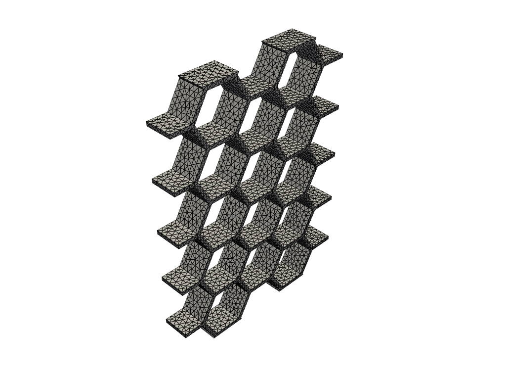
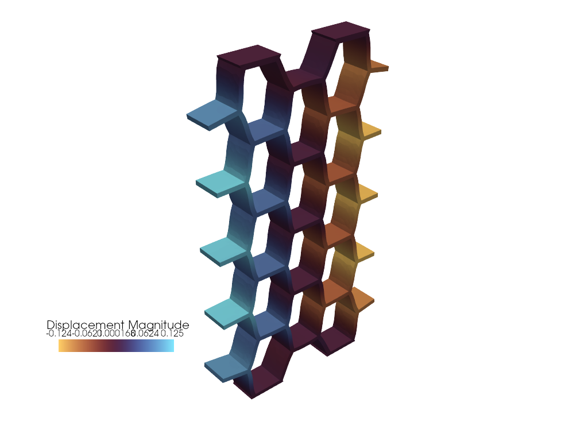

<div class="nb-header"><a href="https://colab.research.google.com/github/smec-ethz/tatva-docs/blob/main/notebooks/examples/ncm_metamaterial.ipynb" target="_blank"></a><a href="/assets/notebooks/examples/ncm_metamaterial.ipynb" download="ncm_metamaterial.ipynb" class="nb-download-btn"><svg class="nb-download-icon" viewBox="0 0 24 24" xmlns="http://www.w3.org/2000/svg"><path d="M12 16l-6-6 1.41-1.41L11 13.17V4h2v9.17l3.59-3.58L18 11l-6 6z"/><path d="M5 18h14v2H5z"/></svg> Download notebook</a></div>

# Neural Constitutive Modeling

<div class="nb-clear"></div>


??? example "Colab Setup (Install Dependencies)"
    ```python
    
    # Only run this if we are in Google Colab
    if 'google.colab' in str(get_ipython()):
        print("Installing dependencies using uv...")
        # Install uv if not available
        !pip install -q uv
        # Install system dependencies
        !apt-get install -qq gmsh
        # Use uv to install Python dependencies
        !uv pip install --system matplotlib meshio
        !uv pip install --system pyvista
        !uv pip install --system "git+https://github.com/smec-ethz/tatva-docs.git"
            
        import pyvista as pv
    
        pv.global_theme.jupyter_backend = 'static'
        pv.global_theme.notebook = True
        pv.start_xvfb()
        
        print("Installation complete!")
    else:
        import pyvista as pv
        pv.global_theme.jupyter_backend = 'client'
    ```

In this example, we will implement a neural constitutive model. A neural constitutive model uses neural networks to represent the relationship between stress and strain in materials. This approach allows for more flexible and accurate modeling of complex material behaviors compared to traditional constitutive models.


```python
import jax

jax.config.update("jax_persistent_cache_min_compile_time_secs", 0)
jax.config.update("jax_enable_x64", True)

from functools import partial

import equinox as eqx
import jax.experimental.sparse as jsp
import jax.numpy as jnp
import numpy as np
import pyvista as pv
import scipy.sparse as sp
from jax import Array
from jax_autovmap import autovmap
from tatva import Mesh, Operator, element, sparse
```

## Mesh 

We start by defining the mesh and material properties for our simulation.


??? example "Gmsh Geometry Creation and Mesh object creation"
    ```python
    
    import gmsh
    import meshio
    
    cells_x = 4          
    cells_y = 5          
    side_length = 1.0   
    wall_thickness = 0.15 
    height = 1.0         
    lc = 0.2         
    fillet_radius = 0.6  # New: Radius for rounding the corners
    
    gmsh.initialize()
    gmsh.model.add("solid_honeycomb")
    occ = gmsh.model.occ
    
    h_hex = side_length * np.sqrt(3) 
    
    dx = 1.5 * side_length + (wall_thickness * np.sqrt(3)/2)
    dy = h_hex + wall_thickness
    
    total_w = (cells_x- 1) * dx + 2 * side_length + 2 * wall_thickness
    total_h = (cells_y) * dy + wall_thickness
    
    # Create the main block
    block = occ.addBox(0.1*total_w, 0.1*total_h, 0, total_w, total_h, height)
    
    punches = []
    
    for i in range(cells_x+1):
        for j in range(cells_y+1):
            cx = i * dx + side_length + wall_thickness
            offset_y = (dy / 2) if (i % 2 != 0) else 0
            cy = j * dy + (h_hex/2) + wall_thickness - offset_y
            
            pts = []
            for angle in range(0, 360, 60):
                rad = np.radians(angle)
                pts.append(occ.addPoint(cx + side_length * np.cos(rad), 
                                        cy + side_length * np.sin(rad), 0, lc))
            
            lines = [occ.addLine(pts[k], pts[(k+1)%6]) for k in range(6)]
            loop = occ.addCurveLoop(lines)
            surf = occ.addPlaneSurface([loop])
            
            # 2. Extrude to create the prism (Punch)
            # extrude returns list of (dim, tag)
            prism = occ.extrude([(2, surf)], 0, 0, height)
            vol_tag = prism[1][1] # Get the tag of the 3D volume
            
            # --- FILLET LOGIC START ---
            # We need to find the 6 vertical edges of this new prism to fillet them.
            occ.synchronize() # Must sync to query the new volume's edges
            
            # Get all curves (edges) associated with the volume
            # getBoundary returns list of (dim, tag)
            edges = gmsh.model.getBoundary([(3, vol_tag)], combined=False, oriented=False, recursive=True)
            
            vertical_edges = []
            for e in edges:
                dim, tag = e
                if dim == 1: # Ensure it is a curve
                    xmin, ymin, zmin, xmax, ymax, zmax = gmsh.model.getBoundingBox(1, tag)
                    
                    # Check if edge is vertical (aligned with Z)
                    z_len = abs(zmax - zmin)
                    x_len = abs(xmax - xmin)
                    y_len = abs(ymax - ymin)
                    
                    if z_len > 0.9 * height and x_len < 1e-4 and y_len < 1e-4:
                        vertical_edges.append(tag)
            
            if vertical_edges:
                filleted_punches = occ.fillet([vol_tag], vertical_edges, fillet_radius)
                
                punches.append((3, filleted_punches[0][1]))
            else:
                punches.append((3, vol_tag))
       
    occ.synchronize()
    
    out, _ = occ.cut([(3, block)], punches, removeTool=True)
    occ.synchronize()
    
    if out:
        final_vols = [v[1] for v in out]
        gmsh.model.addPhysicalGroup(3, final_vols, tag=100, name="Lattice_Material")
    
    gmsh.option.setNumber("Mesh.Algorithm3D", 1) # Delaunay
    gmsh.model.mesh.setSize(gmsh.model.getEntities(0), lc)
    gmsh.model.mesh.generate(3)
    gmsh.write("../meshes/honeycomb.msh")
    gmsh.finalize()
    
    _mesh = meshio.read("../meshes/honeycomb.msh")
    
    points = _mesh.points
    z_points = points[:, 2].copy()  # Store z-coordinates
    y_points = points[:, 1].copy()  # Store y-coordinates
    points[:, 1] = z_points 
    points[:, 2] = y_points
    
    if "tetra" in _mesh.cells_dict:
        tetra_elements = _mesh.cells_dict["tetra"]
        print(f"Successfully loaded {len(tetra_elements)} tetrahedrons.")
    else:
        print("No tetrahedrons found. Ensure gmsh.model.mesh.generate(3) was called.")
    
    
    mesh = Mesh(coords=points, elements=tetra_elements)
    ```

??? info "Output"
    Info    : Meshing 1D...ence                                                                                  
        Info    : [  0%] Meshing curve 13 (Line)
        Info    : [ 10%] Meshing curve 19 (Line)
        Info    : [ 10%] Meshing curve 20 (Line)
        Info    : [ 10%] Meshing curve 21 (Line)
        Info    : [ 10%] Meshing curve 31 (Line)
        Info    : [ 10%] Meshing curve 36 (Line)
        Info    : [ 10%] Meshing curve 37 (Line)
        Info    : [ 10%] Meshing curve 38 (Line)
        Info    : [ 10%] Meshing curve 39 (Line)
        Info    : [ 10%] Meshing curve 46 (Line)
        Info    : [ 10%] Meshing curve 48 (Line)
        Info    : [ 10%] Meshing curve 49 (Line)
        Info    : [ 10%] Meshing curve 54 (Line)
        Info    : [ 10%] Meshing curve 55 (Line)
        Info    : [ 10%] Meshing curve 56 (Line)
        Info    : [ 10%] Meshing curve 57 (Line)
        Info    : [ 10%] Meshing curve 64 (Line)
        Info    : [ 10%] Meshing curve 66 (Line)
        Info    : [ 10%] Meshing curve 67 (Line)
        Info    : [ 10%] Meshing curve 72 (Line)
        Info    : [ 10%] Meshing curve 73 (Line)
        Info    : [ 10%] Meshing curve 74 (Line)
        Info    : [ 10%] Meshing curve 75 (Line)
        Info    : [ 10%] Meshing curve 82 (Line)
        Info    : [ 10%] Meshing curve 84 (Line)
        Info    : [ 10%] Meshing curve 85 (Line)
        Info    : [ 10%] Meshing curve 90 (Line)
        Info    : [ 10%] Meshing curve 91 (Line)
        Info    : [ 10%] Meshing curve 92 (Line)
        Info    : [ 10%] Meshing curve 93 (Line)
        Info    : [ 10%] Meshing curve 100 (Line)
        Info    : [ 10%] Meshing curve 102 (Line)
        Info    : [ 10%] Meshing curve 108 (Line)
        Info    : [ 10%] Meshing curve 109 (Line)
        Info    : [ 10%] Meshing curve 118 (Line)
        Info    : [ 10%] Meshing curve 120 (Line)
        Info    : [ 10%] Meshing curve 139 (Line)
        Info    : [ 10%] Meshing curve 140 (Line)
        Info    : [ 10%] Meshing curve 141 (Line)
        Info    : [ 10%] Meshing curve 142 (Line)
        Info    : [ 10%] Meshing curve 143 (Line)
        Info    : [ 10%] Meshing curve 144 (Line)
        Info    : [ 10%] Meshing curve 145 (Line)
        Info    : [ 10%] Meshing curve 146 (Line)
        Info    : [ 10%] Meshing curve 147 (Line)
        Info    : [ 10%] Meshing curve 148 (Line)
        Info    : [ 20%] Meshing curve 149 (Line)
        Info    : [ 20%] Meshing curve 150 (Line)
        Info    : [ 20%] Meshing curve 151 (Line)
        Info    : [ 20%] Meshing curve 152 (Line)
        Info    : [ 20%] Meshing curve 153 (Line)
        Info    : [ 20%] Meshing curve 154 (Line)
        Info    : [ 20%] Meshing curve 155 (Line)
        Info    : [ 20%] Meshing curve 156 (Line)
        Info    : [ 20%] Meshing curve 157 (Line)
        Info    : [ 20%] Meshing curve 158 (Line)
        Info    : [ 20%] Meshing curve 159 (Line)
        Info    : [ 20%] Meshing curve 160 (Line)
        Info    : [ 20%] Meshing curve 161 (Line)
        Info    : [ 20%] Meshing curve 162 (Line)
        Info    : [ 20%] Meshing curve 163 (Line)
        Info    : [ 20%] Meshing curve 164 (Line)
        Info    : [ 20%] Meshing curve 165 (Line)
        Info    : [ 20%] Meshing curve 166 (Line)
        Info    : [ 20%] Meshing curve 167 (Line)
        Info    : [ 20%] Meshing curve 168 (Line)
        Info    : [ 20%] Meshing curve 169 (Line)
        Info    : [ 20%] Meshing curve 170 (Line)
        Info    : [ 20%] Meshing curve 171 (Line)
        Info    : [ 20%] Meshing curve 172 (Line)
        Info    : [ 20%] Meshing curve 173 (Line)
        Info    : [ 20%] Meshing curve 174 (Line)
        Info    : [ 20%] Meshing curve 175 (Line)
        Info    : [ 20%] Meshing curve 176 (Line)
        Info    : [ 20%] Meshing curve 177 (Line)
        Info    : [ 20%] Meshing curve 178 (Line)
        Info    : [ 20%] Meshing curve 179 (Line)
        Info    : [ 20%] Meshing curve 180 (Line)
        Info    : [ 20%] Meshing curve 181 (Line)
        Info    : [ 20%] Meshing curve 182 (Line)
        Info    : [ 20%] Meshing curve 183 (Line)
        Info    : [ 20%] Meshing curve 184 (Line)
        Info    : [ 20%] Meshing curve 185 (Line)
        Info    : [ 20%] Meshing curve 186 (Line)
        Info    : [ 20%] Meshing curve 187 (Line)
        Info    : [ 20%] Meshing curve 188 (Line)
        Info    : [ 20%] Meshing curve 189 (Line)
        Info    : [ 20%] Meshing curve 190 (Line)
        Info    : [ 20%] Meshing curve 191 (Line)
        Info    : [ 20%] Meshing curve 192 (Line)
        Info    : [ 20%] Meshing curve 193 (Line)
        Info    : [ 20%] Meshing curve 194 (Line)
        Info    : [ 30%] Meshing curve 195 (Line)
        Info    : [ 30%] Meshing curve 196 (Line)
        Info    : [ 30%] Meshing curve 197 (Line)
        Info    : [ 30%] Meshing curve 198 (Line)
        Info    : [ 30%] Meshing curve 199 (Line)
        Info    : [ 30%] Meshing curve 200 (Line)
        Info    : [ 30%] Meshing curve 201 (Line)
        Info    : [ 30%] Meshing curve 202 (Line)
        Info    : [ 30%] Meshing curve 203 (Line)
        Info    : [ 30%] Meshing curve 204 (Line)
        Info    : [ 30%] Meshing curve 205 (Line)
        Info    : [ 30%] Meshing curve 206 (Line)
        Info    : [ 30%] Meshing curve 207 (Line)
        Info    : [ 30%] Meshing curve 208 (Line)
        Info    : [ 30%] Meshing curve 209 (Line)
        Info    : [ 30%] Meshing curve 210 (Line)
        Info    : [ 30%] Meshing curve 211 (Line)
        Info    : [ 30%] Meshing curve 212 (Line)
        Info    : [ 30%] Meshing curve 213 (Line)
        Info    : [ 30%] Meshing curve 214 (Line)
        Info    : [ 30%] Meshing curve 215 (Line)
        Info    : [ 30%] Meshing curve 216 (Line)
        Info    : [ 30%] Meshing curve 217 (Line)
        Info    : [ 30%] Meshing curve 218 (Line)
        Info    : [ 30%] Meshing curve 219 (Line)
        Info    : [ 30%] Meshing curve 220 (Line)
        Info    : [ 30%] Meshing curve 221 (Line)
        Info    : [ 30%] Meshing curve 222 (Line)
        Info    : [ 30%] Meshing curve 223 (Line)
        Info    : [ 30%] Meshing curve 224 (Line)
        Info    : [ 30%] Meshing curve 225 (Line)
        Info    : [ 30%] Meshing curve 226 (Line)
        Info    : [ 30%] Meshing curve 227 (Line)
        Info    : [ 30%] Meshing curve 228 (Line)
        Info    : [ 30%] Meshing curve 229 (Line)
        Info    : [ 30%] Meshing curve 230 (Line)
        Info    : [ 30%] Meshing curve 231 (Line)
        Info    : [ 30%] Meshing curve 235 (Line)
        Info    : [ 30%] Meshing curve 236 (Line)
        Info    : [ 30%] Meshing curve 237 (Line)
        Info    : [ 30%] Meshing curve 238 (Line)
        Info    : [ 30%] Meshing curve 239 (Line)
        Info    : [ 30%] Meshing curve 240 (Line)
        Info    : [ 30%] Meshing curve 241 (Line)
        Info    : [ 30%] Meshing curve 247 (Line)
        Info    : [ 40%] Meshing curve 248 (Line)
        Info    : [ 40%] Meshing curve 249 (Line)
        Info    : [ 40%] Meshing curve 250 (Line)
        Info    : [ 40%] Meshing curve 251 (Line)
        Info    : [ 40%] Meshing curve 252 (Line)
        Info    : [ 40%] Meshing curve 253 (Line)
        Info    : [ 40%] Meshing curve 254 (Line)
        Info    : [ 40%] Meshing curve 255 (Line)
        Info    : [ 40%] Meshing curve 256 (Line)
        Info    : [ 40%] Meshing curve 257 (Line)
        Info    : [ 40%] Meshing curve 258 (Line)
        Info    : [ 40%] Meshing curve 259 (Line)
        Info    : [ 40%] Meshing curve 260 (Line)
        Info    : [ 40%] Meshing curve 261 (Line)
        Info    : [ 40%] Meshing curve 262 (Line)
        Info    : [ 40%] Meshing curve 263 (Line)
        Info    : [ 40%] Meshing curve 264 (Line)
        Info    : [ 40%] Meshing curve 265 (Line)
        Info    : [ 40%] Meshing curve 266 (Line)
        Info    : [ 40%] Meshing curve 267 (Line)
        Info    : [ 40%] Meshing curve 268 (Line)
        Info    : [ 40%] Meshing curve 269 (Line)
        Info    : [ 40%] Meshing curve 270 (Line)
        Info    : [ 40%] Meshing curve 271 (Line)
        Info    : [ 40%] Meshing curve 272 (Line)
        Info    : [ 40%] Meshing curve 273 (Line)
        Info    : [ 40%] Meshing curve 274 (Line)
        Info    : [ 40%] Meshing curve 275 (Line)
        Info    : [ 40%] Meshing curve 276 (Line)
        Info    : [ 40%] Meshing curve 277 (Line)
        Info    : [ 40%] Meshing curve 278 (Line)
        Info    : [ 40%] Meshing curve 279 (Line)
        Info    : [ 40%] Meshing curve 280 (Line)
        Info    : [ 40%] Meshing curve 281 (Line)
        Info    : [ 40%] Meshing curve 282 (Line)
        Info    : [ 40%] Meshing curve 283 (Line)
        Info    : [ 40%] Meshing curve 284 (Line)
        Info    : [ 40%] Meshing curve 285 (Line)
        Info    : [ 40%] Meshing curve 286 (Line)
        Info    : [ 40%] Meshing curve 287 (Line)
        Info    : [ 40%] Meshing curve 288 (Line)
        Info    : [ 40%] Meshing curve 289 (Line)
        Info    : [ 40%] Meshing curve 290 (Line)
        Info    : [ 40%] Meshing curve 291 (Line)
        Info    : [ 40%] Meshing curve 292 (Line)
        Info    : [ 40%] Meshing curve 293 (Line)
        Info    : [ 50%] Meshing curve 294 (Line)
        Info    : [ 50%] Meshing curve 295 (Line)
        Info    : [ 50%] Meshing curve 296 (Line)
        Info    : [ 50%] Meshing curve 297 (Line)
        Info    : [ 50%] Meshing curve 298 (Line)
        Info    : [ 50%] Meshing curve 299 (Line)
        Info    : [ 50%] Meshing curve 300 (Line)
        Info    : [ 50%] Meshing curve 301 (Line)
        Info    : [ 50%] Meshing curve 302 (Line)
        Info    : [ 50%] Meshing curve 303 (Line)
        Info    : [ 50%] Meshing curve 304 (Line)
        Info    : [ 50%] Meshing curve 305 (Line)
        Info    : [ 50%] Meshing curve 306 (Line)
        Info    : [ 50%] Meshing curve 307 (Line)
        Info    : [ 50%] Meshing curve 308 (Line)
        Info    : [ 50%] Meshing curve 309 (Line)
        Info    : [ 50%] Meshing curve 310 (Line)
        Info    : [ 50%] Meshing curve 311 (Line)
        Info    : [ 50%] Meshing curve 312 (Line)
        Info    : [ 50%] Meshing curve 313 (Line)
        Info    : [ 50%] Meshing curve 314 (Line)
        Info    : [ 50%] Meshing curve 315 (Line)
        Info    : [ 50%] Meshing curve 316 (Line)
        Info    : [ 50%] Meshing curve 317 (Line)
        Info    : [ 50%] Meshing curve 318 (Line)
        Info    : [ 50%] Meshing curve 322 (Line)
        Info    : [ 50%] Meshing curve 323 (Line)
        Info    : [ 50%] Meshing curve 324 (Line)
        Info    : [ 50%] Meshing curve 325 (Line)
        Info    : [ 50%] Meshing curve 330 (Line)
        Info    : [ 50%] Meshing curve 332 (Line)
        Info    : [ 50%] Meshing curve 333 (Line)
        Info    : [ 50%] Meshing curve 334 (Line)
        Info    : [ 50%] Meshing curve 335 (Line)
        Info    : [ 50%] Meshing curve 336 (Line)
        Info    : [ 50%] Meshing curve 355 (Line)
        Info    : [ 50%] Meshing curve 356 (Line)
        Info    : [ 50%] Meshing curve 357 (Line)
        Info    : [ 50%] Meshing curve 358 (Line)
        Info    : [ 50%] Meshing curve 359 (Line)
        Info    : [ 50%] Meshing curve 360 (Line)
        Info    : [ 50%] Meshing curve 361 (Line)
        Info    : [ 50%] Meshing curve 362 (Line)
        Info    : [ 50%] Meshing curve 363 (Line)
        Info    : [ 50%] Meshing curve 364 (Line)
        Info    : [ 60%] Meshing curve 365 (Line)
        Info    : [ 60%] Meshing curve 366 (Line)
        Info    : [ 60%] Meshing curve 367 (Line)
        Info    : [ 60%] Meshing curve 368 (Line)
        Info    : [ 60%] Meshing curve 369 (Line)
        Info    : [ 60%] Meshing curve 370 (Line)
        Info    : [ 60%] Meshing curve 371 (Line)
        Info    : [ 60%] Meshing curve 372 (Line)
        Info    : [ 60%] Meshing curve 373 (Line)
        Info    : [ 60%] Meshing curve 374 (Line)
        Info    : [ 60%] Meshing curve 375 (Line)
        Info    : [ 60%] Meshing curve 376 (Line)
        Info    : [ 60%] Meshing curve 377 (Line)
        Info    : [ 60%] Meshing curve 378 (Line)
        Info    : [ 60%] Meshing curve 379 (Line)
        Info    : [ 60%] Meshing curve 380 (Line)
        Info    : [ 60%] Meshing curve 381 (Line)
        Info    : [ 60%] Meshing curve 382 (Line)
        Info    : [ 60%] Meshing curve 383 (Line)
        Info    : [ 60%] Meshing curve 384 (Line)
        Info    : [ 60%] Meshing curve 385 (Line)
        Info    : [ 60%] Meshing curve 386 (Line)
        Info    : [ 60%] Meshing curve 387 (Line)
        Info    : [ 60%] Meshing curve 388 (Line)
        Info    : [ 60%] Meshing curve 389 (Line)
        Info    : [ 60%] Meshing curve 390 (Line)
        Info    : [ 60%] Meshing curve 391 (Line)
        Info    : [ 60%] Meshing curve 392 (Line)
        Info    : [ 60%] Meshing curve 393 (Line)
        Info    : [ 60%] Meshing curve 394 (Line)
        Info    : [ 60%] Meshing curve 395 (Line)
        Info    : [ 60%] Meshing curve 396 (Line)
        Info    : [ 60%] Meshing curve 397 (Line)
        Info    : [ 60%] Meshing curve 398 (Line)
        Info    : [ 60%] Meshing curve 399 (Line)
        Info    : [ 60%] Meshing curve 400 (Line)
        Info    : [ 60%] Meshing curve 401 (Line)
        Info    : [ 60%] Meshing curve 402 (Line)
        Info    : [ 60%] Meshing curve 403 (Line)
        Info    : [ 60%] Meshing curve 404 (Line)
        Info    : [ 60%] Meshing curve 405 (Line)
        Info    : [ 60%] Meshing curve 406 (Line)
        Info    : [ 60%] Meshing curve 407 (Line)
        Info    : [ 60%] Meshing curve 408 (Line)
        Info    : [ 60%] Meshing curve 409 (Line)
        Info    : [ 60%] Meshing curve 410 (Line)
        Info    : [ 70%] Meshing curve 411 (Line)
        Info    : [ 70%] Meshing curve 412 (Line)
        Info    : [ 70%] Meshing curve 413 (Line)
        Info    : [ 70%] Meshing curve 414 (Line)
        Info    : [ 70%] Meshing curve 415 (Line)
        Info    : [ 70%] Meshing curve 416 (Line)
        Info    : [ 70%] Meshing curve 417 (Line)
        Info    : [ 70%] Meshing curve 418 (Line)
        Info    : [ 70%] Meshing curve 419 (Line)
        Info    : [ 70%] Meshing curve 420 (Line)
        Info    : [ 70%] Meshing curve 421 (Line)
        Info    : [ 70%] Meshing curve 422 (Line)
        Info    : [ 70%] Meshing curve 423 (Line)
        Info    : [ 70%] Meshing curve 424 (Line)
        Info    : [ 70%] Meshing curve 425 (Line)
        Info    : [ 70%] Meshing curve 426 (Line)
        Info    : [ 70%] Meshing curve 427 (Line)
        Info    : [ 70%] Meshing curve 428 (Line)
        Info    : [ 70%] Meshing curve 429 (Line)
        Info    : [ 70%] Meshing curve 430 (Line)
        Info    : [ 70%] Meshing curve 431 (Line)
        Info    : [ 70%] Meshing curve 432 (Line)
        Info    : [ 70%] Meshing curve 433 (Line)
        Info    : [ 70%] Meshing curve 434 (Line)
        Info    : [ 70%] Meshing curve 435 (Line)
        Info    : [ 70%] Meshing curve 436 (Line)
        Info    : [ 70%] Meshing curve 437 (Line)
        Info    : [ 70%] Meshing curve 438 (Line)
        Info    : [ 70%] Meshing curve 439 (Line)
        Info    : [ 70%] Meshing curve 440 (Line)
        Info    : [ 70%] Meshing curve 441 (Line)
        Info    : [ 70%] Meshing curve 442 (Line)
        Info    : [ 70%] Meshing curve 443 (Line)
        Info    : [ 70%] Meshing curve 444 (Line)
        Info    : [ 70%] Meshing curve 447 (Line)
        Info    : [ 70%] Meshing curve 454 (Line)
        Info    : [ 70%] Meshing curve 456 (Line)
        Info    : [ 70%] Meshing curve 457 (Line)
        Info    : [ 70%] Meshing curve 465 (Line)
        Info    : [ 70%] Meshing curve 466 (Line)
        Info    : [ 70%] Meshing curve 472 (Line)
        Info    : [ 70%] Meshing curve 474 (Line)
        Info    : [ 70%] Meshing curve 475 (Line)
        Info    : [ 70%] Meshing curve 476 (Line)
        Info    : [ 70%] Meshing curve 477 (Line)
        Info    : [ 70%] Meshing curve 483 (Line)
        Info    : [ 80%] Meshing curve 484 (Line)
        Info    : [ 80%] Meshing curve 490 (Line)
        Info    : [ 80%] Meshing curve 492 (Line)
        Info    : [ 80%] Meshing curve 493 (Line)
        Info    : [ 80%] Meshing curve 494 (Line)
        Info    : [ 80%] Meshing curve 495 (Line)
        Info    : [ 80%] Meshing curve 501 (Line)
        Info    : [ 80%] Meshing curve 502 (Line)
        Info    : [ 80%] Meshing curve 508 (Line)
        Info    : [ 80%] Meshing curve 510 (Line)
        Info    : [ 80%] Meshing curve 511 (Line)
        Info    : [ 80%] Meshing curve 512 (Line)
        Info    : [ 80%] Meshing curve 513 (Line)
        Info    : [ 80%] Meshing curve 519 (Line)
        Info    : [ 80%] Meshing curve 520 (Line)
        Info    : [ 80%] Meshing curve 526 (Line)
        Info    : [ 80%] Meshing curve 528 (Line)
        Info    : [ 80%] Meshing curve 529 (Line)
        Info    : [ 80%] Meshing curve 530 (Line)
        Info    : [ 80%] Meshing curve 531 (Line)
        Info    : [ 80%] Meshing curve 538 (Line)
        Info    : [ 80%] Meshing curve 546 (Line)
        Info    : [ 80%] Meshing curve 548 (Line)
        Info    : [ 80%] Meshing curve 549 (Line)
        Info    : [ 80%] Meshing curve 550 (Line)
        Info    : [ 80%] Meshing curve 551 (Line)
        Info    : [ 80%] Meshing curve 552 (Line)
        Info    : [ 80%] Meshing curve 553 (Line)
        Info    : [ 80%] Meshing curve 554 (Line)
        Info    : [ 80%] Meshing curve 555 (Line)
        Info    : [ 80%] Meshing curve 556 (Line)
        Info    : [ 80%] Meshing curve 557 (Line)
        Info    : [ 80%] Meshing curve 558 (Line)
        Info    : [ 80%] Meshing curve 559 (Line)
        Info    : [ 80%] Meshing curve 560 (Line)
        Info    : [ 80%] Meshing curve 561 (Line)
        Info    : [ 80%] Meshing curve 562 (Line)
        Info    : [ 80%] Meshing curve 563 (Line)
        Info    : [ 80%] Meshing curve 564 (Line)
        Info    : [ 80%] Meshing curve 565 (Line)
        Info    : [ 80%] Meshing curve 566 (Line)
        Info    : [ 80%] Meshing curve 567 (Line)
        Info    : [ 80%] Meshing curve 568 (Line)
        Info    : [ 80%] Meshing curve 569 (Line)
        Info    : [ 80%] Meshing curve 570 (Line)
        Info    : [ 90%] Meshing curve 571 (Line)
        Info    : [ 90%] Meshing curve 572 (Line)
        Info    : [ 90%] Meshing curve 573 (Line)
        Info    : [ 90%] Meshing curve 574 (Line)
        Info    : [ 90%] Meshing curve 575 (Line)
        Info    : [ 90%] Meshing curve 576 (Line)
        Info    : [ 90%] Meshing curve 577 (Line)
        Info    : [ 90%] Meshing curve 578 (Line)
        Info    : [ 90%] Meshing curve 579 (Line)
        Info    : [ 90%] Meshing curve 580 (Line)
        Info    : [ 90%] Meshing curve 581 (Line)
        Info    : [ 90%] Meshing curve 582 (Line)
        Info    : [ 90%] Meshing curve 583 (Line)
        Info    : [ 90%] Meshing curve 584 (Line)
        Info    : [ 90%] Meshing curve 585 (Line)
        Info    : [ 90%] Meshing curve 586 (Line)
        Info    : [ 90%] Meshing curve 587 (Line)
        Info    : [ 90%] Meshing curve 588 (Line)
        Info    : [ 90%] Meshing curve 589 (Line)
        Info    : [ 90%] Meshing curve 590 (Line)
        Info    : [ 90%] Meshing curve 591 (Line)
        Info    : [ 90%] Meshing curve 592 (Line)
        Info    : [ 90%] Meshing curve 593 (Line)
        Info    : [ 90%] Meshing curve 594 (Line)
        Info    : [ 90%] Meshing curve 595 (Line)
        Info    : [ 90%] Meshing curve 596 (Line)
        Info    : [ 90%] Meshing curve 597 (Line)
        Info    : [ 90%] Meshing curve 598 (Line)
        Info    : [ 90%] Meshing curve 599 (Line)
        Info    : [ 90%] Meshing curve 600 (Line)
        Info    : [ 90%] Meshing curve 601 (Line)
        Info    : [ 90%] Meshing curve 602 (Line)
        Info    : [ 90%] Meshing curve 603 (Line)
        Info    : [ 90%] Meshing curve 604 (Line)
        Info    : [ 90%] Meshing curve 605 (Line)
        Info    : [ 90%] Meshing curve 606 (Line)
        Info    : [ 90%] Meshing curve 607 (Line)
        Info    : [ 90%] Meshing curve 608 (Line)
        Info    : [ 90%] Meshing curve 609 (Line)
        Info    : [ 90%] Meshing curve 610 (Line)
        Info    : [ 90%] Meshing curve 611 (Line)
        Info    : [ 90%] Meshing curve 612 (Line)
        Info    : [ 90%] Meshing curve 613 (Line)
        Info    : [ 90%] Meshing curve 614 (Line)
        Info    : [ 90%] Meshing curve 615 (Line)
        Info    : [ 90%] Meshing curve 616 (Line)
        Info    : [100%] Meshing curve 617 (Line)
        Info    : [100%] Meshing curve 618 (Line)
        Info    : [100%] Meshing curve 619 (Line)
        Info    : [100%] Meshing curve 620 (Line)
        Info    : [100%] Meshing curve 621 (Line)
        Info    : [100%] Meshing curve 622 (Line)
        Info    : [100%] Meshing curve 623 (Line)
        Info    : [100%] Meshing curve 624 (Line)
        Info    : [100%] Meshing curve 625 (Line)
        Info    : [100%] Meshing curve 626 (Line)
        Info    : [100%] Meshing curve 627 (Line)
        Info    : [100%] Meshing curve 628 (Line)
        Info    : [100%] Meshing curve 629 (Line)
        Info    : [100%] Meshing curve 630 (Line)
        Info    : [100%] Meshing curve 631 (Line)
        Info    : [100%] Meshing curve 632 (Line)
        Info    : [100%] Meshing curve 633 (Line)
        Info    : [100%] Meshing curve 634 (Line)
        Info    : [100%] Meshing curve 635 (Line)
        Info    : [100%] Meshing curve 636 (Line)
        Info    : [100%] Meshing curve 637 (Line)
        Info    : [100%] Meshing curve 638 (Line)
        Info    : [100%] Meshing curve 639 (Line)
        Info    : [100%] Meshing curve 640 (Line)
        Info    : [100%] Meshing curve 641 (Line)
        Info    : [100%] Meshing curve 642 (Line)
        Info    : [100%] Meshing curve 643 (Line)
        Info    : [100%] Meshing curve 644 (Line)
        Info    : [100%] Meshing curve 645 (Line)
        Info    : [100%] Meshing curve 646 (Line)
        Info    : [100%] Meshing curve 647 (Line)
        Info    : [100%] Meshing curve 648 (Line)
        Info    : [100%] Meshing curve 649 (Line)
        Info    : [100%] Meshing curve 650 (Line)
        Info    : [100%] Meshing curve 651 (Line)
        Info    : [100%] Meshing curve 652 (Line)
        Info    : [100%] Meshing curve 653 (Line)
        Info    : [100%] Meshing curve 654 (Line)
        Info    : [100%] Meshing curve 655 (Line)
        Info    : [100%] Meshing curve 656 (Line)
        Info    : [100%] Meshing curve 657 (Line)
        Info    : [100%] Meshing curve 658 (Line)
        Info    : [100%] Meshing curve 659 (Line)
        Info    : [100%] Meshing curve 660 (Line)
        Info    : [100%] Meshing curve 661 (Line)
        Info    : Done meshing 1D (Wall 0.0300234s, CPU 0.034056s)
        Info    : Meshing 2D...
        Info    : [  0%] Meshing surface 8 (Plane, Frontal-Delaunay)
        Info    : [ 10%] Meshing surface 16 (Plane, Frontal-Delaunay)
        Info    : [ 10%] Meshing surface 21 (Plane, Frontal-Delaunay)
        Info    : [ 10%] Meshing surface 24 (Plane, Frontal-Delaunay)
        Info    : [ 10%] Meshing surface 29 (Plane, Frontal-Delaunay)
        Info    : [ 10%] Meshing surface 32 (Plane, Frontal-Delaunay)
        Info    : [ 10%] Meshing surface 37 (Plane, Frontal-Delaunay)
        Info    : [ 10%] Meshing surface 40 (Plane, Frontal-Delaunay)
        Info    : [ 10%] Meshing surface 45 (Plane, Frontal-Delaunay)
        Info    : [ 10%] Meshing surface 53 (Plane, Frontal-Delaunay)
        Info    : [ 10%] Meshing surface 64 (Plane, Frontal-Delaunay)
        Info    : [ 10%] Meshing surface 65 (Plane, Frontal-Delaunay)
        Info    : [ 10%] Meshing surface 66 (Plane, Frontal-Delaunay)
        Info    : [ 10%] Meshing surface 67 (Plane, Frontal-Delaunay)
        Info    : [ 10%] Meshing surface 68 (Plane, Frontal-Delaunay)
        Info    : [ 10%] Meshing surface 69 (Plane, Frontal-Delaunay)
        Info    : [ 20%] Meshing surface 72 (Plane, Frontal-Delaunay)
        Info    : [ 20%] Meshing surface 73 (Plane, Frontal-Delaunay)
        Info    : [ 20%] Meshing surface 74 (Plane, Frontal-Delaunay)
        Info    : [ 20%] Meshing surface 75 (Plane, Frontal-Delaunay)
        Info    : [ 20%] Meshing surface 76 (Plane, Frontal-Delaunay)
        Info    : [ 20%] Meshing surface 77 (Plane, Frontal-Delaunay)
        Info    : [ 20%] Meshing surface 80 (Plane, Frontal-Delaunay)
        Info    : [ 20%] Meshing surface 81 (Plane, Frontal-Delaunay)
        Info    : [ 20%] Meshing surface 82 (Plane, Frontal-Delaunay)
        Info    : [ 20%] Meshing surface 83 (Plane, Frontal-Delaunay)
        Info    : [ 20%] Meshing surface 84 (Plane, Frontal-Delaunay)
        Info    : [ 20%] Meshing surface 85 (Plane, Frontal-Delaunay)
        Info    : [ 20%] Meshing surface 88 (Plane, Frontal-Delaunay)
        Info    : [ 20%] Meshing surface 89 (Plane, Frontal-Delaunay)
        Info    : [ 20%] Meshing surface 90 (Plane, Frontal-Delaunay)
        Info    : [ 30%] Meshing surface 91 (Plane, Frontal-Delaunay)
        Info    : [ 30%] Meshing surface 92 (Plane, Frontal-Delaunay)
        Info    : [ 30%] Meshing surface 93 (Plane, Frontal-Delaunay)
        Info    : [ 30%] Meshing surface 96 (Plane, Frontal-Delaunay)
        Info    : [ 30%] Meshing surface 97 (Plane, Frontal-Delaunay)
        Info    : [ 30%] Meshing surface 98 (Plane, Frontal-Delaunay)
        Info    : [ 30%] Meshing surface 99 (Plane, Frontal-Delaunay)
        Info    : [ 30%] Meshing surface 100 (Plane, Frontal-Delaunay)
        Info    : [ 30%] Meshing surface 101 (Plane, Frontal-Delaunay)
        Info    : [ 30%] Meshing surface 104 (Plane, Frontal-Delaunay)
        Info    : [ 30%] Meshing surface 105 (Plane, Frontal-Delaunay)
        Info    : [ 30%] Meshing surface 106 (Plane, Frontal-Delaunay)
        Info    : [ 30%] Meshing surface 112 (Plane, Frontal-Delaunay)
        Info    : [ 30%] Meshing surface 113 (Plane, Frontal-Delaunay)
        Info    : [ 30%] Meshing surface 114 (Plane, Frontal-Delaunay)
        Info    : [ 30%] Meshing surface 115 (Plane, Frontal-Delaunay)
        Info    : [ 40%] Meshing surface 116 (Plane, Frontal-Delaunay)
        Info    : [ 40%] Meshing surface 117 (Plane, Frontal-Delaunay)
        Info    : [ 40%] Meshing surface 120 (Plane, Frontal-Delaunay)
        Info    : [ 40%] Meshing surface 121 (Plane, Frontal-Delaunay)
        Info    : [ 40%] Meshing surface 122 (Plane, Frontal-Delaunay)
        Info    : [ 40%] Meshing surface 123 (Plane, Frontal-Delaunay)
        Info    : [ 40%] Meshing surface 124 (Plane, Frontal-Delaunay)
        Info    : [ 40%] Meshing surface 125 (Plane, Frontal-Delaunay)
        Info    : [ 40%] Meshing surface 128 (Plane, Frontal-Delaunay)
        Info    : [ 40%] Meshing surface 129 (Plane, Frontal-Delaunay)
        Info    : [ 40%] Meshing surface 130 (Plane, Frontal-Delaunay)
        Info    : [ 40%] Meshing surface 131 (Plane, Frontal-Delaunay)
        Info    : [ 40%] Meshing surface 132 (Plane, Frontal-Delaunay)
        Info    : [ 40%] Meshing surface 133 (Plane, Frontal-Delaunay)
        Info    : [ 40%] Meshing surface 136 (Plane, Frontal-Delaunay)
        Info    : [ 50%] Meshing surface 137 (Plane, Frontal-Delaunay)
        Info    : [ 50%] Meshing surface 138 (Plane, Frontal-Delaunay)
        Info    : [ 50%] Meshing surface 139 (Plane, Frontal-Delaunay)
        Info    : [ 50%] Meshing surface 140 (Plane, Frontal-Delaunay)
        Info    : [ 50%] Meshing surface 141 (Plane, Frontal-Delaunay)
        Info    : [ 50%] Meshing surface 147 (Plane, Frontal-Delaunay)
        Info    : [ 50%] Meshing surface 148 (Plane, Frontal-Delaunay)
        Info    : [ 50%] Meshing surface 149 (Plane, Frontal-Delaunay)
        Info    : [ 50%] Meshing surface 160 (Plane, Frontal-Delaunay)
        Info    : [ 50%] Meshing surface 161 (Plane, Frontal-Delaunay)
        Info    : [ 50%] Meshing surface 162 (Plane, Frontal-Delaunay)
        Info    : [ 50%] Meshing surface 163 (Plane, Frontal-Delaunay)
        Info    : [ 50%] Meshing surface 164 (Plane, Frontal-Delaunay)
        Info    : [ 50%] Meshing surface 165 (Plane, Frontal-Delaunay)
        Info    : [ 50%] Meshing surface 168 (Plane, Frontal-Delaunay)
        Info    : [ 60%] Meshing surface 169 (Plane, Frontal-Delaunay)
        Info    : [ 60%] Meshing surface 170 (Plane, Frontal-Delaunay)
        Info    : [ 60%] Meshing surface 171 (Plane, Frontal-Delaunay)
        Info    : [ 60%] Meshing surface 172 (Plane, Frontal-Delaunay)
        Info    : [ 60%] Meshing surface 173 (Plane, Frontal-Delaunay)
        Info    : [ 60%] Meshing surface 176 (Plane, Frontal-Delaunay)
        Info    : [ 60%] Meshing surface 177 (Plane, Frontal-Delaunay)
        Info    : [ 60%] Meshing surface 178 (Plane, Frontal-Delaunay)
        Info    : [ 60%] Meshing surface 179 (Plane, Frontal-Delaunay)
        Info    : [ 60%] Meshing surface 180 (Plane, Frontal-Delaunay)
        Info    : [ 60%] Meshing surface 181 (Plane, Frontal-Delaunay)
        Info    : [ 60%] Meshing surface 184 (Plane, Frontal-Delaunay)
        Info    : [ 60%] Meshing surface 185 (Plane, Frontal-Delaunay)
        Info    : [ 60%] Meshing surface 186 (Plane, Frontal-Delaunay)
        Info    : [ 60%] Meshing surface 187 (Plane, Frontal-Delaunay)
        Info    : [ 60%] Meshing surface 188 (Plane, Frontal-Delaunay)
        Info    : [ 70%] Meshing surface 189 (Plane, Frontal-Delaunay)
        Info    : [ 70%] Meshing surface 192 (Plane, Frontal-Delaunay)
        Info    : [ 70%] Meshing surface 193 (Plane, Frontal-Delaunay)
        Info    : [ 70%] Meshing surface 194 (Plane, Frontal-Delaunay)
        Info    : [ 70%] Meshing surface 195 (Plane, Frontal-Delaunay)
        Info    : [ 70%] Meshing surface 196 (Plane, Frontal-Delaunay)
        Info    : [ 70%] Meshing surface 197 (Plane, Frontal-Delaunay)
        Info    : [ 70%] Meshing surface 202 (Plane, Frontal-Delaunay)
        Info    : [ 70%] Meshing surface 210 (Plane, Frontal-Delaunay)
        Info    : [ 70%] Meshing surface 211 (Plane, Frontal-Delaunay)
        Info    : [ 70%] Meshing surface 218 (Plane, Frontal-Delaunay)
        Info    : [ 70%] Meshing surface 219 (Plane, Frontal-Delaunay)
        Info    : [ 70%] Meshing surface 226 (Plane, Frontal-Delaunay)
        Info    : [ 70%] Meshing surface 227 (Plane, Frontal-Delaunay)
        Info    : [ 70%] Meshing surface 234 (Plane, Frontal-Delaunay)
        Info    : [ 80%] Meshing surface 235 (Plane, Frontal-Delaunay)
        Info    : [ 80%] Meshing surface 243 (Plane, Frontal-Delaunay)
        Info    : [ 80%] Meshing surface 244 (Plane, Frontal-Delaunay)
        Info    : [ 80%] Meshing surface 245 (Plane, Frontal-Delaunay)
        Info    : [ 80%] Meshing surface 246 (Plane, Frontal-Delaunay)
        Info    : [ 80%] Meshing surface 247 (Plane, Frontal-Delaunay)
        Info    : [ 80%] Meshing surface 248 (Plane, Frontal-Delaunay)
        Info    : [ 80%] Meshing surface 249 (Plane, Frontal-Delaunay)
        Info    : [ 80%] Meshing surface 250 (Plane, Frontal-Delaunay)
        Info    : [ 80%] Meshing surface 251 (Plane, Frontal-Delaunay)
        Info    : [ 80%] Meshing surface 252 (Plane, Frontal-Delaunay)
        Info    : [ 80%] Meshing surface 253 (Plane, Frontal-Delaunay)
        Info    : [ 80%] Meshing surface 254 (Plane, Frontal-Delaunay)
        Info    : [ 80%] Meshing surface 255 (Plane, Frontal-Delaunay)
        Info    : [ 80%] Meshing surface 256 (Plane, Frontal-Delaunay)
        Info    : [ 80%] Meshing surface 257 (Plane, Frontal-Delaunay)
        Info    : [ 90%] Meshing surface 258 (Plane, Frontal-Delaunay)
        Info    : [ 90%] Meshing surface 259 (Plane, Frontal-Delaunay)
        Info    : [ 90%] Meshing surface 260 (Plane, Frontal-Delaunay)
        Info    : [ 90%] Meshing surface 261 (Plane, Frontal-Delaunay)
        Info    : [ 90%] Meshing surface 262 (Plane, Frontal-Delaunay)
        Info    : [ 90%] Meshing surface 263 (Plane, Frontal-Delaunay)
        Info    : [ 90%] Meshing surface 264 (Plane, Frontal-Delaunay)
        Info    : [ 90%] Meshing surface 265 (Plane, Frontal-Delaunay)
        Info    : [ 90%] Meshing surface 266 (Plane, Frontal-Delaunay)
        Info    : [ 90%] Meshing surface 267 (Plane, Frontal-Delaunay)
        Info    : [ 90%] Meshing surface 268 (Plane, Frontal-Delaunay)
        Info    : [ 90%] Meshing surface 269 (Plane, Frontal-Delaunay)
        Info    : [ 90%] Meshing surface 270 (Plane, Frontal-Delaunay)
        Info    : [ 90%] Meshing surface 271 (Plane, Frontal-Delaunay)
        Info    : [ 90%] Meshing surface 272 (Plane, Frontal-Delaunay)
        Info    : [100%] Meshing surface 273 (Plane, Frontal-Delaunay)
        Info    : [100%] Meshing surface 274 (Plane, Frontal-Delaunay)
        Info    : [100%] Meshing surface 275 (Plane, Frontal-Delaunay)
        Info    : [100%] Meshing surface 276 (Plane, Frontal-Delaunay)
        Info    : [100%] Meshing surface 277 (Plane, Frontal-Delaunay)
        Info    : [100%] Meshing surface 278 (Plane, Frontal-Delaunay)
        Info    : [100%] Meshing surface 279 (Plane, Frontal-Delaunay)
        Info    : [100%] Meshing surface 280 (Plane, Frontal-Delaunay)
        Info    : [100%] Meshing surface 281 (Plane, Frontal-Delaunay)
        Info    : [100%] Meshing surface 282 (Plane, Frontal-Delaunay)
        Info    : [100%] Meshing surface 283 (Plane, Frontal-Delaunay)
        Info    : [100%] Meshing surface 284 (Plane, Frontal-Delaunay)
        Info    : [100%] Meshing surface 285 (Plane, Frontal-Delaunay)
        Info    : [100%] Meshing surface 286 (Plane, Frontal-Delaunay)
        Info    : [100%] Meshing surface 287 (Plane, Frontal-Delaunay)
        Info    : Done meshing 2D (Wall 0.206909s, CPU 0.19783s)
        Info    : Meshing 3D...
        Info    : 3D Meshing 1 volume with 1 connected component
        Info    : Tetrahedrizing 5922 nodes...
        Info    : Done tetrahedrizing 5930 nodes (Wall 0.0707914s, CPU 0.067769s)
        Info    : Reconstructing mesh...
        Info    :  - Creating surface mesh
        Info    :  - Identifying boundary edges
        Info    :  - Recovering boundary
        Info    :  - Added 1 Steiner point
        Info    : Done reconstructing mesh (Wall 0.175318s, CPU 0.166739s)
        Info    : Found volume 1
        Info    : It. 0 - 0 nodes created - worst tet radius 0.912402 (nodes removed 0 0)
        Info    : 3D refinement terminated (5923 nodes total):
        Info    :  - 0 Delaunay cavities modified for star shapeness
        Info    :  - 0 nodes could not be inserted
        Info    :  - 17362 tetrahedra created in 0.00157873 sec. (10997419 tets/s)
        Info    : 0 node relocations
        Info    : Done meshing 3D (Wall 0.384664s, CPU 0.361599s)
        Info    : Optimizing mesh...
        Info    : Optimizing volume 1
        Info    : Optimization starts (volume = 10.2837) with worst = 0.000838874 / average = 0.719092:
        Info    : 0.00 < quality < 0.10 :       342 elements
        Info    : 0.10 < quality < 0.20 :       190 elements
        Info    : 0.20 < quality < 0.30 :       150 elements
        Info    : 0.30 < quality < 0.40 :       149 elements
        Info    : 0.40 < quality < 0.50 :       485 elements
        Info    : 0.50 < quality < 0.60 :      1345 elements
        Info    : 0.60 < quality < 0.70 :      3180 elements
        Info    : 0.70 < quality < 0.80 :      5742 elements
        Info    : 0.80 < quality < 0.90 :      4856 elements
        Info    : 0.90 < quality < 1.00 :       923 elements
        Info    : 628 edge swaps, 0 node relocations (volume = 10.2837): worst = 0.000838874 / average = 0.738579 (Wall 0.0109034s, CPU 0.010951s)
        Info    : 663 edge swaps, 0 node relocations (volume = 10.2837): worst = 0.000838874 / average = 0.73902 (Wall 0.0135029s, CPU 0.013664s)
        Info    : 0.00 < quality < 0.10 :        44 elements
        Info    : 0.10 < quality < 0.20 :         8 elements
        Info    : 0.20 < quality < 0.30 :         6 elements
        Info    : 0.30 < quality < 0.40 :       150 elements
        Info    : 0.40 < quality < 0.50 :       520 elements
        Info    : 0.50 < quality < 0.60 :      1307 elements
        Info    : 0.60 < quality < 0.70 :      3155 elements
        Info    : 0.70 < quality < 0.80 :      6040 elements
        Info    : 0.80 < quality < 0.90 :      4704 elements
        Info    : 0.90 < quality < 1.00 :       857 elements
        Info    : Done optimizing mesh (Wall 0.0323708s, CPU 0.033524s)
        Info    : 5923 nodes 31149 elements
        Info    : Writing '../meshes/honeycomb.msh'...
        Info    : Done writing '../meshes/honeycomb.msh'
        
        Successfully loaded 16817 tetrahedrons.
    
    
        Warning : 1 ill-shaped tets are still in the mesh
        Warning : ------------------------------
        Warning : Mesh generation error summary
        Warning :     1 warning
        Warning :     0 errors
        Warning : Check the full log for details
        Warning : ------------------------------


```python
grid = pv.UnstructuredGrid(
    np.hstack((np.full((mesh.elements.shape[0], 1), 4), mesh.elements)).flatten(),
    np.full(mesh.elements.shape[0], pv.CellType.TETRA),
    np.array(mesh.coords)
)

pl = pv.Plotter()
pl.add_mesh(grid, show_edges=True, color="lightgray",  smooth_shading=False)
pl.view_isometric()
pl.show()
```


    Widget(value='<iframe src="http://localhost:36931/index.html?ui=P_0x73cb2c36faa0_0&reconnect=auto" class="pyvi…




We use `Tetrahedral` elements for the mesh and below we define the `Operator` object.


```python
tet = element.Tetrahedron4()
op = Operator(mesh, tet)


n_dofs_per_node = 3
n_nodes, n_dofs = mesh.coords.shape[0], mesh.coords.shape[0] * n_dofs_per_node 
```

## Defining the Neural Constitutive Model

The specific architecture employed for the neural strain energy density was a feed-forward Multi-Layer Perceptron (MLP). The network consisted of an input layer accepting the two scalar invariants $(I_1, J)$, followed by two hidden layers with 16 neurons each, and a final output layer producing the scalar energy value. To ensure that the second-order derivatives (Hessian) remained continuous and numerically stable, a \texttt{softplus} activation function was utilized across all hidden layers. This choice is critical as standard piecewise linear activations, such as \texttt{ReLU}, yield zero second derivatives almost everywhere, leading to immediate solver divergence.

$$
\psi_{\text{total}}(I_1, J) = \underbrace{\left[ \text{NN}(I_1, J; \theta) - \text{NN}(3, 1; \theta) \right]}_{\text{Shifted Neural Potential}} + \underbrace{\Psi_{\text{base}}(I_1, J)}_{\text{Stiffness Prior}}
$$

!!! note
    
    Note we use an untrained neural network and for actual purpose this should be replaced by a trained neural network


```python
class NeuralMaterial(eqx.Module):
    layers: list
    mu_init: float
    lmbda_init: float

    def __init__(self, key, mu=500.0, lmbda=1000.0):
        self.mu_init = mu
        self.lmbda_init = lmbda

        keys = jax.random.split(key, 3)
        self.layers = [
            eqx.nn.Linear(2, 12, key=keys[0]),
            jax.nn.softplus,
            eqx.nn.Linear(12, 12, key=keys[1]),
            jax.nn.softplus,
            eqx.nn.Linear(12, 1, key=keys[2]),
        ]

    def __call__(self, x: Array) -> Array:

        y = x
        for layer in self.layers:
            y = layer(y)
        psi_nn = y[0]

        ref_invariants = jnp.array([3.0, 1.0])
        y_ref = ref_invariants
        for layer in self.layers:
            y_ref = layer(y_ref)
        psi_0 = y_ref[0]

        I1, J = x[0], x[1]
        psi_base = (
            (self.mu_init / 2) * (I1 - 3)
            - self.mu_init * jnp.log(J)
            + (self.lmbda_init / 2) * (jnp.log(J)) ** 2
        )

        # Total Energy = (NN - Offset) + Base
        return (psi_nn - psi_0) + psi_base
```

Now, we define the neural network architecture and the total strain energy density function based on the neural network defined above.


```python
key = jax.random.PRNGKey(42)

E = 1e4
nu = 0.3
mu = E / 2 / (1 + nu)
lmbda = E * nu / (1 - 2 * nu) / (1 + nu)

nn_material = NeuralMaterial(key, mu=mu, lmbda=lmbda)


@autovmap(grad_u=2)
def neural_strain_energy(grad_u, model):
    I = jnp.eye(3)
    F = I + grad_u
    C = F.T @ F

    I1 = jnp.trace(C)
    J = jnp.linalg.det(F)

    invariants = jnp.array([I1, J])
    return model(invariants)


@eqx.filter_jit
def total_neural_energy(u_flat: Array, model) -> float:
    u = u_flat.reshape(-1, n_dofs_per_node)
    u_grad = op.grad(u)
    energy_density = neural_strain_energy(u_grad, model)
    return op.integrate(energy_density)
```

To check if the total energy at 0 deformation is zero, we can evaluate the total strain energy density function at the reference configuration where $I_1 = 3$ and $J = 1$. This ensures that the neural network's contribution is shifted appropriately, and the stiffness prior is also evaluated at this point.


## Applying Boundary Conditions and Loads


```python
z_min, z_max = jnp.min(mesh.coords[:, 2]), jnp.max(mesh.coords[:, 2])


top_nodes = jnp.where(jnp.isclose(mesh.coords[:, 2], z_max))[0]
bottom_nodes = jnp.where(jnp.isclose(mesh.coords[:, 2], z_min))[0]

zero_dofs = jnp.concatenate(
    [
        3 * bottom_nodes,
        3 * bottom_nodes + 1,
        3 * bottom_nodes + 2,
        3 * top_nodes,
        3 * top_nodes + 1,
    ]
)
applied_dofs = 3 * top_nodes + 2  # Apply displacement in z-direction

fixed_dofs = jnp.concatenate([applied_dofs, zero_dofs])

prescribed_values = jnp.zeros(n_dofs).at[applied_dofs].set(0.4)

```

## Using Coloring to compute Sparse Hessians

We will solve the problem using direct linear solver. To this end, we will need to perform sparse differentiation using the `sparse` module of `tatva` and coloring approach from `tatva_coloring.`


```python
sparsity_pattern_csr = sparse.create_sparsity_pattern(
    mesh, n_dofs_per_node=n_dofs_per_node
)
colored_matrix = sparse.ColoredMatrix.from_csr(sparsity_pattern_csr)

energy_fn = eqx.Partial(total_neural_energy, model=nn_material)
gradient_fn = jax.jacrev(energy_fn)

K_sparse_fn = sparse.jacfwd(
    fn=gradient_fn,
    colored_matrix=colored_matrix,
    color_batch_size=10,
)

zero_indices, one_indices = sparse.get_bc_indices(sparsity_pattern_csr, fixed_dofs)
```

!!! note

    One can use the matrix-free solver by computing the Jacobian-vector product by simply using `jax.jvp` on the `gradient_fn`.

## Defining Newton Solver

We will use a newton sparse solver


??? example "Newton Solver with Sparse Linear Solve"
    ```python
    
    
    @eqx.filter_jit
    def newton_sparse_solver(
        u,
        fext,
        gradient,
        hessian_sparse,
        fixed_dofs,
        zero_indices,
        one_indices,
    ):
        fint = gradient(u)
    
        norm_res = 1.0
    
        tol = 1e-8
        max_iter = 10
    
        def solver(u, n):
            def true_func(u):
                fint = gradient(u)
                residual = fext - fint
                residual = residual.at[fixed_dofs].set(0.0)
    
                K_sparse = hessian_sparse(u)
                K_data_lifted = K_sparse.data.at[zero_indices].set(0)
                K_data_lifted = K_data_lifted.at[one_indices].set(1)
    
                du = jsp.linalg.spsolve(
                    K_data_lifted,
                    indices=K_sparse.indices,
                    indptr=K_sparse.indptr,
                    b=residual,
                )
    
                u = u.at[:].add(du)
                return u
    
            def false_func(u):
                return u
    
            fint = gradient(u)
            residual = fext - fint
            residual = residual.at[fixed_dofs].set(0.0)
            norm_res = jnp.linalg.norm(residual)
    
            jax.debug.print("residual={}", norm_res)
    
            return jax.lax.cond(norm_res > tol, true_func, false_func, u), n
    
        u, xs = jax.lax.scan(solver, init=u, xs=jnp.arange(0, max_iter))
    
        fint = gradient(u)
        residual = fext - fint
        residual = residual.at[fixed_dofs].set(0.0)
        norm_res = jnp.linalg.norm(residual)
    
        return u, norm_res
    ```

## Solving the System


```python

fext = jnp.zeros(n_dofs)

n_steps = 5
applied_displacement = prescribed_values / n_steps  # displacement increment

for i in range(n_steps):
    u_prev = u_prev.at[fixed_dofs].add(applied_displacement[fixed_dofs])

    u_new, rnorm = newton_sparse_solver(
        u_prev,
        fext,
        gradient_fn,
        K_sparse_fn,
        fixed_dofs,
        zero_indices,
        one_indices,
    )

    u_prev = u_new

    print(f"Iteration {i}: Residual Norm = {rnorm:.4e}")

u_sol = u_prev.reshape(n_nodes, n_dofs_per_node)
```

??? info "Output"
    residual=1371.570589894706
        residual=1402.269075102642
        residual=516.3211491024834
        residual=167.34643670888568
        residual=26.774625960499975
        residual=0.9441458517834568
        residual=0.0013813731895300958
        residual=3.1511744323539518e-09
        residual=3.1511744323539518e-09
        residual=3.1511744323539518e-09
        Iteration 0: Residual Norm = 3.1512e-09
        residual=1371.0780886756154
        residual=1375.7943623328404
        residual=501.66823707292286
        residual=160.38678791964037
        residual=24.923278457678418
        residual=0.827860417393414
        residual=0.0010720930028342405
        residual=1.9273171080981712e-09
        residual=1.9273171080981712e-09
        residual=1.9273171080981712e-09
        Iteration 1: Residual Norm = 1.9273e-09
        residual=1370.550620706396
        residual=1349.8788478066601
        residual=487.2624762079414
        residual=153.58816016433408
        residual=23.16588771120084
        residual=0.7238842678099198
        residual=0.0008293137478007945
        residual=1.1781167225397521e-09
        residual=1.1781167225397521e-09
        residual=1.1781167225397521e-09
        Iteration 2: Residual Norm = 1.1781e-09
        residual=1369.9899481741083
        residual=1324.5185506340106
        residual=473.1014648963445
        residual=146.94885917842316
        residual=21.497995708642627
        residual=0.6310382481266316
        residual=0.0006388297473102514
        residual=7.167711051384289e-10
        residual=7.167711051384289e-10
        residual=7.167711051384289e-10
        Iteration 3: Residual Norm = 7.1677e-10
        residual=1369.393738883142
        residual=1299.7020849297282
        residual=459.1809042580567
        residual=140.4662771051909
        residual=19.91534601710452
        residual=0.5482549150482866
        residual=0.0004895203968808261
        residual=4.316696382420045e-10
        residual=4.316696382420045e-10
        residual=4.316696382420045e-10
        Iteration 4: Residual Norm = 4.3167e-10


```python

```

## Visualization

We will now visualize the deformation of metamaterial.


??? example "Visualization of Deformed Configuration"
    ```python
    
    sargs = dict(
        title=r"Displacement Magnitude",
        height=0.08,
        width=0.2,
        vertical=False,
        position_x=0.1,
        position_y=0.2,
        title_font_size=20,
        label_font_size=16,
        color="black",
        font_family="arial",
    )
    
    
    pl = pv.Plotter()
    grid["u"] = np.array(u_sol)
    warped = grid.warp_by_vector("u", factor=4.0)
    warped = warped.cell_data_to_point_data()
    pl.add_mesh(
        warped,
        show_edges=False,
        scalars="u",
        component=0,
        cmap="managua",
        line_width=0.1,
        scalar_bar_args=sargs,
    )
    pl.view_vector([-0.55, -0.65, 0.5])
    pl.show()
    ```

Widget(value='<iframe src="http://localhost:36931/index.html?ui=P_0x73ca2c74c2f0_1&reconnect=auto" class="pyvi…




