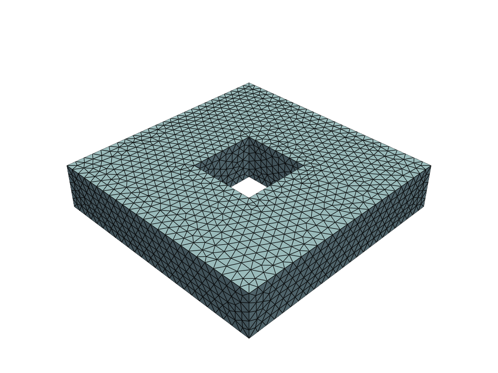
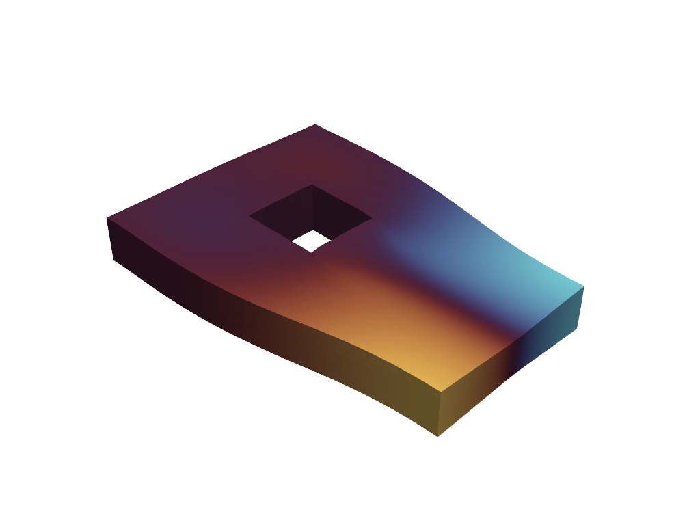

<div class="nb-header"><a href="https://colab.research.google.com/github/smec-ethz/tatva-docs/blob/main/notebooks/examples/neural_operator_method_3d.ipynb" target="_blank"></a><a href="/assets/notebooks/examples/neural_operator_method_3d.ipynb" download="neural_operator_method_3d.ipynb" class="nb-download-btn"><svg class="nb-download-icon" viewBox="0 0 24 24" xmlns="http://www.w3.org/2000/svg"><path d="M12 16l-6-6 1.41-1.41L11 13.17V4h2v9.17l3.59-3.58L18 11l-6 6z"/><path d="M5 18h14v2H5z"/></svg> Download</a></div>

# Neural Operator Element Method

<div class="nb-clear"></div>


In this notebook, we will implement a neural constitutive model. A neural constitutive model uses neural networks to represent the relationship between stress and strain in materials. This approach allows for more flexible and accurate modeling of complex material behaviors compared to traditional constitutive models. 


??? example "Colab Setup (Install Dependencies)"
    ```python
    
    # Only run this if we are in Google Colab
    if 'google.colab' in str(get_ipython()):
        print("Installing dependencies using uv...")
        # Install uv if not available
        !pip install -q uv
        # Install system dependencies
        !apt-get install -qq gmsh
        # Use uv to install Python dependencies
        !uv pip install --system matplotlib meshio
        !uv pip install --system pyvista
        !uv pip install --system "git+https://github.com/smec-ethz/tatva-docs.git"
            
        import pyvista as pv
    
        pv.global_theme.jupyter_backend = 'static'
        pv.global_theme.notebook = True
        pv.start_xvfb()
        
        print("Installation complete!")
    else:
        import pyvista as pv
        pv.global_theme.jupyter_backend = 'client'
    ```


```python
import os

import jax

jax.config.update("jax_enable_x64", True)  # Use double-precision for FEM stability

import equinox as eqx
import jax.experimental.sparse as jsp
import jax.numpy as jnp
import numpy as np
import pyvista as pv
import scipy.sparse as sp
from jax import Array
from jax_autovmap import autovmap
from tatva import Mesh, Operator, element, sparse
```

## Mesh and Material Setup

We start by defining the mesh and material properties for our simulation.


??? example "Mesh Generation"
    ```python
    
    import gmsh
    import meshio
    
    
    def create_unstructured_3d_through_hole_mesh(
        L=10.0, H=5.0, a=3.0, mesh_size=0.8, filename="noem_3d_hole.msh"
    ):
        """
        Creates an unstructured tetrahedral mesh for a cuboid with a
        through-hole along the Z-axis.
    
        Parameters:
        - L: Width/Length of the cuboid (X and Y).
        - H: Height of the cuboid (Z-axis).
        - a: Side of the square hole.
        - mesh_size: Characteristic mesh size.
        """
        gmsh.initialize()
        gmsh.model.add("NOEM_ThroughHole")
        occ = gmsh.model.occ
    
        outer_vol = occ.addBox(-L / 2, -L / 2, 0, L, L, H)
        cutter_vol = occ.addBox(-a / 2, -a / 2, -0.1, a, a, H + 0.2)
    
        fem_vol, _ = occ.cut([(3, outer_vol)], [(3, cutter_vol)])
        occ.synchronize()
    
        all_surfaces = gmsh.model.getEntities(2)
        interface_surfaces = []
    
        for dim, tag in all_surfaces:
            mass_prop = occ.getCenterOfMass(dim, tag)
            # Check if surface is on the internal walls (x or y = +/- a/2)
            is_internal_x = (
                np.isclose(np.abs(mass_prop[0]), a / 2, atol=1e-3)
                and np.abs(mass_prop[1]) <= a / 2
            )
            is_internal_y = (
                np.isclose(np.abs(mass_prop[1]), a / 2, atol=1e-3)
                and np.abs(mass_prop[0]) <= a / 2
            )
            # Ensure it's not the top or bottom cap of the cuboid
            is_not_cap = not np.isclose(mass_prop[2], 0, atol=1e-3) and not np.isclose(
                mass_prop[2], H, atol=1e-3
            )
    
            if (is_internal_x or is_internal_y) and is_not_cap:
                interface_surfaces.append(tag)
    
        gmsh.model.addPhysicalGroup(3, [fem_vol[0][1]], name="FEM_Volume")
        gmsh.model.addPhysicalGroup(2, interface_surfaces, name="Interface")
    
        gmsh.option.setNumber("Mesh.MeshSizeMin", mesh_size)
        gmsh.option.setNumber("Mesh.MeshSizeMax", mesh_size)
        gmsh.model.mesh.generate(3)
        gmsh.write(filename)
        gmsh.finalize()
    
        mesh = meshio.read(filename)
        nodes = mesh.points
        fem_elements = mesh.cells_dict["tetra"]
    
        if "Interface" in mesh.cell_sets_dict:
            # Get the triangles forming the internal boundary
            interface_tris = mesh.cells_dict["triangle"][
                mesh.cell_sets_dict["Interface"]["triangle"]
            ]
            interface_node_ids = np.unique(interface_tris)
        else:
            interface_node_ids = np.unique(mesh.cells_dict["triangle"])
    
        if os.path.exists(filename):
            os.remove(filename)
    
        return nodes, fem_elements, interface_node_ids
    
    
    def get_pyvista_grid(mesh, cell_type="quad"):
        if mesh.coords.shape[1] == 2:
            pv_points = np.hstack((mesh.coords, np.zeros(shape=(mesh.coords.shape[0], 1))))
        else:
            pv_points = np.array(mesh.coords)
    
        cell_type_dict = {
            "quad": 4,
            "triangle": 3,
            "tetra": 4,
            "hexahedron": 8,
        }
    
        pv_cells = np.hstack(
            (
                np.full(
                    fill_value=cell_type_dict[cell_type], shape=(mesh.elements.shape[0], 1)
                ),
                mesh.elements,
            )
        )
    
        pv_cell_type_dict = {
            "quad": pv.CellType.QUAD,
            "triangle": pv.CellType.TRIANGLE,
            "tetra": pv.CellType.TETRA,
            "hexahedron": pv.CellType.HEXAHEDRON,
        }
        cell_types = np.full(
            fill_value=pv_cell_type_dict[cell_type], shape=(mesh.elements.shape[0],)
        )
    
        grid = pv.UnstructuredGrid(pv_cells.flatten(), cell_types, pv_points)
    
        return grid
    ```


```python
nodes, elements, interface_idx = create_unstructured_3d_through_hole_mesh(
    L=10.0, H=2.0, a=a, mesh_size=0.4
)

mesh = Mesh(coords=nodes, elements=elements)

n_dofs_per_node = 3
n_nodes = mesh.coords.shape[0]
n_dofs = n_dofs_per_node * n_nodes
```

??? info "Output"
    Info    : Meshing 1D...ence - Classify solids                                                                                        
        Info    : [  0%] Meshing curve 1 (Line)
        Info    : [ 10%] Meshing curve 2 (Line)
        Info    : [ 10%] Meshing curve 3 (Line)
        Info    : [ 20%] Meshing curve 4 (Line)
        Info    : [ 20%] Meshing curve 5 (Line)
        Info    : [ 30%] Meshing curve 6 (Line)
        Info    : [ 30%] Meshing curve 7 (Line)
        Info    : [ 30%] Meshing curve 8 (Line)
        Info    : [ 40%] Meshing curve 9 (Line)
        Info    : [ 40%] Meshing curve 10 (Line)
        Info    : [ 50%] Meshing curve 11 (Line)
        Info    : [ 50%] Meshing curve 12 (Line)
        Info    : [ 60%] Meshing curve 13 (Line)
        Info    : [ 60%] Meshing curve 14 (Line)
        Info    : [ 60%] Meshing curve 15 (Line)
        Info    : [ 70%] Meshing curve 16 (Line)
        Info    : [ 70%] Meshing curve 17 (Line)
        Info    : [ 80%] Meshing curve 18 (Line)
        Info    : [ 80%] Meshing curve 19 (Line)
        Info    : [ 80%] Meshing curve 20 (Line)
        Info    : [ 90%] Meshing curve 21 (Line)
        Info    : [ 90%] Meshing curve 22 (Line)
        Info    : [100%] Meshing curve 23 (Line)
        Info    : [100%] Meshing curve 24 (Line)
        Info    : Done meshing 1D (Wall 0.00344843s, CPU 0.00454s)
        Info    : Meshing 2D...
        Info    : [  0%] Meshing surface 1 (Plane, Frontal-Delaunay)
        Info    : [ 20%] Meshing surface 2 (Plane, Frontal-Delaunay)
        Info    : [ 30%] Meshing surface 3 (Plane, Frontal-Delaunay)
        Info    : [ 40%] Meshing surface 4 (Plane, Frontal-Delaunay)
        Info    : [ 50%] Meshing surface 5 (Plane, Frontal-Delaunay)
        Info    : [ 60%] Meshing surface 6 (Plane, Frontal-Delaunay)
        Info    : [ 70%] Meshing surface 7 (Plane, Frontal-Delaunay)
        Info    : [ 80%] Meshing surface 8 (Plane, Frontal-Delaunay)
        Info    : [ 90%] Meshing surface 9 (Plane, Frontal-Delaunay)
        Info    : [100%] Meshing surface 10 (Plane, Frontal-Delaunay)
        Info    : Done meshing 2D (Wall 0.120163s, CPU 0.119756s)
        Info    : Meshing 3D...
        Info    : 3D Meshing 1 volume with 1 connected component
        Info    : Tetrahedrizing 2284 nodes...
        Info    : Done tetrahedrizing 2292 nodes (Wall 0.0319515s, CPU 0.028789s)
        Info    : Reconstructing mesh...
        Info    :  - Creating surface mesh
        Info    :  - Identifying boundary edges
        Info    :  - Recovering boundary
        Info    : Done reconstructing mesh (Wall 0.0804139s, CPU 0.075628s)
        Info    : Found volume 1
        Info    : It. 0 - 0 nodes created - worst tet radius 2.8065 (nodes removed 0 0)
        Info    : It. 500 - 500 nodes created - worst tet radius 1.29513 (nodes removed 0 0)
        Info    : It. 1000 - 1000 nodes created - worst tet radius 1.07848 (nodes removed 0 0)
        Info    : 3D refinement terminated (3552 nodes total):
        Info    :  - 0 Delaunay cavities modified for star shapeness
        Info    :  - 0 nodes could not be inserted
        Info    :  - 14859 tetrahedra created in 0.0795629 sec. (186757 tets/s)
        Info    : 0 node relocations
        Info    : Done meshing 3D (Wall 0.263304s, CPU 0.257163s)
        Info    : Optimizing mesh...
        Info    : Optimizing volume 1
        Info    : Optimization starts (volume = 182) with worst = 0.0147182 / average = 0.763304:
        Info    : 0.00 < quality < 0.10 :        42 elements
        Info    : 0.10 < quality < 0.20 :       100 elements
        Info    : 0.20 < quality < 0.30 :       169 elements
        Info    : 0.30 < quality < 0.40 :       241 elements
        Info    : 0.40 < quality < 0.50 :       405 elements
        Info    : 0.50 < quality < 0.60 :       729 elements
        Info    : 0.60 < quality < 0.70 :      2116 elements
        Info    : 0.70 < quality < 0.80 :      3953 elements
        Info    : 0.80 < quality < 0.90 :      4788 elements
        Info    : 0.90 < quality < 1.00 :      2312 elements
        Info    : 306 edge swaps, 5 node relocations (volume = 182): worst = 0.295076 / average = 0.776317 (Wall 0.00773976s, CPU 0.007272s)
        Info    : 307 edge swaps, 5 node relocations (volume = 182): worst = 0.300393 / average = 0.776343 (Wall 0.00960906s, CPU 0.009276s)
        Info    : No ill-shaped tets in the mesh :-)
        Info    : 0.00 < quality < 0.10 :         0 elements
        Info    : 0.10 < quality < 0.20 :         0 elements
        Info    : 0.20 < quality < 0.30 :         0 elements
        Info    : 0.30 < quality < 0.40 :       236 elements
        Info    : 0.40 < quality < 0.50 :       386 elements
        Info    : 0.50 < quality < 0.60 :       726 elements
        Info    : 0.60 < quality < 0.70 :      2100 elements
        Info    : 0.70 < quality < 0.80 :      3986 elements
        Info    : 0.80 < quality < 0.90 :      4840 elements
        Info    : 0.90 < quality < 1.00 :      2304 elements
        Info    : Done optimizing mesh (Wall 0.0269406s, CPU 0.026428s)
        Info    : 3552 nodes 19470 elements
        Info    : Writing 'noem_3d_hole.msh'...
        Info    : Done writing 'noem_3d_hole.msh'


```python
grid = get_pyvista_grid(mesh, cell_type="tetra")
pl = pv.Plotter()
pl.add_mesh(grid, show_edges=True)
pl.show()
```


    Widget(value='<iframe src="http://localhost:39469/index.html?ui=P_0x708e20223860_0&reconnect=auto" class="pyvi…




We define a simple 3D bar of length $L$, width $W$, and height $H$. The bar isfixed at one end and subjected to a force at the other end. We use `Tetrahedral` elements for the mesh.


```python
tetra = element.Tetrahedron4()
op = Operator(mesh, tetra)

n_dofs_per_node = 3
n_nodes, n_dofs = mesh.coords.shape[0], mesh.coords.shape[0] * n_dofs_per_node
```

## Defining FEM energy functional


```python
from typing import NamedTuple


class Material(NamedTuple):
    """Material properties for the elasticity operator."""

    mu: float  # Diffusion coefficient
    lmbda: float  # Diffusion coefficient


E = 1e4
nu = 0.3
mu = E / 2 / (1 + nu)
lmbda = E * nu / (1 - 2 * nu) / (1 + nu)

mat = Material(mu=mu, lmbda=lmbda)


@autovmap(grad_u=2)
def compute_strain(grad_u):
    return 0.5 * (grad_u + grad_u.T)


@autovmap(eps=2, mu=0, lmbda=0)
def compute_stress(eps, mu, lmbda):
    I = jnp.eye(3)
    return 2 * mu * eps + lmbda * jnp.trace(eps) * I


@autovmap(grad_u=2, mu=0, lmbda=0)
def strain_energy(grad_u, mu, lmbda):
    eps = compute_strain(grad_u)
    sigma = compute_stress(eps, mu, lmbda)
    return 0.5 * jnp.einsum("ij,ij->", sigma, eps)


@jax.jit
def total_fem_energy(u_flat: Array) -> float:
    """Compute the total energy of the system."""
    u = u_flat.reshape(-1, n_dofs_per_node)
    u_grad = op.grad(u)
    energy_density = strain_energy(u_grad, mat.mu, mat.lmbda)
    return op.integrate(energy_density)
```

## Defining the Neural Constitutive Model

The specific architecture employed for the neural strain energy density was a feed-forward Multi-Layer Perceptron (MLP). The network consisted of an input layer accepting the two scalar invariants $(I_1, J)$, followed by two hidden layers with 16 neurons each, and a final output layer producing the scalar
energy value. To ensure that the second-order derivatives (Hessian) remained continuous and numerically stable, a \texttt{softplus} activation function was  utilized across all hidden layers. This choice is critical as standard piecewise linear activations, such as \texttt{ReLU}, yield zero second derivatives almost everywhere, leading to immediate solver divergence.


$$
\psi_{\text{total}}(I_1, J) = \underbrace{\left[ \text{NN}(I_1, J; \theta) - \text{NN}(3, 1; \theta) \right]}_{\text{Shifted Neural Potential}} + \underbrace{\Psi_{\text{base}}(I_1, J)}_{\text{Stiffness Prior}}
$$


```python
class NeuralInclusion(eqx.Module):
    network: eqx.nn.MLP
    stiffness_prior: float  # Helps with initial convergence

    def __init__(self, n_interface_dofs, key, stiffness_prior=1e-2):
        self.stiffness_prior = stiffness_prior
        self.network = eqx.nn.MLP(
            in_size=n_interface_dofs,
            out_size="scalar",
            width_size=64,
            depth=3,
            activation=jax.nn.softplus,  # Must be smooth for Hessian
            key=key,
        )

    def __call__(self, u_interface):
        """
        Computes the shifted energy: G(u) - G(0) + prior
        u_interface: flattened array of displacements for nodes on the boundary
        """
        psi_raw = self.network(u_interface)

        u_zero = jnp.zeros_like(u_interface)
        psi_0 = self.network(u_zero)

        prior = 0.5 * self.stiffness_prior * jnp.sum(u_interface**2)

        return (psi_raw - psi_0) + prior


neural_operator = NeuralInclusion(
    n_interface_dofs=len(interface_idx) * n_dofs_per_node,
    key=jax.random.PRNGKey(0),
    stiffness_prior=1e4, #1e-2
)
```

## Coupling the domains through energies

Now, we define the neural network architecture and the total strain energy density function based on the neural network defined above.


```python
def total_energy(u_flat, neural_operator):
    u = u_flat.reshape(-1, n_dofs_per_node)
    energy_fem = total_fem_energy(u_flat)

    # Extract displacements for interface nodes
    u_interface = u[interface_idx].flatten()
    energy_neural = neural_operator(u_interface)

    return energy_fem + energy_neural
```

## Using Coloring to compute Sparse Hessians


```python
sparsity_pattern_csr = sparse.create_sparsity_pattern(
    mesh, n_dofs_per_node=n_dofs_per_node
)
colored_matrix = sparse.ColoredMatrix.from_csr(sparsity_pattern_csr)

# Closure for the energy based on the NN weights
energy_fn = eqx.Partial(total_energy, neural_operator=neural_operator)
gradient_fn = jax.jacrev(energy_fn)

K_sparse_fn = sparse.jacfwd(
    fn=gradient_fn,
    colored_matrix=colored_matrix,
    color_batch_size=10
)
```

To check if the total energy at 0 deformation is zero, we can evaluate the total strain energy density function at the reference configuration where $I_1 = 3$ and $J = 1$. This ensures that the neural network's contribution is shifted  appropriately, and the stiffness prior is also evaluated at this point.


## Applying Boundary Conditions and Loads


```python
# Boundary Conditions & Solver Setup
y_min, y_max = jnp.min(mesh.coords[:, 1]), jnp.max(mesh.coords[:, 1])


top_nodes = jnp.where(jnp.isclose(mesh.coords[:, 1], y_max))[0]
bottom_nodes = jnp.where(jnp.isclose(mesh.coords[:, 1], y_min))[0]

applied_dofs = n_dofs_per_node * top_nodes + 1  # y-direction DOFs at the top nodes

zero_dofs = jnp.concatenate(
    [n_dofs_per_node * bottom_nodes, n_dofs_per_node * bottom_nodes + 1]
)

fixed_dofs = jnp.concatenate([applied_dofs, zero_dofs])

prescribed_values = jnp.zeros(n_dofs).at[applied_dofs].set(1.0)

zero_indices, one_indices = sparse.get_bc_indices(sparsity_pattern_csr, fixed_dofs)
```

## Defining Newton Solver


??? example "Newton Solver with Sparse Hessian"
    ```python
    
    
    @eqx.filter_jit
    def newton_sparse_solver(
        u,
        fext,
        gradient,
        hessian_sparse,
        fixed_dofs,
        zero_indices,
        one_indices,
    ):
        fint = gradient(u)
    
        norm_res = 1.0
    
        tol = 1e-8
        max_iter = 10
    
        def solver(u, n):
            def true_func(u):
                fint = gradient(u)
                residual = fext - fint
                residual = residual.at[fixed_dofs].set(0.0)
    
                K_sparse = hessian_sparse(u)
                K_data_lifted = K_sparse.data.at[zero_indices].set(0)
                K_data_lifted = K_data_lifted.at[one_indices].set(1)
    
                du = jsp.linalg.spsolve(
                    K_data_lifted,
                    indices=K_sparse.indices,
                    indptr=K_sparse.indptr,
                    b=residual,
                )
    
                u = u.at[:].add(du)
                return u
    
            def false_func(u):
                return u
    
            fint = gradient(u)
            residual = fext - fint
            residual = residual.at[fixed_dofs].set(0.0)
            norm_res = jnp.linalg.norm(residual)
    
            jax.debug.print("residual={}", norm_res)
    
            return jax.lax.cond(norm_res > tol, true_func, false_func, u), n
    
        u, xs = jax.lax.scan(solver, init=u, xs=jnp.arange(0, max_iter))
    
        fint = gradient(u)
        residual = fext - fint
        residual = residual.at[fixed_dofs].set(0.0)
        norm_res = jnp.linalg.norm(residual)
    
        return u, norm_res
    ```

## Solving the System


```python

fext = jnp.zeros(n_dofs)

n_steps = 5
applied_displacement = prescribed_values / n_steps  # displacement increment

residual_history = []

print("Starting Neural Constitutive Solver...")
for i in range(n_steps):  # Newton iterations
    u_prev = u_prev.at[fixed_dofs].add(applied_displacement[fixed_dofs])

    u_new, rnorm = newton_sparse_solver(
        u_prev,
        fext,
        gradient_fn,
        K_sparse_fn,
        fixed_dofs,
        zero_indices,
        one_indices,
    )

    residual_history.append(rnorm)

    u_prev = u_new

    print(f"Iteration {i}: Residual Norm = {rnorm:.4e}")

u_sol = u_prev.reshape(n_nodes, n_dofs_per_node)
```

??? info "Output"
    Starting Neural Constitutive Solver...
        residual=12808.14011061805
        residual=1.27413048968689e-05
        residual=4.758274047437637e-12
        residual=4.758274047437637e-12
        residual=4.758274047437637e-12
        residual=4.758274047437637e-12
        residual=4.758274047437637e-12
        residual=4.758274047437637e-12
        residual=4.758274047437637e-12
        residual=4.758274047437637e-12
        Iteration 0: Residual Norm = 4.7566e-12
        residual=12808.140110612276
        residual=1.2741216153232334e-05
        residual=9.398268013732339e-12
        residual=9.398268013732339e-12
        residual=9.398268013732339e-12
        residual=9.398268013732339e-12
        residual=9.398268013732339e-12
        residual=9.398268013732339e-12
        residual=9.398268013732339e-12
        residual=9.398268013732339e-12
        Iteration 1: Residual Norm = 9.4029e-12
        residual=12808.140110612281
        residual=1.2741272644436237e-05
        residual=1.4289837932056026e-11
        residual=1.4289837932056026e-11
        residual=1.4289837932056026e-11
        residual=1.4289837932056026e-11
        residual=1.4289837932056026e-11
        residual=1.4289837932056026e-11
        residual=1.4289837932056026e-11
        residual=1.4289837932056026e-11
        Iteration 2: Residual Norm = 1.4290e-11
        residual=12808.14011061227
        residual=1.2741321191479694e-05
        residual=1.8630825271420838e-11
        residual=1.8630825271420838e-11
        residual=1.8630825271420838e-11
        residual=1.8630825271420838e-11
        residual=1.8630825271420838e-11
        residual=1.8630825271420838e-11
        residual=1.8630825271420838e-11
        residual=1.8630825271420838e-11
        Iteration 3: Residual Norm = 1.8630e-11
        residual=12808.140110612272
        residual=1.2741361575762716e-05
        residual=2.1887496215340466e-11
        residual=2.1887496215340466e-11
        residual=2.1887496215340466e-11
        residual=2.1887496215340466e-11
        residual=2.1887496215340466e-11
        residual=2.1887496215340466e-11
        residual=2.1887496215340466e-11
        residual=2.1887496215340466e-11
        Iteration 4: Residual Norm = 2.1893e-11


```python

```


??? example "Visualization of Results"
    ```python
    
    grid = pv.UnstructuredGrid(
        np.hstack((np.full((mesh.elements.shape[0], 1), 4), mesh.elements)).flatten(),
        np.full(mesh.elements.shape[0], pv.CellType.TETRA),
        np.array(mesh.coords),
    )
    
    pl = pv.Plotter()
    
    grad_u = op.grad(u_sol).squeeze()
    strains = compute_strain(grad_u)
    stresses = compute_stress(strains, mat.mu, mat.lmbda)
    
    
    grid["u"] = np.array(u_sol)
    grid["sigma_yy"] = stresses[:, 1, 1].flatten()
    
    warped = grid.warp_by_vector("u", factor=4.0)
    pl.add_mesh(warped, show_edges=False, scalars="u", component=0, cmap="managua", show_scalar_bar=False)
    pl.view_isometric()
    pl.screenshot("../assets/plots/neural_soft_inclusion_deformed_mesh.png", transparent_background=True)
    pl.show()
    ```

Widget(value='<iframe src="http://localhost:39469/index.html?ui=P_0x708d383062d0_1&reconnect=auto" class="pyvi…




