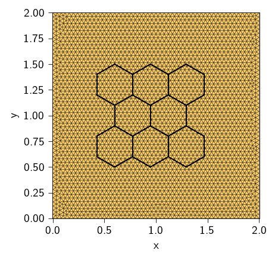
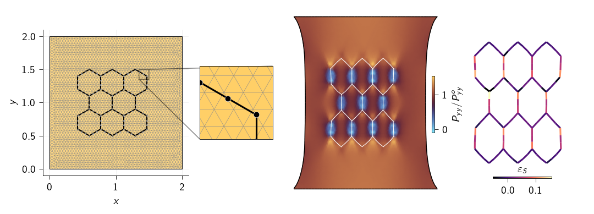

<div class="nb-header"><a href="https://colab.research.google.com/github/smec-ethz/tatva-docs/blob/main/notebooks/examples/soft_hydrogel.ipynb" target="_blank"></a><a href="/assets/notebooks/examples/soft_hydrogel.ipynb" download="soft_hydrogel.ipynb" class="nb-download-btn"><svg class="nb-download-icon" viewBox="0 0 24 24" xmlns="http://www.w3.org/2000/svg"><path d="M12 16l-6-6 1.41-1.41L11 13.17V4h2v9.17l3.59-3.58L18 11l-6 6z"/><path d="M5 18h14v2H5z"/></svg> Download notebook</a></div>

# Embedded 1D Fibers

<div class="nb-clear"></div>


??? example "Colab Setup (Install Dependencies)"
    ```python
    
    # Only run this if we are in Google Colab
    if 'google.colab' in str(get_ipython()):
        print("Installing dependencies using uv...")
        # Install uv if not available
        !pip install -q uv
        # Install system dependencies
        !apt-get install -qq gmsh
        # Use uv to install Python dependencies
        !uv pip install --system matplotlib meshio
        !uv pip install --system "git+https://github.com/smec-ethz/tatva-docs.git"
        print("Installation complete!")
    else:
        import pyvista as pv
    ```

we consider a fiber-reinforced composite in which stiff 1D fibers are embedded in a soft 2D soft material. A central difficulty in such problems is that the fiber geometry typically does not align with the bulk mesh. The fibers may intersect bulk elements at arbitrary positions and orientations. In this example, we use an embedded-element approach formulated entirely at the level of the total potential energy.


```python
import jax

jax.config.update("jax_enable_x64", True)  # use double-precision

from functools import partial
from typing import NamedTuple

import equinox as eqx
import jax.numpy as jnp
from jax import Array
from jax_autovmap import autovmap
from tatva import Mesh, Operator, element
```


??? example "Mesh Generation"
    ```python
    
    import os
    
    import gmsh
    import matplotlib.pyplot as plt
    import meshio
    import numpy as np
    
    
    def generate_plate_mesh(
        Lx: float, Ly: float, mesh_size: float, work_dir: str = "."
    ) -> Mesh:
        """
        Generates a 2D unstructured triangular mesh for a rectangular plate.
    
        Args:
            Lx (float): Length of the plate in the x-direction.
            Ly (float): Length of the plate in the y-direction.
            mesh_size (float): Target mesh size for the mesh generation.
            work_dir (str): Directory to store temporary mesh files.
    
        Returns:
            Mesh: The generated plate mesh.
        """
        if not os.path.exists(work_dir):
            os.makedirs(work_dir)
    
        filename = os.path.join(work_dir, "plate_2d.msh")
    
        gmsh.initialize()
        gmsh.model.add("plate")
    
        p1 = gmsh.model.geo.addPoint(0, 0, 0, mesh_size)
        p2 = gmsh.model.geo.addPoint(Lx, 0, 0, mesh_size)
        p3 = gmsh.model.geo.addPoint(Lx, Ly, 0, mesh_size)
        p4 = gmsh.model.geo.addPoint(0, Ly, 0, mesh_size)
    
        l1 = gmsh.model.geo.addLine(p1, p2)
        l2 = gmsh.model.geo.addLine(p2, p3)
        l3 = gmsh.model.geo.addLine(p3, p4)
        l4 = gmsh.model.geo.addLine(p4, p1)
    
        loop = gmsh.model.geo.addCurveLoop([l1, l2, l3, l4])
        surface = gmsh.model.geo.addPlaneSurface([loop])
    
        # 2. Mesh Generation
        gmsh.model.geo.synchronize()
        gmsh.model.mesh.generate(2)
        gmsh.write(filename)
        gmsh.finalize()
    
        # 3. Read back with meshio
        m = meshio.read(filename)
        if os.path.exists(filename):
            os.remove(filename)
    
        points = m.points[:, :2]  # Drop z-coordinate for 2D
        triangles = m.cells_dict["triangle"]
    
        return Mesh(points, triangles)
    
    
    def generate_honeycomb_mesh(
        start_x: float,
        start_y: float,
        n_x: int,
        n_y: int,
        side_length: float,
        segments_per_side: int = 1,
    ) -> Mesh:
        """
        Generates a 2D honeycomb mesh (hexagonal grid) with specified parameters.
        Each hexagon side can be subdivided into smaller segments.
    
        Args:
            start_x (float): Starting x-coordinate of the honeycomb grid.
            start_y (float): Starting y-coordinate of the honeycomb grid.
            n_x (int): Number of hexagons along the x-direction.
            n_y (int): Number of hexagons along the y-direction.
            side_length (float): Length of each side of the hexagon.
            segments_per_side (int): Number of subdivisions per hexagon side.
    
        Returns:
            Mesh: The generated honeycomb mesh.
        """
    
        dx = np.sqrt(3) * side_length
        dy = 1.5 * side_length
        row_offset = (np.sqrt(3) * side_length) / 2.0
    
        node_map = {}
        coords_list = []
        lines_list = []
        edge_set = set()
    
        def get_or_create_node(x, y):
            key = (round(x, 6), round(y, 6))
            if key not in node_map:
                idx = len(coords_list)
                coords_list.append([x, y])
                node_map[key] = idx
                return idx
            return node_map[key]
    
        angles = np.deg2rad([30, 90, 150, 210, 270, 330])
    
        for row in range(n_y):
            cols_in_this_row = n_x if (row % 2 == 0) else (n_x - 1)
            current_offset = 0.0 if (row % 2 == 0) else row_offset
    
            for col in range(cols_in_this_row):
                cx = start_x + (col * dx) + current_offset
                cy = start_y + (row * dy)
    
                corners = []
                for theta in angles:
                    vx = cx + side_length * np.cos(theta)
                    vy = cy + side_length * np.sin(theta)
                    corners.append((vx, vy))
    
                for k in range(6):
                    # Start and End coordinates of the current side
                    start_pt = np.array(corners[k])
                    end_pt = np.array(corners[(k + 1) % 6])
    
                    # Get the Node Index for the start of the side
                    current_node_idx = get_or_create_node(start_pt[0], start_pt[1])
    
                    # Vector along the side
                    side_vector = end_pt - start_pt
    
                    for i in range(1, segments_per_side + 1):
                        # Calculate fraction of distance (e.g., 1/3, 2/3, 3/3)
                        t = i / segments_per_side
    
                        # Calculate next coordinate
                        next_pt = start_pt + t * side_vector
    
                        # Get index for this new point
                        next_node_idx = get_or_create_node(next_pt[0], next_pt[1])
    
                        # Create the small segment
                        edge_key = tuple(sorted((current_node_idx, next_node_idx)))
                        if edge_key not in edge_set:
                            edge_set.add(edge_key)
                            lines_list.append([current_node_idx, next_node_idx])
    
                        # Move forward
                        current_node_idx = next_node_idx
    
        return Mesh(np.array(coords_list), np.array(lines_list))
    ```


```python
plate_mesh = generate_plate_mesh(Lx=Lx, Ly=Ly, mesh_size=0.04)
n_nodes = plate_mesh.coords.shape[0]
n_dofs_per_node = 2  
n_dofs = n_nodes * n_dofs_per_node

fiber_mesh = generate_honeycomb_mesh(
    start_x=0.6, start_y=0.7, n_x=3, n_y=3, side_length=0.2, segments_per_side=3
)
```

??? info "Output"
    Info    : Meshing 1D...
        Info    : [  0%] Meshing curve 1 (Line)
        Info    : [ 30%] Meshing curve 2 (Line)
        Info    : [ 60%] Meshing curve 3 (Line)
        Info    : [ 80%] Meshing curve 4 (Line)
        Info    : Done meshing 1D (Wall 0.000440115s, CPU 0.00057s)
        Info    : Meshing 2D...
        Info    : Meshing surface 1 (Plane, Frontal-Delaunay)
        Info    : Done meshing 2D (Wall 0.103935s, CPU 0.103244s)
        Info    : 3013 nodes 6028 elements
        Info    : Writing './plate_2d.msh'...
        Info    : Done writing './plate_2d.msh'


??? example "Visualize Meshes"
    ```python
    
    plt.figure(figsize=(3, 3))
    ax = plt.gca()
    
    ax.tripcolor(
        plate_mesh.coords[:, 0],
        plate_mesh.coords[:, 1],
        plate_mesh.elements,
        facecolors=jnp.ones(plate_mesh.elements.shape[0]),
        edgecolors="k",
        cmap="managua",
        lw=0.2,
    )
    
    for i, el in enumerate(fiber_mesh.elements):
        p0 = fiber_mesh.coords[el[0]]
        p1 = fiber_mesh.coords[el[1]]
        ax.plot(
            [p0[0], p1[0]],
            [p0[1], p1[1]],
            "k-",
            lw=1,
        )
    
    ax.set_xlabel("x")
    ax.set_ylabel("y")
    ax.axis("equal")
    ax.margins(0.0, 0.0)
    plt.show()
    ```


    


We now find the bulk material elements that contain the nodes of each fiber and then map these nodes tot he quadrature points of that element.


??? example "Barycentric Coordinate Computation and Embedding Logic"
    ```python
    
    def compute_barycentric(p, a, b, c):
        """
        Computes local coordinates (xi, eta) of point p in triangle abc.
        Returns (xi, eta) and a boolean 'is_inside'.
        """
        v0 = c - a
        v1 = b - a
        v2 = p - a
    
        dot00 = np.dot(v0, v0)
        dot01 = np.dot(v0, v1)
        dot02 = np.dot(v0, v2)
        dot11 = np.dot(v1, v1)
        dot12 = np.dot(v1, v2)
    
        invDenom = 1 / (dot00 * dot11 - dot01 * dot01)
        eta = (dot11 * dot02 - dot01 * dot12) * invDenom
        xi = (dot00 * dot12 - dot01 * dot02) * invDenom
    
        tol = 1e-10
        is_inside = (xi >= -tol) and (eta >= -tol) and (xi + eta <= 1 + tol)
    
        return xi, eta, is_inside
    
    
    def embed_fiber_into_plate(host_mesh, fiber_mesh):
    
        fiber_nodes = fiber_mesh.coords
        n_nodes = fiber_nodes.shape[0]
    
        n_triangles = len(host_mesh.elements)
    
        host_elem_indices = np.full(n_nodes, -1, dtype=int)
        local_coords = np.zeros((n_nodes, 2))  # (xi, eta)
    
        print(f"Embedding {n_nodes} fiber nodes into {n_triangles} triangles...")
    
        tri_coords = host_mesh.coords[host_mesh.elements]  # (N_tri, 3, 2)
        tri_min = tri_coords.min(axis=1)
        tri_max = tri_coords.max(axis=1)
    
        for i, pt in enumerate(fiber_nodes):
            candidates = np.where(
                (pt[0] >= tri_min[:, 0])
                & (pt[0] <= tri_max[:, 0])
                & (pt[1] >= tri_min[:, 1])
                & (pt[1] <= tri_max[:, 1])
            )[0]
    
            found = False
            for tri_idx in candidates:
                a, b, c = tri_coords[tri_idx]
    
                xi, eta, is_inside = compute_barycentric(pt, a, b, c)
    
                if is_inside:
                    host_elem_indices[i] = tri_idx
                    local_coords[i] = [xi, eta]
                    found = True
                    break
    
            if not found:
                print(f"Warning: Fiber segment {i} at {pt} is outside the mesh domain!")
    
        return {
            "host_elem_indices": host_elem_indices,
            "local_coords": local_coords,  # (xi, eta)
        }
    ```


```python
embedding_data = embed_fiber_into_plate(plate_mesh, fiber_mesh)
```

    Embedding 98 fiber nodes into 5824 triangles...


We define two operator one for the bulk material which consists of `Tri3` elements and one for fibers which are 1D elements emebeded in 2D space. For this we define a new elemenr `Line2in3D` which takes the displacements defined in 2D or 3D space and then project this displacement along its tangent vector.


??? example "Define Custom Line Element in 3D for Fiber Representation"
    ```python
    
    class Line2In3D(element.Element):
        """
        A 2-node linear element embedded in 3D space.
        Reference domain: [-1, 1]
        """
    
        quad_points = jnp.array([[0.0]])
        quad_weights = jnp.array([2.0])
    
        def shape_function(self, xi: Array) -> Array:
            return jnp.array([0.5 * (1.0 - xi[0]), 0.5 * (1.0 + xi[0])])
    
        def shape_function_derivative(self, xi: Array) -> Array:
            return jnp.array([[-0.5, 0.5]])
    
        def get_jacobian(self, xi: Array, nodal_coords: Array) -> tuple[Array, Array]:
            """
            nodal_coords: (2, 3) -> Two nodes in 3D space
            """
            dN_dxi = self.shape_function_derivative(xi)
    
            J_vec = dN_dxi @ nodal_coords  # (1, 2) @ (2, 3) -> (1, 3)
    
            detJ = jnp.linalg.norm(J_vec)
            return J_vec, detJ
    
        def gradient(self, xi: Array, nodal_values: Array, nodal_coords: Array) -> Array:
            """
            Returns the 3D Gradient vector.
            """
            J_vec, detJ = self.get_jacobian(xi, nodal_coords)
            dN_dxi = self.shape_function_derivative(xi)
            du_dxi = dN_dxi @ nodal_values
    
            du_ds = du_dxi / detJ
    
            tangent = J_vec / detJ
            grad_u_3d = jnp.vdot(du_ds, tangent)
    
            return grad_u_3d
    ```


```python
op_plate = Operator(plate_mesh, element.Tri3())
op_line = Operator(fiber_mesh, Line2In3D())
```

## Defining the energy for the bulk material


```python
@autovmap(grad_u=2)
def compute_deformation_gradient(grad_u):
    I = jnp.eye(2)
    F = I + grad_u
    return F


@autovmap(F=2, mu=0, lmbda=0)
def strain_energy(F, mu, lmbda):
    C = F.T @ F
    I1 = jnp.trace(C)
    J = jnp.linalg.det(F)
    # return mu / 2 * (I1 - 3) - lmbda * jnp.log(J) + (lmbda / 2) * (jnp.log(J)) ** 2
    return 0.5 * mu * (I1 - 3 - 2 * jnp.log(J)) + (lmbda / 2) * (jnp.log(J)) ** 2


@jax.jit
def total_material_energy(u_flat: Array) -> float:
    u = u_flat.reshape(-1, n_dofs_per_node)
    u_grad = op_plate.grad(u)
    F = compute_deformation_gradient(u_grad)
    energy_density = strain_energy(F, mat.mu, mat.lmbda)
    return op_plate.integrate(energy_density)


@autovmap(grad_u=0)
def compute_fiber_energy(grad_u):
    return 0.5 * E_fiber * jnp.dot(grad_u, grad_u) * Area_fiber
```


```python
class Material(NamedTuple):
    """Material properties for the elasticity operator."""

    mu: float 
    lmbda: float  


mat = Material(mu=1, lmbda=10.0)

E = mat.mu * (3 * mat.lmbda + 2 * mat.mu) / (mat.lmbda + mat.mu)
print(f"Effective Young's Modulus of the Plate: E = {E:.2f}")
```

    Effective Young's Modulus of the Plate: E = 2.91


## Defining energy for the fiber network

We now compute the energy of the fibe network which defined as 

$$
\psi_\text{fiber}(\varepsilon_\text{fiber}) = \frac{1}{2}E_\text{fiber}A_\text{fiber} \varepsilon_\text{fiber}^2
$$


```python
E_fiber = 100 * E  # Much stiffer than bulk
Area_fiber = 0.01
```


```python
p0 = fiber_mesh.coords[fiber_mesh.elements[:, 0]]
p1 = fiber_mesh.coords[fiber_mesh.elements[:, 1]]
vecs = p1 - p0
lengths = np.linalg.norm(vecs, axis=1)
tangents = vecs / lengths[:, None]  # Unit vectors (N_seg, 2)

host_indices = jnp.array(embedding_data["host_elem_indices"])
local_coords = jnp.array(embedding_data["local_coords"])
fiber_L0 = jnp.array(lengths)
fiber_tangents = jnp.array(tangents)
```


```python
@eqx.filter_jit
def compute_u_fiber(u_flat: Array, host_indices: Array, local_coords: Array) -> Array:
    u = u_flat.reshape(-1, n_dofs_per_node)

    xi = local_coords[:, 0]
    eta = local_coords[:, 1]
    N1 = 1 - xi - eta
    N2 = xi
    N3 = eta

    u1 = u[host_elems[:, 0]]  # (N_seg, 2)
    u2 = u[host_elems[:, 1]]  # (N_seg, 2)
    u3 = u[host_elems[:, 2]]  # (N_seg, 2)

    u_fiber = N1[:, None] * u1 + N2[:, None] * u2 + N3[:, None] * u3  # (N_seg, 2)

    return u_fiber


@autovmap(u_elem=2, local_coords=1)
def compute_u_at_fiber(u_elem: Array, local_coords: Array) -> Array:
    N = element.Tri3().shape_function(local_coords)  # (3,)
    u_quad = N @ u_elem  # (2,)
    return u_quad


@autovmap(host_elem=1, local_coord=2)
def compute_fiber_stretch(host_elem, local_coord, u):
    u_elem = u[host_elem]  # (3, 2)
    u_at_a = compute_u_at_fiber(u_elem, local_coord[0])
    u_at_b = compute_u_at_fiber(u_elem, local_coord[1])

    strain = (u_at_b - u_at_a) / fiber_L0

    return strain


@eqx.filter_jit
def fiber_strain_energy(
    u_flat: Array,
    host_elems: Array,
    local_coords: Array,
) -> float:
    u = u_flat.reshape(-1, n_dofs_per_node)
    u_elem = u[host_elems]  # (N_seg, 3, 2)
    u_at_nodes = compute_u_at_fiber(u_elem, local_coords)
    u_grad = op_line.grad(u_at_nodes)  # (N_seg, 1, 2)
    energy_density = compute_fiber_energy(u_grad)  # (N_seg,)
    return op_line.integrate(energy_density)


host_elems = plate_mesh.elements[host_indices]
total_fiber_energy = jax.jit(
    partial(
        fiber_strain_energy,
        host_elems=host_elems,
        local_coords=local_coords,
    )
)
```

## Coupling the energies

$$
\Psi(\boldsymbol{u}) = \underbrace{\int_{\Omega_{\text{bulk}}} \psi_\varepsilon(\nabla \boldsymbol{u}) ~\mathrm{d\Omega}}_{\Psi_\mathrm{bulk}} + \underbrace{\int_{\Gamma_{\text{fiber}}} \psi_{\text{fiber}}(\epsilon_{\text{fiber}})~ \mathrm{dS}}_{\Psi_{\text{fiber}}}
$$


```python
@jax.jit
def total_energy(u_flat: Array) -> float:
    U_plate = total_material_energy(u_flat)
    U_fiber = total_fiber_energy(u_flat)
    return U_plate + U_fiber


@jax.jit
def total_energy_without_fibre(u_flat: Array) -> float:
    U_plate = total_material_energy(u_flat)
    return U_plate
```

## Applying boundary conditions

We apply uniaxial tension to the bulk material.


```python
y_max = jnp.max(plate_mesh.coords[:, 1])
y_min = jnp.min(plate_mesh.coords[:, 1])
x_min = jnp.min(plate_mesh.coords[:, 0])
height = y_max - y_min


upper_nodes = jnp.where(jnp.isclose(plate_mesh.coords[:, 1], y_max))[0]
lower_nodes = jnp.where(jnp.isclose(plate_mesh.coords[:, 1], y_min))[0]

fixed_dofs = jnp.concatenate(
    [
        2 * upper_nodes,
        2 * upper_nodes + 1,
        2 * lower_nodes,
        2 * lower_nodes + 1,
    ]
)


applied_disp = height * 0.2  # 10% strain

prescribed_values = jnp.zeros(n_dofs).at[2 * upper_nodes].set(0.0)
prescribed_values = prescribed_values.at[2 * upper_nodes + 1].set(applied_disp / 2.0)
prescribed_values = prescribed_values.at[2 * lower_nodes].set(0.0)
prescribed_values = prescribed_values.at[2 * lower_nodes + 1].set(-applied_disp / 2.0)

free_dofs = jnp.setdiff1d(jnp.arange(n_dofs), fixed_dofs)
```

## Matrix-free approach

We use a matrix-free approach to automatically consider the additions terms due to the embedding of the fibers in the bulk material.


```python
gradient = jax.jacrev(total_energy)
gradient_wo_fiber = jax.jacrev(total_energy_without_fibre)


@eqx.filter_jit
def compute_tangent(du, u_prev, gradient):
    du_projected = du.at[fixed_dofs].set(0)
    tangent = jax.jvp(gradient, (u_prev,), (du_projected,))[1]
    tangent = tangent.at[fixed_dofs].set(0)
    return tangent
```


??? example "Conjugate Gradient Solver and Newton-Krylov Loop"
    ```python
    
    @eqx.filter_jit
    def conjugate_gradient(A, b, atol=1e-8, max_iter=100):
        iiter = 0
    
        def body_fun(state):
            b, p, r, rsold, x, iiter = state
            Ap = A(p)
            alpha = rsold / jnp.vdot(p, Ap)
            x = x + jnp.dot(alpha, p)
            r = r - jnp.dot(alpha, Ap)
            rsnew = jnp.vdot(r, r)
            p = r + (rsnew / rsold) * p
            rsold = rsnew
            iiter = iiter + 1
            return (b, p, r, rsold, x, iiter)
    
        def cond_fun(state):
            b, p, r, rsold, x, iiter = state
            return jnp.logical_and(jnp.sqrt(rsold) > atol, iiter < max_iter)
    
        x = jnp.full_like(b, fill_value=0.0)
        r = b - A(x)
        p = r
        rsold = jnp.vdot(r, p)
    
        b, p, r, rsold, x, iiter = jax.lax.while_loop(
            cond_fun, body_fun, (b, p, r, rsold, x, iiter)
        )
        return x, iiter
    
    
    def newton_krylov_solver(
        u,
        fext,
        gradient,
        compute_tangent,
        fixed_dofs,
    ):
        fint = gradient(u)
        du = jnp.zeros_like(u)
        iiter = 0
        norm_res = 1.0
        tol = 1e-8
        max_iter = 80
        while norm_res > tol and iiter < max_iter:
            residual = fext - fint
            residual = residual.at[fixed_dofs].set(0)
    
            A = eqx.Partial(compute_tangent, u_prev=u, gradient=gradient)
            du, cg_iiter = conjugate_gradient(A=A, b=residual, atol=1e-8, max_iter=100)
            u = u.at[:].add(du)
    
            fint = gradient(u)
            residual = fext - fint
            residual = residual.at[fixed_dofs].set(0)
            norm_res = jnp.linalg.norm(residual)
    
            print(f"  Residual: {norm_res:.2e}")
            iiter += 1
        return u, norm_res
    ```


```python
u_prev_wo_fiber = jnp.zeros(n_dofs)

fext = jnp.zeros(n_dofs)

n_steps = 10
applied_displacement = prescribed_values / n_steps
force_on_top = [0.0]
disp_on_top = [0.0]
force_on_top_wo_fiber = [0.0]
disp_on_top_wo_fiber = [0.0]

for i in range(n_steps):
    u_prev = u_prev.at[fixed_dofs].add(applied_displacement[fixed_dofs])
    u_prev_wo_fiber = u_prev_wo_fiber.at[fixed_dofs].add(
        applied_displacement[fixed_dofs]
    )

    u_new, rnorm = newton_krylov_solver(
        u_prev,
        fext,
        gradient,
        compute_tangent,
        fixed_dofs,
    )

    u_new_wo_fiber, rnorm = newton_krylov_solver(
        u_prev_wo_fiber,
        fext,
        gradient_wo_fiber,
        compute_tangent,
        fixed_dofs,
    )

    u_prev = u_new
    u_prev_wo_fiber = u_new_wo_fiber

    fint = gradient(u_prev).reshape(-1, n_dofs_per_node)
    force_on_top.append(jnp.sum(fint[upper_nodes, 1]))
    disp_on_top.append(jnp.mean(u_prev.reshape(-1, n_dofs_per_node)[upper_nodes, 1]))

    fint_wo_fiber = gradient_wo_fiber(u_prev_wo_fiber).reshape(-1, n_dofs_per_node)
    force_on_top_wo_fiber.append(jnp.sum(fint_wo_fiber[upper_nodes, 1]))
    disp_on_top_wo_fiber.append(
        jnp.mean(u_prev_wo_fiber.reshape(-1, n_dofs_per_node)[upper_nodes, 1])
    )

    print(f"Iteration {i}: Residual Norm = {rnorm:.4e}")

u_sol = u_prev.reshape(n_nodes, n_dofs_per_node)
u_sol_wo_fiber = u_prev_wo_fiber.reshape(n_nodes, n_dofs_per_node)
```

??? info "Output"
    Residual: 5.60e+00
          Residual: 2.00e+00
          Residual: 5.44e-01
          Residual: 9.69e-02
          Residual: 9.13e-03
          Residual: 1.82e-04
          Residual: 3.75e-05
          Residual: 2.48e-05
          Residual: 1.38e-05
          Residual: 6.50e-06
          Residual: 5.91e-06
          Residual: 2.19e-06
          Residual: 1.93e-06
          Residual: 8.48e-07
          Residual: 6.57e-07
          Residual: 3.22e-07
          Residual: 2.38e-07
          Residual: 1.17e-07
          Residual: 9.15e-08
          Residual: 4.27e-08
          Residual: 3.37e-08
          Residual: 1.68e-08
          Residual: 9.69e-09
          Residual: 5.65e+00
          Residual: 2.01e+00
          Residual: 5.37e-01
          Residual: 8.60e-02
          Residual: 6.63e-03
          Residual: 8.05e-05
          Residual: 1.75e-05
          Residual: 3.47e-06
          Residual: 1.77e-06
          Residual: 3.77e-07
          Residual: 2.04e-07
          Residual: 4.35e-08
          Residual: 2.39e-08
          Residual: 9.59e-09
        Iteration 0: Residual Norm = 9.5937e-09
          Residual: 5.22e+00
          Residual: 1.84e+00
          Residual: 4.82e-01
          Residual: 7.75e-02
          Residual: 5.91e-03
          Residual: 1.26e-04
          Residual: 4.13e-05
          Residual: 1.39e-05
          Residual: 1.58e-05
          Residual: 3.30e-06
          Residual: 5.89e-06
          Residual: 9.55e-07
          Residual: 1.94e-06
          Residual: 3.22e-07
          Residual: 6.38e-07
          Residual: 1.24e-07
          Residual: 2.00e-07
          Residual: 3.59e-08
          Residual: 7.78e-08
          Residual: 1.31e-08
          Residual: 4.83e-08
          Residual: 9.99e-09
          Residual: 5.30e+00
          Residual: 1.86e+00
          Residual: 4.78e-01
          Residual: 6.75e-02
          Residual: 3.92e-03
          Residual: 3.84e-05
          Residual: 1.41e-05
          Residual: 2.63e-06
          Residual: 1.46e-06
          Residual: 3.03e-07
          Residual: 1.74e-07
          Residual: 3.57e-08
          Residual: 2.04e-08
          Residual: 9.68e-09
        Iteration 1: Residual Norm = 9.6778e-09
          Residual: 4.89e+00
          Residual: 1.70e+00
          Residual: 4.28e-01
          Residual: 6.11e-02
          Residual: 3.65e-03
          Residual: 1.15e-04
          Residual: 3.41e-05
          Residual: 7.33e-06
          Residual: 6.52e-06
          Residual: 2.61e-06
          Residual: 4.15e-06
          Residual: 6.73e-07
          Residual: 7.85e-07
          Residual: 2.58e-07
          Residual: 2.70e-07
          Residual: 1.31e-07
          Residual: 2.49e-07
          Residual: 2.29e-08
          Residual: 6.09e-08
          Residual: 9.86e-09
          Residual: 5.00e+00
          Residual: 1.74e+00
          Residual: 4.32e-01
          Residual: 5.50e-02
          Residual: 2.49e-03
          Residual: 2.65e-05
          Residual: 1.24e-05
          Residual: 2.10e-06
          Residual: 1.20e-06
          Residual: 2.55e-07
          Residual: 1.50e-07
          Residual: 3.27e-08
          Residual: 1.94e-08
          Residual: 9.92e-09
        Iteration 2: Residual Norm = 9.9184e-09
          Residual: 4.62e+00
          Residual: 1.58e+00
          Residual: 3.87e-01
          Residual: 5.01e-02
          Residual: 2.42e-03
          Residual: 1.01e-04
          Residual: 2.78e-05
          Residual: 5.07e-06
          Residual: 1.94e-06
          Residual: 1.04e-06
          Residual: 7.17e-07
          Residual: 3.12e-07
          Residual: 2.72e-07
          Residual: 1.17e-07
          Residual: 9.63e-08
          Residual: 4.74e-08
          Residual: 2.64e-08
          Residual: 3.42e-08
          Residual: 9.94e-09
          Residual: 4.75e+00
          Residual: 1.63e+00
          Residual: 3.94e-01
          Residual: 4.58e-02
          Residual: 1.65e-03
          Residual: 2.07e-05
          Residual: 1.05e-05
          Residual: 1.46e-06
          Residual: 9.42e-07
          Residual: 1.65e-07
          Residual: 1.11e-07
          Residual: 2.07e-08
          Residual: 9.97e-09
        Iteration 3: Residual Norm = 9.9748e-09
          Residual: 4.37e+00
          Residual: 1.48e+00
          Residual: 3.52e-01
          Residual: 4.17e-02
          Residual: 1.65e-03
          Residual: 9.04e-05
          Residual: 2.01e-05
          Residual: 6.88e-06
          Residual: 1.57e-06
          Residual: 1.38e-06
          Residual: 7.93e-07
          Residual: 4.18e-07
          Residual: 4.54e-07
          Residual: 1.25e-07
          Residual: 1.18e-07
          Residual: 3.97e-08
          Residual: 3.53e-08
          Residual: 1.77e-08
          Residual: 9.79e-09
          Residual: 4.53e+00
          Residual: 1.54e+00
          Residual: 3.63e-01
          Residual: 3.90e-02
          Residual: 1.15e-03
          Residual: 1.81e-05
          Residual: 9.50e-06
          Residual: 1.96e-06
          Residual: 1.08e-06
          Residual: 2.29e-07
          Residual: 1.29e-07
          Residual: 2.76e-08
          Residual: 1.57e-08
          Residual: 9.83e-09
        Iteration 4: Residual Norm = 9.8288e-09
          Residual: 4.16e+00
          Residual: 1.40e+00
          Residual: 3.24e-01
          Residual: 3.60e-02
          Residual: 1.22e-03
          Residual: 8.49e-05
          Residual: 2.04e-05
          Residual: 6.07e-06
          Residual: 6.55e-06
          Residual: 1.73e-06
          Residual: 3.52e-06
          Residual: 5.09e-07
          Residual: 1.15e-06
          Residual: 1.71e-07
          Residual: 4.55e-07
          Residual: 5.63e-08
          Residual: 2.03e-07
          Residual: 1.65e-08
          Residual: 4.63e-08
          Residual: 9.62e-09
          Residual: 4.33e+00
          Residual: 1.46e+00
          Residual: 3.37e-01
          Residual: 3.39e-02
          Residual: 8.50e-04
          Residual: 1.76e-05
          Residual: 8.26e-06
          Residual: 2.69e-06
          Residual: 1.40e-06
          Residual: 4.75e-07
          Residual: 2.56e-07
          Residual: 8.85e-08
          Residual: 4.83e-08
          Residual: 1.68e-08
          Residual: 9.91e-09
        Iteration 5: Residual Norm = 9.9107e-09
          Residual: 3.98e+00
          Residual: 1.32e+00
          Residual: 3.00e-01
          Residual: 3.17e-02
          Residual: 9.52e-04
          Residual: 9.32e-05
          Residual: 1.72e-05
          Residual: 9.94e-06
          Residual: 5.74e-06
          Residual: 3.38e-06
          Residual: 2.02e-06
          Residual: 8.72e-07
          Residual: 9.17e-07
          Residual: 3.18e-07
          Residual: 2.62e-07
          Residual: 1.18e-07
          Residual: 9.84e-08
          Residual: 4.27e-08
          Residual: 4.06e-08
          Residual: 1.53e-08
          Residual: 9.95e-09
          Residual: 4.15e+00
          Residual: 1.39e+00
          Residual: 3.13e-01
          Residual: 2.98e-02
          Residual: 6.46e-04
          Residual: 1.83e-05
          Residual: 5.12e-06
          Residual: 2.43e-06
          Residual: 7.44e-07
          Residual: 3.73e-07
          Residual: 1.18e-07
          Residual: 6.05e-08
          Residual: 1.93e-08
          Residual: 9.99e-09
        Iteration 6: Residual Norm = 9.9871e-09
          Residual: 3.82e+00
          Residual: 1.26e+00
          Residual: 2.81e-01
          Residual: 2.89e-02
          Residual: 8.26e-04
          Residual: 9.04e-05
          Residual: 1.91e-05
          Residual: 1.17e-05
          Residual: 7.13e-06
          Residual: 3.12e-06
          Residual: 1.86e-06
          Residual: 1.06e-06
          Residual: 9.78e-07
          Residual: 3.31e-07
          Residual: 6.31e-07
          Residual: 9.57e-08
          Residual: 1.39e-07
          Residual: 4.14e-08
          Residual: 4.47e-08
          Residual: 1.29e-08
          Residual: 9.77e-09
          Residual: 4.00e+00
          Residual: 1.32e+00
          Residual: 2.94e-01
          Residual: 2.67e-02
          Residual: 5.26e-04
          Residual: 1.89e-05
          Residual: 2.19e-06
          Residual: 8.70e-07
          Residual: 3.87e-07
          Residual: 1.74e-07
          Residual: 7.78e-08
          Residual: 3.46e-08
          Residual: 9.91e-09
        Iteration 7: Residual Norm = 9.9117e-09
          Residual: 3.67e+00
          Residual: 1.20e+00
          Residual: 2.64e-01
          Residual: 2.67e-02
          Residual: 7.18e-04
          Residual: 8.21e-05
          Residual: 1.74e-05
          Residual: 1.10e-05
          Residual: 5.85e-06
          Residual: 3.73e-06
          Residual: 1.63e-06
          Residual: 2.10e-06
          Residual: 5.02e-07
          Residual: 6.80e-07
          Residual: 1.72e-07
          Residual: 2.08e-07
          Residual: 6.14e-08
          Residual: 1.20e-07
          Residual: 1.99e-08
          Residual: 4.53e-08
          Residual: 9.76e-09
          Residual: 3.86e+00
          Residual: 1.27e+00
          Residual: 2.78e-01
          Residual: 2.44e-02
          Residual: 4.50e-04
          Residual: 2.14e-05
          Residual: 2.19e-06
          Residual: 5.22e-07
          Residual: 4.66e-07
          Residual: 7.56e-08
          Residual: 8.34e-08
          Residual: 1.40e-08
          Residual: 9.98e-09
        Iteration 8: Residual Norm = 9.9847e-09
          Residual: 3.54e+00
          Residual: 1.15e+00
          Residual: 2.50e-01
          Residual: 2.51e-02
          Residual: 6.49e-04
          Residual: 8.67e-05
          Residual: 1.91e-05
          Residual: 9.68e-06
          Residual: 6.52e-06
          Residual: 3.59e-06
          Residual: 2.09e-06
          Residual: 1.43e-06
          Residual: 7.21e-07
          Residual: 3.90e-07
          Residual: 2.42e-07
          Residual: 1.96e-07
          Residual: 8.53e-08
          Residual: 7.76e-08
          Residual: 2.73e-08
          Residual: 2.59e-08
          Residual: 9.82e-09
          Residual: 3.73e+00
          Residual: 1.22e+00
          Residual: 2.64e-01
          Residual: 2.28e-02
          Residual: 4.04e-04
          Residual: 2.24e-05
          Residual: 3.30e-06
          Residual: 1.33e-06
          Residual: 6.86e-07
          Residual: 2.93e-07
          Residual: 1.47e-07
          Residual: 6.41e-08
          Residual: 3.16e-08
          Residual: 9.99e-09
        Iteration 9: Residual Norm = 9.9888e-09


```python

```

## Visualization

We now visualize the deformation of the bulk material and the embedded fibres.


??? example "Post-processing and Visualization"
    ```python
    
    import matplotlib.patches as patches
    import matplotlib.tri as tri_mat
    import pyvista as pv
    from matplotlib.collections import LineCollection
    
    
    def set_size(fraction=1, height_ratio="golden", width="two-column", subplots=(1, 1)):
        if width == "two-column":
            width_pt = 180  # mm
        elif width == "one-column":
            width_pt = 90  # mm
        else:
            width_pt = width
    
        if height_ratio == "golden":
            ratio_pt = (np.sqrt(5) - 1.0) / 2.0
        else:
            ratio_pt = height_ratio
    
        fig_width_pt = width_pt * fraction
        inches_per_pt = 1.0 / 25.4
        fig_width_in = fig_width_pt * inches_per_pt
        fig_height_in = fig_width_in * ratio_pt * (subplots[0] / subplots[1])
        fig_dim = (fig_width_in, fig_height_in)
    
        return fig_dim
    
    
    def get_pv_grid(mesh: Mesh) -> pv.UnstructuredGrid:
        """Convert Tatva mesh to PyVista UnstructuredGrid."""
        if mesh.coords.shape[1] == 2:
            pv_points = np.hstack((mesh.coords, np.zeros(shape=(mesh.coords.shape[0], 1))))
        else:
            pv_points = np.array(mesh.coords)
        cells = np.hstack(
            [
                np.full((mesh.elements.shape[0], 1), 3, dtype=np.int64),
                np.array(mesh.elements, dtype=np.int64),
            ]
        )
        grid = pv.UnstructuredGrid(
            cells, np.full(mesh.elements.shape[0], pv.CellType.TRIANGLE), pv_points
        )
        return grid
    
    
    def find_domain_boundary(elements):
        edges = np.concatenate(
            [elements[:, [0, 1]], elements[:, [1, 2]], elements[:, [2, 0]]], axis=0
        )
    
        edges_sorted = np.sort(edges, axis=1)
    
        unique_edges, indices, counts = np.unique(
            edges_sorted, axis=0, return_index=True, return_counts=True
        )
    
        boundary_edges = edges[indices[counts == 1]]
    
        return boundary_edges
    
    
    grad_u = op_plate.grad(u_sol)
    F = jnp.eye(2) + grad_u.squeeze()
    
    grad_u_wo_fiber = op_plate.grad(u_sol_wo_fiber)
    F_wo_fiber = jnp.eye(2) + grad_u_wo_fiber.squeeze()
    
    
    def add_bounding_box(ax):
        rect = patches.Rectangle(
            (x_min, y_min),
            Lx,
            Ly,
            linewidth=0.5,
            edgecolor="black",
            facecolor="none",
        )
        ax.add_patch(rect)
    
    
    def compute_strain_energy_flattened(F_flat):
        F_mat = F_flat.reshape(-1, 2, 2)
        return jnp.sum(strain_energy(F_mat, mat.mu, mat.lmbda))
    
    
    compute_piola_kirchoff = jax.jacrev(compute_strain_energy_flattened, argnums=0)
    P = compute_piola_kirchoff(F.flatten()).reshape(-1, 2, 2)
    P_wo_fiber = compute_piola_kirchoff(F_wo_fiber.flatten()).reshape(-1, 2, 2)
    
    grid = get_pv_grid(plate_mesh)
    grid["sig_xx"] = P[:, 0, 0] / P_wo_fiber[:, 0, 0]
    grid["sig_yy"] = P[:, 1, 1] / P_wo_fiber[:, 1, 1]
    grid["sig_xy"] = P[:, 0, 1] / P_wo_fiber[:, 0, 1]
    grid["sig_xx_wo_fiber"] = P_wo_fiber[:, 0, 0]
    grid["sig_yy_wo_fiber"] = P_wo_fiber[:, 1, 1]
    grid["sig_xy_wo_fiber"] = P_wo_fiber[:, 0, 1]
    
    grid: pv.UnstructuredGrid = grid.cell_data_to_point_data()
    sample = grid.sample_over_line(
        pointa=(x_min, y_max / 2, 0),
        pointb=(x_min + Lx, y_max / 2, 0),
        resolution=200,
    )
    
    u_quad = op_plate.eval(u_sol).squeeze()
    u_fiber = u_quad[host_indices]  # (N_seg, 2)
    grad_u_fiber = op_line.grad(u_fiber)  # (N_seg, 1, 2)
    
    triang = tri_mat.Triangulation(
        plate_mesh.coords[:, 0] + u_sol[:, 0],
        plate_mesh.coords[:, 1] + u_sol[:, 1],
        plate_mesh.elements,
    )
    
    
    plt.style.use("./latex_sans_serif.mplstyle")
    fig = plt.figure(
        figsize=set_size(height_ratio=0.7, subplots=(2, 4)),
        layout="constrained",
    )
    gs = fig.add_gridspec(
        1,
        4,
        width_ratios=[0.8, 0.4, 0.9, 0.7],
        wspace=0.075,
    )
    ax = fig.add_subplot(gs[0, 0])
    bx = fig.add_subplot(gs[0, 2])
    ex = fig.add_subplot(gs[0, 3])
    
    cb = ax.tripcolor(
        *plate_mesh.coords.T,
        plate_mesh.elements,
        facecolors=jnp.ones(plate_mesh.elements.shape[0]),
        edgecolors="gray",
        lw=0.2,
        alpha=0.8,
        cmap="managua",
    )
    
    add_bounding_box(ax)
    
    axins = fig.add_subplot(gs[0, 1])
    axins.tripcolor(
        *plate_mesh.coords.T,
        plate_mesh.elements,
        facecolors=jnp.ones(plate_mesh.elements.shape[0]),
        edgecolors="gray",
        lw=0.2,
        alpha=1.0,
        cmap="managua",
    )
    axins.set(xticks=[], yticks=[])
    axins.set_xlim(1.35, 1.5)
    axins.set_ylim(1.35, 1.5)
    axins.set_aspect("equal", adjustable="box")
    axins.grid(True)
    ax.indicate_inset_zoom(axins, edgecolor="black", linewidth=0.7)
    
    
    cb = bx.tripcolor(
        triang,
        grid["sig_yy"].flatten(),
        cmap="managua_r",
        shading="gouraud",
    )
    
    
    cax = fig.add_axes((0.73, 0.375, 0.005, 0.275))
    cb = plt.colorbar(
        cb,
        cax=cax,
        label=r"$P_{yy}/P_{yy}^{o}$",
        shrink=0.7,
        pad=0.01,
        orientation="vertical",
    )
    cb.ax.xaxis.set_label_position("top")
    
    edge_elems = find_domain_boundary(plate_mesh.elements)
    
    segments = plate_mesh.coords[edge_elems][:, :, :2]
    coll_boundary = LineCollection(
        segments + u_sol[edge_elems][:, :, :2], colors="k", linewidths=0.7
    )
    bx.add_collection(coll_boundary)
    
    for coords, disp in zip(
        fiber_mesh.coords[fiber_mesh.elements], u_fiber[fiber_mesh.elements]
    ):
        axins.plot(
            coords[:, 0],
            coords[:, 1],
            color="k",
            linewidth=1.5,
            markersize=5,
            marker="o",
        )
        ax.plot(
            coords[:, 0],
            coords[:, 1],
            color="k",
            marker="o",
            markersize=1,
        )
        bx.plot(
            coords[:, 0] + disp[:, 0],
            coords[:, 1] + disp[:, 1],
            color="white",
            linewidth=0.5,
        )
    
    segments = fiber_mesh.coords[fiber_mesh.elements] + u_fiber[fiber_mesh.elements]
    lc = LineCollection(segments, linewidth=1.5, cmap="magma")
    lc.set_array(grad_u_fiber.flatten())
    
    lines = ex.add_collection(lc)
    cax = fig.add_axes((0.835, 0.15, 0.1, 0.01))
    cb = plt.colorbar(
        lines,
        cax=cax,
        label=r"$\varepsilon_S$",
        shrink=0.7,
        pad=0.01,
        orientation="horizontal",
    )
    cb.ax.xaxis.set_label_position("top")
    
    
    ax.spines["top"].set_visible(False)
    ax.spines["right"].set_visible(False)
    
    # ax.set_xlim([x_min - 0.1, x_min + Lx + 0.1])
    # ax.set_ylim([y_min - 0.1, y_min + Ly + 0.1])
    ex.set_xlim([x_min + 0.35, x_min + Lx - 0.35])
    ex.set_ylim([y_min + 0.35, y_min + Ly - 0.35])
    ax.set_aspect("equal", adjustable="box")
    bx.set_aspect("equal", adjustable="box")
    ex.set_aspect("equal", adjustable="box")
    
    ax.grid(True)
    ax.set(xlabel=r"$x$", ylabel=r"$y$")
    bx.set(xlabel=r"$x$")
    ex.set(xlabel=r"$x$")
    bx.set_yticklabels([])
    bx.set_yticks([])
    bx.set_axis_off()
    ex.set_yticklabels([])
    ex.set_yticks([])
    ex.set_axis_off()
    ex.margins(0.01, 0.01)
    plt.show()
    ```




```python

```
