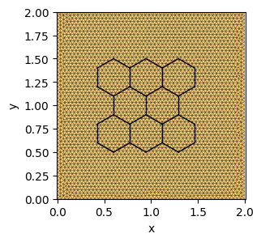
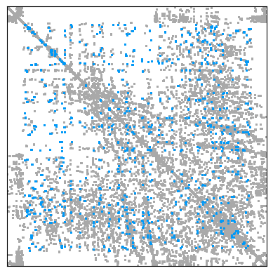
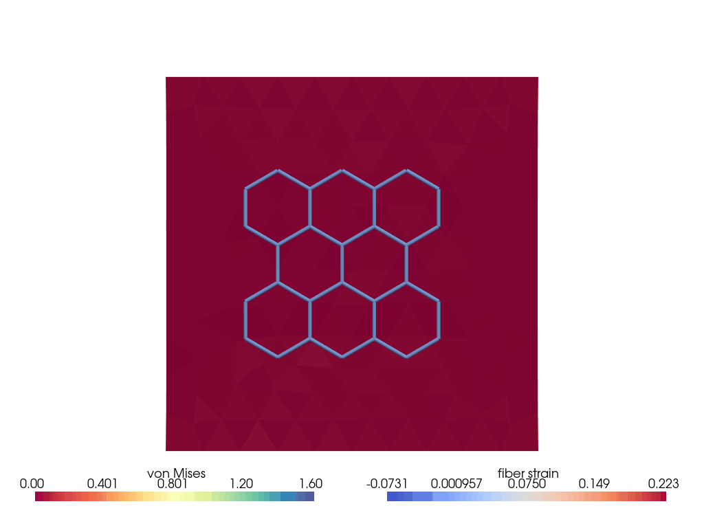

---
tags:
  - sparse-ad
  - mixed-dimension
---

<div class="nb-header"><a href="https://colab.research.google.com/github/smec-ethz/tatva-docs/blob/main/notebooks/examples/soft_hydrogel.ipynb" target="_blank"></a><a href="/assets/notebooks/examples/soft_hydrogel.ipynb" download="soft_hydrogel.ipynb" class="nb-download-btn"><svg class="nb-download-icon" viewBox="0 0 24 24" xmlns="http://www.w3.org/2000/svg"><path d="M12 16l-6-6 1.41-1.41L11 13.17V4h2v9.17l3.59-3.58L18 11l-6 6z"/><path d="M5 18h14v2H5z"/></svg> Download</a></div>

# Embedded 1D Fibers


??? example "Colab Setup (Install Dependencies)"
    ```python
    
    # Only run this if we are in Google Colab
    if 'google.colab' in str(get_ipython()):
        print("Installing dependencies using uv...")
        # Install uv if not available
        !pip install -q uv
        # Install system dependencies
        !apt-get install -qq gmsh
        # Use uv to install Python dependencies
        !uv pip install --system matplotlib meshio
        !uv pip install --system "git+https://github.com/smec-ethz/tatva-docs.git"
        print("Installation complete!")
    else:
        import pyvista as pv
    ```

we consider a fiber-reinforced composite in which stiff 1D fibers are embedded in a soft 2D soft material. A central difficulty in such problems is that the fiber geometry typically does not align with the bulk mesh. The fibers may intersect bulk elements at arbitrary positions and orientations. In this example, we use an embedded-element approach formulated entirely at the level of the total potential energy.


```python
import jax


from typing import NamedTuple

import jax.numpy as jnp
from jax import Array
from jax_autovmap import autovmap

from tatva import Mesh, Operator, compound, element, lifter, sparse

jax.config.update("jax_enable_x64", True)  # use double-precision
```


??? example "Mesh Generation"
    ```python
    
    import os
    
    import gmsh
    import matplotlib.pyplot as plt
    import meshio
    import numpy as np
    
    
    def generate_plate_mesh(
        Lx: float, Ly: float, mesh_size: float, work_dir: str = "."
    ) -> Mesh:
        """
        Generates a 2D unstructured triangular mesh for a rectangular plate.
    
        Args:
            Lx (float): Length of the plate in the x-direction.
            Ly (float): Length of the plate in the y-direction.
            mesh_size (float): Target mesh size for the mesh generation.
            work_dir (str): Directory to store temporary mesh files.
    
        Returns:
            Mesh: The generated plate mesh.
        """
        if not os.path.exists(work_dir):
            os.makedirs(work_dir)
    
        filename = os.path.join(work_dir, "plate_2d.msh")
    
        gmsh.initialize()
        gmsh.model.add("plate")
    
        p1 = gmsh.model.geo.addPoint(0, 0, 0, mesh_size)
        p2 = gmsh.model.geo.addPoint(Lx, 0, 0, mesh_size)
        p3 = gmsh.model.geo.addPoint(Lx, Ly, 0, mesh_size)
        p4 = gmsh.model.geo.addPoint(0, Ly, 0, mesh_size)
    
        l1 = gmsh.model.geo.addLine(p1, p2)
        l2 = gmsh.model.geo.addLine(p2, p3)
        l3 = gmsh.model.geo.addLine(p3, p4)
        l4 = gmsh.model.geo.addLine(p4, p1)
    
        loop = gmsh.model.geo.addCurveLoop([l1, l2, l3, l4])
        _ = gmsh.model.geo.addPlaneSurface([loop])
    
        # 2. Mesh Generation
        gmsh.model.geo.synchronize()
        gmsh.model.mesh.generate(2)
        gmsh.write(filename)
        gmsh.finalize()
    
        # 3. Read back with meshio
        m = meshio.read(filename)
        if os.path.exists(filename):
            os.remove(filename)
    
        points = m.points[:, :2]  # Drop z-coordinate for 2D
        triangles = m.cells_dict["triangle"]
    
        return Mesh(points, triangles)
    
    
    def generate_honeycomb_mesh(
        start_x: float,
        start_y: float,
        n_x: int,
        n_y: int,
        side_length: float,
        segments_per_side: int = 1,
    ) -> Mesh:
        """
        Generates a 2D honeycomb mesh (hexagonal grid) with specified parameters.
        Each hexagon side can be subdivided into smaller segments.
    
        Args:
            start_x (float): Starting x-coordinate of the honeycomb grid.
            start_y (float): Starting y-coordinate of the honeycomb grid.
            n_x (int): Number of hexagons along the x-direction.
            n_y (int): Number of hexagons along the y-direction.
            side_length (float): Length of each side of the hexagon.
            segments_per_side (int): Number of subdivisions per hexagon side.
    
        Returns:
            Mesh: The generated honeycomb mesh.
        """
    
        dx = np.sqrt(3) * side_length
        dy = 1.5 * side_length
        row_offset = (np.sqrt(3) * side_length) / 2.0
    
        node_map = {}
        coords_list = []
        lines_list = []
        edge_set = set()
    
        def get_or_create_node(x, y):
            key = (round(x, 6), round(y, 6))
            if key not in node_map:
                idx = len(coords_list)
                coords_list.append([x, y])
                node_map[key] = idx
                return idx
            return node_map[key]
    
        angles = np.deg2rad([30, 90, 150, 210, 270, 330])
    
        for row in range(n_y):
            cols_in_this_row = n_x if (row % 2 == 0) else (n_x - 1)
            current_offset = 0.0 if (row % 2 == 0) else row_offset
    
            for col in range(cols_in_this_row):
                cx = start_x + (col * dx) + current_offset
                cy = start_y + (row * dy)
    
                corners = []
                for theta in angles:
                    vx = cx + side_length * np.cos(theta)
                    vy = cy + side_length * np.sin(theta)
                    corners.append((vx, vy))
    
                for k in range(6):
                    # Start and End coordinates of the current side
                    start_pt = np.array(corners[k])
                    end_pt = np.array(corners[(k + 1) % 6])
    
                    # Get the Node Index for the start of the side
                    current_node_idx = get_or_create_node(start_pt[0], start_pt[1])
    
                    # Vector along the side
                    side_vector = end_pt - start_pt
    
                    for i in range(1, segments_per_side + 1):
                        # Calculate fraction of distance (e.g., 1/3, 2/3, 3/3)
                        t = i / segments_per_side
    
                        # Calculate next coordinate
                        next_pt = start_pt + t * side_vector
    
                        # Get index for this new point
                        next_node_idx = get_or_create_node(next_pt[0], next_pt[1])
    
                        # Create the small segment
                        edge_key = tuple(sorted((current_node_idx, next_node_idx)))
                        if edge_key not in edge_set:
                            edge_set.add(edge_key)
                            lines_list.append([current_node_idx, next_node_idx])
    
                        # Move forward
                        current_node_idx = next_node_idx
    
        return Mesh(np.array(coords_list), np.array(lines_list))
    ```


```python
plate_mesh = generate_plate_mesh(Lx=Lx, Ly=Ly, mesh_size=0.04)
n_nodes = plate_mesh.coords.shape[0]
n_dofs_per_node = 2  
n_dofs = n_nodes * n_dofs_per_node

fiber_mesh = generate_honeycomb_mesh(
    start_x=0.6, start_y=0.7, n_x=3, n_y=3, side_length=0.2, segments_per_side=3
)
```

??? info "Output"
    Info    : Meshing 1D...
        Info    : [  0%] Meshing curve 1 (Line)
        Info    : [ 30%] Meshing curve 2 (Line)
        Info    : [ 60%] Meshing curve 3 (Line)
        Info    : [ 80%] Meshing curve 4 (Line)
        Info    : Done meshing 1D (Wall 0.000292872s, CPU 0.000414s)
        Info    : Meshing 2D...
        Info    : Meshing surface 1 (Plane, Frontal-Delaunay)
        Info    : Done meshing 2D (Wall 0.0697915s, CPU 0.068195s)
        Info    : 3013 nodes 6028 elements
        Info    : Writing './plate_2d.msh'...
        Info    : Done writing './plate_2d.msh'


??? example "Visualize Meshes"
    ```python
    
    plt.figure(figsize=(3, 3))
    ax = plt.gca()
    
    ax.tripcolor(
        plate_mesh.coords[:, 0],
        plate_mesh.coords[:, 1],
        plate_mesh.elements,
        facecolors=jnp.ones(plate_mesh.elements.shape[0]),
        edgecolors="k",
        cmap="managua",
        lw=0.2,
    )
    
    for i, el in enumerate(fiber_mesh.elements):
        p0 = fiber_mesh.coords[el[0]]
        p1 = fiber_mesh.coords[el[1]]
        ax.plot(
            [p0[0], p1[0]],
            [p0[1], p1[1]],
            "k-",
            lw=1,
        )
    
    ax.set_xlabel("x")
    ax.set_ylabel("y")
    ax.axis("equal")
    ax.margins(0.0, 0.0)
    plt.show()
    ```


    


We define two operator one for the bulk material which consists of `Tri3` elements and one for fibers which are 1D elements emebeded in 2D space. For this we define a new elemenr `Line2in3D` which takes the displacements defined in 2D or 3D space and then project this displacement along its tangent vector.


??? example "Define Custom Line Element in 3D for Fiber Representation"
    ```python
    
    class SpringElement(element.Line2):
        """
        A 2-node linear element embedded in 3D space.
        Reference domain: [-1, 1]
        """
    
        def shape_function(self, xi: Array) -> Array:
            return jnp.array([0.5 * (1.0 - xi[0]), 0.5 * (1.0 + xi[0])])
    
        def shape_function_derivative(self, xi: Array) -> Array:
            return jnp.array([[-0.5, 0.5]])
    
        def get_jacobian(self, xi: Array, nodal_coords: Array) -> tuple[Array, Array]:
            """
            nodal_coords: (2, 3) -> Two nodes in 3D space
            """
            dN_dxi = self.shape_function_derivative(xi)
    
            J_vec = dN_dxi @ nodal_coords  # (1, 2) @ (2, 3) -> (1, 3)
    
            detJ = jnp.linalg.norm(J_vec)
            return J_vec, detJ
    
        def gradient(self, xi: Array, nodal_values: Array, nodal_coords: Array) -> Array:
            """
            Returns the 3D Gradient vector.
            """
            J_vec, detJ = self.get_jacobian(xi, nodal_coords)
            dN_dxi = self.shape_function_derivative(xi)
            du_dxi = dN_dxi @ nodal_values
    
            du_ds = du_dxi / detJ
    
            tangent = J_vec / detJ
            grad_u_3d = jnp.vdot(du_ds, tangent)
    
            return grad_u_3d
    ```


```python
op_plate = Operator(plate_mesh, element.Tri3())
op_line = Operator(fiber_mesh, SpringElement())
```

We now find the bulk material elements that contain the nodes of each fiber and then map these nodes to the quadrature points of that element. We use `Operator.make_interpolater` to do this.


```python
interpolater = op_plate.make_interpolate(fiber_mesh.coords)
```

## Defining the energy for the bulk material


```python
@autovmap(grad_u=2)
def compute_deformation_gradient(grad_u):
    I = jnp.eye(2)
    F = I + grad_u
    return F


@autovmap(F=2, mu=0, lmbda=0)
def strain_energy(F, mu, lmbda):
    C = F.T @ F
    I1 = jnp.trace(C)
    J = jnp.linalg.det(F)
    # return mu / 2 * (I1 - 3) - lmbda * jnp.log(J) + (lmbda / 2) * (jnp.log(J)) ** 2
    return 0.5 * mu * (I1 - 2 - 2 * jnp.log(J)) + (lmbda / 2) * (jnp.log(J)) ** 2


@jax.jit
def total_material_energy(u: Array) -> Array:
    u_grad = op_plate.grad(u)
    F = compute_deformation_gradient(u_grad)
    energy_density = strain_energy(F, mat.mu, mat.lmbda)
    return op_plate.integrate(energy_density)


@autovmap(grad_u=0)
def compute_fiber_energy(grad_u):
    return 0.5 * E_fiber * jnp.dot(grad_u, grad_u) * Area_fiber
```


```python
class Material(NamedTuple):
    """Material properties for the elasticity operator."""

    mu: float  # Diffusion coefficient
    lmbda: float  # Diffusion coefficient


mat = Material(mu=1, lmbda=10.0)

E = mat.mu * (3 * mat.lmbda + 2 * mat.mu) / (mat.lmbda + mat.mu)
print(f"Effective Young's Modulus of the Plate: E = {E:.2f}")
```

    Effective Young's Modulus of the Plate: E = 2.91


## Defining energy for the fiber network

We now compute the energy of the fibe network which defined as 

$$
\psi_\text{fiber}(\varepsilon_\text{fiber}) = \frac{1}{2}E_\text{fiber}A_\text{fiber} \varepsilon_\text{fiber}^2
$$


```python
E_fiber = 100 * E  # Much stiffer than bulk
Area_fiber = 0.01
```


```python
p0 = fiber_mesh.coords[fiber_mesh.elements[:, 0]]
p1 = fiber_mesh.coords[fiber_mesh.elements[:, 1]]
vecs = p1 - p0
lengths = np.linalg.norm(vecs, axis=1)
tangents = vecs / lengths[:, None]  # Unit vectors (N_seg, 2)

fiber_L0 = jnp.array(lengths)
fiber_tangents = jnp.array(tangents)
```


```python
@jax.jit
def fiber_strain_energy(
    u: Array,
) -> Array:
    u_at_nodes = interpolater(u)
    u_grad = op_line.grad(u_at_nodes)  # (N_seg, 1, 2)
    energy_density = compute_fiber_energy(u_grad)  # (N_seg,)
    return op_line.integrate(energy_density)

```

## Coupling the energies

$$
\Psi(\boldsymbol{u}) = \underbrace{\int_{\Omega_{\text{bulk}}} \psi_\varepsilon(\nabla \boldsymbol{u}) ~\mathrm{d\Omega}}_{\Psi_\mathrm{bulk}} + \underbrace{\int_{\Gamma_{\text{fiber}}} \psi_{\text{fiber}}(\epsilon_{\text{fiber}})~ \mathrm{dS}}_{\Psi_{\text{fiber}}}
$$


```python
@jax.jit
def total_energy(u_flat: Array) -> float:
    (u,) = Solution(u_flat)
    U_plate = total_material_energy(u)
    U_fiber = fiber_strain_energy(u)
    return U_fiber + U_plate
```

## Applying boundary conditions

We apply uniaxial tension to the bulk material.


```python
y_max = jnp.max(plate_mesh.coords[:, 1])
y_min = jnp.min(plate_mesh.coords[:, 1])
x_min = jnp.min(plate_mesh.coords[:, 0])
height = y_max - y_min


upper_nodes = jnp.where(jnp.isclose(plate_mesh.coords[:, 1], y_max))[0]
lower_nodes = jnp.where(jnp.isclose(plate_mesh.coords[:, 1], y_min))[0]


class Solution(compound.Compound):
    u = compound.field(
        shape=(plate_mesh.coords.shape[0], 2), field_type=compound.FieldType.NODAL
    )


lifter_plate = lifter.Lifter(
    Solution.size,
    lifter.Fixed(Solution.u[upper_nodes, 0], 0.0),
    lifter.Fixed(Solution.u[lower_nodes, :], 0.0),
    lifter.Fixed(Solution.u[upper_nodes, 1], lifter.RuntimeValue("top_disp", 0.0)),
)
```

## Defining Free Energy


```python
def total_energy_free(u_free: Array, lifter: lifter.Lifter):
    u_full = lifter.lift_from_zeros(u_free)
    return total_energy(u_full)


total_energy_free(jnp.zeros(lifter_plate.size_reduced), lifter_plate)  # Test call
```


    Array(0., dtype=float64)


## Sparse Differentiation to construct the $K$


```python
gradient = jax.grad(total_energy_free, argnums=0)

sparsity_pattern = sparse.pattern_from_energy(
    total_energy_free, lifter_plate.size_reduced, lifter_plate
)
sparsity_pattern_mesh = sparse.pattern_from_mesh(plate_mesh, n_dofs_per_node=2)
sparsity_pattern_mesh = lifter_plate.adapt_sparsity(sparsity_pattern_mesh)

cm = sparse.ColoredMatrix.from_csr(sparsity_pattern)
n_colors = int(cm.colors.max() + 1)
print(n_colors)

hessian_fn = sparse.jacfwd(gradient, colored_matrix=cm, color_batch_size=n_colors)
hessian_fn = jax.jit(hessian_fn)
```

    42


```python

import matplotlib.pyplot as plt

ax = plt.axes()
plt.spy(
    sparsity_pattern_mesh.toarray(),
    markersize=1,
    color="darkgray",
    markeredgecolor="darkgray",
)
plt.spy(
    sparsity_pattern.toarray() - sparsity_pattern_mesh.toarray(),
    markersize=1,
    markeredgecolor="#009AF9",
)


ax.set_xticks([])
ax.set_yticks([])

plt.show()
```


    

    


??? example "Newton-Solver with sparse solver"
    ```python
    
    def newton_krylov_solver(
        u,
        fext,
        lifter_plate: lifter.Lifter,
    ):
        fint = gradient(u, lifter_plate)
        iiter = 0
        norm_res = 1.0
        tol = 1e-8
        max_iter = 80
        while norm_res > tol and iiter < max_iter:
            residual = fext - fint
            A = hessian_fn(u, lifter_plate)
            du = jax.experimental.sparse.linalg.spsolve(
                A.data, A.indices, A.indptr, residual
            )
            u = u.at[:].add(du)
    
            fint = gradient(u, lifter_plate)
            residual = fext - fint
            norm_res = jnp.linalg.norm(residual)
    
            print(f"  Residual: {norm_res:.2e}")
            iiter += 1
        return u, norm_res
    ```


```python
fext = jnp.zeros(lifter_plate.size_reduced)


n_steps = 50
applied_displacement = height * 0.2 / n_steps

u_sol_per_step = []

for i in range(n_steps):
    lifter_plate = lifter_plate.at["top_disp"].set((i + 1) * applied_displacement)

    u_new, rnorm = newton_krylov_solver(u_prev, fext, lifter_plate=lifter_plate)

    u_prev = u_new
    u_full = lifter_plate.lift_from_zeros(u_prev)
    u_sol_per_step.append(u_full)

    print(f"Iteration {i}: Residual Norm = {rnorm:.4e}")
```

??? info "Output"
    Residual: 2.77e-01
          Residual: 2.49e-02
          Residual: 2.63e-04
          Residual: 4.45e-08
          Residual: 4.74e-15
        Iteration 0: Residual Norm = 4.7447e-15
          Residual: 2.75e-01
          Residual: 2.46e-02
          Residual: 2.57e-04
          Residual: 4.21e-08
          Residual: 4.71e-15
        Iteration 1: Residual Norm = 4.7133e-15
          Residual: 2.73e-01
          Residual: 2.43e-02
          Residual: 2.52e-04
          Residual: 3.98e-08
          Residual: 4.69e-15
        Iteration 2: Residual Norm = 4.6920e-15
          Residual: 2.71e-01
          Residual: 2.41e-02
          Residual: 2.46e-04
          Residual: 3.77e-08
          Residual: 4.77e-15
        Iteration 3: Residual Norm = 4.7739e-15
          Residual: 2.69e-01
          Residual: 2.38e-02
          Residual: 2.41e-04
          Residual: 3.58e-08
          Residual: 4.89e-15
        Iteration 4: Residual Norm = 4.8948e-15
          Residual: 2.67e-01
          Residual: 2.35e-02
          Residual: 2.36e-04
          Residual: 3.40e-08
          Residual: 5.13e-15
        Iteration 5: Residual Norm = 5.1254e-15
          Residual: 2.66e-01
          Residual: 2.33e-02
          Residual: 2.31e-04
          Residual: 3.24e-08
          Residual: 5.24e-15
        Iteration 6: Residual Norm = 5.2382e-15
          Residual: 2.64e-01
          Residual: 2.30e-02
          Residual: 2.26e-04
          Residual: 3.08e-08
          Residual: 5.46e-15
        Iteration 7: Residual Norm = 5.4569e-15
          Residual: 2.62e-01
          Residual: 2.28e-02
          Residual: 2.21e-04
          Residual: 2.94e-08
          Residual: 6.04e-15
        Iteration 8: Residual Norm = 6.0375e-15
          Residual: 2.60e-01
          Residual: 2.26e-02
          Residual: 2.17e-04
          Residual: 2.80e-08
          Residual: 6.35e-15
        Iteration 9: Residual Norm = 6.3468e-15
          Residual: 2.58e-01
          Residual: 2.23e-02
          Residual: 2.13e-04
          Residual: 2.68e-08
          Residual: 6.69e-15
        Iteration 10: Residual Norm = 6.6873e-15
          Residual: 2.57e-01
          Residual: 2.21e-02
          Residual: 2.09e-04
          Residual: 2.56e-08
          Residual: 7.21e-15
        Iteration 11: Residual Norm = 7.2092e-15
          Residual: 2.55e-01
          Residual: 2.19e-02
          Residual: 2.05e-04
          Residual: 2.45e-08
          Residual: 7.30e-15
        Iteration 12: Residual Norm = 7.2986e-15
          Residual: 2.53e-01
          Residual: 2.17e-02
          Residual: 2.01e-04
          Residual: 2.35e-08
          Residual: 7.33e-15
        Iteration 13: Residual Norm = 7.3292e-15
          Residual: 2.52e-01
          Residual: 2.14e-02
          Residual: 1.97e-04
          Residual: 2.26e-08
          Residual: 7.98e-15
        Iteration 14: Residual Norm = 7.9768e-15
          Residual: 2.50e-01
          Residual: 2.12e-02
          Residual: 1.94e-04
          Residual: 2.17e-08
          Residual: 8.71e-15
        Iteration 15: Residual Norm = 8.7135e-15
          Residual: 2.49e-01
          Residual: 2.10e-02
          Residual: 1.90e-04
          Residual: 2.08e-08
          Residual: 9.19e-15
        Iteration 16: Residual Norm = 9.1940e-15
          Residual: 2.47e-01
          Residual: 2.08e-02
          Residual: 1.87e-04
          Residual: 2.01e-08
          Residual: 9.96e-15
        Iteration 17: Residual Norm = 9.9569e-15
          Residual: 2.45e-01
          Residual: 2.06e-02
          Residual: 1.84e-04
          Residual: 1.93e-08
          Residual: 1.02e-14
        Iteration 18: Residual Norm = 1.0230e-14
          Residual: 2.44e-01
          Residual: 2.04e-02
          Residual: 1.81e-04
          Residual: 1.86e-08
          Residual: 1.04e-14
        Iteration 19: Residual Norm = 1.0381e-14
          Residual: 2.42e-01
          Residual: 2.02e-02
          Residual: 1.78e-04
          Residual: 1.80e-08
          Residual: 1.07e-14
        Iteration 20: Residual Norm = 1.0665e-14
          Residual: 2.41e-01
          Residual: 2.01e-02
          Residual: 1.75e-04
          Residual: 1.74e-08
          Residual: 1.13e-14
        Iteration 21: Residual Norm = 1.1253e-14
          Residual: 2.40e-01
          Residual: 1.99e-02
          Residual: 1.72e-04
          Residual: 1.68e-08
          Residual: 1.08e-14
        Iteration 22: Residual Norm = 1.0810e-14
          Residual: 2.38e-01
          Residual: 1.97e-02
          Residual: 1.69e-04
          Residual: 1.63e-08
          Residual: 1.24e-14
        Iteration 23: Residual Norm = 1.2413e-14
          Residual: 2.37e-01
          Residual: 1.95e-02
          Residual: 1.67e-04
          Residual: 1.58e-08
          Residual: 1.20e-14
        Iteration 24: Residual Norm = 1.1975e-14
          Residual: 2.35e-01
          Residual: 1.93e-02
          Residual: 1.64e-04
          Residual: 1.53e-08
          Residual: 1.34e-14
        Iteration 25: Residual Norm = 1.3373e-14
          Residual: 2.34e-01
          Residual: 1.92e-02
          Residual: 1.62e-04
          Residual: 1.48e-08
          Residual: 1.32e-14
        Iteration 26: Residual Norm = 1.3175e-14
          Residual: 2.33e-01
          Residual: 1.90e-02
          Residual: 1.59e-04
          Residual: 1.44e-08
          Residual: 1.29e-14
        Iteration 27: Residual Norm = 1.2864e-14
          Residual: 2.31e-01
          Residual: 1.88e-02
          Residual: 1.57e-04
          Residual: 1.40e-08
          Residual: 1.29e-14
        Iteration 28: Residual Norm = 1.2860e-14
          Residual: 2.30e-01
          Residual: 1.87e-02
          Residual: 1.55e-04
          Residual: 1.36e-08
          Residual: 1.37e-14
        Iteration 29: Residual Norm = 1.3660e-14
          Residual: 2.29e-01
          Residual: 1.85e-02
          Residual: 1.52e-04
          Residual: 1.33e-08
          Residual: 1.35e-14
        Iteration 30: Residual Norm = 1.3472e-14
          Residual: 2.27e-01
          Residual: 1.84e-02
          Residual: 1.50e-04
          Residual: 1.30e-08
          Residual: 1.39e-14
        Iteration 31: Residual Norm = 1.3900e-14
          Residual: 2.26e-01
          Residual: 1.82e-02
          Residual: 1.48e-04
          Residual: 1.27e-08
          Residual: 1.56e-14
        Iteration 32: Residual Norm = 1.5554e-14
          Residual: 2.25e-01
          Residual: 1.81e-02
          Residual: 1.46e-04
          Residual: 1.24e-08
          Residual: 1.63e-14
        Iteration 33: Residual Norm = 1.6259e-14
          Residual: 2.24e-01
          Residual: 1.79e-02
          Residual: 1.44e-04
          Residual: 1.21e-08
          Residual: 1.60e-14
        Iteration 34: Residual Norm = 1.5969e-14
          Residual: 2.23e-01
          Residual: 1.78e-02
          Residual: 1.43e-04
          Residual: 1.19e-08
          Residual: 1.75e-14
        Iteration 35: Residual Norm = 1.7458e-14
          Residual: 2.21e-01
          Residual: 1.77e-02
          Residual: 1.41e-04
          Residual: 1.16e-08
          Residual: 1.71e-14
        Iteration 36: Residual Norm = 1.7066e-14
          Residual: 2.20e-01
          Residual: 1.75e-02
          Residual: 1.39e-04
          Residual: 1.14e-08
          Residual: 1.77e-14
        Iteration 37: Residual Norm = 1.7716e-14
          Residual: 2.19e-01
          Residual: 1.74e-02
          Residual: 1.38e-04
          Residual: 1.12e-08
          Residual: 1.76e-14
        Iteration 38: Residual Norm = 1.7566e-14
          Residual: 2.18e-01
          Residual: 1.72e-02
          Residual: 1.36e-04
          Residual: 1.10e-08
          Residual: 1.82e-14
        Iteration 39: Residual Norm = 1.8217e-14
          Residual: 2.17e-01
          Residual: 1.71e-02
          Residual: 1.34e-04
          Residual: 1.09e-08
          Residual: 1.95e-14
        Iteration 40: Residual Norm = 1.9522e-14
          Residual: 2.16e-01
          Residual: 1.70e-02
          Residual: 1.33e-04
          Residual: 1.07e-08
          Residual: 1.97e-14
        Iteration 41: Residual Norm = 1.9704e-14
          Residual: 2.15e-01
          Residual: 1.69e-02
          Residual: 1.32e-04
          Residual: 1.06e-08
          Residual: 1.99e-14
        Iteration 42: Residual Norm = 1.9866e-14
          Residual: 2.14e-01
          Residual: 1.68e-02
          Residual: 1.30e-04
          Residual: 1.05e-08
          Residual: 2.04e-14
        Iteration 43: Residual Norm = 2.0404e-14
          Residual: 2.12e-01
          Residual: 1.66e-02
          Residual: 1.29e-04
          Residual: 1.04e-08
          Residual: 2.01e-14
        Iteration 44: Residual Norm = 2.0149e-14
          Residual: 2.11e-01
          Residual: 1.65e-02
          Residual: 1.28e-04
          Residual: 1.03e-08
          Residual: 2.08e-14
        Iteration 45: Residual Norm = 2.0827e-14
          Residual: 2.10e-01
          Residual: 1.64e-02
          Residual: 1.27e-04
          Residual: 1.02e-08
          Residual: 2.14e-14
        Iteration 46: Residual Norm = 2.1355e-14
          Residual: 2.09e-01
          Residual: 1.63e-02
          Residual: 1.26e-04
          Residual: 1.02e-08
          Residual: 2.42e-14
        Iteration 47: Residual Norm = 2.4154e-14
          Residual: 2.08e-01
          Residual: 1.62e-02
          Residual: 1.25e-04
          Residual: 1.02e-08
          Residual: 2.29e-14
        Iteration 48: Residual Norm = 2.2869e-14
          Residual: 2.07e-01
          Residual: 1.61e-02
          Residual: 1.24e-04
          Residual: 1.02e-08
          Residual: 2.35e-14
        Iteration 49: Residual Norm = 2.3507e-14


```python

```

## Visualization

We now visualize the deformation of the bulk material and the embedded fibres.


??? example "Post-processing and Visualization"
    ```python
    
    import pyvista as pv
    
    
    def set_size(fraction=1, height_ratio="golden", width="two-column", subplots=(1, 1)):
        if width == "two-column":
            width_pt = 180  # mm
        elif width == "one-column":
            width_pt = 90  # mm
        else:
            width_pt = width
    
        if height_ratio == "golden":
            ratio_pt = (np.sqrt(5) - 1.0) / 2.0
        else:
            ratio_pt = height_ratio
    
        fig_width_pt = width_pt * fraction
        inches_per_pt = 1.0 / 25.4
        fig_width_in = fig_width_pt * inches_per_pt
        fig_height_in = fig_width_in * ratio_pt * (subplots[0] / subplots[1])
        fig_dim = (fig_width_in, fig_height_in)
    
        return fig_dim
    
    
    def get_pv_grid(mesh: Mesh) -> pv.UnstructuredGrid:
        """Convert Tatva mesh to PyVista UnstructuredGrid."""
        if mesh.coords.shape[1] == 2:
            pv_points = np.hstack((mesh.coords, np.zeros(shape=(mesh.coords.shape[0], 1))))
        else:
            pv_points = np.array(mesh.coords)
        cells = np.hstack(
            [
                np.full((mesh.elements.shape[0], 1), 3, dtype=np.int64),
                np.array(mesh.elements, dtype=np.int64),
            ]
        )
        grid = pv.UnstructuredGrid(
            cells, np.full(mesh.elements.shape[0], pv.CellType.TRIANGLE), pv_points
        )
        return grid
    
    
    def find_domain_boundary(elements):
        # 1. Get all edges (3 per triangle)
        edges = np.concatenate(
            [elements[:, [0, 1]], elements[:, [1, 2]], elements[:, [2, 0]]], axis=0
        )
    
        # 2. Sort node IDs within each edge to handle directionality
        edges_sorted = np.sort(edges, axis=1)
    
        # 3. Find unique edges and their counts
        unique_edges, indices, counts = np.unique(
            edges_sorted, axis=0, return_index=True, return_counts=True
        )
    
        # 4. Boundary edges are those that appear only once
        boundary_edges = edges[indices[counts == 1]]
    
        return boundary_edges
    
    
    def get_pv_line_grid(mesh: Mesh) -> pv.PolyData:
        """Convert a Line2 (segment) Tatva mesh to a PyVista PolyData of lines."""
        coords = np.asarray(mesh.coords)
        if coords.shape[1] == 2:
            pv_points = np.hstack((coords, np.zeros((coords.shape[0], 1))))
        else:
            pv_points = coords
        elems = np.asarray(mesh.elements, dtype=np.int64)
        # VTK line connectivity: [n_points_in_cell, id0, id1, ...] per cell
        lines = np.hstack([np.full((elems.shape[0], 1), 2, dtype=np.int64), elems])
        return pv.PolyData(pv_points, lines=lines)
    
    
    def _pad3(u: Array) -> np.ndarray:
        """Pad a 2D nodal (n, 2) field to (n, 3) so it can warp PyVista points."""
        u = np.asarray(u)
        return np.hstack([u, np.zeros((u.shape[0], 1))])
    
    
    def _neo_hookean_energy(F: Array) -> Array:
        """Scalar strain-energy density for a single 2x2 deformation gradient."""
        C = F.T @ F
        I1 = jnp.trace(C)
        J = jnp.linalg.det(F)
        return (
            0.5 * mat.mu * (I1 - 2 - 2 * jnp.log(J)) + (mat.lmbda / 2) * (jnp.log(J)) ** 2
        )
    
    
    @autovmap(F=2)
    def von_mises_from_F(F: Array) -> Array:
        """In-plane von Mises stress from the Cauchy stress sigma = J^-1 P F^T."""
        P = jax.grad(_neo_hookean_energy)(F)  # 1st Piola-Kirchhoff (2, 2)
        J = jnp.linalg.det(F)
        sigma = (P @ F.T) / J  # Cauchy stress (2, 2)
        sxx, syy, sxy = sigma[0, 0], sigma[1, 1], sigma[0, 1]
        return jnp.sqrt(sxx**2 - sxx * syy + syy**2 + 3 * sxy**2)
    
    
    def plate_von_mises(u2d: Array) -> np.ndarray:
        """Per-element (per quadrature point) von Mises stress for a nodal field."""
        grad_u = op_plate.grad(u2d)
        F = compute_deformation_gradient(grad_u)
        return np.asarray(von_mises_from_F(F)).reshape(-1)
    
    
    def animate_deformation(
        save_gif: str | None = None,
        plate_cmap: str = "viridis",
        fiber_cmap: str = "magma",
    ):
        """Step through ``u_sol_per_step``, warping the plate and fibers.
    
        With ``save_gif`` a GIF is written; otherwise an interactive window opens
        with a slider to scrub through the load steps. Colour limits are fixed to
        the global range so steps are directly comparable.
        """
        plate_grid = get_pv_grid(plate_mesh)
        fiber_grid = get_pv_line_grid(fiber_mesh)
        plate_pts0 = plate_grid.points.copy()
        fiber_pts0 = fiber_grid.points.copy()
    
        # lift_from_zeros returns a flat DOF vector; reshape to (n_nodes, 2).
        u2d_steps = [
            jnp.asarray(u).reshape(plate_mesh.coords.shape[0], 2) for u in u_sol_per_step
        ]
    
        # Precompute per-step warp fields and scalars.
        plate_disp = [_pad3(u) for u in u2d_steps]
        plate_vm = [plate_von_mises(u) for u in u2d_steps]  # per-element von Mises
        fiber_disp = [_pad3(interpolater(u)) for u in u2d_steps]
        fiber_strain = [
            np.asarray(op_line.grad(interpolater(u)).flatten()) for u in u2d_steps
        ]
    
        plate_clim = [0.0, float(max(s.max() for s in plate_vm))]
        fiber_clim = [
            float(min(s.min() for s in fiber_strain)),
            float(max(s.max() for s in fiber_strain)),
        ]
    
        def set_step(i):
            i = int(round(i))
            plate_grid.points = plate_pts0 + plate_disp[i]
            plate_grid["von Mises"] = plate_vm[i]
            fiber_grid.points = fiber_pts0 + fiber_disp[i]
            fiber_grid["strain"] = fiber_strain[i]
    
        pl = pv.Plotter(off_screen=save_gif is not None)
        set_step(0)
        pl.add_mesh(
            plate_grid,
            scalars="von Mises",
            cmap=plate_cmap,
            clim=plate_clim,
            show_edges=False,
            edge_color="gray",
            line_width=0.0,
            scalar_bar_args={
                "title": "von Mises",
                "vertical": False,
                "position_x": 0.05,
                "position_y": 0.05,
                "width": 0.4,
                "height": 0.05,
            },
        )
        pl.add_mesh(
            fiber_grid,
            scalars="strain",
            cmap=fiber_cmap,
            clim=fiber_clim,
            line_width=6,
            render_lines_as_tubes=True,
            scalar_bar_args={
                "title": "fiber strain",
                "vertical": False,
                "position_x": 0.55,
                "position_y": 0.05,
                "width": 0.4,
                "height": 0.05,
            },
        )
        pl.view_xy()
        pl.enable_parallel_projection()
    
        n = len(u_sol_per_step)
        if save_gif is not None:
            pl.open_gif(save_gif)
            for i in range(n):
                set_step(i)
                pl.write_frame()
            pl.close()
        else:
            pl.add_slider_widget(
                set_step,
                [0, n - 1],
                value=0,
                title="load step",
                fmt="%.0f",
            )
            pl.show()
        return pl
    ```


```python
animate_deformation(
    save_gif="soft_hydrogel.gif", plate_cmap="Spectral", fiber_cmap="coolwarm"
)
```


    <pyvista.plotting.plotter.Plotter at 0x7391e4604350>



