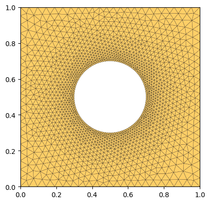
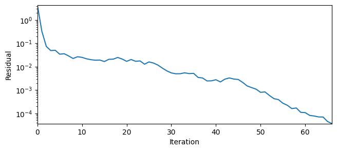
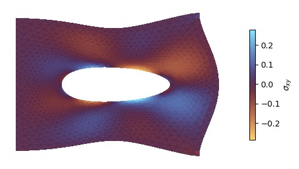

<div class="nb-header"><a href="https://colab.research.google.com/github/smec-ethz/tatva-docs/blob/main/notebooks/external_solvers/linear_elasticity_petsc4py.ipynb" target="_blank"></a><a href="/assets/notebooks/external_solvers/linear_elasticity_petsc4py.ipynb" download="linear_elasticity_petsc4py.ipynb" class="nb-download-btn"><svg class="nb-download-icon" viewBox="0 0 24 24" xmlns="http://www.w3.org/2000/svg"><path d="M12 16l-6-6 1.41-1.41L11 13.17V4h2v9.17l3.59-3.58L18 11l-6 6z"/><path d="M5 18h14v2H5z"/></svg> Download</a></div>

# Linear elasticity with PETSc

!!! info

    This example uses `PETSc` to solver the nonlinear problem. Please ensure that `petsc4py` is installed to run this example. 


In this notebook, we solve a linear elastic problem using `PETSc` based solvers.


```python
from typing import NamedTuple

import gmsh
import jax

jax.config.update("jax_enable_x64", True)

import jax.numpy as jnp
from jax import Array
from jax_autovmap import autovmap
from tatva import Mesh, Operator, sparse

from petsc4py import PETSc
```


??? example "Code for generating a plate with a hole and plotting the mesh"
    ```python
    
    import matplotlib.pyplot as plt
    from matplotlib.axes import Axes
    import meshio
    
    import numpy as np
    import os
    
    
    def plot_mesh(mesh: Mesh, ax: Axes | None = None) -> None:
        if ax is None:
            fig, ax = plt.subplots()
        ax.tripcolor(
            mesh.coords[:, 0],
            mesh.coords[:, 1],
            mesh.elements,
            facecolors=np.ones(len(mesh.elements)),
            cmap="managua",
            edgecolors="k",
            linewidth=0.2,
        )
       
        ax.set_aspect("equal")
        ax.margins(0.0)
    
    def generate_refined_plate_with_hole(
        width: float,
        height: float,
        hole_radius: float,
        mesh_size_fine: float,
        mesh_size_coarse: float,
    ):
        mesh_dir = os.path.join(os.getcwd(), "../meshes")
        os.makedirs(mesh_dir, exist_ok=True)
        output_filename = os.path.join(mesh_dir, "plate_hole_refined.msh")
    
        gmsh.initialize()
        gmsh.model.add("plate_with_hole_refined")
        occ = gmsh.model.occ
    
        rect = occ.addRectangle(0, 0, 0, width, height)
        cx = width / 2.0
        cy = height / 2.0
        disk = occ.addDisk(cx, cy, 0, hole_radius, hole_radius)
    
        out, _ = occ.cut([(2, rect)], [(2, disk)])
        occ.synchronize()
    
        surface_tag = out[0][1]
        gmsh.model.addPhysicalGroup(2, [surface_tag], 1, name="domain")
    
        boundaries = gmsh.model.getBoundary(out, oriented=False)
        boundary_tags = [b[1] for b in boundaries]
        gmsh.model.addPhysicalGroup(1, boundary_tags, 2, name="boundaries")
    
        hole_curve_tags = []
        for tag in boundary_tags:
            xmin, ymin, zmin, xmax, ymax, zmax = gmsh.model.getBoundingBox(1, tag)
            # The hole is completely inside the outer rectangle
            if xmin > 0 and xmax < width and ymin > 0 and ymax < height:
                hole_curve_tags.append(tag)
    
        gmsh.model.mesh.field.add("Distance", 1)
        gmsh.model.mesh.field.setNumbers(1, "CurvesList", hole_curve_tags)
        gmsh.model.mesh.field.setNumber(1, "NumPointsPerCurve", 100)
    
        gmsh.model.mesh.field.add("Threshold", 2)
        gmsh.model.mesh.field.setNumber(2, "InField", 1)
        gmsh.model.mesh.field.setNumber(2, "SizeMin", mesh_size_fine)
        gmsh.model.mesh.field.setNumber(2, "SizeMax", mesh_size_coarse)
        # Start growing the mesh exactly at the hole boundary
        gmsh.model.mesh.field.setNumber(2, "DistMin", 0.0)
        # Reach maximum element size at a distance equal to 2 hole radii away
        gmsh.model.mesh.field.setNumber(2, "DistMax", hole_radius * 2.0)
    
        gmsh.model.mesh.field.setAsBackgroundMesh(2)
    
        gmsh.option.setNumber("Mesh.MeshSizeExtendFromBoundary", 0)
        gmsh.option.setNumber("Mesh.MeshSizeFromPoints", 0)
        gmsh.option.setNumber("Mesh.MeshSizeFromCurvature", 0)
    
        gmsh.model.mesh.generate(2)
        gmsh.write(output_filename)
        gmsh.finalize()
    
        _mesh = meshio.read(output_filename)
        coords = _mesh.points[:, :2]
        elements = _mesh.cells_dict["triangle"]
    
        return Mesh(coords=coords, elements=elements)
    ```


```python
lx = 1.0
ly = 1.0
mesh = generate_refined_plate_with_hole(
    lx, ly, hole_radius=0.2, mesh_size_fine=0.01, mesh_size_coarse=0.05
)

n_dofs_per_node = 2
n_dofs = mesh.coords.shape[0] * n_dofs_per_node

plot_mesh(mesh)
```

    Info    : Meshing 1D...                                                                                                                        
    Info    : [  0%] Meshing curve 5 (Ellipse)
    Info    : [ 30%] Meshing curve 6 (Line)
    Info    : [ 50%] Meshing curve 7 (Line)
    Info    : [ 70%] Meshing curve 8 (Line)
    Info    : [ 90%] Meshing curve 9 (Line)
    Info    : Done meshing 1D (Wall 0.0274259s, CPU 0.022802s)
    Info    : Meshing 2D...
    Info    : Meshing surface 1 (Plane, Frontal-Delaunay)
    Info    : Done meshing 2D (Wall 0.0437901s, CPU 0.041577s)
    Info    : 1874 nodes 3753 elements
    Info    : Writing '/home/mohit/Documents/dev/tatva-docs/docs/external_solvers/../meshes/plate_hole_refined.msh'...
    Info    : Done writing '/home/mohit/Documents/dev/tatva-docs/docs/external_solvers/../meshes/plate_hole_refined.msh'
    


    

    


## Problem setup


```python
from tatva.element import Tri3

op = Operator(mesh, Tri3())


boundary_left = jnp.where(jnp.isclose(mesh.coords[:, 0], 0.0))[0]
boundary_right = jnp.where(jnp.isclose(mesh.coords[:, 0], lx))[0]
point_at_y_0 = jnp.where(
    jnp.isclose(mesh.coords[:, 0], lx) & jnp.isclose(mesh.coords[:, 1], 0.0)
)[0][0]
assert point_at_y_0

fixed_dofs = jnp.concatenate(
    [
        boundary_left * n_dofs_per_node,
    ]
)
free_dofs = jnp.setdiff1d(jnp.arange(n_dofs), fixed_dofs)

```

## Defining energy functional

We now define the functions to compute the total strain energy


```python
class Material(NamedTuple):
    """Material properties for the elasticity operator."""

    mu: float  
    lmbda: float

    @classmethod
    def from_youngs_poisson_2d(
        cls, E: float, nu: float, plane_stress: bool = False
    ) -> "Material":
        mu = E / 2 / (1 + nu)
        if plane_stress:
            lmbda = 2 * nu * mu / (1 - nu)
        else:
            lmbda = E * nu / (1 - 2 * nu) / (1 + nu)
        return cls(mu=mu, lmbda=lmbda)


mat = Material.from_youngs_poisson_2d(1, 0.3)


@autovmap(grad_u=2)
def compute_strain(grad_u):
    return 0.5 * (grad_u + grad_u.T)


@autovmap(eps=2, mu=0, lmbda=0)
def compute_stress(eps, mu, lmbda):
    return 2 * mu * eps + lmbda * jnp.trace(eps) * jnp.eye(2)


@autovmap(grad_u=2, mu=0, lmbda=0)
def strain_energy_density(grad_u, mu, lmbda):
    eps = compute_strain(grad_u)
    sigma = compute_stress(eps, mu, lmbda)
    return 0.5 * jnp.einsum("ij,ij->", sigma, eps)

```

## Enforcing boundary condition via static condensation


```python
@jax.jit
def total_energy_full(u_flat: Array) -> Array:
    """Compute the total energy of the system."""
    u = u_flat.reshape(-1, 2)
    u_grad = op.grad(u)
    e_density = strain_energy_density(u_grad, mat.mu, mat.lmbda)
    return op.integrate(e_density)


@jax.jit
def total_energy(u_free: Array, applied_disp: Array) -> Array:
    """Compute the total energy of the system."""
    u_full = jnp.zeros(n_dofs).at[free_dofs].set(u_free)
    u_full = u_full.at[fixed_dofs].set(applied_disp)
    return total_energy_full(u_full)


residual = jax.jacrev(total_energy)
```

Now we can define the `sparsity_pattern` and use `sparse.jacfwd` to create a function that computes the sparse stiffness matrix using sparse differentiation.


```python
nb_dofs_per_node = 2

sparsity_pattern = sparse.create_sparsity_pattern(
    mesh, n_dofs_per_node=nb_dofs_per_node
)

reduced_sparsity_pattern = sparse.reduce_sparsity_pattern(sparsity_pattern, free_dofs)

colored_matrix = sparse.ColoredMatrix.from_csr(reduced_sparsity_pattern)
```


```python
hessian_fn = sparse.jacfwd(
    fn=residual,
    colored_matrix=colored_matrix,
    color_batch_size=10,
)
```

## Defining the loading traction on right edge

We define a new `Operator` consisting of line elements along the right edge and then use this `op_line` to integrate the traction along the nodes.


```python
sig_loading = 1e-2

f_ext_0 = jnp.zeros(n_dofs)

idx_right = n_dofs_per_node * boundary_right

f_ext_0 = f_ext_0.at[idx_right].add(sig_loading)
f_ext = f_ext_0.at[free_dofs].get()
```

Now let us solve the linear problem using `PETSc`

$$
\mathbf{K}\boldsymbol{u} =\boldsymbol{f}_\text{ext}
$$

We will use the above defined `hessian_fn` to compute the sparse stiffness matrix and will convert it to `PETSc.Mat.AIJ` which is the the sparse matrix representation.


```python
K_sparse = hessian_fn(
    jnp.zeros(len(free_dofs)), applied_disp=jnp.zeros(len(fixed_dofs))
)
petsc_mat = PETSc.Mat().createAIJ(
    size=K_sparse.shape,
    csr=(
        K_sparse.indptr,
        K_sparse.indices,
        K_sparse.data,
    ),
)
```

## Setting up PETSc solver (Direct Linear Solver)

We first set a Direct Linear Solver in PETSc.


```python
ksp = PETSc.KSP().create()
ksp.setOperators(petsc_mat)
ksp.setType('preonly')
ksp.setConvergenceHistory()
ksp.getPC().setType('lu')
```

We can now solve the linear system for the applied $\boldsymbol{f}_\text{ext}$


```python
du = petsc_mat.createVecRight()
b = petsc_mat.createVecLeft()
b.setArray(f_ext)
ksp.solve(b, du)
```

## Visualization and analyzing the results


??? example "Code to visualize the results"
    ```python
    
    from matplotlib.tri import Triangulation
    
    u = jnp.zeros(n_dofs).at[free_dofs].set(du.getArray())
    u = u.reshape(-1, 2)
    
    fig, ax = plt.subplots(figsize=(7.4, 3))
    x_final = mesh.coords + u
    tri = Triangulation(x_final[:, 0], x_final[:, 1], mesh.elements)
    
    sig = compute_stress(compute_strain(op.grad(u)), mat.mu, mat.lmbda).squeeze()
    
    
    def plot_field(ax: Axes):
        cb = ax.tripcolor(
            tri,
            sig[..., 0, 1],
            alpha=0.95,
            rasterized=True,
            cmap="managua",
        )
        ax.set_aspect("equal")
        ax.set(
            xlabel="$x$",
            ylabel="$y$",
        )
        return cb
    
    
    cb = plot_field(ax)
    ax.set_axis_off()
    plt.colorbar(cb, ax=ax, label=r"$\sigma_{xy}$", shrink=0.7)
    fig.tight_layout()
    ```


    


## Setting up PETSc Solver (Iterative Solver)

We will use a `Conjugate Gradient` solver from `PETSc`. Although, here we will directly use the sparse matrix and pass it on to `PETSc`. 

!!! Info

    Ideally, we should use the `JVP` and set the function.


```python
ksp = PETSc.KSP().create()
ksp.setOperators(petsc_mat)
ksp.setType('cg')
ksp.setConvergenceHistory()
ksp.getPC().setType('gamg')

```

We can now solve the linear system for the applied $\boldsymbol{f}_\text{ext}$


```python
du = petsc_mat.createVecRight()
b = petsc_mat.createVecLeft()
b.setArray(f_ext)

ksp.solve(b, du)
```

Lets see how the error evolved during the iterations.


??? example "Code to visualize the convergence history"
    ```python
    
    residuals = ksp.getConvergenceHistory()
    
    plt.figure(figsize=(7.4, 3))
    plt.semilogy(residuals)
    plt.xlabel("Iteration")
    plt.ylabel("Residual")
    plt.gca().margins(0.0)
    plt.show()
    ```


    


We can visualize the deformation of the plate and it should be identical to the previous result.


??? example "Code to visualize the results"
    ```python
    
    from matplotlib.tri import Triangulation
    
    u = jnp.zeros(n_dofs).at[free_dofs].set(du.getArray())
    u = u.reshape(-1, 2)
    
    fig, ax = plt.subplots(figsize=(7.4, 3))
    x_final = mesh.coords + u
    tri = Triangulation(x_final[:, 0], x_final[:, 1], mesh.elements)
    
    sig = compute_stress(compute_strain(op.grad(u)), mat.mu, mat.lmbda).squeeze()
    
    
    def plot_field(ax: Axes):
        cb = ax.tripcolor(
            tri,
            sig[..., 0, 1],
            alpha=0.95,
            rasterized=True,
            cmap="managua",
        )
        ax.set_aspect("equal")
        ax.set(
            xlabel="$x$",
            ylabel="$y$",
        )
        return cb
    
    
    cb = plot_field(ax)
    ax.set_axis_off()
    plt.colorbar(cb, ax=ax, label=r"$\sigma_{xy}$", shrink=0.7)
    fig.tight_layout()
    ```




```python

```
