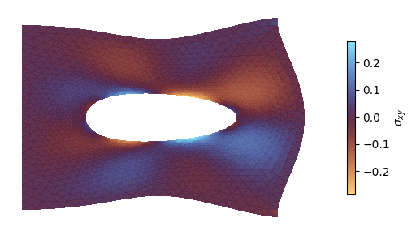

<div class="nb-header"><a href="https://colab.research.google.com/github/smec-ethz/tatva-docs/blob/main/notebooks/external_solvers/linear_elasticity_petsc4py_mf.ipynb" target="_blank"></a><a href="/assets/notebooks/external_solvers/linear_elasticity_petsc4py_mf.ipynb" download="linear_elasticity_petsc4py_mf.ipynb" class="nb-download-btn"><svg class="nb-download-icon" viewBox="0 0 24 24" xmlns="http://www.w3.org/2000/svg"><path d="M12 16l-6-6 1.41-1.41L11 13.17V4h2v9.17l3.59-3.58L18 11l-6 6z"/><path d="M5 18h14v2H5z"/></svg> Download</a></div>

# Matrix-Free approach with PETSc

<div class="nb-clear"></div>


!!! info

    This example uses `PETSc` to solver the nonlinear problem. Please ensure that `petsc4py` is installed to run this example. 


In this notebook, we solve a linear elastic problem using `PETSc` based solvers. In this example, we will use the Jacobian-Vector product to compute the action of sitffness matrix instead of materializing the stiffness matrix.

In this example, we will use the [`Python-Aware`](https://petsc.org/main/petsc4py/petsc_python_types.html) PETSc types.


```python
from typing import NamedTuple

import gmsh
import jax

jax.config.update("jax_enable_x64", True)

import jax.numpy as jnp
from jax import Array
from jax_autovmap import autovmap
from tatva import Mesh, Operator

from petsc4py import PETSc
```


??? example "Code for generating a plate with a hole and plotting the mesh"
    ```python
    
    import matplotlib.pyplot as plt
    from matplotlib.axes import Axes
    import meshio
    
    import numpy as np
    import os
    
    
    def plot_mesh(mesh: Mesh, ax: Axes | None = None) -> None:
        if ax is None:
            fig, ax = plt.subplots()
        ax.tripcolor(
            mesh.coords[:, 0],
            mesh.coords[:, 1],
            mesh.elements,
            facecolors=np.ones(len(mesh.elements)),
            cmap="managua",
            edgecolors="k",
            linewidth=0.2,
        )
       
        ax.set_aspect("equal")
        ax.margins(0.0)
    
    
    def generate_refined_plate_with_hole(
        width: float,
        height: float,
        hole_radius: float,
        mesh_size_fine: float,
        mesh_size_coarse: float,
    ):
        mesh_dir = os.path.join(os.getcwd(), "../meshes")
        os.makedirs(mesh_dir, exist_ok=True)
        output_filename = os.path.join(mesh_dir, "plate_hole_refined.msh")
    
        gmsh.initialize()
        gmsh.model.add("plate_with_hole_refined")
        occ = gmsh.model.occ
    
        rect = occ.addRectangle(0, 0, 0, width, height)
        cx = width / 2.0
        cy = height / 2.0
        disk = occ.addDisk(cx, cy, 0, hole_radius, hole_radius)
    
        out, _ = occ.cut([(2, rect)], [(2, disk)])
        occ.synchronize()
    
        surface_tag = out[0][1]
        gmsh.model.addPhysicalGroup(2, [surface_tag], 1, name="domain")
    
        boundaries = gmsh.model.getBoundary(out, oriented=False)
        boundary_tags = [b[1] for b in boundaries]
        gmsh.model.addPhysicalGroup(1, boundary_tags, 2, name="boundaries")
    
        hole_curve_tags = []
        for tag in boundary_tags:
            xmin, ymin, zmin, xmax, ymax, zmax = gmsh.model.getBoundingBox(1, tag)
            # The hole is completely inside the outer rectangle
            if xmin > 0 and xmax < width and ymin > 0 and ymax < height:
                hole_curve_tags.append(tag)
    
        gmsh.model.mesh.field.add("Distance", 1)
        gmsh.model.mesh.field.setNumbers(1, "CurvesList", hole_curve_tags)
        gmsh.model.mesh.field.setNumber(1, "NumPointsPerCurve", 100)
    
        gmsh.model.mesh.field.add("Threshold", 2)
        gmsh.model.mesh.field.setNumber(2, "InField", 1)
        gmsh.model.mesh.field.setNumber(2, "SizeMin", mesh_size_fine)
        gmsh.model.mesh.field.setNumber(2, "SizeMax", mesh_size_coarse)
        # Start growing the mesh exactly at the hole boundary
        gmsh.model.mesh.field.setNumber(2, "DistMin", 0.0)
        # Reach maximum element size at a distance equal to 2 hole radii away
        gmsh.model.mesh.field.setNumber(2, "DistMax", hole_radius * 2.0)
    
        gmsh.model.mesh.field.setAsBackgroundMesh(2)
    
        gmsh.option.setNumber("Mesh.MeshSizeExtendFromBoundary", 0)
        gmsh.option.setNumber("Mesh.MeshSizeFromPoints", 0)
        gmsh.option.setNumber("Mesh.MeshSizeFromCurvature", 0)
    
        gmsh.model.mesh.generate(2)
        gmsh.write(output_filename)
        gmsh.finalize()
    
        _mesh = meshio.read(output_filename)
        coords = _mesh.points[:, :2]
        elements = _mesh.cells_dict["triangle"]
    
        return Mesh(coords=coords, elements=elements)
    ```


```python
lx = 1.0
ly = 1.0
mesh = generate_refined_plate_with_hole(
    lx, ly, hole_radius=0.2, mesh_size_fine=0.01, mesh_size_coarse=0.05
)

n_dofs_per_node = 2
n_dofs = mesh.coords.shape[0] * n_dofs_per_node

plot_mesh(mesh)
```

    Info    : Meshing 1D...                                                                                                                        
    Info    : [  0%] Meshing curve 5 (Ellipse)
    Info    : [ 30%] Meshing curve 6 (Line)
    Info    : [ 50%] Meshing curve 7 (Line)
    Info    : [ 70%] Meshing curve 8 (Line)
    Info    : [ 90%] Meshing curve 9 (Line)
    Info    : Done meshing 1D (Wall 0.0317488s, CPU 0.028828s)
    Info    : Meshing 2D...
    Info    : Meshing surface 1 (Plane, Frontal-Delaunay)
    Info    : Done meshing 2D (Wall 0.0757454s, CPU 0.075845s)
    Info    : 1874 nodes 3753 elements
    Info    : Writing '/home/mohit/Documents/research_notes/tatva-examples/examples/../meshes/plate_hole_refined.msh'...
    Info    : Done writing '/home/mohit/Documents/research_notes/tatva-examples/examples/../meshes/plate_hole_refined.msh'
    


    

    


## Problem setup


```python
from tatva.element import Tri3

op = Operator(mesh, Tri3())


boundary_left = jnp.where(jnp.isclose(mesh.coords[:, 0], 0.0))[0]
boundary_right = jnp.where(jnp.isclose(mesh.coords[:, 0], lx))[0]
point_at_y_0 = jnp.where(
    jnp.isclose(mesh.coords[:, 0], lx) & jnp.isclose(mesh.coords[:, 1], 0.0)
)[0][0]
assert point_at_y_0

fixed_dofs = jnp.concatenate(
    [
        boundary_left * n_dofs_per_node,
    ]
)
free_dofs = jnp.setdiff1d(jnp.arange(n_dofs), fixed_dofs)

```

## Defining energy functional

We now define the functions to compute the total strain energy


```python
class Material(NamedTuple):
    """Material properties for the elasticity operator."""

    mu: float  
    lmbda: float

    @classmethod
    def from_youngs_poisson_2d(
        cls, E: float, nu: float, plane_stress: bool = False
    ) -> "Material":
        mu = E / 2 / (1 + nu)
        if plane_stress:
            lmbda = 2 * nu * mu / (1 - nu)
        else:
            lmbda = E * nu / (1 - 2 * nu) / (1 + nu)
        return cls(mu=mu, lmbda=lmbda)


mat = Material.from_youngs_poisson_2d(1, 0.3)


@autovmap(grad_u=2)
def compute_strain(grad_u):
    return 0.5 * (grad_u + grad_u.T)


@autovmap(eps=2, mu=0, lmbda=0)
def compute_stress(eps, mu, lmbda):
    return 2 * mu * eps + lmbda * jnp.trace(eps) * jnp.eye(2)


@autovmap(grad_u=2, mu=0, lmbda=0)
def strain_energy_density(grad_u, mu, lmbda):
    eps = compute_strain(grad_u)
    sigma = compute_stress(eps, mu, lmbda)
    return 0.5 * jnp.einsum("ij,ij->", sigma, eps)

```

## Enforcing boundary condition via static condensation


```python
@jax.jit
def total_energy_full(u_flat: Array) -> Array:
    """Compute the total energy of the system."""
    u = u_flat.reshape(-1, 2)
    u_grad = op.grad(u)
    e_density = strain_energy_density(u_grad, mat.mu, mat.lmbda)
    return op.integrate(e_density)


@jax.jit
def total_energy(u_free: Array, applied_disp: Array) -> Array:
    """Compute the total energy of the system."""
    u_full = jnp.zeros(n_dofs).at[free_dofs].set(u_free)
    u_full = u_full.at[fixed_dofs].set(applied_disp)
    return total_energy_full(u_full)


compute_internal = jax.jacrev(total_energy)

@jax.jit
def compute_tangent(u: Array, v: Array, applied_disp: Array) -> Array:
    """Compute the tangent stiffness matrix."""
    tangent = jax.jvp(compute_internal, (u, applied_disp), (v, applied_disp))[1]
    return tangent
```

## Defining the loading traction on right edge

We define a new `Operator` consisting of line elements along the right edge and then use this `op_line` to integrate the traction along the nodes.


```python
sig_loading = 1e-2

f_ext_0 = jnp.zeros(n_dofs)

idx_right = n_dofs_per_node * boundary_right

f_ext_0 = f_ext_0.at[idx_right].add(sig_loading)
f_ext = f_ext_0.at[free_dofs].get()
```

## Defining true `Matrix-Free` approach in `PETSc`

In the previous example, we use the sparse data to construct the `matrix-free` solver in `PETSc`. Which meant that we had to know the sparsity pattern beforehand and store the sparse data. 

However, since we can also express stiffness matrix as `Jacobian-vector` product, we can use this feature to truly define a matrix-free solver in `PETSc`.

For this we will make use of the `PythonContext` in `PETSc` through `petsc4py.PETSc.Mat.Type.PYTHON` type.


Below we define a `PythonContext` to describe the matrix-multiplication behavior which is what Jacobian-vector product will. We will need `ctx` to store the values of displacment at which we want to differentiate the internal forces


```python
ctx = {}  # context for the Jacobian-vector product


class MatMultCtx:
    def __init__(self):
        self.x_cur = None # J(u) which is the last iterate state
        self.applied_disp = None

    def set_x(self, x: Array):
        """Set the current iterate for the Jacobian-vector product."""
        self.x_cur = x

    def set_applied_disp(self, applied_disp: Array):
        """Set the applied displacement for the Jacobian-vector product."""
        self.applied_disp = applied_disp

    def mult(self, A, V, Y):
        "Y = J(u) * V with current x stored in ctx['x']"
        v_np = V.getArray(readonly=True)
        jvp = compute_tangent(self.x_cur, v_np, self.applied_disp)
        Y.setArray(jvp)


ctx = MatMultCtx()
J = PETSc.Mat().createPython(
    [len(free_dofs), len(free_dofs)], comm=PETSc.COMM_SELF, context=ctx
)
J.setUp()

```


    <petsc4py.PETSc.Mat at 0x7186dc0ef010>


Now we wrap the above `ctx` in a typical `SNES` problem class which provides two functions:

- to compute the residual
- to compute the jacobian, note that the jacobian uses `ctx` to set the last iterate value for displacement and returns `True`


```python
class ElasticitySNES:
    def __init__(self, applied_disp: Array, f_ext: Array):
        self.applied_disp = applied_disp
        self.f_ext = f_ext

    def residual(self, snes, u_petsc, r_petsc):
        """Compute the residual of the nonlinear system."""
        u = u_petsc.getArray(readonly=True)
        r = compute_internal(u, self.applied_disp)
        res = r - self.f_ext
        r_petsc.setArray(res)

    def jacobian(self, snes, u_petsc, J_mat: PETSc.Mat, P_mat: PETSc.Mat):
        """Compute the Jacobian of the nonlinear system."""
        u = u_petsc.getArray(readonly=True)
        ctx.set_x(u)
        ctx.set_applied_disp(self.applied_disp)
        return True


```

Setting up `SNES` solver which is basically Newton-Krylov Solver where for the Krylov solver we will use the `Conjugate-Gradient` solver.


```python
problem = ElasticitySNES(applied_disp=jnp.zeros(len(fixed_dofs)), f_ext=f_ext)


snes = PETSc.SNES().create(comm=PETSc.COMM_SELF)
x_sol = PETSc.Vec().createSeq(len(free_dofs))

snes.setFunction(problem.residual, x_sol)
snes.setJacobian(problem.jacobian, J, J)

snes.setType("newtonls")
snes.setTolerances(atol=1e-8, rtol=1e-10)
snes.setConvergenceHistory()
snes.setConvergedReason(reason=PETSc.SNES.ConvergedReason.CONVERGED_FNORM_ABS)

ksp = snes.getKSP()
ksp.setType("cg")  # Use Conjugate Gradient method
ksp.getPC().setType("none")  # No preconditioner
ksp.setConvergedReason(reason=PETSc.KSP.ConvergedReason.CONVERGED_ATOL)
ksp.setTolerances(rtol=1e-2, atol=1e-8)

convergence_history = np.zeros(100)  # Preallocate convergence history array

def monitor_fn(_snes, it, residual):
    convergence_history[it] = residual
    print(it, residual)


snes.setMonitor(monitor_fn)
```

Finally, solving the problem


```python
du = x_sol.duplicate()
du.setArray(jnp.zeros(len(free_dofs)))  # Initial guess (zero displacement)
snes.solve(None, du)
```

    0 0.04898979485566356
    1 0.0004664493197841444
    2 4.56924100496837e-06
    3 4.476608293234423e-08
    4 9.873898243606004e-09


## Visualization and analyzing the results


??? example "Code to visualize the results"
    ```python
    
    from matplotlib.tri import Triangulation
    
    u = jnp.zeros(n_dofs).at[free_dofs].set(du.getArray())
    u = u.reshape(-1, 2)
    
    fig, ax = plt.subplots(figsize=(7.4, 3))
    x_final = mesh.coords + u
    tri = Triangulation(x_final[:, 0], x_final[:, 1], mesh.elements)
    
    sig = compute_stress(compute_strain(op.grad(u)), mat.mu, mat.lmbda).squeeze()
    
    
    def plot_field(ax: Axes):
        cb = ax.tripcolor(
            tri,
            sig[..., 0, 1],
            alpha=0.95,
            rasterized=True,
            cmap="managua",
        )
        ax.set_aspect("equal")
        ax.set(
            xlabel="$x$",
            ylabel="$y$",
        )
        return cb
    
    
    cb = plot_field(ax)
    ax.set_axis_off()
    plt.colorbar(cb, ax=ax, label=r"$\sigma_{xy}$", shrink=0.7)
    fig.tight_layout()
    ```



