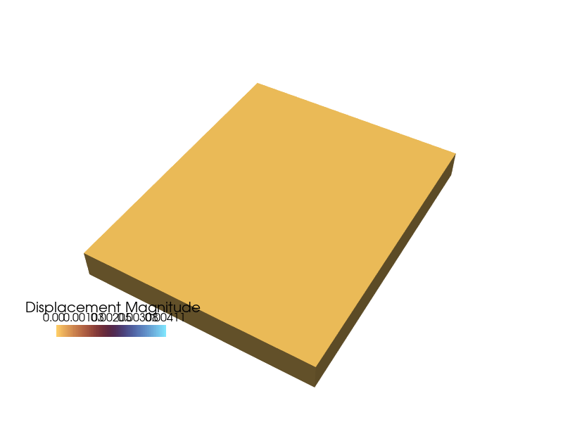

#  Getting Started

<div align="center">


<h3 align="center">tatva: Lego-like building blocks for differentiable FEM</h3>

</div>


``tatva`` (तत्त्व) is a Sanskrit word meaning *principle* or *elements of reality*.
True to its name, ``tatva`` provides fundamental Lego-like building blocks
(elements) which can be used to construct complex finite element method (FEM)
simulations. ``tatva`` is a pure Python library for FEM simulations and is
built on top of JAX ecosystem, making it easy to use FEM in a differentiable
way.

<div class="swiper">
  <div class="swiper-wrapper">
    
    <div class="swiper-slide">
      
      <div class="slide-caption">
        <h3>Surface Advection Diffusion</h3>
      </div>
    </div>

    <div class="swiper-slide">
      
      <div class="slide-caption">
        <h3>Cohesive Fracture</h3>
      </div>
    </div>

  </div>

  <div class="swiper-pagination"></div>

  <div class="swiper-button-prev"></div>
  <div class="swiper-button-next"></div>
</div>


<div class="grid-cards">
  <div class="card">
    <h3>🔥 Monolithic Solver</h3>
    <p>Energy-based formulation of FEM operators with automatic differentiation via JAX. Fully differentiable and fully composable.</p>
  </div>
  <div class="card">
    <h3>🤖 Versitality</h3>
    <p> Operator abstractions that map, integrate, differentiate on arbitrary meshes. Capability to handle mixed-dimension coupling, multi-point constaints, and more. </p>
  </div>
  <div class="card">
    <h3>⚡ High Performance</h3>
    <p>Built-in sparse differentiation via coloring and matrix-free assembly tailored for mordern architecture. </p>
  </div>
</div>

## Installation

Install the current release from PyPI:

```bash
pip install tatva
```

For development work, clone the repository and install it in editable mode (use your preferred virtual environment tool such as ``uv`` or ``venv``):

```bash
git clone https://github.com/smec-ethz/tatva.git
cd tatva
pip install -e .
```


## Quick Example

Create a mesh, pick an element type, and let Operator perform the heavy lifting with JAX arrays:


```bash
import jax.numpy as jnp
from tatva.element import Tri3
from tatva.mesh import Mesh
from tatva.operator import Operator

coords = jnp.array([[0.0, 0.0], [1.0, 0.0], [1.0, 1.0], [0.0, 1.0]])
elements = jnp.array([[0, 1, 2], [0, 2, 3]])

mesh = Mesh(coords, elements)

op = Operator(mesh, Tri3())
nodal_values = jnp.arange(coords.shape[0], dtype=jnp.float64)

# Integrate a nodal field over the mesh
total = op.integrate(nodal_values)

# Evaluate gradients at all quadrature points
gradients = op.grad(nodal_values)
```

## License

`tatva` is distributed under the GNU Lesser General Public License v3.0 or later. See `COPYING` and `COPYING.LESSER` for the complete terms. © 2025 ETH Zurich (SMEC).
