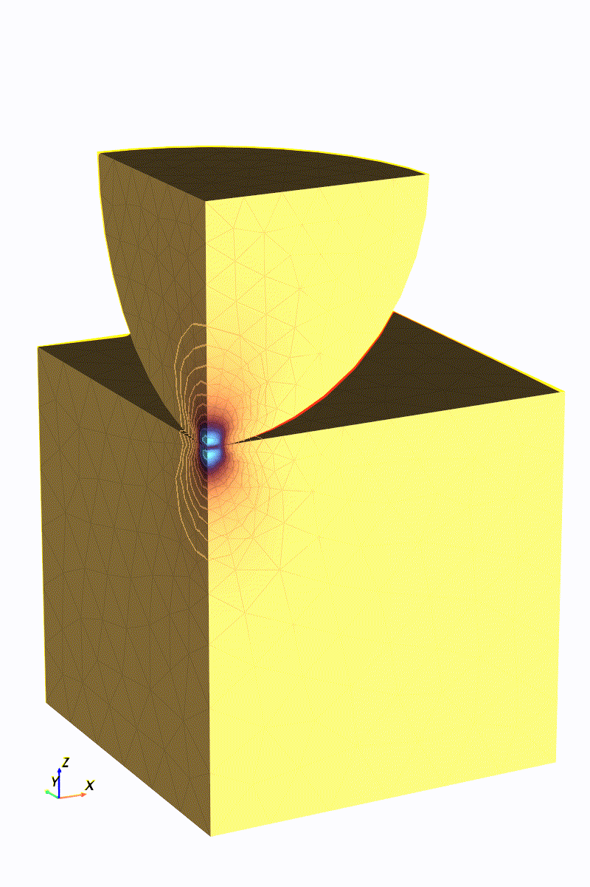
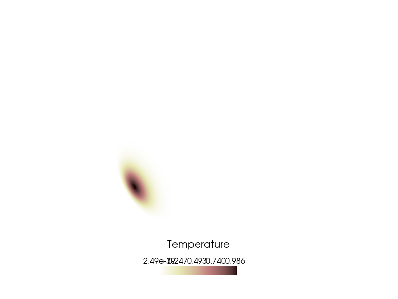

---
hide:
  - navigation
  - toc
---

<h3>Lego-like building blocks for differentiable FEM</h3>

<b>tatva (तत्त्व)</b> is a Sanskrit word meaning <i>principle</i> or <i>elements of reality</i>.
True to its name, <code>tatva</code> provides fundamental Lego-like building blocks
(elements) which can be used to construct complex finite element method (FEM)
simulations as energy functionals. <code>tatva</code> is a pure Python library for FEM simulations and is
built on top of JAX ecosystem, making it easy to use FEM in a differentiable
way.

<a href="getting_started" class="button">👉 Get Started</a>
<a href="examples/linear_elasticity" class="button">👷‍♀️ Examples</a>

<section id="home">

  
  

    <h3>Hertzian Contact</h3>
  

  
  

    <h3>Cohesive Fracture</h3>
  

  
  

    <h3>Surface Advection Diffusion</h3>
  

  

    <h3>Energy-Centric Solver</h3>
    
Energy-based formulation of FEM operators with automatic differentiation via JAX. Just write energy and differentiate it directly.

  

  

    <h3>Versatility</h3>
    
 Operator abstractions that map, integrate, differentiate on arbitrary meshes. Capability to handle mixed-dimension coupling, multi-point constaints, and more. 

  

  

    <h3>High Performance</h3>
    
Built-in sparse differentiation via coloring and matrix-free assembly tailored for mordern architecture such as GPUs. 

  

</section>

<h3>Find us on LinkedIn</h3>

<iframe src="https://www.linkedin.com/embed/feed/update/urn:li:share:7469644702548426752?collapsed=1" height="470" width="504" frameborder="0" allowfullscreen=""></iframe>

<iframe src="https://www.linkedin.com/embed/feed/update/urn:li:ugcPost:7442949970275504128?collapsed=1" height="550" width="504" frameborder="0" allowfullscreen=""></iframe>

<iframe src="https://www.linkedin.com/embed/feed/update/urn:li:ugcPost:7434187928412606464?collapsed=1" height="550" width="504" frameborder="0" allowfullscreen=""></iframe>

<iframe src="https://www.linkedin.com/embed/feed/update/urn:li:share:7429468306744586240?collapsed=1" height="264" width="504" frameborder="0" allowfullscreen=""></iframe>

